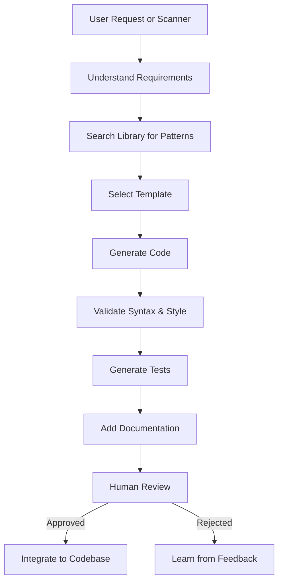

# Builder Agent

Autonomous agent for generating F Prime components, tests, and configurations from library patterns.

## Purpose

The Builder Agent uses patterns from the library to generate production-ready code:
- F Prime components from natural language or patterns
- Test scaffolds with realistic scenarios
- Configuration templates
- Integration examples

## Workflow



## Input Forms

### From Natural Language

```bash
$ python builder.py --describe "I2C manager with multiplexer support for 8 channels"

Searching library for relevant patterns...
Found: software-001 (I2C address conflict resolution)
Found: build-042 (TCA9548A integration guide)

Generating component...
✓ Created: I2CManager.fpp
✓ Created: I2CManager.cpp
✓ Created: I2CManager.hpp
✓ Created: I2CManagerTester.cpp
✓ Validated: All files compile
✓ Generated: 12 unit tests

Ready for review in: generated/I2CManager/
```

### From Library Pattern

```bash
$ python builder.py --pattern software-001 --output generated/

Using pattern: I2C Address Conflicts (software-001)
Generating recommended solution...
✓ Component: I2CManager with TCA9548A support
✓ Tests: I2C conflict detection tests
✓ Config: Channel mapping template

Ready for review.
```

### From Scanner (Auto-fix)

When scanner detects a risk with a known pattern:

```bash
Risk detected: I2C address conflict (risk-abc123)
Pattern match: software-001

Would you like to generate a fix? (y/n): y

Generating fix based on software-001...
✓ Created: src/I2CManager.fpp
✓ Updated: topology to include I2CManager
✓ Created: tests/test_i2c_conflicts.py

Review generated code before applying.
```

## Core Logic

### 1. Understand Requirements

**LLM Prompt:**
```
Analyze this request and extract technical requirements:

Request: "{user_description}"

Return JSON:
{
  "component_type": "active | passive | queued",
  "core_functionality": "Brief description",
  "inputs": ["what component receives"],
  "outputs": ["what component produces"],
  "state": ["what state it maintains"],
  "timing": "periodic | event-driven | both",
  "keywords": ["multiplexer", "i2c", "power", ...]
}
```

### 2. Search Library for Patterns

Query MCP server:

```python
async def find_relevant_patterns(requirements):
    # Semantic search based on keywords and functionality
    results = await mcp_client.search(
        query=" ".join(requirements.keywords),
        domain="software",
        type="risk-pattern",
        limit=5
    )

    # Rank by relevance to requirements
    ranked = rank_by_relevance(results, requirements)
    return ranked[:3]  # Top 3 patterns
```

### 3. Select Template

Based on component type and patterns:

```python
def select_template(component_type, patterns):
    """
    Templates are in agents/builder/templates/
    """
    template_map = {
        "active": {
            "periodic": "active_periodic.fpp.jinja",
            "event_driven": "active_event.fpp.jinja",
            "both": "active_mixed.fpp.jinja"
        },
        "passive": "passive.fpp.jinja",
        "queued": "queued.fpp.jinja"
    }

    base_template = template_map[component_type][requirements.timing]

    # Augment with pattern-specific additions
    pattern_modules = [load_pattern_module(p) for p in patterns]

    return {
        "base": base_template,
        "modules": pattern_modules
    }
```

### 4. Generate Code

**F Prime Component Generation:**

```python
class ComponentGenerator:
    def generate_fpp(self, requirements, patterns):
        """Generate .fpp component definition"""
        template = self.templates["component.fpp.jinja"]

        context = {
            "name": requirements.component_name,
            "type": requirements.component_type,
            "ports": self.infer_ports(requirements, patterns),
            "commands": self.infer_commands(requirements, patterns),
            "telemetry": self.infer_telemetry(requirements, patterns),
            "events": self.infer_events(requirements, patterns),
            "params": self.infer_params(requirements, patterns)
        }

        return template.render(context)

    def generate_cpp(self, requirements, patterns):
        """Generate .cpp implementation"""
        template = self.templates["component.cpp.jinja"]

        # Add implementation stubs with TODOs
        handlers = self.generate_handlers(requirements)

        # Add pattern-specific logic from library
        pattern_logic = self.extract_pattern_logic(patterns)

        context = {
            "name": requirements.component_name,
            "handlers": handlers,
            "pattern_logic": pattern_logic,
            "citations": [p.sources for p in patterns]
        }

        return template.render(context)
```

**Example Generated .fpp:**

```fpp
# I2CManager.fpp
# Generated from pattern: software-001
# Citation: https://github.com/proveskit/fprime-proves/issues/31

module Components {

  @ I2C Manager with TCA9548A multiplexer support
  @ Resolves I2C address conflicts by channel separation
  active component I2CManager {

    # ----------------------------------------------------------------------
    # Ports
    # ----------------------------------------------------------------------

    @ Select I2C channel on multiplexer
    async command port cmdIn

    @ I2C read/write port
    output port i2cOut: Drv.I2C

    @ Telemetry output
    telemetry port tlmOut

    @ Event output
    event port eventOut

    # ----------------------------------------------------------------------
    # Commands
    # ----------------------------------------------------------------------

    @ Select I2C multiplexer channel
    async command SelectChannel(
      channel: U8 @< Channel number (0-7)
    )

    @ Read from I2C device on selected channel
    async command ReadDevice(
      channel: U8 @< Channel number
      address: U8 @< I2C device address
      numBytes: U8 @< Number of bytes to read
    )

    # ----------------------------------------------------------------------
    # Telemetry
    # ----------------------------------------------------------------------

    @ Currently selected channel
    telemetry CurrentChannel: U8

    @ Number of successful reads
    telemetry ReadCount: U32

    # ----------------------------------------------------------------------
    # Events
    # ----------------------------------------------------------------------

    @ Channel switched
    event ChannelSwitched(
      channel: U8 @< New channel
    ) severity activity low

    @ I2C bus error detected
    event BusError(
      channel: U8
      error: U32
    ) severity warning high

    # ----------------------------------------------------------------------
    # Parameters
    # ----------------------------------------------------------------------

    @ Multiplexer I2C address
    param MuxAddress: U8 default 0x70
  }
}
```

### 5. Validate Generated Code

```python
def validate_component(files):
    """Run validation checks"""
    checks = []

    # 1. Syntax check (run fpp-check)
    result = subprocess.run(["fpp-check", files["fpp"]])
    checks.append(("FPP syntax", result.returncode == 0))

    # 2. C++ compilation check
    result = subprocess.run(["g++", "-fsyntax-only", files["cpp"]])
    checks.append(("C++ syntax", result.returncode == 0))

    # 3. Style check
    style_ok = check_style(files)
    checks.append(("Style guide", style_ok))

    # 4. Documentation check
    docs_ok = has_documentation(files["fpp"])
    checks.append(("Documentation", docs_ok))

    return all(check[1] for check in checks), checks
```

### 6. Generate Tests

**LLM Prompt:**
```
Generate unit tests for this F Prime component:

Component: {fpp_content}
Implementation: {cpp_content}
Pattern context: {pattern_description}

Generate:
1. Nominal case tests (happy path)
2. Error case tests (edge cases from pattern)
3. Integration tests (if applicable)

Return test code in F Prime test format.
```

**Example Generated Test:**

```cpp
// I2CManagerTest.cpp
// Tests for I2C address conflict resolution

TEST(I2CManagerTest, ChannelSelection) {
  I2CManagerTester tester;
  tester.connectPorts();

  // Select channel 3
  tester.sendCmd_SelectChannel(0, 0, 3);
  tester.component.doDispatch();

  // Verify channel switched
  ASSERT_EVENTS_SIZE(1);
  ASSERT_EVENTS_ChannelSwitched_SIZE(1);
  ASSERT_EVENTS_ChannelSwitched(0, 3);

  // Verify telemetry updated
  ASSERT_TLM_CurrentChannel(0, 3);
}

TEST(I2CManagerTest, AddressConflictResolution) {
  // Test reading from multiple devices with same address
  // on different channels (from pattern software-001)

  I2CManagerTester tester;
  tester.connectPorts();

  // Device 0x40 on channel 0
  tester.sendCmd_ReadDevice(0, 0, 0, 0x40, 2);
  tester.component.doDispatch();
  ASSERT_from_i2cOut_SIZE(1);

  // Same address on channel 1 (should work)
  tester.sendCmd_ReadDevice(0, 1, 1, 0x40, 2);
  tester.component.doDispatch();
  ASSERT_from_i2cOut_SIZE(2);

  // No bus errors
  ASSERT_EVENTS_BusError_SIZE(0);
}
```

### 7. Add Documentation

Add inline citations to generated code:

```cpp
// I2CManager.cpp
// Pattern: I2C Address Conflict Resolution (software-001)
// Citations:
// - https://github.com/proveskit/fprime-proves/issues/31
// - https://www.ti.com/product/TCA9548A

void I2CManager::SelectChannel_cmdHandler(
    FwOpcodeType opCode,
    U32 cmdSeq,
    U8 channel
)
{
  // Validate channel range (TCA9548A supports 8 channels)
  if (channel > 7) {
    this->log_WARNING_HI_InvalidChannel(channel);
    this->cmdResponse_out(opCode, cmdSeq, Fw::CmdResponse::VALIDATION_ERROR);
    return;
  }

  // Write to multiplexer control register
  // Pattern from software-001: Use single-byte write to select channel
  U8 control = 1 << channel;
  // ... implementation
}
```

## Configuration

`agents/builder/config.yaml`:

```yaml
builder:
  llm_provider: anthropic
  model: claude-sonnet-3-5
  temperature: 0.3

  templates_dir: templates/
  patterns_cache: .cache/patterns/

  validation:
    check_syntax: true
    check_style: true
    require_tests: true
    require_docs: true

  code_generation:
    add_citations: true
    add_todos: true
    include_examples: true
    generate_cmake: true

  test_generation:
    nominal_cases: true
    error_cases: true
    edge_cases: true
    integration_tests: false  # Complex, skip for now
```

## Usage

### Command Line

```bash
# From natural language
python builder.py --describe "Power monitor with I2C multiplexer" --output generated/

# From library pattern
python builder.py --pattern software-001 --output generated/

# Interactive mode
python builder.py --interactive

# Generate and apply (with approval)
python builder.py --pattern software-001 --apply --repo /path/to/fprime-project
```

### Programmatic

```python
from builder import BuilderAgent

agent = BuilderAgent(config="config.yaml")

# Generate from description
result = await agent.generate(
    description="I2C manager with 8-channel multiplexer",
    output_dir="generated/"
)

# Review result
print(result.files)  # {'.fpp': '...', '.cpp': '...', 'tests': '...'}
print(result.validation_report)

# Apply to project (with approval)
if approve(result):
    agent.integrate(result, project_dir="/path/to/project")
```

## Next Steps

1. Implement `builder.py` main logic
2. Create FPP/C++ templates (Jinja2)
3. Build pattern → code mapping logic
4. Add validation suite
5. Create test generation
6. Build integration workflow
