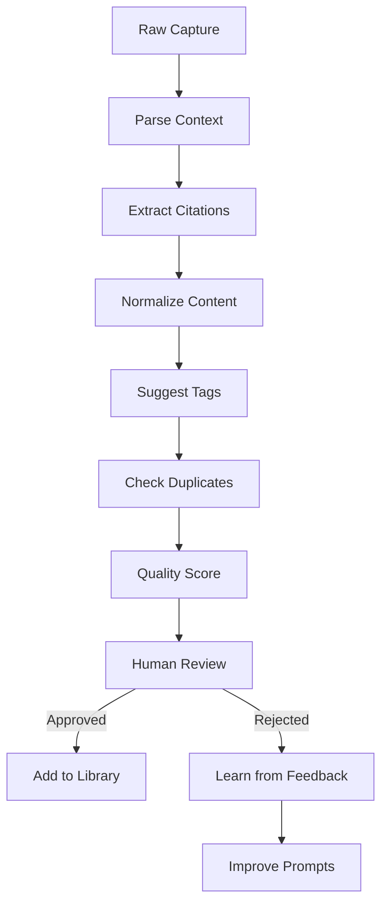

# Curator Agent

Autonomous agent for normalizing raw knowledge captures into structured library entries.

## Purpose

The Curator Agent transforms messy, context-specific knowledge captures from the risk scanner into clean, well-structured library entries with proper citations, tags, and formatting.

## Workflow



## Input: Raw Capture

From risk scanner knowledge capture:

```markdown
# Raw Capture: risk-abc123

## Risk
I2C address conflict in power monitoring

## Context
BroncoSat-2 has 4 INA219 sensors that need same address.
We tried changing addresses with solder jumpers but only 4 addresses available.

## Resolution
Added TCA9548A I2C multiplexer to separate bus segments.
All 4 sensors now on different channels.

## Testing
Used fprime-proves test suite, all sensors read correctly now.
See commit a4f04c9 for implementation.

## Sources
- https://github.com/proveskit/fprime-proves/issues/31
- TCA9548A datasheet
```

## Output: Normalized Entry

Clean library entry ready for review:

```markdown
---
entry_id: software-001
type: risk-pattern
domain: software
observed: I2C address conflicts in multi-sensor power monitoring configurations
sources:
  - citation: "PROVES Kit INA219 Power Monitor Issue #31"
    url: "https://github.com/proveskit/fprime-proves/issues/31"
    excerpt: "Multiple INA219 sensors defaulting to same I2C address"
  - citation: "TCA9548A Low-Voltage 8-Channel I2C Switch Datasheet"
    url: "https://www.ti.com/product/TCA9548A"
    excerpt: "Enables multiple devices with identical addresses on single I2C bus"
artifacts:
  - type: component
    path: "github.com/proveskit/fprime-proves/commit/a4f04c9"
    description: "I2C manager with TCA9548A multiplexer support"
resolution: Use I2C multiplexer (TCA9548A) to create separate bus segments
verification: Run test suite and verify all sensors readable without bus errors
tags:
  - power
  - i2c
  - hardware-integration
  - multiplexer
  - sensors
created: 2024-12-20
---

# I2C Address Conflicts in Multi-Device Power Monitoring

[Normalized, well-structured content...]
```

## Core Logic

### 1. Parse Raw Capture

Extract key information:
- Risk description
- Context and specific situation
- Resolution approach
- Testing/verification
- Source links

### 2. Extract Citations

**LLM Prompt:**
```
Given this raw capture, extract formal citations:
- Identify all source URLs
- Find official names for referenced documents
- Extract relevant excerpts (1-2 sentences)
- Format as bibliography entries

Raw capture:
{raw_text}

Return JSON:
{
  "citations": [
    {"title": "...", "url": "...", "excerpt": "..."}
  ]
}
```

### 3. Normalize Content

**LLM Prompt:**
```
Transform this raw capture into a structured library entry:
- Use clear, technical writing
- Organize into: Problem, Context, Resolution, Verification sections
- Remove first-person references
- Generalize from specific instance to pattern
- Add "Lessons Learned" and "Related Patterns" sections

Raw capture:
{raw_text}

Return markdown (no frontmatter).
```

### 4. Suggest Tags

**LLM Prompt:**
```
Suggest 3-7 tags for this entry:
- Technical categories (power, radio, memory, etc.)
- Component types (sensors, multiplexer, etc.)
- Patterns (conflict-resolution, integration, etc.)

Content:
{normalized_content}

Return JSON: {"tags": ["tag1", "tag2", ...]}
```

### 5. Check for Duplicates

Use MCP server to search for similar entries:

```python
async def check_duplicates(entry_content, threshold=0.85):
    # Query MCP with semantic search
    results = await mcp_client.search(
        query=extract_key_concepts(entry_content),
        limit=10
    )

    # Calculate similarity scores
    for result in results:
        score = semantic_similarity(entry_content, result.content)
        if score > threshold:
            return {
                "is_duplicate": True,
                "similar_to": result.entry_id,
                "similarity": score
            }

    return {"is_duplicate": False}
```

### 6. Quality Scoring

Evaluate entry quality (0-1 score):

**Criteria:**
- Has valid citations (0.3 weight)
- Clear problem/resolution (0.2 weight)
- Verification steps provided (0.2 weight)
- Appropriate tags (0.1 weight)
- Well-structured markdown (0.1 weight)
- No first-person references (0.1 weight)

```python
def quality_score(entry):
    score = 0.0

    # Check citations
    if entry.sources and all(s.url for s in entry.sources):
        score += 0.3

    # Check structure
    if has_section(entry.content, "Problem") and \
       has_section(entry.content, "Resolution"):
        score += 0.2

    # Check verification
    if entry.verification:
        score += 0.2

    # Check tags
    if 3 <= len(entry.tags) <= 7:
        score += 0.1

    # Check formatting
    if is_valid_markdown(entry.content):
        score += 0.1

    # Check style (no "I", "we", "our")
    if not has_first_person(entry.content):
        score += 0.1

    return score
```

### 7. Present for Human Review

Generate review summary:

```markdown
# Curator Review: software-001

## Quality Score: 0.92 / 1.00

✓ Valid citations (2 sources)
✓ Clear problem/resolution
✓ Verification steps
✓ Appropriate tags (5 tags)
✓ Well-structured markdown
✓ No first-person references

## Suggested Entry

[Entry preview with diff highlighting changes from raw capture]

## Actions

- **Approve**: Add to library and index
- **Edit**: Make changes before approval
- **Reject**: Provide feedback for learning

## Similar Entries (Duplicates?)

- software-015 (similarity: 0.23) - I2C bus error recovery
- build-042 (similarity: 0.31) - TCA9548A integration guide

*Not likely duplicates (scores < 0.85)*
```

## Feedback Learning

Track approval/rejection patterns:

```python
class FeedbackTracker:
    def record_decision(self, entry_id, decision, feedback_text):
        """
        decision: approved | rejected | edited
        feedback_text: human explanation of changes/rejection
        """
        self.db.insert({
            "entry_id": entry_id,
            "decision": decision,
            "feedback": feedback_text,
            "quality_score": entry.quality_score,
            "tags_used": entry.tags,
            "timestamp": now()
        })

    def analyze_patterns(self):
        """
        Identify common rejection reasons:
        - Weak citations
        - Missing verification steps
        - Poor tag selection
        - Etc.
        """
        rejections = self.db.filter(decision="rejected")
        return {
            "common_issues": extract_common_themes(rejections),
            "tag_patterns": analyze_tag_usage(rejections),
            "quality_threshold": compute_optimal_threshold(rejections)
        }

    def adjust_prompts(self, analysis):
        """
        Update LLM prompts based on feedback patterns
        """
        if "weak citations" in analysis.common_issues:
            self.prompts["citation_extraction"] += \
                "\nEnsure excerpts are substantial and relevant."
```

## Configuration

`agents/curator/config.yaml`:

```yaml
curator:
  llm_provider: anthropic
  model: claude-sonnet-3-5
  temperature: 0.2
  max_tokens: 4000

  prompts:
    citation_extraction: prompts/citations.txt
    content_normalization: prompts/normalize.txt
    tag_suggestion: prompts/tags.txt

  quality:
    min_score: 0.7
    duplicate_threshold: 0.85
    require_citations: true
    require_verification: true
    min_tags: 3
    max_tags: 7

  feedback:
    track_decisions: true
    learn_from_rejections: true
    retrain_interval_days: 7
```

## Usage

### Command Line

```bash
# Process single capture
python agent.py --input captures/raw-abc123.md --output review/

# Batch process pending
python agent.py --batch --pending --output review/

# Test mode (no LLM calls)
python agent.py --test --mock-llm --input test_data/sample.md
```

### Programmatic

```python
from curator import CuratorAgent

agent = CuratorAgent(config="config.yaml")

# Process raw capture
result = await agent.process_capture(
    raw_text=capture_content,
    risk_id="risk-abc123"
)

# Review result
if result.quality_score >= 0.7:
    print(result.normalized_entry)
    print(result.review_summary)

    decision = await get_human_decision(result)
    agent.record_feedback(result.entry_id, decision)
```

## Testing

```bash
# Run tests
pytest tests/

# Test specific scenarios
pytest tests/test_citation_extraction.py
pytest tests/test_duplicate_detection.py
pytest tests/test_quality_scoring.py

# Test with mock LLM
pytest tests/ --mock-llm
```

## Next Steps

1. Implement `agent.py` main logic
2. Create prompt templates
3. Build citation extraction
4. Add quality scoring
5. Integrate with risk scanner
6. Build review UI (web or CLI)
