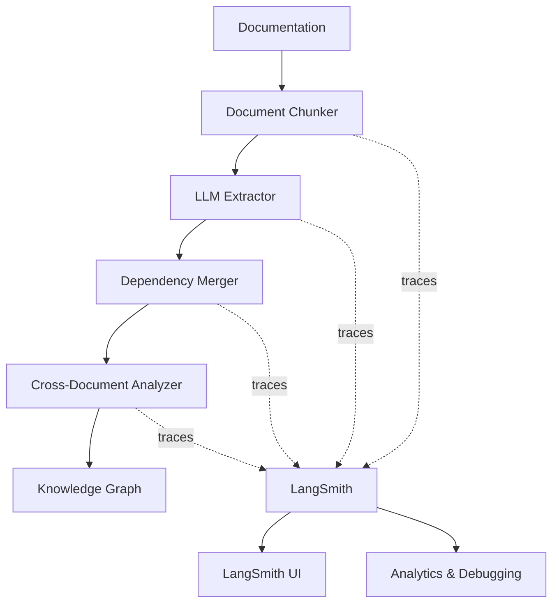

# LangSmith Integration for PROVES Library

## Overview

The PROVES Library uses [LangSmith](https://smith.langchain.com) for comprehensive observability of the agentic dependency extraction system. LangSmith provides end-to-end tracing of:

- **Document processing pipelines** - See how documents are chunked and processed
- **LLM dependency extraction** - Monitor prompts, responses, and extraction quality
- **Cross-document analysis** - Track how dependencies are identified across systems
- **Knowledge graph operations** - Observe how extracted dependencies are stored

## Why LangSmith for PROVES Library?

### Challenge: Non-Deterministic Dependency Extraction

The PROVES Library agents use LLMs to extract dependencies from documentation. LLMs are non-deterministic, which means:
- Same documentation → Different extractions on each run
- Subtle prompt changes → Major result variations
- Hard to debug when dependencies are missed
- Difficult to validate extraction quality

### Solution: Full Observability with LangSmith

LangSmith provides:

1. **Trace Every Extraction** - See exact prompts sent to LLMs and responses received
2. **Debug Missing Dependencies** - Identify why certain dependencies weren't found
3. **Monitor Quality** - Track extraction accuracy and confidence scores
4. **Optimize Prompts** - A/B test different prompting strategies
5. **Validate Results** - Compare manual vs automated extractions

## Architecture



## Setup

### 1. Get LangSmith API Key

1. Sign up at [smith.langchain.com](https://smith.langchain.com)
2. Navigate to **Settings** → **API Keys**
3. Create a new API key
4. Copy the key (it won't be shown again)

### 2. Configure Environment

Add to your `.env` file:

```bash
# Enable tracing
LANGSMITH_TRACING=true

# Your API key
LANGSMITH_API_KEY=lsv2_pt_...

# Project name (optional, defaults to "default")
LANGSMITH_PROJECT=PROVES_Library

# Workspace ID (only if you have multiple workspaces)
# LANGSMITH_WORKSPACE_ID=your_workspace_id
```

### 3. Install Dependencies

```bash
cd c:/Users/LizO5/PROVES_LIBRARY
.venv/Scripts/activate
pip install -U langsmith openai
```

## Usage

### Basic Dependency Extraction with Tracing

```python
from scripts.dependency_extractor import DependencyExtractor

# Automatically traces all operations
extractor = DependencyExtractor()

dependencies = extractor.extract_dependencies(
    document_text=doc_content,
    document_name="fprime_i2c_driver.md"
)

# View trace in LangSmith UI at https://smith.langchain.com
```

### Full Pipeline with Tracing

```python
from scripts.dependency_extractor import process_document_pipeline

# This function is decorated with @traceable
result = process_document_pipeline(
    document_path="trial_docs/fprime_i2c_driver_full.md",
    document_name="F´ I2C Driver"
)

print(f"Found {result['statistics']['total_dependencies']} dependencies")
print(f"View trace at: https://smith.langchain.com")
```

### Running the Test

```bash
cd c:/Users/LizO5/PROVES_LIBRARY
.venv/Scripts/python scripts/dependency_extractor.py trial_docs/fprime_i2c_driver_full.md
```

This will:
1. Process the F´ I2C driver documentation
2. Extract all dependencies using the LLM
3. Create a complete trace in LangSmith
4. Print statistics to terminal

## Viewing Traces in LangSmith

### Navigate to Your Project

1. Go to [smith.langchain.com](https://smith.langchain.com)
2. Select **PROVES_Library** project (or your configured project name)
3. You'll see all trace runs listed chronologically

### Trace Structure

Each document processing creates a trace like this:

```
📊 process_document_pipeline (ROOT)
  ├─ 📄 extract_dependencies_from_document
  │   ├─ 📝 chunk_document
  │   ├─ 🤖 extract_from_chunk (chunk 1)
  │   │   └─ 💬 ChatOpenAI (LLM call with prompt/response)
  │   ├─ 🤖 extract_from_chunk (chunk 2)
  │   │   └─ 💬 ChatOpenAI
  │   └─ 🔗 merge_dependencies
  └─ 📊 Statistics calculation
```

### What You Can See

For each **LLM call**:
- Full system prompt (dependency extraction instructions)
- User message (document chunk)
- Complete LLM response (JSON dependencies)
- Token usage and latency
- Model parameters (temperature, etc.)

For each **traced function**:
- Input arguments
- Output results
- Execution time
- Any errors or warnings

## Key Features for PROVES Library

### 1. Dependency Extraction Quality

**Problem:** LLM might miss critical dependencies

**LangSmith Solution:**
- Review extraction traces to see what was found
- Compare against manual analysis
- Identify patterns in missed dependencies
- Refine prompts to improve recall

### 2. Cross-Document Analysis

**Problem:** Hard to verify cross-system dependencies

**LangSmith Solution:**
- Trace `find_cross_document_dependencies` function
- See exact comparison logic
- Verify matched components
- Debug false positives/negatives

### 3. Prompt Engineering

**Problem:** Unclear if prompt changes improve results

**LangSmith Solution:**
- A/B test different prompts
- Compare extraction results side-by-side
- Measure consistency across runs
- Track which prompts produce highest quality

### 4. Error Debugging

**Problem:** Pipeline fails on certain documents

**LangSmith Solution:**
- See exact step where failure occurred
- Inspect problematic document chunk
- Review LLM response that caused parsing error
- Reproduce and fix issues

## Traced Functions Reference

### `@traceable` Decorators

All these functions are traced:

| Function | Purpose | Key Metrics |
|----------|---------|-------------|
| `process_document_pipeline` | Full processing pipeline | Total time, success rate |
| `extract_dependencies_from_document` | Main extraction | Dependency count, quality |
| `chunk_document` | Text splitting | Chunk count, sizes |
| `extract_from_chunk` | LLM extraction per chunk | LLM latency, token usage |
| `merge_dependencies` | Deduplication | Dedupe effectiveness |
| `find_cross_document_dependencies` | Cross-doc matching | Match count, accuracy |

### `wrap_openai` Wrapper

The OpenAI client is wrapped with `wrap_openai()`, which automatically traces:

- All `chat.completions.create()` calls
- Prompts (system + user messages)
- Responses (full JSON output)
- Token counts (prompt + completion)
- Latency and errors

## Trial Mapping with LangSmith

The trial dependency mapping (F´ + PROVES Kit) demonstrates LangSmith's value:

### Before LangSmith (Manual Analysis)

- ✅ Found 45+ dependencies
- ✅ Identified 4 critical cross-system gaps
- ❌ Took ~8 hours of manual review
- ❌ Not reproducible
- ❌ Can't compare different approaches

### With LangSmith (Automated + Traced)

- ✅ Extract dependencies in ~2 minutes
- ✅ Full trace of extraction logic
- ✅ Reproducible and testable
- ✅ Compare automated vs manual
- ✅ Continuously improve prompts

## Next Steps

1. **Run Trial Extraction**: Process F´ and PROVES Kit docs with tracing
2. **Compare Results**: Manual (GitHub Pages) vs Automated (LangSmith traces)
3. **Optimize Prompts**: Refine system prompts based on trace analysis
4. **Add Feedback**: Use LangSmith feedback API to mark good/bad extractions
5. **Build Evals**: Create evaluation datasets for extraction quality

## Resources

- **LangSmith Docs**: https://docs.smith.langchain.com
- **Tracing Quickstart**: https://docs.smith.langchain.com/observability/observability-quickstart
- **PROVES Library Traces**: https://smith.langchain.com (your PROVES_Library project)

## Support

For LangSmith integration issues:
- Check `.env` configuration
- Verify API key is valid
- Ensure `LANGSMITH_TRACING=true`
- Review LangSmith dashboard for errors

For PROVES Library specific questions:
- See [AGENTIC_ARCHITECTURE.md](/docs/AGENTIC_ARCHITECTURE.md)
- Review [COMPREHENSIVE_DEPENDENCY_MAP.md](/trial_docs/COMPREHENSIVE_DEPENDENCY_MAP.md)
- Open issue at [github.com/Lizo-RoadTown/PROVES_LIBRARY/issues](https://github.com/Lizo-RoadTown/PROVES_LIBRARY/issues)
