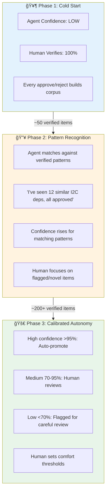
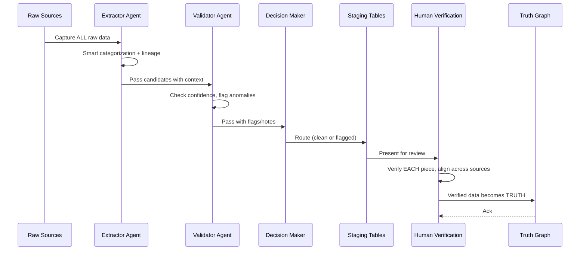
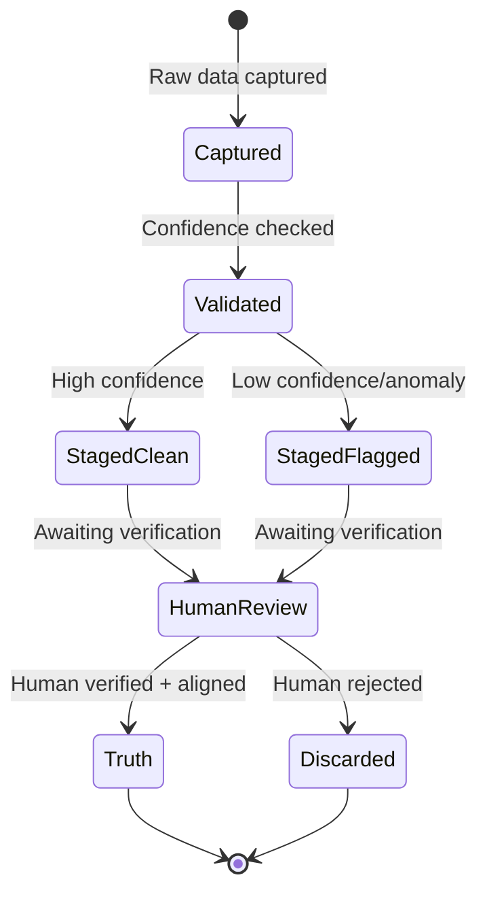

# 🛰� PROVES Library

**An AI-powered knowledge graph that prevents CubeSat mission failures by tracking hidden cross-system dependencies.**

[](https://lizo-roadtown.github.io/PROVES_LIBRARY/)
[](https://smith.langchain.com)
[](https://www.python.org/downloads/)
[](LICENSE)

> 📖 **New here?** Start with [GETTING_STARTED.md](GETTING_STARTED.md) | **Core principles:** [CANON.md](CANON.md)

---

## � The Problem

> *"Team A modified power management code. Tested locally — worked perfectly. Two weeks before launch, Team B's I2C sensors stopped communicating. Root cause: undocumented dependency on load switch timing. **Mission delayed 6 months.**"*

University CubeSat programs face a brutal reality:
- **Knowledge is fragmented** across teams, repos, docs, and Slack threads
- **Dependencies are hidden** — changes cascade unpredictably across systems
- **Teams can't learn from each other** — every program rediscovers the same failures

## 💡 The Solution

**LLM-powered dependency extraction → Knowledge graph → Continuous monitoring**

This project uses AI agents to automatically extract dependencies from technical documentation, validate them against a structured schema, and build a queryable knowledge graph that reveals the hidden connections between spacecraft systems.
That layered capture becomes the basis for a future graph neural network risk model used to assess mission-operations impact.

---

## �� Architecture: Truth Layer System

```
┌─────────────────────────────────────────────────────────────────�
│                    PROVES Library System                        │
│                                                                 │
│        "Context is EVERYTHING. Agents assist. Humans verify."   │
├─────────────────────────────────────────────────────────────────┤
│                                                                 │
│  📄 RAW SOURCES (capture everything)                            │
│     ├── F´ Framework (NASA/JPL flight software)                │
│     ├── PROVES Kit (Cal Poly Pomona CubeSat hardware)          │
│     └── GitHub repos, docs, specs, datasheets...               │
│                          ↓                                      │
│  🤖 CAPTURE LAYER (Extractor Agent)                             │
│     └── Grab ALL data, smart categorization, add lineage       │
│                          ↓                                      │
│  � STAGING LAYER (Validator Agent)                             │
│     └── Check confidence, flag anomalies, note pattern breaks  │
│                          ↓                                      │
│  📋 ROUTING (Decision Maker)                                    │
│     ├── Clean data → staging table                             │
│     └── Suspect data → flagged table with reasoning            │
│                          ↓                                      │
│  👤 HUMAN VERIFICATION (THE TRUTH GATE)                         │
│     └── Human reviews EACH piece, aligns across sources        │
│                          ↓                                      │
│  ✅ TRUTH LAYER (Knowledge Graph)                               │
│     ├── Only human-verified data enters                        │
│     ├── Aligned layers create clean GNN matrix                 │
│     └── kg_nodes, kg_relationships, library_entries            │
│                          ↓                                      │
│  � GitHub Pages (Interactive Visualizations)                   │
│                                                                 │
└─────────────────────────────────────────────────────────────────┘
```

### Why This Architecture?

| Decision | Rationale |
|----------|-----------|
| **Capture EVERYTHING** | Sources won't match in language - we need all data to cross-reference |
| **Agents provide context** | Smart categorization helps humans eliminate ambiguity |
| **Humans verify EACH piece** | Only human-aligned data becomes truth |
| **Sub-agents as tools** | Context isolation — each agent is an expert at one thing |
| **Haiku for validation/storage** | 90% cost savings on simple tasks |

---

## 📊 Current Status (December 2025)

### ✅ Phase 1: Trial Mapping — COMPLETE
- Manually analyzed F´ I2C Driver (411 lines) + PROVES Kit Power Management (154 lines)
- **Found 45+ dependencies** with exact line citations
- **Discovered 4 critical cross-system dependencies** (undocumented in either system!)
- **Identified 5 major knowledge gaps** (timing specs, voltage requirements, error recovery)

### ✅ Phase 2: Infrastructure — COMPLETE
- Neon PostgreSQL database with knowledge graph schema (9 tables)
- LangGraph checkpointer tables for agent state persistence
- Scripts for database management and schema application
- Staging + domain tables for evidence, confidence, and promotion workflow

### 🔄 Phase 3: Curator Agent — IN DEVELOPMENT
- LangGraph orchestration with sub-agents-as-tools pattern
- Claude Sonnet 4.5 (curator/extractor) + Haiku 3.5 (validator/storage)
- Truth Layer: Capture ALL → Stage → Human Verify EVERY piece
- **Current focus:** Agent workflow refinement and testing

### 🔮 Phase 4: Training Pipeline — PLANNED
- Training data collection from HITL interactions
- Local LLM fine-tuning with Unsloth/LoRA
- Model deployment for specialized CubeSat knowledge

### 📈 Confidence Calibration: How Agents Learn

As humans verify data, agents learn what "truth" looks like. Confidence grows, human involvement tapers:



**The Feedback Loop:**
- Every human decision (approve/reject/correct) trains the agent
- Corrections become **GOLD** training data
- Agent confidence is calibrated per pattern type, not globally
- Humans can always override — the agent suggests, humans decide

---

## 🚀 Quick Start

### Prerequisites
- Python 3.11+
- API keys: [Anthropic](https://console.anthropic.com/), [Neon](https://neon.tech/)

### Setup

```bash
# Clone and enter
git clone https://github.com/Lizo-RoadTown/PROVES_LIBRARY.git
cd PROVES_LIBRARY

# Create virtual environment
python -m venv .venv
.venv\Scripts\activate  # Windows
# source .venv/bin/activate  # macOS/Linux

# Install dependencies
pip install -r requirements.txt

# Configure environment
cp .env.example .env
# Edit .env with your API keys:
#   ANTHROPIC_API_KEY=sk-ant-...
#   DATABASE_URL=postgresql://...

# Initialize database
python scripts/apply_schema.py
python scripts/setup_domain_tables.py
python scripts/setup_checkpointer.py

# Run the curator agent
cd curator-agent
python run_with_approval.py
```

---

## 🔧 How It Works

### The Workflow

```mermaid
flowchart TD
  A["📄 Raw Sources<br/>(GitHub, docs, specs)"] --> B["🤖 Extractor Agent<br/>Capture ALL + categorize"]
  B --> C["� Validator Agent<br/>Check confidence, flag anomalies"]
  C --> D["📋 Decision Maker<br/>Route to staging tables"]
  D -->|Clean data| E["📦 Staging Table"]
  D -->|Suspect data| F["⚠� Flagged Table<br/>with reasoning"]
  E --> G["👤 Human Verification<br/>Review EACH piece"]
  F --> G
  G -->|Verified + Aligned| H["ƒo. Layered Truth Graph<br/>Knowledge Graph"]
  G -->|Rejected| I["� Discarded"]
  H --> J["dY"S Graph Neural Network"]
  J --> K["dY"- Mission Ops Risk Assessment"]
```

**Truth Layer Pipeline:**
- **Extractor** captures ALL raw data with smart categorization and lineage.
- **Validator** checks confidence, flags anomalies, notes pattern breaks.
- **Decision Maker** routes to clean staging or flagged table with reasoning.
- **Human** reviews EACH piece, aligns across sources to establish TRUTH.
- Only human-verified data enters the layered truth graph.
- The layered graph becomes the basis for GNN risk assessment in mission operations.

### Lifecycle: Curation Run



### Lifecycle: Data State



### ERV Relationship Types

The knowledge graph uses **Entity-Relationship-Value (ERV)** semantics:

| Relationship | Meaning | Example |
|-------------|---------|---------|
| `depends_on` | Runtime dependency | `ImuManager` depends_on `LinuxI2cDriver` |
| `requires` | Build/config requirement | `FprimeComponent` requires `FPP toolchain` |
| `enables` | Makes possible | `LoadSwitch` enables `SensorPower` |
| `conflicts_with` | Incompatible | `UARTDebug` conflicts_with `RadioTX` (same pins) |
| `mitigates` | Reduces risk | `Watchdog` mitigates `InfiniteLoop` |
| `causes` | Leads to effect | `BrownoutReset` causes `StateCorruption` |

### Criticality Levels (Post-Verification Metadata)

| Level | Meaning | Assigned By |
|-------|---------|-------------|
| **HIGH** | Mission-critical — failure = mission loss | Human during verification |
| **MEDIUM** | Important — affects functionality | Human during verification |
| **LOW** | Nice-to-have — minor impact | Human during verification |

> **Note:** Criticality is metadata assigned by humans AFTER verification, not a gate for capture.

---

## � Repository Structure

```
PROVES_LIBRARY/
├── curator-agent/          # 🤖 LangGraph deep agent system
│   ├── src/curator/
│   │   ├── agent.py        # Main curator with HITL
│   │   └── subagents/      # Extractor, Validator, Storage
│   ├── run_with_approval.py # CLI with human approval
│   └── langgraph.json      # LangGraph deployment config
│
├── docs/                   # 📚 GitHub Pages site
│   ├── diagrams/           # Interactive Mermaid diagrams
│   └── *.md                # Architecture & guides
│
├── scripts/                # 🔧 Database & graph utilities
│   ├── apply_schema.py     # Initialize Neon schema
│   ├── db_connector.py     # PostgreSQL connection
│   └── graph_manager.py    # Knowledge graph operations
│
├── trial_docs/             # 📋 Manual analysis results
│   └── COMPREHENSIVE_DEPENDENCY_MAP.md
│
├── library/                # 📖 Curated knowledge entries
│   ├── build/              # Assembly & hardware
│   ├── software/           # F´ patterns & components
│   └── ops/                # Operations & fixes
│
└── archive/                # 🗄� Superseded code & docs
```

---

## 🧠 For AI Builders

This project demonstrates several production patterns for LangGraph agents:

### Deep Agents Pattern
Sub-agents are wrapped as tools, giving the main agent the ability to delegate specialized tasks while maintaining context isolation:

```python
@tool("extractor_agent")
def call_extractor_agent(task: str) -> str:
    extractor = create_extractor_agent()
    result = extractor.invoke({"messages": [{"role": "user", "content": task}]})
    return result['messages'][-1].content
```

### Safe HITL Interrupts
Anthropic requires every `tool_use` to have a `tool_result` before the next model turn. We use a **deferred storage pattern** to safely pause for human approval:

1. **Tools node**: Always emits `ToolMessage` for every tool call
2. **HIGH storage**: Returns `DEFERRED_PENDING_APPROVAL` placeholder
3. **Approval node**: Calls `interrupt()` — safe because tool results exist
4. **Commit node**: Executes deferred storage if approved

### Cost Optimization
Use expensive models only where reasoning matters:
- **Sonnet 4.5**: Curator coordination, dependency extraction (complex)
- **Haiku 3.5**: Schema validation, database storage (simple) — **90% cheaper**

---

## 🔗 Links

| Resource | URL |
|----------|-----|
| **Live Docs** | https://lizo-roadtown.github.io/PROVES_LIBRARY/ |
| **Dependency Map** | [trial_docs/COMPREHENSIVE_DEPENDENCY_MAP.md](trial_docs/COMPREHENSIVE_DEPENDENCY_MAP.md) |
| **Agent README** | [curator-agent/README.md](curator-agent/README.md) |
| **Architecture Deep Dive** | [docs/AGENTIC_ARCHITECTURE.md](docs/AGENTIC_ARCHITECTURE.md) |

---

## � Contributing

This is an open research project. Contributions welcome!

- **Found a bug?** Open an issue
- **Have domain knowledge?** Help us map more CubeSat dependencies
- **AI/agent expertise?** Check `curator-agent/` for opportunities

For agent-specific changes, start with [curator-agent/README.md](curator-agent/README.md).

---

## 📜 License

MIT License — see [LICENSE](LICENSE).

---

## 👩�🚀 Contact

**Elizabeth Osborn**  
Cal Poly Pomona  
📧 eosborn@cpp.edu  
� [Portfolio](https://lizo-roadtown.github.io/proveskit-agent/)
