# 🛰️ PROVES Library

**An AI-powered knowledge graph that prevents CubeSat mission failures by tracking hidden cross-system dependencies.**

[](https://lizo-roadtown.github.io/PROVES_LIBRARY/)
[](https://smith.langchain.com)
[](https://www.python.org/downloads/)
[](LICENSE)

> 📖 **New here?** Start with [GETTING_STARTED.md](GETTING_STARTED.md) | **Core principles:** [CANON.md](CANON.md)

---

## 🎯 The Problem

> *"Team A modified power management code. Tested locally — worked perfectly. Two weeks before launch, Team B's I2C sensors stopped communicating. Root cause: undocumented dependency on load switch timing. **Mission delayed 6 months.**"*

University CubeSat programs face a brutal reality:
- **Knowledge is fragmented** across teams, repos, docs, and Slack threads
- **Dependencies are hidden** — changes cascade unpredictably across systems
- **Teams can't learn from each other** — every program rediscovers the same failures

## 💡 The Solution

**LLM-powered dependency extraction → Knowledge graph → Continuous monitoring**

This project uses AI agents to automatically extract dependencies from technical documentation, validate them against a structured schema, and build a queryable knowledge graph that reveals the hidden connections between spacecraft systems.

---

## 🏗️ Architecture

```
┌─────────────────────────────────────────────────────────────────┐
│                    PROVES Library System                        │
├─────────────────────────────────────────────────────────────────┤
│                                                                 │
│  📄 Documentation Sources                                       │
│     ├── F´ Framework (NASA/JPL flight software)                │
│     └── PROVES Kit (Cal Poly Pomona CubeSat hardware)          │
│                          ↓                                      │
│  🤖 Deep Agent System (LangGraph + Claude)                      │
│     ┌─────────────────────────────────────────┐                │
│     │  Main Curator Agent (Sonnet 4.5)        │                │
│     │     ↓ spawns as tools                   │                │
│     │  ├── Extractor (Sonnet 4.5)             │                │
│     │  ├── Validator (Haiku 3.5) ← 90% cheaper│                │
│     │  └── Storage   (Haiku 3.5) ← 90% cheaper│                │
│     └─────────────────────────────────────────┘                │
│                          ↓                                      │
│  👤 Human-in-the-Loop (HITL)                                    │
│     └── HIGH criticality deps require approval                 │
│                          ↓                                      │
│  🗄️ Neon PostgreSQL + pgvector                                 │
│     ├── kg_nodes (components, hardware, patterns)              │
│     ├── kg_relationships (ERV dependency types)                │
│     └── library_entries (source documentation)                 │
│                          ↓                                      │
│  🌐 GitHub Pages (Interactive Visualizations)                   │
│                                                                 │
└─────────────────────────────────────────────────────────────────┘
```

### Why This Architecture?

| Decision | Rationale |
|----------|-----------|
| **Sub-agents as tools** | Context isolation — each agent is an expert at one thing |
| **Haiku for validation/storage** | 90% cost savings on simple tasks; Sonnet only where reasoning matters |
| **HITL for HIGH criticality** | Mission-critical dependencies need human eyes before storage |
| **Deferred storage pattern** | Ensures tool_use/tool_result pairing for reliable interrupts |

---

## 📊 Current Status (December 2025)

### ✅ Phase 1: Trial Mapping — COMPLETE
- Manually analyzed F´ I2C Driver (411 lines) + PROVES Kit Power Management (154 lines)
- **Found 45+ dependencies** with exact line citations
- **Discovered 4 critical cross-system dependencies** (undocumented in either system!)
- **Identified 5 major knowledge gaps** (timing specs, voltage requirements, error recovery)

### ✅ Phase 2: Infrastructure — COMPLETE
- Neon PostgreSQL database with knowledge graph schema (9 tables)
- LangGraph checkpointer tables for agent state persistence
- Scripts for database management and schema application

### 🔄 Phase 3: Curator Agent — IN DEVELOPMENT
- LangGraph orchestration with sub-agents-as-tools pattern
- Claude Sonnet 4.5 (curator/extractor) + Haiku 3.5 (validator/storage)
- Human-in-the-loop framework for HIGH criticality dependencies
- **Current focus:** Agent workflow refinement and testing

### 🔮 Phase 4: Training Pipeline — PLANNED
- Training data collection from HITL interactions
- Local LLM fine-tuning with Unsloth/LoRA
- Model deployment for specialized CubeSat knowledge

---

## 🚀 Quick Start

### Prerequisites
- Python 3.11+
- API keys: [Anthropic](https://console.anthropic.com/), [Neon](https://neon.tech/)

### Setup

```bash
# Clone and enter
git clone https://github.com/Lizo-RoadTown/PROVES_LIBRARY.git
cd PROVES_LIBRARY

# Create virtual environment
python -m venv .venv
.venv\Scripts\activate  # Windows
# source .venv/bin/activate  # macOS/Linux

# Install dependencies
pip install -r requirements.txt

# Configure environment
cp .env.example .env
# Edit .env with your API keys:
#   ANTHROPIC_API_KEY=sk-ant-...
#   DATABASE_URL=postgresql://...

# Initialize database
python scripts/apply_schema.py
python scripts/setup_checkpointer.py

# Run the curator agent
cd curator-agent
python run_with_approval.py
```

---

## 🔧 How It Works

### The Workflow

```mermaid
flowchart-elk TD
  A[📄 Documentation] --> B[🤖 Curator Agent]
  B --> C[Extractor Sub-Agent]
  C --> D[Validator Sub-Agent]
  D -->|LOW/MEDIUM| E[Storage Sub-Agent]
  D -->|HIGH criticality| F[👤 Human Review]
  F -->|Approved| E
  F -->|Rejected| G[Skip Storage]
  E --> H[🗄️ Knowledge Graph]
  H --> I[📊 Visualizations & Queries]
```



### Lifecycle: Curation Run


### Lifecycle: Curator Job State


### ERV Relationship Types

The knowledge graph uses **Entity-Relationship-Value (ERV)** semantics:

| Relationship | Meaning | Example |
|-------------|---------|---------|
| `depends_on` | Runtime dependency | `ImuManager` depends_on `LinuxI2cDriver` |
| `requires` | Build/config requirement | `FprimeComponent` requires `FPP toolchain` |
| `enables` | Makes possible | `LoadSwitch` enables `SensorPower` |
| `conflicts_with` | Incompatible | `UARTDebug` conflicts_with `RadioTX` (same pins) |
| `mitigates` | Reduces risk | `Watchdog` mitigates `InfiniteLoop` |
| `causes` | Leads to effect | `BrownoutReset` causes `StateCorruption` |

### Criticality Levels

| Level | Meaning | HITL Required? |
|-------|---------|----------------|
| **HIGH** | Mission-critical — failure = mission loss | ✅ Yes |
| **MEDIUM** | Important — affects functionality | ❌ No |
| **LOW** | Nice-to-have — minor impact | ❌ No |

---

## 📁 Repository Structure

```
PROVES_LIBRARY/
├── curator-agent/          # 🤖 LangGraph deep agent system
│   ├── src/curator/
│   │   ├── agent.py        # Main curator with HITL
│   │   └── subagents/      # Extractor, Validator, Storage
│   ├── run_with_approval.py # CLI with human approval
│   └── langgraph.json      # LangGraph deployment config
│
├── docs/                   # 📚 GitHub Pages site
│   ├── diagrams/           # Interactive Mermaid diagrams
│   └── *.md                # Architecture & guides
│
├── scripts/                # 🔧 Database & graph utilities
│   ├── apply_schema.py     # Initialize Neon schema
│   ├── db_connector.py     # PostgreSQL connection
│   └── graph_manager.py    # Knowledge graph operations
│
├── trial_docs/             # 📋 Manual analysis results
│   └── COMPREHENSIVE_DEPENDENCY_MAP.md
│
├── library/                # 📖 Curated knowledge entries
│   ├── build/              # Assembly & hardware
│   ├── software/           # F´ patterns & components
│   └── ops/                # Operations & fixes
│
└── archive/                # 🗄️ Superseded code & docs
```

---

## 🧠 For AI Builders

This project demonstrates several production patterns for LangGraph agents:

### Deep Agents Pattern
Sub-agents are wrapped as tools, giving the main agent the ability to delegate specialized tasks while maintaining context isolation:

```python
@tool("extractor_agent")
def call_extractor_agent(task: str) -> str:
    extractor = create_extractor_agent()
    result = extractor.invoke({"messages": [{"role": "user", "content": task}]})
    return result['messages'][-1].content
```

### Safe HITL Interrupts
Anthropic requires every `tool_use` to have a `tool_result` before the next model turn. We use a **deferred storage pattern** to safely pause for human approval:

1. **Tools node**: Always emits `ToolMessage` for every tool call
2. **HIGH storage**: Returns `DEFERRED_PENDING_APPROVAL` placeholder
3. **Approval node**: Calls `interrupt()` — safe because tool results exist
4. **Commit node**: Executes deferred storage if approved

### Cost Optimization
Use expensive models only where reasoning matters:
- **Sonnet 4.5**: Curator coordination, dependency extraction (complex)
- **Haiku 3.5**: Schema validation, database storage (simple) — **90% cheaper**

---

## 🔗 Links

| Resource | URL |
|----------|-----|
| **Live Docs** | https://lizo-roadtown.github.io/PROVES_LIBRARY/ |
| **Dependency Map** | [trial_docs/COMPREHENSIVE_DEPENDENCY_MAP.md](trial_docs/COMPREHENSIVE_DEPENDENCY_MAP.md) |
| **Agent README** | [curator-agent/README.md](curator-agent/README.md) |
| **Architecture Deep Dive** | [docs/AGENTIC_ARCHITECTURE.md](docs/AGENTIC_ARCHITECTURE.md) |

---

## 🤝 Contributing

This is an open research project. Contributions welcome!

- **Found a bug?** Open an issue
- **Have domain knowledge?** Help us map more CubeSat dependencies
- **AI/agent expertise?** Check `curator-agent/` for opportunities

For agent-specific changes, start with [curator-agent/README.md](curator-agent/README.md).

---

## 📜 License

MIT License — see [LICENSE](LICENSE).

---

## 👩‍🚀 Contact

**Elizabeth Osborn**  
Cal Poly Pomona  
📧 eosborn@cpp.edu  
🌐 [Portfolio](https://lizo-roadtown.github.io/proveskit-agent/)
