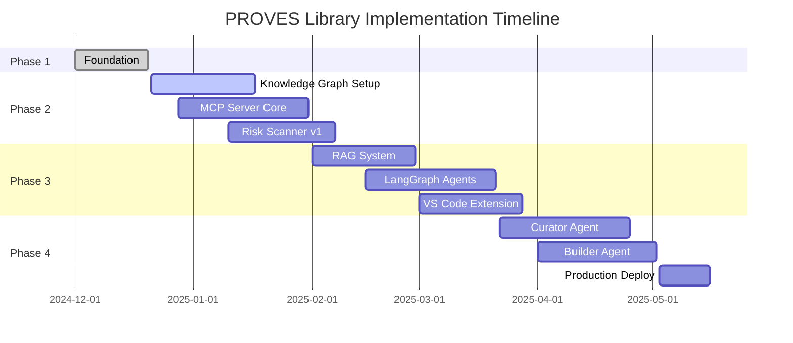

# PROVES Library Implementation Roadmap

**Version:** 1.0
**Last Updated:** December 19, 2024
**Status:** Foundation Phase Complete - Ready for Phase 2

---

## Executive Summary

This roadmap outlines the implementation of the PROVES Library system - a knowledge graph-powered, agent-driven platform for capturing and interrogating CubeSat mission knowledge. The system integrates:

- **FRAMES Ontology** (organizational behavior modeling)
- **Engineering Relationship Vocabulary** (technical causality mapping)
- **LangGraph + Deep Agents** (autonomous reasoning)
- **MCP + RAG** (hybrid knowledge retrieval)

**Timeline:** 16-20 weeks to production-ready system
**Current Phase:** Phase 1 (Foundation) - 90% complete

---

## Phase Overview



---

## Phase 1: Foundation ✅ (90% Complete)

**Duration:** 3 weeks (Dec 1 - Dec 20, 2024)
**Status:** Nearly complete

### Completed ✅

- [x] Repository structure created
- [x] Comprehensive documentation (2,600+ lines)
  - [x] ARCHITECTURE.md with mermaid diagrams
  - [x] TASKS.md with phase dependencies
  - [x] ONTOLOGY_INTEGRATION.md (FRAMES analysis)
  - [x] KNOWLEDGE_GRAPH_SCHEMA.md (ERV specification)
  - [x] AGENTIC_ARCHITECTURE.md (LangGraph + agents)
- [x] Example library entry (I2C conflict pattern)
- [x] Agent architecture specifications
- [x] Theoretical framework integration (FRAMES + ERV)

### Remaining ✓

- [ ] **Entry schema formalization** (docs/ENTRY_SCHEMA.md)
- [ ] **2-3 more example entries** (one per domain: build, ops)
- [ ] **Contributing guidelines** (docs/CONTRIBUTING.md)

**Deliverable:** Complete foundational documentation and example entries
**Timeline:** Complete by Dec 23, 2024 (3 days)

---

## Phase 2: Core Infrastructure (8 weeks)

**Duration:** 8 weeks (Dec 21, 2024 - Feb 14, 2025)
**Goal:** Build the knowledge graph, MCP server, and basic risk scanner

### Milestone 2.1: Knowledge Graph Setup (4 weeks)

**Owner:** Backend team
**Dependencies:** None
**Deliverable:** Working graph database with first 100 nodes

#### Week 1-2: Database Setup & Initial Schema

**Tasks:**
1. **Choose graph database**
   - Recommendation: Neo4j Community Edition
   - Alternative: PostgreSQL + Apache AGE (graph extension)
   - Fallback: DuckDB + graph tables (simplest)

2. **Implement ERV schema**
   ```python
   # Schema implementation
   - Node types: Component, Port, Hardware, Resource, Procedure, FailureMode
   - Edge types: IDENTICAL, REQUIRES, CONFIGURES, CONTROLS, COUPLES_TO, etc.
   - 5 attributes per edge: directionality, strength, mechanism, knownness, scope
   ```

3. **Create ingestion pipeline**
   - Parse markdown entries → extract nodes/edges
   - Validate schema compliance
   - Store in graph DB

4. **Build first 100 nodes**
   - 30 nodes: F´ core components (CommandDispatcher, RateGroup, ActiveLogger, etc.)
   - 30 nodes: PROVES Kit components (PowerMonitor, RadioDriver, IMU, etc.)
   - 20 nodes: Resources (PowerRail_3V3, I2C_Bus, Thermal budget, etc.)
   - 20 nodes: Hardware elements (SX1262, INA219, STM32, etc.)

**Code Example:**
```python
# nodes.csv
id,type,name,namespace,version,category
comp_001,SoftwareComponent,RadioDriver,PROVES.Radio,v2.1.0,software
hw_001,HardwareElement,SX1262,Radio.Hardware,rev_c,hardware
res_001,Resource,PowerRail_3V3,Power.Rails,,resource

# edges.csv
source,target,relation,forward,reverse,strength,mechanism,knownness,scope
comp_001,hw_001,REQUIRES,true,false,always,protocol,known,fprime@v3.4.3
comp_001,res_001,CONSUMES,true,false,sometimes,electrical,known,board_rev_c
```

#### Week 3-4: First Cascade & Sweep Implementation

**Tasks:**
1. **Implement cascade path algorithm**
   ```python
   def find_cascade_paths(start_node, resource_type, max_depth=5):
       # Traverse graph following CONSUMES/CONSTRAINS/COUPLES_TO edges
       # Return all paths from start_node through resource_type
       # Flag unknowns and assumed edges
   ```

2. **Build first sweep: Cascade Analysis**
   - Input: Starting component + resource type (power, thermal, timing)
   - Output: All cascade paths with risk scoring
   - Evidence gaps flagged

3. **Test with real scenario**
   - Scenario: "RadioTX causes brownouts"
   - Expected path: RadioTX → PowerRail_3V3 → MCU_Brownout → Reset
   - Validate knownness tracking works

**Deliverable:**
- Graph DB with 100 nodes, 50+ edges
- Working cascade path query
- First sweep implementation

**Success Metric:** Can answer "Show all components affected by RadioTX via power"

---

### Milestone 2.2: MCP Server Core (4 weeks, overlaps with 2.1)

**Owner:** Backend team
**Dependencies:** Graph DB setup (week 2)
**Deliverable:** MCP server with graph query endpoints

#### Week 1-2: Basic MCP Server

**Tasks:**
1. **Set up FastAPI application**
   ```python
   # mcp-server/server.py
   from fastapi import FastAPI
   from pydantic import BaseModel

   app = FastAPI(title="PROVES Library MCP Server")

   # Standard MCP endpoints
   @app.post("/search")
   @app.get("/entry/{entry_id}")
   @app.get("/list")
   @app.get("/artifacts/{entry_id}")
   ```

2. **Implement library indexer**
   - Parse markdown files with frontmatter
   - Extract metadata to SQLite
   - Build full-text search index

3. **Add basic search functionality**
   - Keyword search across entries
   - Filter by domain (build/software/ops)
   - Filter by tags

**Deliverable:** Working MCP server with basic search

#### Week 3-4: Graph Query Endpoints

**Tasks:**
1. **Add graph query endpoints**
   ```python
   # New endpoints
   @app.post("/graph/query")          # Cypher-like queries
   @app.post("/graph/cascade")        # Cascade path analysis
   @app.get("/graph/node/{id}/edges") # Get all edges for node
   @app.post("/graph/sweep")          # Run specific sweep
   ```

2. **Implement graph query engine**
   - Translate MCP queries to graph DB queries
   - Support filtering by edge attributes
   - Return results with evidence links

3. **Add caching layer**
   - Cache cascade path results (15 min TTL)
   - Cache search results
   - Invalidate on library updates

**Deliverable:** MCP server with full graph query capabilities

**Success Metric:** Can query "Find all REQUIRES edges with knownness:assumed"

---

### Milestone 2.3: Risk Scanner v1 (4 weeks, starts week 3)

**Owner:** Scanner team
**Dependencies:** MCP server basic endpoints (week 2)
**Deliverable:** Working risk scanner with pattern matching

#### Week 1-2: Pattern Matching Engine

**Tasks:**
1. **Build AST parser**
   ```python
   # risk-scanner/analyzers/ast_analyzer.py
   import ast

   def scan_python_file(file_path):
       # Parse Python AST
       # Detect patterns: duplicate I2C addresses, missing error handling, etc.
       # Return risks
   ```

2. **Implement 5 initial patterns**
   - I2C address conflicts
   - Missing REQUIRES dependencies
   - Port type mismatches
   - Config parameter undefined
   - Version tuple conflicts

3. **Create risk report format**
   ```json
   {
     "scan_id": "scan-001",
     "risks": [
       {
         "risk_id": "risk-001",
         "severity": "high",
         "category": "power",
         "pattern": "i2c-address-conflict",
         "file": "RadioDriver.py",
         "line": 45,
         "description": "Multiple devices at 0x40",
         "library_fix": "software-001"
       }
     ]
   }
   ```

#### Week 3-4: Graph-Enhanced Scanning

**Tasks:**
1. **Integrate with knowledge graph**
   ```python
   # Query graph for known risks
   def check_topology_risks(repo_topology):
       # Extract components from repo
       # Query graph: "Does this topology have known cascade risks?"
       # Check for missing REQUIRES edges
       # Flag version mismatches
   ```

2. **Implement cascade risk detection**
   - Detect high-power components near noise-sensitive components
   - Check for shared power rails
   - Flag potential COUPLES_TO relationships

3. **Add CLI interface**
   ```bash
   python scanner.py --repo /path/to/repo --output report.json
   ```

**Deliverable:** Scanner that detects 5 risk patterns + cascade risks

**Success Metric:** Can scan a university repo and find real risks

---

## Phase 3: Intelligence Layer (6 weeks)

**Duration:** 6 weeks (Feb 1 - Mar 14, 2025)
**Goal:** Add RAG system and LangGraph agent orchestration

### Milestone 3.1: RAG System (4 weeks)

**Owner:** ML/AI team
**Dependencies:** MCP server core
**Deliverable:** Hybrid graph + vector search

#### Week 1-2: Vector Store Setup

**Tasks:**
1. **Choose vector database**
   - Recommendation: Chroma (embedded, free)
   - Alternative: Pinecone (hosted, scalable)
   - Alternative: Weaviate (self-hosted, feature-rich)

2. **Index documentation**
   - F´ documentation (latest version)
   - PROVES Kit docs
   - PySquared docs
   - PROVES Library entries

3. **Implement embeddings pipeline**
   ```python
   from sentence_transformers import SentenceTransformer

   model = SentenceTransformer('all-MiniLM-L6-v2')

   # Chunk documents
   # Generate embeddings
   # Store in vector DB
   ```

#### Week 3-4: Hybrid Query System

**Tasks:**
1. **Implement query router**
   ```python
   class QueryRouter:
       def route(self, query: str) -> QueryStrategy:
           if self.is_structural(query):
               return GraphQuery()    # "What requires I2C_Bus?"
           elif self.is_semantic(query):
               return VectorQuery()   # "How to prevent brownouts?"
           else:
               return HybridQuery()   # "Why radio causes resets?"
   ```

2. **Build result fusion**
   - Combine graph results + vector search results
   - Re-rank using LLM
   - Deduplicate and score

3. **Add to MCP server**
   ```python
   @app.post("/hybrid/search")
   def hybrid_search(query: str, strategy: str = "auto"):
       # Route query
       # Execute graph + vector search
       # Fuse results
       # Return ranked list
   ```

**Deliverable:** Working hybrid search via MCP

**Success Metric:** Query "radio brownout" returns cascade path + mitigation docs

---

### Milestone 3.2: LangGraph Agent Orchestration (4 weeks, overlaps)

**Owner:** AI team
**Dependencies:** MCP + RAG system
**Deliverable:** Working LangGraph workflow for complex queries

#### Week 1-2: Basic LangGraph Setup

**Tasks:**
1. **Install dependencies**
   ```bash
   pip install langgraph langchain langchain-anthropic
   ```

2. **Create basic workflow**
   ```python
   from langgraph.graph import StateGraph

   workflow = StateGraph()
   workflow.add_node("router", route_query)
   workflow.add_node("graph_query", graph_query_agent)
   workflow.add_node("synthesizer", synthesis_agent)

   workflow.set_entry_point("router")
   workflow.add_edge("graph_query", "synthesizer")

   app = workflow.compile()
   ```

3. **Implement 3 core agents**
   - Router: Classify query type
   - Graph Query: Execute graph searches
   - Synthesizer: Generate final answer

#### Week 3-4: Deep Agent Integration

**Tasks:**
1. **Build Cascade Analyzer agent**
   ```python
   cascade_tools = [
       Tool(name="GraphCascadeQuery", func=mcp_cascade),
       Tool(name="GetEdgeDetails", func=mcp_get_edge),
       Tool(name="CalculateRisk", func=calculate_risk)
   ]

   cascade_agent = create_react_agent(llm, cascade_tools, cascade_prompt)
   ```

2. **Create agent workflow graph**
   ```mermaid
   stateDiagram-v2
       [*] --> Router
       Router --> CascadeAnalyzer: cascade query
       Router --> VectorSearch: semantic query
       CascadeAnalyzer --> EvidenceTracer
       VectorSearch --> Synthesizer
       EvidenceTracer --> Synthesizer
       Synthesizer --> [*]
   ```

3. **Test with complex queries**
   - "Why does my radio cause brownouts?"
   - "What components depend on I2C_Bus?"
   - "How do I add a new sensor to PROVES Kit?"

**Deliverable:** LangGraph workflow handling 3 query types

**Success Metric:** 80% accuracy on test queries

---

### Milestone 3.3: VS Code Extension (4 weeks, starts week 3)

**Owner:** Frontend team
**Dependencies:** MCP server with graph endpoints
**Deliverable:** VS Code extension for library queries

#### Week 1-2: Basic Extension

**Tasks:**
1. **Set up TypeScript project**
   ```json
   {
     "name": "proves-library",
     "displayName": "PROVES Library",
     "description": "Query PROVES Library knowledge graph",
     "version": "0.1.0",
     "engines": {"vscode": "^1.80.0"}
   }
   ```

2. **Implement MCP client**
   ```typescript
   class MCPClient {
     async search(query: string): Promise<SearchResult[]> {
       const response = await fetch(`${MCP_URL}/search`, {
         method: 'POST',
         body: JSON.stringify({ query })
       });
       return response.json();
     }
   }
   ```

3. **Add command palette commands**
   - "PROVES: Search Library"
   - "PROVES: Scan Current File"
   - "PROVES: Show Cascade Paths"

#### Week 3-4: Rich Features

**Tasks:**
1. **Add inline risk warnings**
   - Scan open file on save
   - Show squiggly underlines for risks
   - Hover for fix suggestions

2. **Add webview for cascade visualization**
   - Display mermaid diagrams in panel
   - Interactive graph navigation
   - Click to see edge details

3. **Package and publish**
   - Test on Windows/Mac/Linux
   - Publish to VS Code Marketplace

**Deliverable:** Published VS Code extension

**Success Metric:** 10+ test users successfully querying library

---

## Phase 4: Agentic Systems (6 weeks)

**Duration:** 6 weeks (Mar 15 - Apr 25, 2025)
**Goal:** Deploy autonomous curator and builder agents

### Milestone 4.1: Curator Agent (5 weeks)

**Owner:** AI team
**Dependencies:** LangGraph workflow, MCP server
**Deliverable:** Agent that normalizes raw captures into library entries

#### Week 1-2: Core Curator Logic

**Tasks:**
1. **Build citation extraction**
   ```python
   async def extract_citations(raw_capture: str):
       prompt = """
       Extract formal citations from this raw capture.
       Find: URLs, document names, commit hashes.
       Return JSON: {"citations": [...]}
       """
       response = await llm.ainvoke([
           SystemMessage(content=prompt),
           HumanMessage(content=raw_capture)
       ])
       return parse_citations(response)
   ```

2. **Implement tag suggestion**
   - Extract keywords using LLM
   - Match against existing tag taxonomy
   - Suggest 3-5 relevant tags

3. **Build duplicate detection**
   - Semantic similarity using embeddings
   - Check for IDENTICAL/ALIAS_OF edges in graph
   - Flag if similarity > 0.85

#### Week 3-4: Quality Scoring & Feedback Loop

**Tasks:**
1. **Implement quality scorer**
   ```python
   def quality_score(entry):
       score = 0.0
       if entry.sources and all(s.url for s in entry.sources):
           score += 0.3  # Valid citations
       if has_section(entry, "Problem") and has_section(entry, "Resolution"):
           score += 0.2  # Clear structure
       if entry.verification:
           score += 0.2  # Verification steps
       if entry.tags and len(entry.tags) >= 3:
           score += 0.15  # Good tagging
       if drift_score(entry) < 0.3:
           score += 0.15  # Low drift from contract
       return score
   ```

2. **Build feedback learning loop**
   - Store approved/rejected entries
   - Analyze patterns in rejections
   - Adjust prompts based on feedback
   - Improve quality score thresholds

3. **Add human review interface**
   - Web UI for reviewing normalized entries
   - Side-by-side: raw capture vs normalized
   - Approve/reject with feedback text

#### Week 5: Production Testing

**Tasks:**
1. **Test with 20 real raw captures**
   - From university teams
   - Various quality levels
   - Different risk categories

2. **Measure performance**
   - Normalization accuracy: > 90%
   - Quality score correlation: > 0.8
   - Human approval rate: > 75%

**Deliverable:** Production curator agent

**Success Metric:** 75% of normalized entries approved on first try

---

### Milestone 4.2: Builder Agent (5 weeks, overlaps week 2)

**Owner:** AI + F´ expert team
**Dependencies:** MCP server, knowledge graph
**Deliverable:** Agent that generates F´ components from patterns

#### Week 1-2: Template System

**Tasks:**
1. **Create Jinja2 templates**
   - `active_component.fpp.jinja`
   - `passive_component.fpp.jinja`
   - `component_impl.cpp.jinja`
   - `component_test.cpp.jinja`

2. **Build requirements parser**
   ```python
   async def parse_requirements(description: str):
       prompt = """
       Extract technical requirements:
       - Component type (active/passive/queued)
       - Inputs/outputs
       - State maintained
       - Timing (periodic/event-driven)
       - Keywords
       Return JSON.
       """
       response = await llm.ainvoke(...)
       return Requirements(**parse_json(response))
   ```

3. **Implement template selection**
   - Map requirements to template
   - Check team constraints (FRAMES satisficing)
   - Select appropriate complexity level

#### Week 3-4: Code Generation & Validation

**Tasks:**
1. **Build code generator**
   ```python
   def generate_component(requirements, team_context):
       # Query graph for similar components
       similar = mcp.search_similar(requirements.functionality)

       # Select template based on constraints
       template = select_template(requirements, team_context)

       # Render with context
       code = template.render(
           requirements=requirements,
           similar_components=similar,
           interface_strength_targets=compute_targets()
       )
       return code
   ```

2. **Add syntax validation**
   - Run `fpp-check` on generated .fpp
   - Run `g++ -fsyntax-only` on generated .cpp
   - Check style compliance

3. **Generate test scaffolds**
   - Create test suite skeleton
   - Add nominal case tests
   - Add error case tests from patterns

#### Week 5: Integration Testing

**Tasks:**
1. **Generate 10 real components**
   - Based on actual university requests
   - Various complexity levels
   - Different subsystems

2. **Human expert review**
   - Code quality assessment
   - Architecture compliance
   - Test coverage evaluation

**Deliverable:** Production builder agent

**Success Metric:** 80% of generated code compiles without modification

---

## Phase 5: Production Deployment (2 weeks)

**Duration:** 2 weeks (Apr 26 - May 9, 2025)
**Goal:** Deploy to production, onboard first users

### Week 1: Infrastructure & Deployment

**Tasks:**
1. **Set up production infrastructure**
   - Cloud hosting (AWS/GCP/Azure)
   - Graph database cluster
   - MCP server with load balancing
   - Vector store replication

2. **Configure CI/CD**
   - Automated testing
   - Deployment pipeline
   - Monitoring and logging

3. **Security hardening**
   - API authentication
   - Rate limiting
   - Input sanitization

### Week 2: User Onboarding

**Tasks:**
1. **Create user documentation**
   - Getting started guide
   - Tutorial videos
   - API reference

2. **Onboard 3 pilot universities**
   - Cal Poly Pomona
   - University of Hawaii
   - One additional partner

3. **Collect feedback**
   - Weekly check-ins
   - Usage analytics
   - Feature requests

**Deliverable:** Production system with active users

**Success Metrics:**
- 3 universities actively using
- 50+ library entries
- 100+ graph nodes
- 10+ scans per week

---

## Key Milestones & Decision Points

### Decision Point 1: Graph Database Choice (Week 1)

**Options:**
1. **Neo4j Community Edition**
   - ✅ Industry standard, mature
   - ✅ Cypher query language
   - ✅ Good visualization tools
   - ❌ License restrictions for commercial use

2. **PostgreSQL + Apache AGE**
   - ✅ Open source, permissive license
   - ✅ Use existing PostgreSQL skills
   - ❌ Newer, less mature
   - ❌ Smaller community

3. **DuckDB + Graph Tables**
   - ✅ Embedded, no server needed
   - ✅ Extremely fast for small datasets
   - ❌ Not a "real" graph database
   - ❌ Manual graph traversal logic

**Recommendation:** Start with **Neo4j Community** for rapid development, migrate to PostgreSQL + AGE for production if needed.

### Decision Point 2: LLM Provider (Week 8)

**Options:**
1. **Anthropic Claude Sonnet 4.5**
   - ✅ Best reasoning capabilities
   - ✅ Long context window (200k)
   - ✅ Tool use support
   - ❌ Cost ($3/$15 per 1M tokens)

2. **OpenAI GPT-4**
   - ✅ Mature, well-documented
   - ✅ Function calling support
   - ❌ Shorter context (128k)
   - ❌ Cost similar to Claude

3. **Local Model (Llama 3, Mistral)**
   - ✅ No API costs
   - ✅ Data privacy
   - ❌ Requires GPU infrastructure
   - ❌ Lower quality reasoning

**Recommendation:** **Claude Sonnet 4.5** for agents, consider local models for simple tasks (tagging, keyword extraction).

### Decision Point 3: Cascade Domain First (Week 2)

**Options:**
1. **Power** (Recommended)
   - ✅ Clear physical mechanism
   - ✅ Easy to validate (scope + multimeter)
   - ✅ High impact (brownouts are common)
   - ✅ Good learning case

2. **Timing**
   - ✅ Critical for real-time systems
   - ❌ Harder to measure
   - ❌ More abstract

3. **Comms/Protocol**
   - ✅ Well-defined interfaces
   - ❌ Less dramatic failures
   - ❌ Lower priority

4. **Thermal**
   - ✅ Important but often overlooked
   - ❌ Requires thermal modeling
   - ❌ Longer feedback loops

**Recommendation:** **Power cascades first** - RadioTX → Brownout → Reset is the canonical example.

---

## Risk Mitigation

### Technical Risks

**Risk:** Graph database performance degrades with 10,000+ nodes

**Mitigation:**
- Implement pagination for large result sets
- Add caching layer
- Optimize frequent queries
- Consider sharding if needed

**Risk:** LLM hallucinations in curator/builder agents

**Mitigation:**
- Always include human review step
- Implement confidence scoring
- Validate generated code syntactically
- Store rejected outputs for training

**Risk:** Vector embeddings drift over time

**Mitigation:**
- Version embedding models
- Store model version with each embedding
- Re-embed periodically (quarterly)
- Monitor similarity score distributions

### Organizational Risks

**Risk:** Low university adoption

**Mitigation:**
- Provide immediate value (risk scanning)
- Make contribution frictionless
- Gamify contributions (leaderboard?)
- Highlight success stories

**Risk:** Knowledge quality degrades

**Mitigation:**
- Maintain high bar for entry approval
- Implement quality scoring
- Periodic audits of existing entries
- Community voting/feedback

---

## Success Metrics

### Phase 2 (Core Infrastructure)
- ✅ 100 nodes in knowledge graph
- ✅ 5 working risk patterns
- ✅ Cascade path query working
- ✅ MCP server handles 10 QPS

### Phase 3 (Intelligence)
- ✅ RAG retrieval accuracy > 85%
- ✅ Hybrid search beats pure vector by 20%
- ✅ LangGraph answers complex queries correctly 80% of time
- ✅ VS Code extension: 10+ active users

### Phase 4 (Agents)
- ✅ Curator approval rate > 75%
- ✅ Builder code compiles 80% without modification
- ✅ Human review time < 5 min per entry

### Phase 5 (Production)
- ✅ 3 universities actively using
- ✅ 50+ library entries
- ✅ 10+ scans per week
- ✅ 95% uptime
- ✅ < 500ms median query latency

---

## Resource Requirements

### Team Composition

**Minimum viable team:**
1. **Backend Engineer** (1 FTE) - MCP server, graph DB, APIs
2. **AI/ML Engineer** (1 FTE) - RAG, agents, LangGraph
3. **F´ Domain Expert** (0.5 FTE) - Component templates, validation
4. **Frontend Engineer** (0.5 FTE) - VS Code extension
5. **DevOps** (0.25 FTE) - Infrastructure, deployment

**Total:** 3.25 FTEs

### Infrastructure Costs (Monthly)

**Development:**
- Cloud compute: $200/month (small instances)
- Neo4j hosting: $0 (local/community)
- Vector DB: $0 (Chroma embedded)
- LLM API: $500/month (development usage)
- **Total: ~$700/month**

**Production:**
- Cloud compute: $800/month (3x web servers, 1x worker)
- Graph DB cluster: $400/month
- Vector DB: $300/month (hosted Pinecone or self-hosted)
- LLM API: $2,000/month (production usage)
- Monitoring/logging: $200/month
- **Total: ~$3,700/month**

---

## Next Immediate Actions (This Week)

**By Dec 23, 2024:**

1. ✅ **Formalize entry schema** (docs/ENTRY_SCHEMA.md)
   - YAML frontmatter specification
   - Required vs optional fields
   - Validation rules

2. ✅ **Create 2 more example entries**
   - `library/build/example-power-budgeting.md`
   - `library/ops/example-radio-configuration.md`

3. ✅ **Write contributing guidelines** (docs/CONTRIBUTING.md)
   - How to submit entries
   - Citation requirements
   - Review process

4. ✅ **Set up development environment**
   - Install Neo4j Desktop
   - Create first graph database
   - Ingest example entries

**By Dec 27, 2024:**

1. **Implement first 30 nodes in graph**
   - F´ core components
   - PROVES Kit components
   - Power resources

2. **Build basic cascade path algorithm**
   - Graph traversal logic
   - Filter by edge attributes
   - Return formatted results

3. **Test cascade query**
   - "RadioTX to Reset via Power"
   - Validate results
   - Measure performance

---

## Conclusion

This roadmap provides a clear path from the current foundation (Phase 1, 90% complete) to a production-ready system (Phase 5, May 2025). The phased approach allows for:

1. **Early validation** - Test core concepts (cascades, sweeps) in Phase 2
2. **Incremental value** - Risk scanner provides value before agents are ready
3. **Risk mitigation** - Key decision points identified upfront
4. **Resource clarity** - Team and infrastructure needs specified

**Next milestone:** Phase 2.1 complete by Jan 17, 2025 (knowledge graph with 100 nodes + cascade queries working).

The system integrates cutting-edge AI (LangGraph, RAG) with solid engineering practices (graph databases, comprehensive testing) to create a knowledge platform that can genuinely reduce CubeSat mission failures.

---

**Questions or concerns?** Open an issue or contact the team lead.

**Want to contribute?** See [CONTRIBUTING.md](docs/CONTRIBUTING.md) (coming Dec 23).
