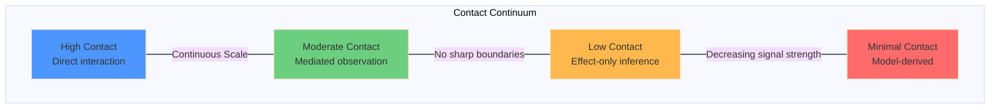
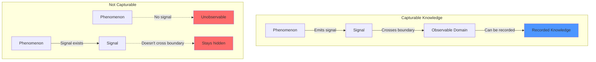
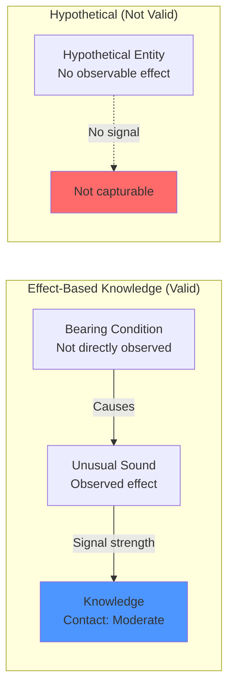
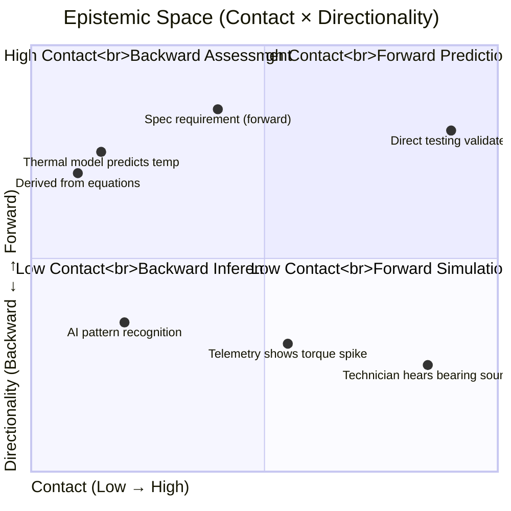
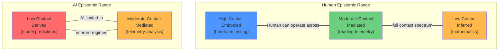
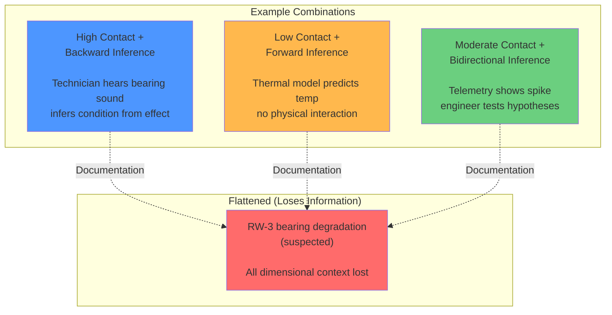

# (In Progress) Knowledge Canonicalization Theory
## A Practical Framework for Preserving Knowledge in Technical Systems
---

## Dimensional Metadata

Before knowledge enters a system where it will be stored, shared, or reasoned over, we capture four structural properties:

**1. Contact** — Signal strength between phenomenon and observer (continuous, not categorical)
**2. Directionality** — Epistemic operation (forward prediction, backward assessment, bidirectional)
**3. Temporality** — Dependence on history (snapshot, sequence, history, lifecycle)
**4. Formalizability** — Capacity for symbolic transformation (portable, conditional, local, tacit)

These determine:

- Reliability of the knowledge
- What it depends on
- How it should be interpreted
- Whether it can transfer across contexts

---

## Contact Defines Embodied vs. Inferred Knowledge

**Contact is the foundational dimension.** It distinguishes between two fundamental forms of technical domain knowledge:

- **Embodied knowledge** (high contact): Learned through direct physical interaction with hardware and systems. Built from doing, failing, adjusting, repeating. Examples: how tight to turn a bolt, what it means to crimp a wire properly, recognizing bearing degradation by sound.
- **Inferred knowledge** (low contact): Exists in symbolic form—specifications, schematics, code, procedures. Examples: torque values in documentation, crimping procedure steps, interface requirements, mathematical models.

This distinction is not merely epistemic theory. **It determines whether knowledge can transfer across interfaces in modular systems.**

In a nearly decomposable architecture (NDA), different modules—human teams, AI systems, organizations—observe phenomena from different positions along the contact axis. When these modules meet at interfaces to exchange knowledge, **Contact tells you whether that knowledge can cross the boundary.**

**High-contact embodied knowledge** often cannot transfer across interfaces without loss, because it depends on direct physical interaction, repeated experience, or tacit pattern recognition. This is what FRAMES calls "institutional knowledge"—knowledge held by individuals that is lost when personnel rotate out.

**Low-contact inferred knowledge** transfers more reliably across interfaces when properly formalized. This is what FRAMES calls "codified knowledge"—documented and transferable independent of individuals.

**Contact is the mechanism that enables knowledge to function in modular architectures where different observers (human or machine) must coordinate without shared authority.**

---

## Contact as Continuous Signal Space

**Contact is not categorical.** However, for linguistic simplification we could use "Direct," "Mediated," "Indirect," and "Derived" to describe how contact is experienced along an axis.

In reality, **contact exists on a continuous scale** representing the degree of coupling between a phenomenon and an observing system.

**Definition:** Contact measures the magnitude of coupling between a phenomenon and an observer, determined by whether and how a signal crosses an epistemic boundary into a recordable domain.

This coupling varies smoothly based on:

- Number of transformations between phenomenon and signal
- Mediation by instruments or abstractions
- Signal loss or distortion
- Abstraction distance
- Embodiment of the observer

---

## Signal-Based Observability Rule

A knowledge item is capturable if and only if:

1. **A signal exists** — either direct observation or observable effect
2. **The signal crosses into an observable domain**:
   - Human sensory experience
   - Instrumentation or telemetry
   - System behavior or state change
   - Recorded judgment, comparison, or decision
3. **That domain admits recording** — even if lossy, uninterpreted, or non-symbolic

**Critical insight:** Phenomena that do not emit or produce any observable effect are not capturable within the system.

---

## Inference from Effect Is Not Hypothetical

Direct observation is not required for knowledge to be grounded.

When only an effect is observed:

- **The effect itself is the signal**
- **The phenomenon is inferred, not hypothetical**
- **Contact exists, but at a lower magnitude**

This corresponds to **indirect or effect-only contact**, which remains valid knowledge with explicit epistemic constraints.

**Example:**

---

## Discrete Labels as Projections

For clarity, continuous contact values may be projected into coarse descriptors:

| Contact Range | Label | Description |
|--------------|-------|-------------|
| High | **Direct** | Physical/experiential interaction |
| Moderate | **Mediated** | Instrumented observation |
| Low | **Indirect** | Effect-only inference |
| Minimal | **Derived** | Model/simulation reasoning |

**These labels do not define the ontology.** They are compression artifacts for human communication.

The underlying contact value remains continuous and should be preserved in the system.

---

## Epistemic Space Representation (Human–AI)

Contact and Directionality together define a **shared epistemic space** that can be visualized geometrically:

**X-axis (Contact):** Continuous degree of coupling between phenomenon and observer, from fully embodied interaction to minimally grounded, model-derived signals.

**Y-axis (Directionality):** Orientation of reasoning, from backward inference (effect → cause) to forward projection (cause → expected effect).

### Human and AI in the Same Contact Space

Both human and AI systems occupy positions within the same contact continuum.

**AI systems:**

- Operate exclusively in **inferred regimes**
- Reason backward from recorded signals or effects
- Typically occupy **low to moderate contact** positions
- Cannot directly observe phenomena (always mediated)

**Humans:**

- Span the **full contact axis**
- Range from high-contact embodied domains (dance, craftsmanship, manual diagnostics)
- To low-contact inferred domains (mathematics, theoretical physics, nanotechnology)

**This difference is structural, not qualitative.**

**Contact provides a shared epistemic coordinate system for mixed human–AI reasoning.**

---

## The Three Dimensions Explained

### 1. Contact (Signal Strength Between Phenomenon and Observer)

**Continuous scale, not discrete categories.**

**High Contact (Direct):** Physical or experiential interaction
*Technician feels, hears, observes the thing itself*

**Moderate Contact (Mediated):** Instrumented observation
*Sensors translate reality into data*

**Low Contact (Indirect):** Effect-only
*Outcome visible, cause inferred*

**Minimal Contact (Derived):** Model-only
*Pure symbolic manipulation, no physical observation*

**Why it matters:** A technician who hears a bearing irregularity has different epistemic grounding than telemetry showing torque increase, which has different grounding than a thermal model prediction. Without tracking this, all three collapse into "bearing degradation" with no reliability differentiation.

---

### 2. Directionality (Prediction vs. Assessment)

**Forward:** Action → observed outcome
*"If we command this, torque will increase by X"*

**Backward:** Observed outcome → inferred cause
*"Torque increased, therefore friction likely increased"*

**Bidirectional:** Hypothesis → test → revision loop
*"We think it's friction, let's check thermal data, adjust hypothesis"*

**Why it matters:** Forward and backward are different operations. AI excels at inference and can help humans predict better by finding patterns humans miss. But if AI learns from a backward assessment without knowing the dimensional grounding, its forward predictions inherit hidden uncertainty.

**The distinction:** Humans can do both forward and backward inference. AI can only infer—but it's very good at it. The value is in helping humans see forward by leveraging AI's pattern recognition across high-dimensional data.

---

### 3. Temporality (Dependence on History)

**Snapshot:** Truth evaluable at a point in time
*"Current voltage: 28.5V"*

**Sequence:** Ordering matters
*"Event A must precede Event B"*

**History:** Accumulated past affects present
*"200 thermal cycles induced cumulative stress"*

**Lifecycle:** Long-term evolution
*"Material fatigue over 5 years"*

**Why episodes must be entities:**
Bearing degradation isn't caused by "time in orbit." It's caused by specific thermal cycling patterns. If "thermal cycling episode" is just metadata on a timestamp, your system can't reason about whether two missions with same duration but different thermal profiles have similar risk.

Episodes need to be first-class entities with relationships to components, states, and other episodes. Otherwise temporal causality collapses into timelines and history-dependent knowledge becomes snapshot reasoning.

---

## Contact and Directionality Are Independent

These are orthogonal dimensions. Knowledge can have any combination:

**Why this matters:** These three scenarios look identical once flattened into "RW-3 bearing degradation (suspected)" in documentation. But their reliability, recoverability, and failure modes are completely different. Without dimensional tracking, systems treat them as equivalent.

---

## Summary Constraints (Canonical)

**Knowledge enters the system when a recordable signal exists.**

The strength of contact is determined by how directly that signal couples to the originating phenomenon.

**Inference based on observable effects is grounded knowledge; only signal-free claims are hypothetical.**

**Discrete labels (Direct, Mediated, Indirect, Derived) are projections of continuous contact values for human communication.**

**Both human and AI reasoning occur within the same epistemic space, positioned differently along the contact axis.**

---

## What This Enables

**Interface transfer in modular architectures:** In nearly decomposable systems where different modules (human teams, AI systems, organizations) must coordinate, Contact reveals whether knowledge can cross interfaces. High-contact embodied knowledge requires different transfer mechanisms than low-contact codified knowledge. Without this distinction, interface mechanisms fail and knowledge is lost during personnel turnover or organizational transitions.

**Better predictions:** Systems can weight confidence based on epistemic grounding, not just statistical correlation.

**Resilient organizations:** Knowledge survives personnel turnover because the structure of how it was known is preserved, not just the content. Systems can identify which interfaces are vulnerable (embodied knowledge without formalization mechanisms) and which are robust (codified knowledge with preserved dimensional metadata).

**Traceable reasoning:** When predictions fail, you can trace back to see where dimensional grounding was lost—often at an interface where high-contact knowledge flattened into low-contact documentation.

**Honest uncertainty:** Systems don't claim to know more than they do. If knowledge is backward-inferred from indirect contact with low formalizability, that's explicit.

**AI as amplifier, not replacement:** AI helps humans predict better by finding patterns in high-dimensional data, but dimensional tracking ensures AI-generated insights remain grounded in their epistemic origins.

**Mixed human–AI systems:** Explicit epistemic coordinates allow systems to reason about grounding, confidence, and failure modes based on where knowledge lies in the space. Human and AI modules can coordinate across interfaces when their different contact positions are made explicit.

---
