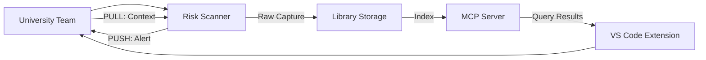

# System Architecture

## Overview

The PROVES Library system consists of three main components that work together to create an automated knowledge capture and interrogation system.

## Components

### 1. Library (Knowledge Storage)

**Purpose:** Store knowledge entries as structured markdown files

**Location:** `/library/`

**Structure:**
```
library/
├── build/              # Assembly, hardware, testing knowledge
├── software/           # F Prime patterns, components, architecture
└── ops/                # Configurations, fixes, operational checklists
```

**Entry Schema:**
- YAML frontmatter with metadata
- Markdown body with detailed content
- Citations and source excerpts
- Artifact links (components, repos, docs, tests)

**Key Requirements:**
- All entries must have citations (no original knowledge claims)
- Artifact links must be verifiable
- No attribution to individuals (structure owns outcomes)
- Tags for searchability

### 2. MCP Server

**Purpose:** Make the library interrogatable through structured queries

**Location:** `/mcp-server/`

**Key Endpoints:**
- `search(query, filters)` - Semantic and keyword search
- `fetch(entry_id)` - Retrieve specific entry with full metadata
- `list(domain, tags)` - List entries by category
- `get_artifacts(entry_id)` - Fetch related artifacts

**Technology:**
- Python FastAPI or similar
- SQLite for metadata indexing
- Embeddings for semantic search (sentence-transformers)
- MCP protocol implementation

**Why MCP?**
- Vendor-neutral protocol
- Works with any AI tool that supports MCP
- Structured queries vs dumping docs into context windows
- Creates "memory" for AI interactions

###3. Risk Scanner

**Purpose:** Detect mission-critical risks in repos and capture knowledge

**Location:** `/risk-scanner/`

**Workflow:**
1. Scan repository for known risk patterns
2. **PUSH:** Alert team with risk details + links to fixes
3. **PULL:** Capture team's context and resolution approach
4. Submit raw capture for review
5. Add approved entry to library

**Pattern Matching:**
- AST parsing for code patterns
- Config file analysis
- Dependency checking
- Test coverage analysis

**Risk Categories:**
- Power system issues
- Radio/communication timing
- I2C conflicts
- Memory management
- Component integration

**Output Format:**
```json
{
  "risk_id": "unique-id",
  "severity": "critical | high | medium | low",
  "category": "power | radio | memory | integration",
  "file_path": "/path/to/file",
  "line_number": 123,
  "pattern_matched": "pattern-name",
  "description": "What the risk is",
  "fix_link": "library/entry/id",
  "suggested_resolution": "How to fix it"
}
```

## Data Flow



## Push/Pull Mechanism

### PUSH (Scanner → Team)
- Scanner detects risk
- Looks up fix in library via MCP
- Presents risk + fix link to team
- **Value to team:** Immediate risk mitigation

### PULL (Team → Scanner)
- Team provides context about their specific case
- Team describes how they resolved it (if different from suggestion)
- Scanner captures this as "raw lesson"
- **Value to library:** Enriched knowledge with real-world context

## Future: Agentic Systems

### Curator Agent (Phase 4)
- Normalizes raw captures into entry format
- Maintains citation integrity
- Suggests tags and categorization
- Flags duplicate or conflicting entries

### Builder Agent (Phase 4)
- Generates F Prime components from patterns
- Creates test scaffolds
- Produces configuration templates
- Builds integration examples

## Security & Privacy

- No personal attribution in entries
- Citations are to public sources only
- No proprietary code or data
- Structure owns outcomes, not individuals

## Scalability

- Library grows through community contributions
- MCP server can be replicated/distributed
- Scanner can run locally or in CI/CD
- Embeddings can be pre-computed and cached
