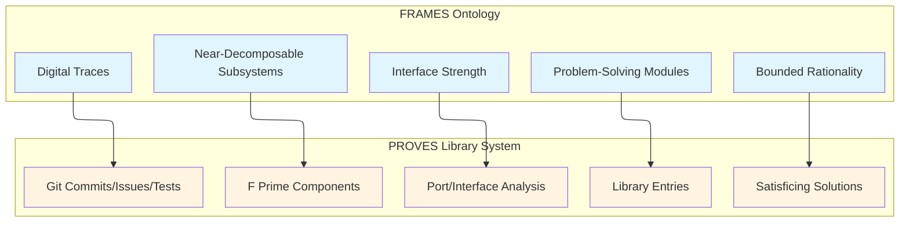
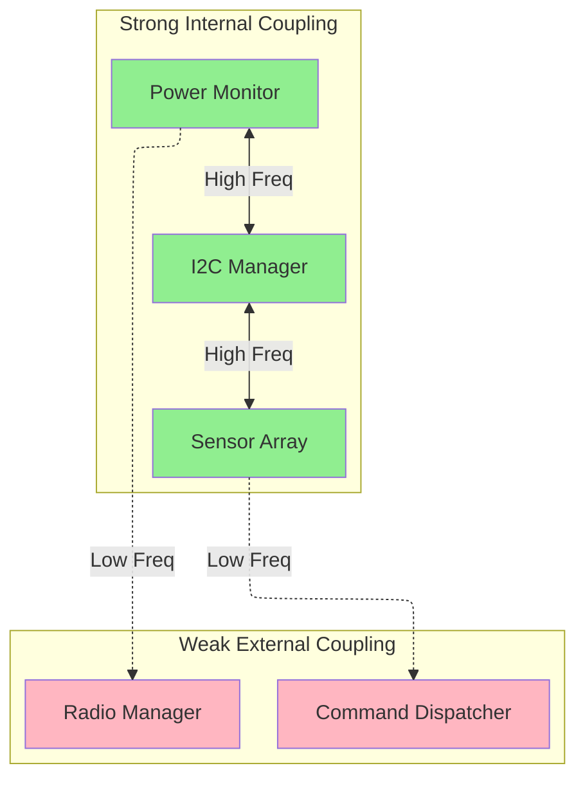
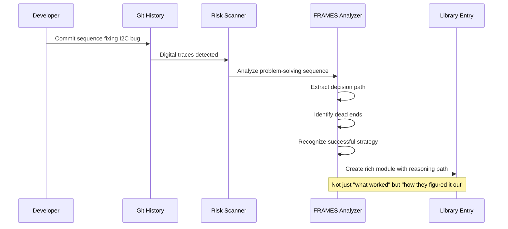
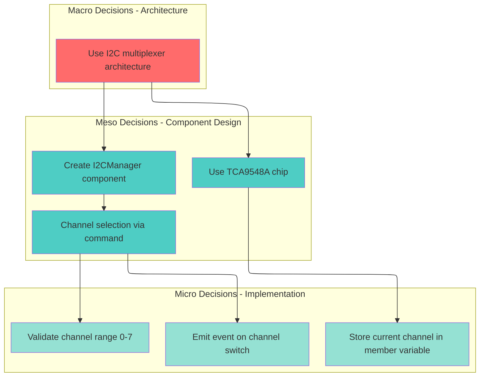

# FRAMES Ontology Integration for Software Risk Navigation

## Overview

This document analyzes how the **FRAMES Theoretical Ontology** (from the FRAMES research platform) can be applied to enhance the PROVES Library agents' ability to navigate software risks and component interfaces in F Prime and PROVES Kit systems.

## Executive Summary

**Can the FRAMES ontology be used?** ✅ **YES** - with significant value

**Key Insight:** The FRAMES ontology provides a **formal theoretical framework** for understanding software risks as **interface degradation patterns** in near-decomposable systems. This transforms risk scanning from pattern matching to **interface strength analysis**.

---

## 1. Theoretical Alignment

### FRAMES Core Concepts → PROVES Library Mapping



| FRAMES Concept | PROVES Library Equivalent | Direct Application |
|----------------|---------------------------|-------------------|
| **Subsystems** | F Prime components (active, passive, queued) | Component = near-decomposable unit |
| **Interfaces** | F Prime ports (input, output, typed) | Ports = observable interaction surface |
| **Interface Strength** | Port coupling metrics | Measurable via frequency, reciprocity, error recovery |
| **Digital Traces** | Git commits, issues, PRs, test results | Observable behavioral signatures |
| **Problem-Solving Modules** | Library entries with context + resolution | Distilled engineering reasoning |
| **Bounded Rationality** | Satisficing solutions in time-constrained environments | Student teams make "good enough" choices |
| **Hierarchical Decisions** | Micro (code edits), Meso (component design), Macro (architecture) | Multi-level decision capture |
| **Journeys** | Developer work sequences across components | Temporal traces through subsystems |

---

## 2. Enhanced Risk Detection Through Interface Analysis

### Traditional Approach (Pattern Matching)

```python
# Current: Pattern-based detection
def detect_i2c_conflict(ast_tree, config):
    """Look for duplicate I2C addresses"""
    devices = extract_i2c_devices(ast_tree)
    addresses = [d.address for d in devices]
    if len(addresses) != len(set(addresses)):
        return Risk(pattern="i2c-address-conflict")
```

### FRAMES-Enhanced Approach (Interface Strength Analysis)

```python
# Enhanced: Interface strength degradation detection
class InterfaceStrengthAnalyzer:
    """
    Measures interface strength using FRAMES dimensions:
    - Frequency: How often does interface transmit?
    - Reciprocity: Bidirectional or one-way?
    - Bandwidth: Amount of information exchanged
    - Latency: Response time
    - Error Recovery: How are errors handled?
    - Shared Outcomes: Do both sides depend on success?
    """

    def analyze_component_interface(self, component, port):
        """Compute interface strength score (0-1)"""
        strength = {
            'frequency': self.measure_call_frequency(port),
            'reciprocity': self.check_bidirectional(port),
            'bandwidth': self.measure_data_size(port),
            'latency': self.measure_response_time(port),
            'error_recovery': self.check_error_handling(port),
            'shared_outcomes': self.check_dependencies(port)
        }

        # Weak interfaces = high risk
        score = sum(strength.values()) / len(strength)

        if score < 0.5:
            return InterfaceRisk(
                subsystem_a=component,
                subsystem_b=port.connected_to,
                strength_score=score,
                weakness_dimensions=self.identify_weak_dimensions(strength),
                predicted_failure_mode=self.predict_failure(strength)
            )
```

### Example: I2C Conflict Detection Enhanced

```python
def detect_i2c_conflict_enhanced(topology):
    """
    FRAMES-enhanced I2C conflict detection

    Instead of: "Are addresses duplicated?"
    Ask: "What is the interface strength between I2C manager and devices?"
    """

    i2c_bus = topology.get_subsystem("I2C_Bus")

    for device_a, device_b in combinations(i2c_bus.connected_devices, 2):
        # Measure interface strength between devices sharing bus
        strength = InterfaceStrengthAnalyzer.analyze(
            subsystem_a=device_a,
            subsystem_b=device_b,
            shared_resource=i2c_bus
        )

        # Weak interface = potential conflict
        if strength.frequency > 0.8 and strength.error_recovery < 0.3:
            # High contention + low error recovery = risk
            return InterfaceRisk(
                type="resource_contention",
                subsystems=[device_a, device_b],
                shared_resource=i2c_bus,
                weakness="High frequency access with poor error recovery",
                frames_interpretation="Interface degradation due to resource contention",
                resolution_pattern="software-001"  # I2C multiplexer pattern
            )
```

---

## 3. Component Topology Analysis

### FRAMES Concept: Organizational Topology Predicts Outcomes

F Prime systems form a **component topology** that can be analyzed using FRAMES principles.



**FRAMES Prediction:**
- ✅ Strong internal coupling = good (coherent subsystem)
- ✅ Weak external coupling = good (reduced coordination cost)
- ❌ Strong external coupling = risk (tight dependency across subsystems)

**Risk Scanner Application:**

```python
def analyze_topology_resilience(topology):
    """
    Apply FRAMES near-decomposability analysis to component topology

    Healthy system: Strong internal coupling, weak external coupling
    Risky system: Strong cross-subsystem coupling
    """

    subsystems = topology.identify_subsystems()

    for subsystem in subsystems:
        internal_strength = compute_internal_coupling(subsystem)
        external_strength = compute_external_coupling(subsystem)

        # FRAMES principle: external >> internal = BAD
        if external_strength > internal_strength:
            return TopologyRisk(
                subsystem=subsystem,
                issue="Violates near-decomposability",
                impact="High coordination cost, fragile architecture",
                frames_interpretation="Subsystem is more tightly coupled to external components than internal ones",
                resolution="Refactor to reduce external dependencies"
            )
```

---

## 4. Digital Trace Analysis for Knowledge Capture

### FRAMES: Digital Traces = Observable Behavioral Signatures

The scanner can extract **much richer context** by treating git history as digital traces.



**Enhanced Capture:**

```python
class DigitalTraceAnalyzer:
    """
    Analyze git history as digital traces of problem-solving behavior

    FRAMES insight: Commit sequences reveal:
    - Problem framing
    - Intermediate reasoning
    - Dead ends (reverted commits)
    - Successful strategies
    - Validation conditions
    """

    def extract_problem_solving_module(self, issue_id):
        """
        From: "Fixed I2C conflict"
        To: Full problem-solving narrative
        """

        commits = git.get_commits_for_issue(issue_id)

        # Temporal sequence analysis
        sequence = self.build_decision_sequence(commits)

        # Identify phases
        phases = {
            'problem_framing': self.extract_initial_commits(sequence),
            'exploration': self.identify_exploratory_commits(sequence),
            'dead_ends': self.find_reverted_attempts(sequence),
            'breakthrough': self.identify_successful_strategy(sequence),
            'validation': self.extract_test_commits(sequence)
        }

        # Create rich module
        return ProblemSolvingModule(
            problem=phases['problem_framing'],
            constraints=self.extract_constraints(sequence),
            attempted_solutions=phases['exploration'] + phases['dead_ends'],
            successful_strategy=phases['breakthrough'],
            validation=phases['validation'],
            temporal_duration=self.compute_duration(sequence),
            agent_interactions=self.identify_collaborations(sequence)
        )
```

---

## 5. Bounded Rationality: Satisficing Solutions

### FRAMES Insight: Students Don't Optimize, They Satisfice

University teams operate under:
- Limited time (semester deadlines)
- Limited information (first time using F Prime)
- Limited computational capacity (small teams)

**Library Enhancement:**

```yaml
# Entry metadata enhancement
---
entry_id: software-001
type: risk-pattern
domain: software

# NEW: Satisficing context
satisficing_constraints:
  - time_pressure: "2 weeks before CDR"
  - knowledge_gap: "Team's first I2C integration"
  - resource_limit: "No hardware debugger available"
  - optimization_level: "satisficing"  # not optimal

resolution: "Used TCA9548A multiplexer"

# NEW: Alternative solutions considered
alternatives_explored:
  - option: "Reassign I2C addresses via hardware jumpers"
    rejected_because: "Only 4 addresses available, needed 6 sensors"
  - option: "Use SPI sensors instead"
    rejected_because: "Would require board redesign, out of time"
  - option: "Software time-multiplexing"
    rejected_because: "Too complex for team's experience level"

# This captures the REAL decision process under constraints
---
```

**Implication for Builder Agent:**

The builder agent should generate solutions that match the team's constraints:

```python
def generate_component(requirements, team_context):
    """
    FRAMES-aware code generation

    Don't generate optimal solution.
    Generate satisficing solution for THIS team's constraints.
    """

    # Assess team constraints
    constraints = {
        'experience_level': team_context.fprime_experience,
        'time_remaining': team_context.deadline - datetime.now(),
        'hardware_available': team_context.test_equipment
    }

    if constraints['experience_level'] == 'beginner':
        # Generate simpler, more documented code
        template = 'simple_component.jinja'
    elif constraints['time_remaining'] < timedelta(weeks=2):
        # Generate pre-tested reference implementation
        template = 'reference_component.jinja'
    else:
        # Generate flexible, extensible code
        template = 'advanced_component.jinja'

    return generate(template, requirements)
```

---

## 6. Hierarchical Decision Capture

### FRAMES: Decisions Occur at Multiple Scales



**Library Structure Enhancement:**

```markdown
# I2C Address Conflicts (software-001)

## Decision Hierarchy

### Macro Decision: System Architecture
**Decision:** Use hardware multiplexing instead of software time-division
**Rationale:** Lower complexity, proven reliability
**Alternatives:** Software scheduling, address reassignment, different sensors

### Meso Decisions: Component Design
1. **Component Type:** Active component (needs command handling)
2. **Chip Selection:** TCA9548A (8 channels, I2C interface)
3. **Control Interface:** Command-driven channel selection

### Micro Decisions: Implementation Details
1. **State Management:** Store current channel in `m_currentChannel`
2. **Observability:** Emit `ChannelSwitched` event
3. **Validation:** Check channel range (0-7) before write
4. **Error Handling:** Return VALIDATION_ERROR on invalid channel

## Traceability
- Macro → Meso: Architecture decision constrains component options
- Meso → Micro: Component design determines implementation requirements
- Micro → Code: Implementation decisions visible in [I2CManager.cpp:45-67](...)
```

---

## 7. What FRAMES Enables

### With FRAMES Integration:

✅ **Richer Risk Detection**
- Move from "pattern matching" to "interface strength analysis"
- Predict failure modes based on topology
- Identify subsystem coupling violations

✅ **Better Knowledge Capture**
- Extract problem-solving sequences from digital traces
- Capture decision hierarchies (macro/meso/micro)
- Preserve satisficing context and alternatives explored

✅ **Smarter Code Generation**
- Generate solutions matched to team constraints
- Respect near-decomposability in component design
- Optimize for interface strength

✅ **Topology-Aware Scanning**
- Analyze component coupling patterns
- Detect architectural anti-patterns
- Predict coordination costs

---

## 8. Implementation Constraints

### Where FRAMES Does NOT Apply:

❌ **Low-level infrastructure**
- Database schemas (use standard relational design)
- API protocols (use REST/MCP conventions)
- File formats (use YAML/JSON standards)

❌ **Deterministic systems**
- FRAMES models human behavior under bounded rationality
- Pure algorithmic systems don't need this framework

❌ **Simple pattern matching**
- Don't overcomplicate: "duplicate I2C address" is still useful
- FRAMES adds interpretive depth, not replacement

### Technical Constraints:

1. **Measurement Challenge:** Interface strength requires observable data
   - Git history must be available
   - Component topology must be parseable
   - Test results must be accessible

2. **Complexity:** FRAMES adds conceptual overhead
   - Use for complex risks and high-value entries
   - Simple risks can stay simple

3. **Validation:** FRAMES predictions need empirical validation
   - Track whether interface strength predicts actual failures
   - Iterate on metrics

---

## 9. Recommended Integration Approach

### Phase 1: Metadata Enhancement
- Add `satisficing_constraints` to entry schema
- Add `decision_hierarchy` section
- Add `alternatives_explored` field

### Phase 2: Interface Strength Analysis
- Implement `InterfaceStrengthAnalyzer` for F Prime port analysis
- Add topology analysis to risk scanner
- Detect near-decomposability violations

### Phase 3: Digital Trace Analysis
- Parse git commit sequences
- Extract problem-solving modules from traces
- Capture decision paths and dead ends

### Phase 4: Builder Agent Enhancement
- Generate code matched to team constraints
- Optimize for interface strength
- Respect near-decomposability in design

---

## 10. Example: Full FRAMES-Enhanced Entry

```yaml
---
entry_id: software-001-enhanced
type: risk-pattern
domain: software
observed: I2C address conflicts in multi-sensor configurations

# FRAMES: Interface strength analysis
interface_analysis:
  subsystems: [Power Monitor, I2C Bus, Sensor Array]
  weak_interface_detected:
    - subsystem_a: INA219 Sensor 1
      subsystem_b: INA219 Sensor 2
      shared_resource: I2C Bus (0x40)
      strength_dimensions:
        frequency: 0.9  # High
        reciprocity: 0.7
        bandwidth: 0.6
        latency: 0.8
        error_recovery: 0.2  # LOW - THIS IS THE PROBLEM
        shared_outcomes: 0.9
      overall_strength: 0.68
      predicted_failure: "Bus contention with poor error recovery"

# FRAMES: Satisficing context
satisficing_constraints:
  time_pressure: "2 weeks to integration test"
  knowledge_gap: "Team's first multi-device I2C system"
  resource_limit: "No logic analyzer for debugging"

# FRAMES: Decision hierarchy
decision_hierarchy:
  macro:
    decision: "Use hardware multiplexing (TCA9548A)"
    alternatives_rejected:
      - "Software time-division (too complex)"
      - "Different sensors (incompatible telemetry)"
  meso:
    - "Active component for channel management"
    - "Command-driven channel selection"
  micro:
    - "Channel state in member variable"
    - "Event emission on switch"
    - "Range validation (0-7)"

# FRAMES: Digital traces analyzed
problem_solving_sequence:
  - phase: problem_framing
    commits: [abc123, def456]
    duration: "3 days"
  - phase: exploration
    commits: [ghi789]
    attempts: "Tried address reassignment via hardware jumpers"
    outcome: "Only 4 addresses available"
  - phase: breakthrough
    commits: [jkl012, mno345]
    solution: "Implemented TCA9548A multiplexer"
  - phase: validation
    commits: [pqr678]
    tests_added: 12

resolution: "TCA9548A I2C multiplexer with I2CManager component"
---
```

---

## Conclusion

**Can FRAMES ontology enhance PROVES Library agents?**

✅ **YES** - It provides:
1. **Theoretical rigor** for interface analysis
2. **Richer context capture** via digital traces
3. **Predictive topology analysis**
4. **Satisficing-aware code generation**
5. **Hierarchical decision modeling**

**Constraints:**
- Requires observable data (git history, topology, tests)
- Adds complexity (use judiciously)
- Needs empirical validation

**Recommendation:** Integrate FRAMES concepts incrementally:
- Start with metadata enhancement (satisficing, decision hierarchy)
- Add interface strength analysis to scanner
- Enhance library entries with FRAMES dimensions
- Validate predictions against real mission outcomes

---

**This integration would make PROVES Library the first knowledge system to apply organizational theory to software risk detection.**
