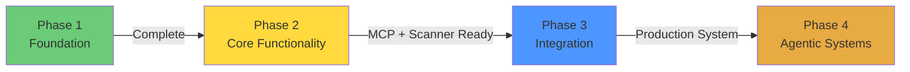
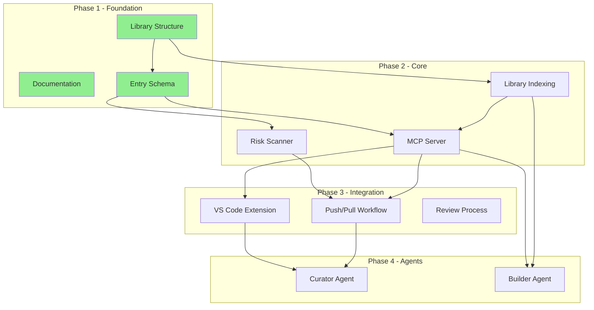

# Implementation Tasks

This document breaks down the work needed to build the PROVES Library system.

## Implementation Phases Overview

## Phase Dependencies

## Phase 1: Foundation ✓

### Library Structure
- [x] Create directory structure
- [ ] Define entry schema (YAML frontmatter spec)
- [ ] Create example entries for each domain
- [ ] Document citation requirements
- [ ] Create entry validation script

### Documentation
- [x] README with project overview
- [x] Architecture documentation
- [ ] Contributing guidelines
- [ ] Entry submission process
- [ ] Code of conduct

## Phase 2: Core Functionality

### MCP Server

**Goal:** Make library interrogatable through MCP protocol

**Tasks:**
1. [ ] Set up Python project structure
   - [ ] FastAPI application
   - [ ] Requirements.txt with dependencies
   - [ ] Config management

2. [ ] Implement library indexer
   - [ ] Parse markdown files with frontmatter
   - [ ] Extract metadata to SQLite
   - [ ] Build full-text search index
   - [ ] Generate embeddings for semantic search

3. [ ] Implement MCP endpoints
   - [ ] `search` - Query library with filters
   - [ ] `fetch` - Get specific entry
   - [ ] `list` - Browse by category/tags
   - [ ] `get_artifacts` - Retrieve linked artifacts

4. [ ] Add caching layer
   - [ ] Cache search results
   - [ ] Cache embeddings
   - [ ] Invalidate on library updates

**Dependencies:**
- FastAPI
- Pydantic (data validation)
- SQLite3
- sentence-transformers (embeddings)
- PyYAML (frontmatter parsing)

**Estimated Effort:** 2-3 weeks

### Risk Scanner

**Goal:** Detect risks and capture knowledge through push/pull loop

**Tasks:**
1. [ ] Set up Python project structure
   - [ ] CLI interface
   - [ ] Requirements.txt
   - [ ] Pattern storage format

2. [ ] Implement pattern matching engine
   - [ ] AST parser for Python code
   - [ ] Config file analyzer (YAML, JSON, TOML)
   - [ ] Dependency checker
   - [ ] Test coverage analyzer

3. [ ] Create initial risk patterns
   - [ ] Power system patterns (I2C conflicts, voltage issues)
   - [ ] Radio timing patterns
   - [ ] Memory management patterns
   - [ ] Component integration patterns

4. [ ] Implement push mechanism
   - [ ] Generate risk report with severity
   - [ ] Link to library fixes via MCP query
   - [ ] Format user-friendly output

5. [ ] Implement pull mechanism
   - [ ] Capture user context (CLI prompts)
   - [ ] Capture resolution approach
   - [ ] Generate raw entry draft
   - [ ] Submit for review

**Dependencies:**
- ast (Python standard library)
- PyYAML
- MCP client library
- Rich (CLI formatting)

**Estimated Effort:** 3-4 weeks

## Phase 3: Integration

### VS Code Extension

**Goal:** Provide IDE integration for library queries and risk scans

**Tasks:**
1. [ ] Set up TypeScript project
   - [ ] Extension manifest
   - [ ] MCP client integration
   - [ ] UI components

2. [ ] Implement core features
   - [ ] Search library command palette
   - [ ] Inline risk warnings
   - [ ] Fix suggestion hover
   - [ ] Submit lesson command

3. [ ] Add UX polish
   - [ ] Keyboard shortcuts
   - [ ] Status bar integration
   - [ ] Settings panel

**Dependencies:**
- VS Code Extension API
- MCP client (TypeScript)

**Estimated Effort:** 2-3 weeks

### Workflow Integration

**Tasks:**
1. [ ] Daily scan workflow
   - [ ] CLI command: `proves-scan --daily`
   - [ ] Output format for CI/CD
   - [ ] GitHub Actions example

2. [ ] Review process
   - [ ] Submission queue (GitHub Issues?)
   - [ ] Review checklist
   - [ ] Approval workflow

3. [ ] Library update automation
   - [ ] Auto-rebuild MCP index on merge
   - [ ] Embedding regeneration
   - [ ] Cache invalidation

**Estimated Effort:** 1-2 weeks

## Phase 4: Agentic Systems (Future)

### Curator Agent

**Goal:** Automate entry normalization and quality control

**Tasks:**
1. [ ] Design agent architecture
   - [ ] LLM selection (Claude, GPT-4, local)
   - [ ] Prompt engineering for normalization
   - [ ] Quality scoring system

2. [ ] Implement core functions
   - [ ] Parse raw captures
   - [ ] Extract citations
   - [ ] Generate frontmatter
   - [ ] Suggest tags
   - [ ] Detect duplicates

3. [ ] Human-in-the-loop review
   - [ ] Present normalized entry for approval
   - [ ] Track feedback for prompt refinement
   - [ ] Learn from rejections

**Estimated Effort:** 4-6 weeks

### Builder Agent

**Goal:** Generate code/components from library patterns

**Tasks:**
1. [ ] Design generation pipeline
   - [ ] Pattern → Component mapping
   - [ ] Template system
   - [ ] Validation/testing

2. [ ] Implement generators
   - [ ] F Prime component generator
   - [ ] Test scaffold generator
   - [ ] Config template generator

3. [ ] Integration with scanner
   - [ ] Suggest generated fixes
   - [ ] Auto-apply with approval
   - [ ] Track success rate

**Estimated Effort:** 6-8 weeks

## Immediate Next Steps

1. **Define entry schema** (docs/ENTRY_SCHEMA.md)
2. **Create 3-5 example entries** (one per domain)
3. **Set up MCP server skeleton**
4. **Set up risk scanner skeleton**
5. **Write contributing guidelines**

## Success Metrics

- Library growth rate (entries per month)
- Risk detection accuracy
- Fix adoption rate
- User engagement (scans run, queries made)
- Cross-university participation
