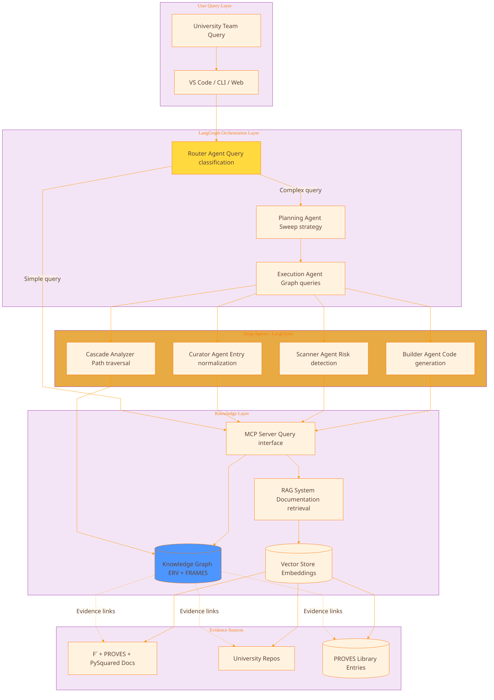
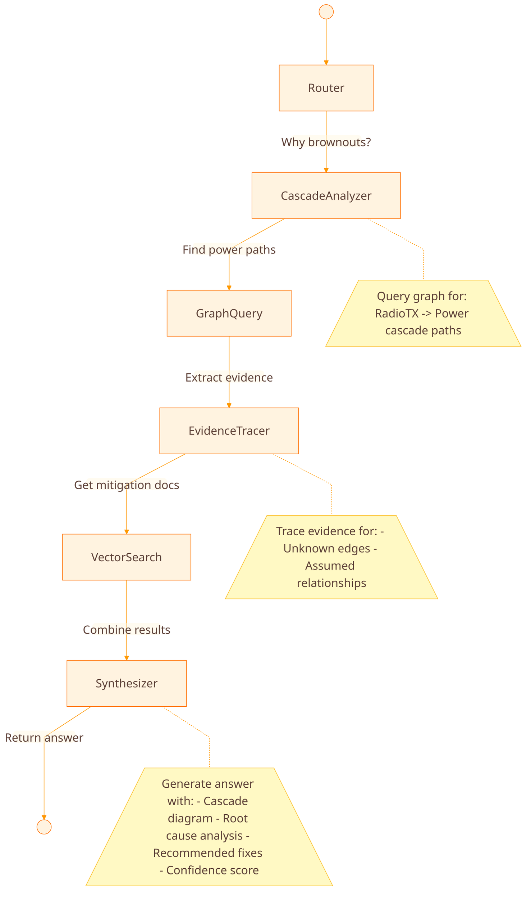

# Agentic Architecture: LangGraph + Deep Agents + MCP + RAG

## System Overview



---

## Layer 1: MCP Server as Knowledge Interface

The MCP server becomes the **single query interface** to the knowledge graph + RAG system.

### Enhanced MCP Endpoints

```python
# Standard MCP endpoints (already defined)
POST /search              # Semantic + keyword search
GET  /entry/{id}         # Fetch specific entry
GET  /list               # Browse by category
GET  /artifacts/{id}     # Get linked artifacts

# NEW: Knowledge Graph endpoints
POST /graph/query        # Cypher-like graph queries
POST /graph/cascade      # Cascade path analysis
POST /graph/sweep        # Run specific sweep
POST /graph/evidence     # Trace evidence chain

# NEW: Relationship queries
GET  /graph/node/{id}/edges          # Get all edges for node
GET  /graph/relationship/{type}      # Query by relation type
POST /graph/check_asymmetry          # Asymmetry sweep
POST /graph/find_unknowns            # Unknown edge backlog
```

### Example: Cascade Query via MCP

```json
// Request
POST /graph/cascade
{
  "start_node": "RadioTX_Component",
  "resource_type": "power",
  "max_depth": 5,
  "filters": {
    "strength": ["always", "sometimes"],
    "knownness": ["known", "assumed"]
  }
}

// Response
{
  "paths": [
    {
      "path": [
        {"source": "RadioTX", "relation": "CONSUMES", "target": "PowerRail_3V3"},
        {"source": "PowerRail_3V3", "relation": "CONSTRAINS", "target": "MCU_BrownoutMargin"},
        {"source": "MCU_BrownoutMargin", "relation": "COUPLES_TO", "target": "FPrime_ResetBehavior"},
        {"source": "FPrime_ResetBehavior", "relation": "CONSTRAINS", "target": "DownlinkReliability"}
      ],
      "strength_min": "sometimes",
      "mechanisms": ["electrical", "electrical", "software_state", "timing"],
      "unknowns": [
        {"edge_index": 2, "source": "MCU_BrownoutMargin", "knownness": "assumed"}
      ],
      "risk_level": "high",
      "evidence_gaps": [
        "Need test: brownout threshold -> reset trigger timing"
      ]
    }
  ],
  "total_paths": 1,
  "query_time_ms": 45
}
```

---

## Layer 2: RAG System for Documentation Retrieval

### Hybrid RAG: Graph + Vector

```mermaid
---
config:
  theme: base
  fontSize: 16
  themeCSS: |
    .node rect, .cluster rect, .edgePath path { transition: filter 0.2s ease, stroke-width: 0.2s ease; }
    .node:hover rect, .cluster:hover rect, .edgePath:hover path { filter: drop-shadow(0 0 8px rgba(0,0,0,0.35)); stroke-width: 3px; }
    .edgeLabel rect { rx: 6px; ry: 6px; stroke-width: 1px; }
    .cluster-label { font-weight: 600; }
    .node .label, .nodeLabel, .node foreignObject div, .edgeLabel { font-size: 20px !important; font-family: "Segoe UI", Tahoma, Geneva, Verdana, sans-serif !important; }
    .node.decision .label, .node polygon + .label { font-size: 18px !important; }
  themeVariables:
    primaryColor: '#FFF3E0'
    secondaryColor: '#F3E5F5'
    tertiaryColor: '#FFF8E1'
    primaryTextColor: '#5D4037'
    secondaryTextColor: '#4A148C'
    tertiaryTextColor: '#F57F17'
    primaryBorderColor: '#FF6F00'
    secondaryBorderColor: '#9C27B0'
    tertiaryBorderColor: '#FBC02D'
    background: '#FFF8E1'
    textColor: '#5D4037'
    lineColor: '#FF9800'
    fontFamily: '"Segoe UI", Tahoma, Geneva, Verdana, sans-serif'
    fontSize: '16px'
    nodeBorder: '#FF6F00'
    mainBkg: '#FFF3E0'
    clusterBkg: '#F3E5F5'
    clusterBorder: '#9C27B0'
    edgeLabelBackground: '#FFF8E1'
    actorBkg: '#FFF3E0'
    actorBorder: '#FF6F00'
    actorTextColor: '#5D4037'
    signalColor: '#FF9800'
    signalTextColor: '#5D4037'
    labelBoxBkgColor: '#F3E5F5'
    noteBkgColor: '#FFF8E1'
    noteTextColor: '#F57F17'
    noteBorderColor: '#FBC02D'
    pie1: '#FF6F00'
    pie2: '#9C27B0'
    pie3: '#FBC02D'
    pie4: '#FF9800'
    pie5: '#BA68C8'
    pie6: '#FFD54F'
    pie7: '#FFB74D'
    pie8: '#CE93D8'
    pie9: '#FFF176'
    pie10: '#FF8A65'
    pie11: '#F3E5F5'
    pie12: '#FFF8E1'
    sectionBkgColor: '#FFF8E1'
    altSectionBkgColor: '#FFF3E0'
    sectionBkgColor2: '#F3E5F5'
    taskBkgColor: '#FFB74D'
    taskBorderColor: '#FF6F00'
    activeTaskBkgColor: '#FF9800'
    activeTaskBorderColor: '#E65100'
    doneTaskBkgColor: '#FFCC80'
    doneTaskBorderColor: '#FF6F00'
    critBkgColor: '#CE93D8'
    critBorderColor: '#7B1FA2'
    taskTextColor: '#5D4037'
    taskTextOutsideColor: '#5D4037'
    taskTextLightColor: '#5D4037'
    taskTextDarkColor: '#FFFFFF'
    gridColor: '#FFCC80'
    todayLineColor: '#7B1FA2'
    classText: '#5D4037'
    fillType0: '#FFF3E0'
    fillType1: '#F3E5F5'
    fillType2: '#FFF8E1'
    fillType3: '#FFB74D'
    fillType4: '#CE93D8'
    fillType5: '#FFD54F'
    fillType6: '#FF8A65'
    fillType7: '#BA68C8'
    attributeBackgroundColorOdd: '#FFF8E1'
    attributeBackgroundColorEven: '#FFF3E0'
  gantt:
    fontSize: 16
    barHeight: 24
    barGap: 6
    topPadding: 50
    leftPadding: 75
    gridLineStartPadding: 35
    numberSectionStyles: 4
  flowchart:
    curve: 'linear'
    htmlLabels: false
    useMaxWidth: true
    padding: 25
    nodeSpacing: 60
    rankSpacing: 80
    diagramPadding: 8
  sequence:
    diagramMarginX: 50
    diagramMarginY: 10
    actorMargin: 50
    boxMargin: 10
    boxTextMargin: 5
    noteMargin: 10
---
flowchart LR
    Query[User Query] --> Router[Query Router]
    Router -->|Structural query| Graph[Graph Query Engine]
    Router -->|Semantic query| Vector[Vector Search]
    Router -->|Hybrid| Both[Graph + Vector Fusion]

    Graph --> GraphDB[(Knowledge Graph)]
    Vector --> VectorDB[(Vector Store)]
    Both --> GraphDB
    Both --> VectorDB

    GraphDB --> Rerank[Re-ranker LLM-based]
    VectorDB --> Rerank

    Rerank --> Context[Context Window]
    Context --> LLM[LLM Response Generation]

    style Graph fill:#4D96FF
    style Vector fill:#6BCB77
    style Both fill:#FFD93D
```



### Query Routing Logic

```python
class QueryRouter:
    """
    Decide whether to use graph query, vector search, or hybrid
    """

    def route(self, query: str) -> QueryStrategy:
# Structural queries -> Graph
        if self.is_structural(query):
            return GraphQuery()

# Semantic/document queries -> Vector
        if self.is_semantic(query):
            return VectorQuery()

# Complex queries -> Hybrid
        return HybridQuery()

    def is_structural(self, query: str) -> bool:
        """
        Detect queries about relationships, dependencies, cascades
        """
        keywords = [
            "depends on", "requires", "connected to",
            "cascade", "affects", "coupled to",
            "path from", "all components that",
            "what uses", "what configures"
        ]
        return any(kw in query.lower() for kw in keywords)

    def is_semantic(self, query: str) -> bool:
        """
        Detect queries about concepts, procedures, explanations
        """
        keywords = [
            "how to", "explain", "what is",
            "guide", "tutorial", "example",
            "best practice", "why"
        ]
        return any(kw in query.lower() for kw in keywords)
```

### Example Queries

**Structural Query (-> Graph)**
- "Show me all components that depend on I2C_Bus"
- "What are the cascade paths from RadioTX through power rails?"
- "Which configs affect the PowerMonitor component?"

**Semantic Query (-> Vector)**
- "How do I integrate a new I2C sensor in F Prime?"
- "What are best practices for power management in PROVES Kit?"
- "Explain the difference between active and passive components"

**Hybrid Query (-> Graph + Vector)**
- "Why does my radio cause brownouts and how do I fix it?"
  - Graph: Find RadioTX -> Power -> Brownout cascade
  - Vector: Retrieve docs on brownout prevention, power budgeting
  - Fusion: Combine cascade analysis with mitigation strategies

---

## Layer 3: LangGraph Orchestration

LangGraph manages **multi-step reasoning** for complex queries.

### Agent Graph Structure

```python
from langgraph.graph import StateGraph, END

# Define the agent workflow
workflow = StateGraph()

# Nodes = Agents / Functions
workflow.add_node("router", route_query)
workflow.add_node("graph_query", graph_query_agent)
workflow.add_node("vector_search", vector_search_agent)
workflow.add_node("cascade_analyzer", cascade_analysis_agent)
workflow.add_node("evidence_tracer", evidence_tracer_agent)
workflow.add_node("synthesizer", synthesis_agent)

# Edges = Workflow transitions
workflow.set_entry_point("router")

workflow.add_conditional_edges(
    "router",
    route_decision,
    {
        "graph": "graph_query",
        "vector": "vector_search",
        "cascade": "cascade_analyzer"
    }
)

workflow.add_edge("graph_query", "evidence_tracer")
workflow.add_edge("vector_search", "synthesizer")
workflow.add_edge("cascade_analyzer", "evidence_tracer")
workflow.add_edge("evidence_tracer", "synthesizer")
workflow.add_edge("synthesizer", END)

# Compile
app = workflow.compile()
```

### State Object

```python
from typing import TypedDict, List, Optional

class AgentState(TypedDict):
    """
    Shared state across all agents in the graph
    """
# Input
    user_query: str
    query_type: str  # "graph" | "vector" | "cascade"

# Intermediate results
    graph_results: Optional[List[dict]]
    vector_results: Optional[List[dict]]
    cascade_paths: Optional[List[dict]]
    evidence_chain: Optional[List[dict]]

# Context for LLM
    context_window: List[str]

# Output
    answer: str
    confidence: float
    sources: List[str]
    recommended_actions: List[str]
```

### Example: Cascade Analysis Workflow



---

## Layer 4: Deep Agents (LangChain)

Each deep agent has **specialized tools** and **memory**.

### Cascade Analyzer Agent

```python
from langchain.agents import AgentExecutor, create_react_agent
from langchain.tools import Tool
from langchain_anthropic import ChatAnthropic

# Tools for cascade analysis
tools = [
    Tool(
        name="GraphCascadeQuery",
        func=mcp_client.query_cascade,
        description="Find cascade paths through resources (power, thermal, timing)"
    ),
    Tool(
        name="GetEdgeDetails",
        func=mcp_client.get_edge_details,
        description="Get detailed attributes for a specific edge (directionality, strength, mechanism, knownness)"
    ),
    Tool(
        name="CheckEvidence",
        func=mcp_client.get_evidence,
        description="Retrieve evidence for an edge claim (code location, doc reference, test result)"
    ),
    Tool(
        name="CalculateRisk",
        func=calculate_cascade_risk,
        description="Score cascade risk based on unknowns, assumed links, and criticality"
    )
]

# Create agent
llm = ChatAnthropic(model="claude-sonnet-4-5-20250929")
agent = create_react_agent(llm, tools, cascade_prompt_template)
agent_executor = AgentExecutor(agent=agent, tools=tools, verbose=True)
```

### Cascade Analyzer Prompt

```python
cascade_prompt_template = """
You are a cascade analysis agent for F´ CubeSat systems.

Your task: Given a starting component and a resource type (power, thermal, bandwidth),
find all cascade paths where the component affects other components via that resource.

For each path:
1. Identify all edges in the cascade
2. Check the 5 attributes for each edge:
   - Directionality (does it flow both ways?)
   - Strength (always, sometimes, never?)
   - Mechanism (electrical, thermal, timing, etc.)
   - Knownness (known, assumed, unknown, disproved?)
   - Scope (version tuple, hardware revision, mission profile)

1. Flag risks:
   - Any edge with knownness: assumed or unknown
   - Any path containing "sometimes" edges (mode-dependent)
   - Long cascades (> 4 hops)

1. Generate evidence backlog:
   - For assumed/unknown edges, recommend tests
   - For version mismatches, recommend updates

Output format:
- Cascade diagram (mermaid)
- Risk assessment (critical/high/medium/low)
- Evidence gaps (what needs verification)
- Recommended actions (tests, updates, design changes)

Tools available: {tools}

{agent_scratchpad}
"""
```

### Scanner Agent (Enhanced with ERV)


```python
class EnhancedScannerAgent:
    """
    Risk scanner that uses ERV knowledge graph for detection
    """

    def scan_repository(self, repo_path: str) -> List[Risk]:
        """
        Scan repo using both pattern matching AND graph reasoning
        """
        risks = []

# Traditional pattern matching
        pattern_risks = self.pattern_matcher.scan(repo_path)
        risks.extend(pattern_risks)

# NEW: Graph-based reasoning
# 1. Extract component topology from code
        topology = self.extract_topology(repo_path)

# 2. Query knowledge graph for known risks in this topology
        for component in topology.components:
# Check if this component has REQUIRES edges we're missing
            required = self.mcp_client.query(f"""
                MATCH (c:Component {{name: '{component.name}'}})-[r:REQUIRES]->(dep)
                WHERE r.knownness = 'known'
                RETURN dep
            """)

            for dep in required:
                if dep not in topology.components:
                    risks.append(MissingDependencyRisk(
                        component=component,
                        missing=dep,
                        evidence=f"Graph shows {component} REQUIRES {dep}"
                    ))

# 3. Check for cascade risks
# Find components connected to shared resources (power, thermal)
        cascade_risks = self.check_cascade_conflicts(topology)
        risks.extend(cascade_risks)

# 4. Check for version tuple conflicts
        version_risks = self.check_version_compatibility(repo_path)
        risks.extend(version_risks)

        return risks

    def check_cascade_conflicts(self, topology):
        """
        Use graph to find components coupled via resources
        """
        risks = []

# Find all power consumers
        power_consumers = self.mcp_client.query("""
            MATCH (c:Component)-[r:CONSUMES]->(p:Resource)
            WHERE p.type = 'power'
            RETURN c, r, p
        """)

# Check for high-power components coupled to sensitive components
        for c1, c2 in combinations(power_consumers, 2):
            if c1.power_draw > THRESHOLD and c2.is_noise_sensitive:
# Query for coupling path
                coupling = self.mcp_client.cascade_query(
                    start=c1,
                    end=c2,
                    resource_type="power"
                )

                if coupling:
                    risks.append(CouplingRisk(
                        source=c1,
                        target=c2,
                        cascade_path=coupling,
                        mechanism="electrical_noise_coupling"
                    ))

        return risks
```

### endraw

### Builder Agent (FRAMES-Aware)


```python
class FramesAwareBuilderAgent:
    """
    Code generation agent that respects FRAMES principles
    """

    def generate_component(self, requirements: dict, team_context: dict):
        """
        Generate component matched to team's satisficing constraints
        """

# 1. Query graph for similar components
        similar = self.mcp_client.search_similar_components(
            requirements.functionality
        )

# 2. Check team constraints (FRAMES: bounded rationality)
        constraints = self.assess_constraints(team_context)

# 3. Select template based on constraints
        if constraints.experience_level == "beginner":
            template = "simple_component_with_comments.jinja"
        elif constraints.time_pressure == "high":
            template = "reference_implementation.jinja"  # battle-tested
        else:
            template = "flexible_component.jinja"

# 4. Query graph for interface requirements
# Ensure generated component respects near-decomposability
        interfaces = self.mcp_client.query(f"""
            MATCH (subsystem:Subsystem {{name: '{requirements.subsystem}'}})-[:CONTAINS]->(c:Component)
            MATCH (c)-[r:REQUIRES|CONFIGURES|CONTROLS]->(external)
            WHERE NOT (external)-[:IN]->(subsystem)
            RETURN r
            ORDER BY r.strength DESC
        """)

# Minimize external coupling (FRAMES principle)
        if len(interfaces) > 3:
            self.warn_high_external_coupling(requirements.subsystem)

# 5. Generate with FRAMES metadata
        code = self.render_template(template, {
            **requirements,
            "similar_components": similar,
            "satisficing_context": constraints,
            "interface_strength_targets": self.compute_target_strengths(interfaces)
        })

        return code

    def compute_target_strengths(self, interfaces):
        """
        For each interface, compute target FRAMES strength dimensions
        """
        targets = {}
        for interface in interfaces:
            targets[interface.name] = {
                "frequency": "high" if interface.critical else "medium",
                "error_recovery": "high",  # Always aim for good error handling
                "latency": interface.latency_requirement,
                "bandwidth": interface.data_rate
            }
        return targets
```

## endraw

---

## Layer 5: Sweep Execution Engine

Run sweeps as scheduled jobs or on-demand queries.

### Sweep Orchestrator

```python
class SweepOrchestrator:
    """
    Manages and executes knowledge graph sweeps
    """

    def __init__(self, mcp_client, graph_db):
        self.mcp = mcp_client
        self.db = graph_db

        self.sweeps = {
            "identity": IdentitySweep(),
            "asymmetry": AsymmetrySweep(),
            "cascade": CascadeSweep(),
            "unknowns": UnknownsSweep(),
            "version": VersionSweep(),
            "drift": DriftSweep()
        }

    async def run_sweep(self, sweep_name: str, config: dict):
        """
        Execute a specific sweep
        """
        sweep = self.sweeps[sweep_name]

# Get current graph state
        snapshot = await self.db.snapshot()

# Run sweep logic
        results = await sweep.execute(snapshot, config)

# Generate report
        report = sweep.format_report(results)

# Store results
        await self.db.store_sweep_results(sweep_name, results)

# Generate action items
        actions = sweep.generate_action_items(results)

        return {
            "sweep": sweep_name,
            "timestamp": datetime.now(),
            "results": results,
            "report": report,
            "actions": actions
        }

    async def run_all_sweeps(self):
        """
        Run all sweeps in dependency order
        """
        order = ["identity", "version", "asymmetry", "cascade", "unknowns", "drift"]

        all_results = {}
        for sweep_name in order:
            results = await self.run_sweep(sweep_name, {})
            all_results[sweep_name] = results

# Generate master report
        return self.generate_master_report(all_results)
```

---

## Complete Query Flow Example

**User Query**: "Why does my radio cause system resets during transmission?"

### Step-by-Step Execution

```python
# 1. User submits query via VS Code extension
query = "Why does my radio cause system resets during transmission?"

# 2. Router classifies query
router_result = router_agent(query)
# -> query_type: "cascade_analysis"
# -> component: "RadioTX"
# -> symptom: "system_resets"
# -> trigger: "transmission"

# 3. Cascade Analyzer queries graph
cascade_paths = mcp_client.query_cascade(
    start_node="RadioTX_Component",
    end_symptom="SystemReset",
    resource_types=["power", "timing"],
    max_depth=6
)

# 4. Results show path:
# RadioTX -> PowerRail_3V3 -> MCU_BrownoutDetect -> FPrime_WatchdogReset

# 5. Evidence Tracer extracts details
evidence = []
for edge in cascade_paths[0]:
    ev = mcp_client.get_evidence(edge.id)
    evidence.append(ev)

# 6. Finds gap: MCU_BrownoutDetect -> FPrime_WatchdogReset
# has knownness: "assumed", no test evidence

# 7. Vector Search retrieves relevant docs
docs = rag_system.search([
    "F´ watchdog reset behavior",
    "brownout detection best practices",
    "power supply decoupling for radio systems"
])

# 8. Synthesizer combines results
answer = synthesizer_agent({
    "cascade_path": cascade_paths[0],
    "evidence": evidence,
    "gaps": ["Brownout -> Reset timing needs verification"],
    "documentation": docs
})

# 9. Return to user
return {
    "answer": """
Your radio causes resets through this cascade:

1. RadioTX draws high current during transmission (CONSUMES PowerRail_3V3)
2. Power rail voltage drops below 3.2V (CONSTRAINS MCU_BrownoutMargin)
3. MCU brownout detector triggers (COUPLES_TO FPrime_WatchdogReset) ← ASSUMED
4. F´ watchdog interprets as hang and resets system (SystemReset)

Evidence gap: Step 3 is marked as "assumed" - we don't have oscilloscope data
confirming brownout threshold -> watchdog timing.

Recommended actions:
1. Add bulk capacitor on PowerRail_3V3 (470μF minimum)
2. Reduce RadioTX duty cycle below 50%
3. Test: Monitor power rail during TX with scope
4. Verify: Brownout threshold is set correctly in fuse bits

Similar issues resolved:
- software-023: "Radio brownout mitigation with capacitor bank"
- build-015: "Power supply sizing for RF modules"
    """,
    "cascade_diagram": generate_mermaid(cascade_paths[0]),
    "confidence": 0.75,  # Lower due to assumed link
    "sources": [ev.source_url for ev in evidence] + [d.url for d in docs]
}
```

---

## Implementation Roadmap

### Phase 1: Graph + MCP Foundation (4-6 weeks)

1. **Week 1-2**: Implement knowledge graph schema
- Set up Neo4j or similar graph DB
- Define node/edge types
- Implement ERV relationship types with 5 attributes
- Create first 100 nodes (F´ + PROVES core components)

1. **Week 3-4**: Enhance MCP server
- Add graph query endpoints
- Implement cascade path algorithm
- Add sweep execution endpoints

1. **Week 5-6**: Integrate RAG
- Set up vector store (Pinecone, Weaviate, or Chroma)
- Index F´, PROVES, PySquared documentation
- Implement hybrid query routing

### Phase 2: LangGraph Orchestration (3-4 weeks)

1. **Week 7-8**: Build LangGraph workflow
- Implement router agent
- Create basic cascade analyzer
- Add evidence tracer

1. **Week 9-10**: Deep agent integration
- Enhanced scanner with graph reasoning
- FRAMES-aware builder
- Curator with drift detection

### Phase 3: Sweeps + Production (2-3 weeks)

1. **Week 11-12**: Implement core sweeps
- Identity integrity sweep
- Cascade path sweep
- Unknowns backlog generation

1. **Week 13**: Production hardening
- Add caching layers
- Performance optimization
- Monitoring and logging

---

## Next Immediate Actions

1. **Choose your first cascade domain**: Power, Timing, Comms, or Thermal?
2. **I'll generate the first 30 nodes + 10 edges** with all attributes filled in
3. **Pick one sweep to implement first** (I recommend Cascade Path - highest ROI)
4. **Set up graph DB**: Neo4j Community Edition or GraphQL-based

Which cascade domain should we start with?
