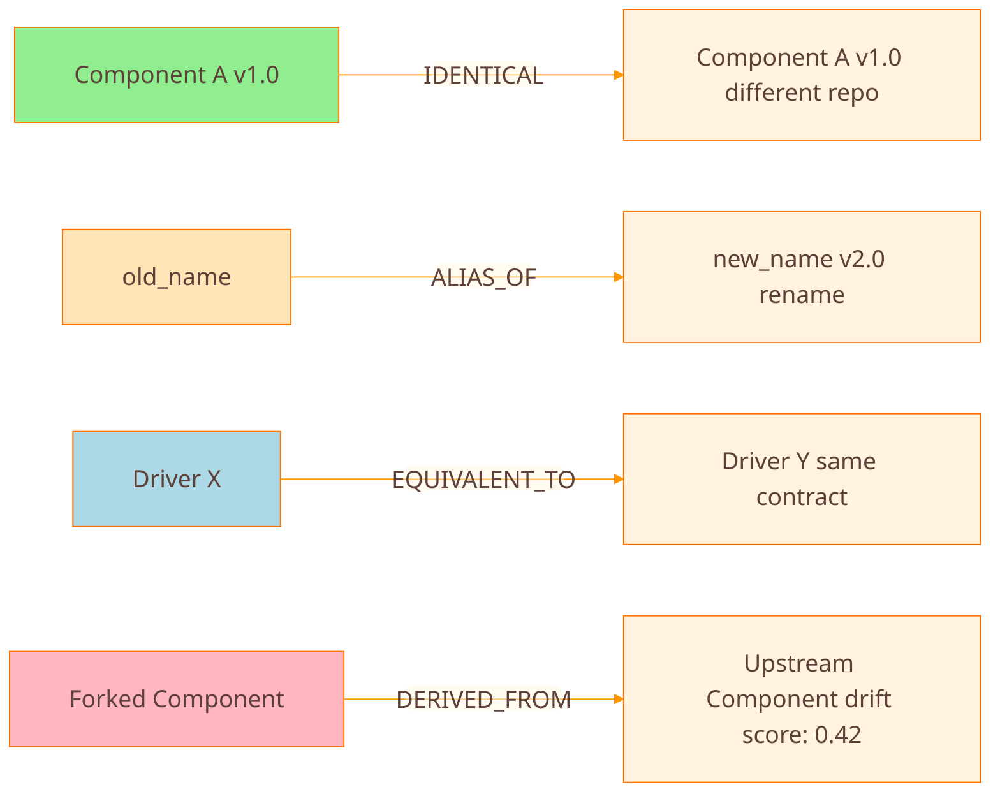
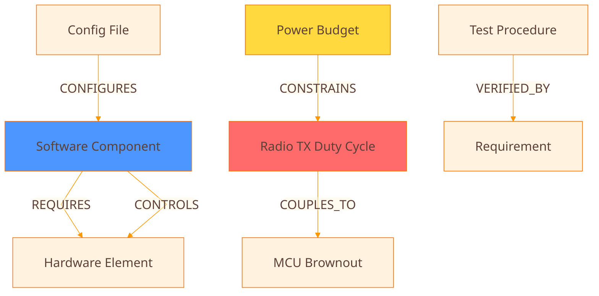
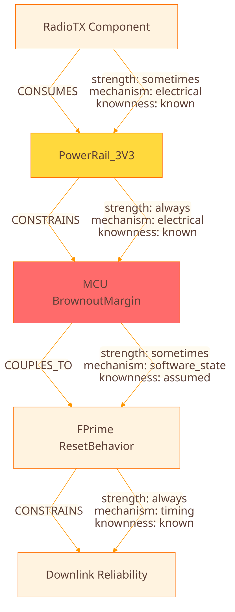

# Knowledge Graph Schema

## Engineering Relationship Vocabulary for F´ + PROVES + PySquared

This schema enables granular failure analysis by capturing both **technical causality** (ERV) and **organizational behavior** (FRAMES ontology).

---

## Node Types

### Core Entity Nodes

```yaml
# Software Artifacts
SoftwareComponent:
  id: canonical_name@version
  type: active | passive | queued
  namespace: fully_qualified_path
  language: fpp | cpp | python
  repo: source_repository
  commit_hash: git_sha

# Interfaces
PortType:
  id: port_type_name
  direction: input | output | bidirectional
  message_type: data_type
  protocol: sync | async | serial

# Hardware Elements
HardwareElement:
  id: part_number | instance_name
  category: board | sensor | radio | mcu | power_rail
  vendor: manufacturer
  datasheet_url: reference

# Resources (for cascade analysis)
Resource:
  id: resource_name
  type: power | thermal | bandwidth | compute | memory
  budget: numeric_value
  unit: watts | celsius | mbps | mips | bytes
  margin: safety_factor

# Procedures
Procedure:
  id: procedure_name
  type: build | integration | test | ops
  phase: when_executed

# Failure Modes
FailureMode:
  id: failure_id
  severity: critical | high | medium | low
  pattern_id: library_entry_reference
```

---

## Relationship Types

Each edge has **5 required attributes**:

```yaml
Edge:
  source: node_id
  target: node_id
  relation_type: (see below)

# The 5 Critical Attributes
  directionality:
    forward: boolean  # source affects target
    reverse: boolean  # target affects source

  strength:
    always: invariant across versions/modes
    sometimes: depends on context (specify conditions)
    never: no relationship (don't infer)

  mechanism:
    - electrical
    - thermal
    - timing
    - protocol
    - resource
    - software_state
    - human_procedure

  knownness:
    known: "we have evidence"
    assumed: "reasonable but not verified"
    unknown: "we suspect but can't justify"
    disproved: "tested false"

  scope:
    version_tuple: fprime@v3.4.3,proves@v2.1.0,pysquared@v1.0.0
    hardware_revision: board_rev_c
    mission_profile: low_power_mode | normal_ops
```

---

## Identity / Equivalence Relations



### IDENTICAL

- **Meaning**: Same object across representations
- **Strength**: Always
- **Example**: Port type definition in code and its doc page
- **Sweep check**: Canonical ID must match exactly

### ALIAS_OF

- **Meaning**: Different name, same thing (rename)
- **Strength**: Sometimes (version-scoped)
- **Example**: `I2CManager`->`I2cManager` in v2.0
- **Sweep check**: Must have version tuple in scope

### EQUIVALENT_TO

- **Meaning**: Same behavior/contract, different implementation
- **Strength**: Always (if contract stable)
- **Example**: Two INA219 drivers with identical interface
- **Sweep check**: Interface signature must match

### DERIVED_FROM

- **Meaning**: Forked from upstream (may drift)
- **Strength**: Sometimes (drift-scored)
- **Example**: University modified PROVES Radio component
- **Sweep check**: Calculate drift score, flag if > 0.5

---

## Dependency / Influence Relations



### REQUIRES (Hard Dependency)

- **Meaning**: If A missing, B cannot function
- **Directionality**: Unidirectional (A->B, not B->A usually)
- **Strength**: Always
- **Mechanism**: software_state, protocol, resource
- **Example**: `RadioDriver REQUIRES I2C_Bus`
- **Asymmetry check**: Does B also REQUIRE A? (Usually no)

### CONFIGURES (Parameter/Mode Control)

- **Meaning**: A changes B's operating regime
- **Directionality**: Usually unidirectional
- **Strength**: Sometimes (depends on which parameter)
- **Mechanism**: software_state
- **Example**: `mission_config.yaml CONFIGURES PowerMonitor.sampling_rate`
- **Sweep**: Check param actually exists in B's definition

### CONTROLS (Active Command)

- **Meaning**: A actively commands B
- **Directionality**: Can be bidirectional (command/response)
- **Strength**: Always
- **Mechanism**: protocol, software_state
- **Example**: `FlightController CONTROLS RadioSubsystem`
- **Sweep**: Verify command dictionary matches code

### CONSTRAINS (Limits/Budgets)

- **Meaning**: A limits B's operation
- **Directionality**: Unidirectional usually
- **Strength**: Always (physics) or Sometimes (policy)
- **Mechanism**: resource, thermal, timing
- **Example**: `ThermalBudget CONSTRAINS PayloadDutyCycle`
- **Sweep**: Check if constraint is enforced in code/test

### COUPLES_TO (Indirect Cascade)

- **Meaning**: A influences B via shared resource or environment
- **Directionality**: Often bidirectional (mutual coupling)
- **Strength**: Sometimes (mode-dependent)
- **Mechanism**: electrical, thermal, timing, resource
- **Example**: `RadioTX COUPLES_TO ADC_Noise` (via power rail noise)
- **Sweep**: This is your "unknown cascade" detector

### VERIFIED_BY

- **Meaning**: A is checked by B
- **Directionality**: Unidirectional
- **Strength**: Always (if test exists)
- **Mechanism**: human_procedure
- **Example**: `RequirementXYZ VERIFIED_BY Test_123`
- **Sweep**: Coverage analysis - what's unverified?

---

## Cascade Modeling: Resources as First-Class Nodes

The trick to "sideways cascades" is treating resources as nodes.

### Power Cascade Example



Now you can query: "Show me all components coupled via PowerRail_3V3"

---

## The 5-Attribute System: Examples

### Example 1: Software REQUIRES Hardware

```yaml
edge:
  source: RadioDriver@v2.1.0
  target: SX1262_Radio_Board_RevC
  relation: REQUIRES

  directionality:
    forward: true   # RadioDriver needs hardware
    reverse: false  # Hardware doesn't need this specific driver

  strength: always  # Can't function without it

  mechanism: protocol  # SPI communication

  knownness: known  # Tested and verified

  scope:
    version: fprime@v3.4.3, proves@v2.1.0
    hardware_revision: board_rev_c
    mission_profile: all
```

### Example 2: Power COUPLES_TO Brownout (Sideways Cascade)

```yaml
edge:
  source: RadioTX_PowerSpike
  target: MCU_BrownoutDetect
  relation: COUPLES_TO

  directionality:
    forward: true   # Radio spike affects MCU
    reverse: false  # MCU state doesn't affect radio power draw

  strength: sometimes  # Only during high TX duty cycle

  mechanism: electrical  # Power rail noise coupling

  knownness: assumed  # Suspected but not oscilloscope-verified

  scope:
    version: any
    hardware_revision: board_rev_b_and_earlier
    mission_profile: high_power_tx_mode
    conditions: "TX duty cycle > 50%, supply voltage < 3.4V"
```

### Example 3: Config CONFIGURES Component (Sometimes)

```yaml
edge:
  source: mission_params.yaml
  target: PowerMonitor.sampling_interval
  relation: CONFIGURES

  directionality:
    forward: true
    reverse: false

  strength: sometimes  # Only if param is set; has default

  mechanism: software_state

  knownness: known

  scope:
    version: fprime@v3.4.3, proves@v2.1.0
    mission_profile: all
    notes: "Overrides default of 1000ms if specified"
```

---

## Sweep Definitions

### Sweep 1: Identity Integrity

**Goal**: Ensure all IDENTICAL/ALIAS/EQUIVALENT claims are justified

**Queries**:
1. Find all edges with `relation IN [IDENTICAL, ALIAS_OF, EQUIVALENT_TO]`
2. Check each has `knownness: known` with evidence
3. Flag any with `knownness: assumed`or`unknown`
4. Check scope: does version tuple match current context?

**Output**: `identity_violations.csv`

```csv
source,target,relation,issue,severity
I2CManager@v1.0,I2cManager@v2.0,ALIAS_OF,missing_version_scope,medium
PortTypeA,PortTypeB,EQUIVALENT_TO,knownness_assumed_no_evidence,high
```

### Sweep 2: Asymmetry Check

**Goal**: Verify directionality makes engineering sense

**Queries**:
1. For each edge A->B with `forward: true`:
- Is there a reverse edge B->A?
- If yes, check if `bidirectional` flag is correct
- If no, verify this is correct (e.g., REQUIRES is usually one-way)
1. Flag suspicious patterns:
- REQUIRES with reverse:true (rarely correct)
- CONTROLS without any response mechanism

**Output**: `asymmetry_warnings.csv`

```csv
source,target,relation,warning
ComponentA,ComponentB,REQUIRES,reverse_dependency_detected
SoftwareX,HardwareY,CONTROLS,no_response_channel_found
```

### Sweep 3: Cascade Path Analysis

**Goal**: Trace propagation through resource nodes

**Algorithm**:
```python
def find_cascade_paths(starting_node, resource_type, max_depth=5):
    """
    Starting from a component, find all cascade paths through
    resources (power, thermal, etc)
    """
    paths = []

    def traverse(current, path, depth):
        if depth > max_depth:
            return

# Find all outgoing edges
        edges = get_outgoing_edges(current)

        for edge in edges:
# Follow CONSUMES/CONSTRAINS/COUPLES_TO edges
            if edge.relation in [CONSUMES, CONSTRAINS, COUPLES_TO]:
                new_path = path + [(current, edge.relation, edge.target)]

# If target is a component, record this cascade path
                if is_component(edge.target):
                    paths.append({
                        'path': new_path,
                        'strength': min([e.strength for e in new_path]),
                        'mechanisms': [e.mechanism for e in new_path],
                        'unknowns': [e for e in new_path if e.knownness == 'unknown']
                    })

# Continue traversing
                traverse(edge.target, new_path, depth + 1)

    traverse(starting_node, [], 0)
    return paths
```

**Example Query**: "Show all paths from RadioTX to any component via PowerRail_3V3"

**Output**: `cascade_report.md`

```markdown
## Cascade Path: RadioTX -> MCU Reset

1. RadioTX **CONSUMES** PowerRail_3V3
   - Strength: sometimes (during TX)
   - Mechanism: electrical
   - Knownness: known

1. PowerRail_3V3 **CONSTRAINS** MCU_BrownoutMargin
   - Strength: always
   - Mechanism: electrical
   - Knownness: known

1. MCU_BrownoutMargin **COUPLES_TO** FPrime_ResetBehavior
   - Strength: sometimes (if margin < threshold)
   - Mechanism: software_state
   - Knownness: **ASSUMED** ← NEEDS VERIFICATION

1. FPrime_ResetBehavior **CONSTRAINS** DownlinkReliability
   - Strength: always
   - Mechanism: timing
   - Knownness: known

**Risk Level**: HIGH (contains ASSUMED link at step 3)
**Recommended Action**: Add test to verify brownout -> reset behavior
```

### Sweep 4: Unknown Edge Backlog

**Goal**: Auto-generate test/procedure queue for unknown relationships

**Queries**:
1. Find all edges with `knownness: unknown`or`knownness: assumed`
2. Rank by:
- Severity of target node (is it mission-critical?)
- Strength (always > sometimes > never)
- Cascade depth (is it in a long cascade chain?)
1. Generate test recommendations

**Output**: `unknown_edges_backlog.csv`

```csv
rank,source,target,relation,knownness,recommended_test,priority
1,RadioTX,MCU_Reset,COUPLES_TO,assumed,Oscilloscope power rail during TX + monitor resets,critical
2,Config_X,Component_Y,CONFIGURES,unknown,Code review: does param actually affect behavior?,high
```

### Sweep 5: Version Tuple Conflicts

**Goal**: Catch "works in v1 but breaks in v2" issues

**Queries**:
1. For current repo, infer version tuple from dependencies
2. Find all edges where `scope.version_tuple` doesn't match current
3. Flag edges marked `strength: always` but scope mismatch (likely broken)

**Output**: `version_conflicts.md`

```markdown
## Version Conflicts Detected

**Current Stack**: fprime@v3.5.0, proves@v2.2.0, pysquared@v1.1.0

### Critical Conflicts

1. **ComponentX REQUIRES I2C_Bus_Legacy**
   - Edge scope: fprime@v3.4.3
   - Current version: fprime@v3.5.0
   - Issue: I2C_Bus_Legacy removed in v3.5.0
   - **Action**: Update to I2C_Bus_V2 or pin to fprime@v3.4.3

### Warnings

1. **Config CONFIGURES PowerMonitor.old_param**
   - Edge scope: proves@v2.0.0
   - Current version: proves@v2.2.0
   - Issue: Parameter renamed to `new_param` in v2.1.0
   - Knownness: assumed (needs verification)
```

### Sweep 6: Contract vs Implementation Drift

**Goal**: Detect when implementations diverge from contracts

**Model**:
```yaml
# Separate contract from implementation
nodes:
  - id: I2C_Port_Contract
    type: Interface_Contract

  - id: I2C_Port_Implementation_PROVES
    type: Implementation

  - id: I2C_Port_Implementation_University_Fork
    type: Implementation

edges:
  - source: I2C_Port_Implementation_PROVES
    target: I2C_Port_Contract
    relation: IMPLEMENTS
    drift_score: 0.0  # Perfect match

  - source: I2C_Port_Implementation_University_Fork
    target: I2C_Port_Contract
    relation: IMPLEMENTS
    drift_score: 0.34  # Some drift
```

**Drift Score Calculation**:
```python
def calculate_drift_score(implementation, contract):
    """
    Compare implementation against contract
    Returns 0.0 (perfect) to 1.0 (completely different)
    """
    checks = {
        'signature_match': compare_signatures(implementation, contract),
        'behavior_match': compare_behaviors(implementation, contract),  # from tests
        'parameter_match': compare_parameters(implementation, contract),
        'doc_match': compare_documentation(implementation, contract)
    }

# Weighted average
    weights = {'signature': 0.4, 'behavior': 0.3, 'parameter': 0.2, 'doc': 0.1}
    score = sum(weights[k] * (1 - checks[f'{k}_match']) for k in weights)

    return score
```

**Output**: `drift_hotspots.md` ranked by risk

---

## Integration with FRAMES Ontology

The ERV edges feed FRAMES analysis:

### Interface Strength Scoring (FRAMES)

```python
def frames_interface_strength(component_a, component_b, erg_edges):
    """
    Use ERV graph edges to compute FRAMES interface strength
    """

# Get all edges between A and B
    edges = get_edges_between(component_a, component_b)

# FRAMES dimensions
    frequency = compute_call_frequency(edges)  # from CONTROLS edges
    reciprocity = check_bidirectional(edges)   # from directionality attribute
    bandwidth = compute_data_flow(edges)       # from CONFIGURES/message size
    latency = compute_response_time(edges)     # from timing mechanism
    error_recovery = check_error_handling(edges)  # from VERIFIED_BY edges
    shared_outcomes = check_dependencies(edges)   # from REQUIRES/CONSTRAINS

    return {
        'frequency': frequency,
        'reciprocity': reciprocity,
        'bandwidth': bandwidth,
        'latency': latency,
        'error_recovery': error_recovery,
        'shared_outcomes': shared_outcomes,
        'overall_strength': weighted_average(...)
    }
```

### Near-Decomposability Check (FRAMES)

```python
def check_near_decomposability(subsystem):
    """
    FRAMES principle: Strong internal coupling, weak external coupling
    """

    internal_edges = get_edges_within_subsystem(subsystem)
    external_edges = get_edges_crossing_subsystem_boundary(subsystem)

    internal_strength = avg([e.strength_score() for e in internal_edges])
    external_strength = avg([e.strength_score() for e in external_edges])

    if external_strength > internal_strength:
        return TopologyRisk(
            subsystem=subsystem,
            issue="Violates near-decomposability",
            evidence=f"External coupling ({external_strength}) > Internal ({internal_strength})"
        )
```

---

## Physical Representation

Start simple:

### nodes.csv

```csv
id,type,name,namespace,version,repo,commit,category,knownness
comp_001,SoftwareComponent,RadioDriver,fprime.PROVES.Radio,v2.1.0,proveskit/fprime-proves,abc123,software,known
hw_001,HardwareElement,SX1262,Radio.Hardware,rev_c,,,hardware,known
res_001,Resource,PowerRail_3V3,Power,,,,,known
```

### edges.csv

```csv
source,target,relation,forward,reverse,strength,mechanism,knownness,scope,evidence,confidence
comp_001,hw_001,REQUIRES,true,false,always,protocol,known,fprime@v3.4.3,datasheet_pg12,high
comp_001,res_001,CONSUMES,true,false,sometimes,electrical,assumed,board_rev_c,schematic_section_4,medium
```

### evidence.csv (optional, for traceability)

```csv
edge_id,repo,commit,file_path,line_start,line_end,text_excerpt
edge_001,fprime-proves,abc123,RadioDriver.cpp,45,67,"// Requires SX1262 via SPI..."
```

---

## Next Steps

1. **Pick your first cascade domain**: Power, Timing, Comms, or Thermal?
2. **Define your first 30 nodes**: I'll give you the exact template
3. **Define your first 10 edges**: With all 5 attributes filled in
4. **Implement Sweep 3**: Cascade path analysis (highest ROI)
5. **Generate first "unknowns backlog"**: Auto-test-generation queue

Which cascade do you want to model first?
