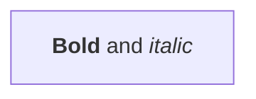
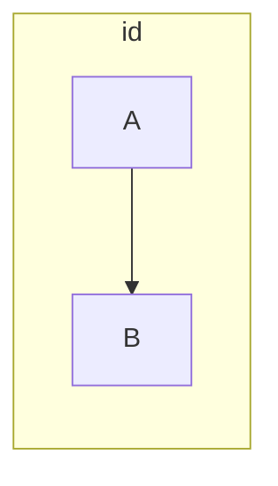
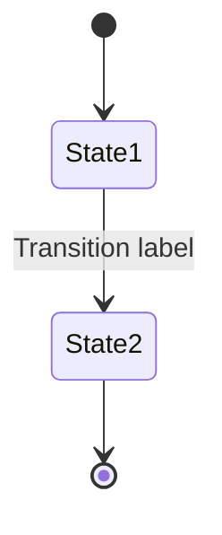
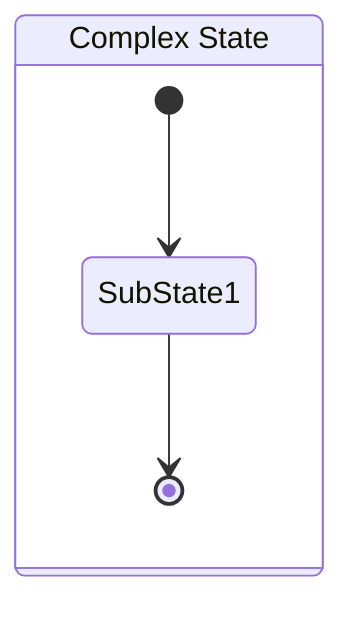
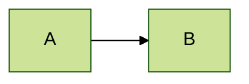
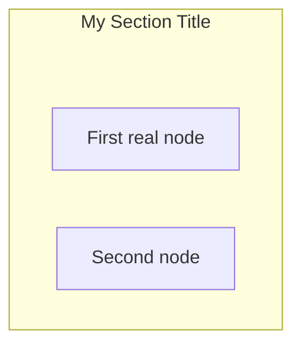
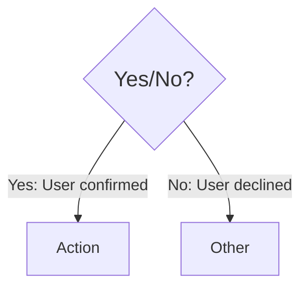
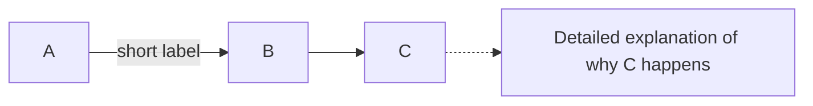
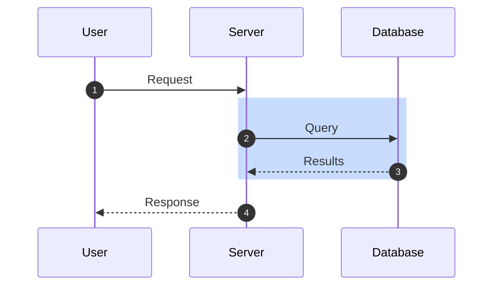

# Mermaid Diagram Syntax Rules

Comprehensive rules compiled from official Mermaid documentation (v10+).

<<<<<<< HEAD
## 🎨 ACTIVE THEME CONFIGURATION

**Current Active Theme: FALL** (default)

To change the active theme, update the "Current Active Theme" line above to
one of:

- SPRING (default) - Fresh greens, soft pinks, pale yellows
- SUMMER - Sky blues, sunny yellows, warm corals
- FALL - Burnt oranges, deep purples, golden yellows
- WINTER - Ice blues, slate greys, pale cyans

**To apply a theme to your diagrams:**

1. Scroll to the "Seasonal Theme Presets" section below
2. Copy the YAML frontmatter for your chosen theme
3. Paste it at the top of your mermaid code block
4. Replace any existing frontmatter (only one per diagram)

See "Seasonal Theme Presets" section below for complete copy-paste configurations.


**MANDATORY: Run validation before committing any diagram changes or
updates to this file.**
=======
## ⚠️ VALIDATION REQUIREMENTS

**MANDATORY: Run validation before committing any diagram changes or updates to this file.**
>>>>>>> 8cdbc5d396a014aafeb27bf6224b714bc1c6a905

### Validation Checklist

grep -n "<br/>\|<span>\|<div>" docs/diagrams/*.md

# 2. Check for double colons in text (ALWAYS BREAKS)
<<<<<<< HEAD
grep -n "::" docs/diagrams/*.md | grep -v "http://" | `
  grep -v "https://" | grep -v "stateDiagram-v2"
=======
grep -n "::" docs/diagrams/*.md | grep -v "http://" | grep -v "https://" | grep -v "stateDiagram-v2"
>>>>>>> 8cdbc5d396a014aafeb27bf6224b714bc1c6a905

# 3. Check for colons in subgraph labels (BREAKS)
grep -n "subgraph.*:.*\"" docs/diagrams/*.md

# 4. Check for unquoted forward slashes in node labels (BREAKS)
grep -n "\[\/.*\]" docs/diagrams/*.md | grep -v "\[\"\/.*\"\]"

# 5. Check for unquoted square brackets inside node labels (BREAKS)
grep -n "\[[^\"\[]*\[[^\]]*\].*\]" docs/diagrams/*.md

# 6. Check for unquoted parentheses in pie/gantt (BREAKS)
grep -n "\"[^\"]*([^)]*)\"" docs/diagrams/*.md

# 7. Check for colons in gantt task names after first colon (BREAKS)
grep -n "^[[:space:]]*[^:]*:.*:.*:" docs/diagrams/*.md | grep -v "http"

<<<<<<< HEAD
# 8. YAML INDENTATION ERRORS (CRITICAL - BREAKS ALL DIAGRAMS)
# Check for misaligned config sections
Select-String -Path docs/diagrams/*.md `
  -Pattern '      sequence:|      state:|      journey:' `
  -Exclude MERMAID_RULES.md
# Should return NO matches - these must be at 2-space indent, not 6

# 9. YAML STRUCTURE VALIDATION
# Verify config sections are properly separated
for file in docs/diagrams/*.md; do
  awk '/^---$/,/^---$/ {print NR": "$0}' "$file" | head -200
done
# Check that flowchart:, sequence:, state: etc. all have 2-space
# indent (not 4 or 6)

# 10. Validate all diagrams render (use Mermaid Live Editor)
=======
# 8. Validate all diagrams render (use Mermaid Live Editor)
>>>>>>> 8cdbc5d396a014aafeb27bf6224b714bc1c6a905
# Copy each diagram to https://mermaid.live/ and verify no errors
```

### Validation Rules for MERMAID_RULES.md Itself

When adding examples to this documentation file:

1. **Complete diagrams ONLY as ```mermaid blocks**
   - Must have proper diagram type declaration (flowchart, sequenceDiagram, etc.)
   - Must be fully valid and renderable
   - Test in Mermaid Live Editor first

2. **Syntax examples as plain ``` blocks**
   - Incomplete snippets showing syntax only
   - Examples with intentional errors (BAD examples)
   - Fragments without diagram type declaration

3. **Test this file on GitHub**
   - Push and verify all diagrams render
   - GitHub treats ALL ```mermaid blocks as renderable diagrams
# Mermaid Diagram Syntax Rules

Comprehensive rules compiled from official Mermaid documentation (v10+).

## 3a8 ACTIVE THEME CONFIGURATION

**Current Active Theme: FALL** (default)

To change the active theme, update the "Current Active Theme" line above to
one of:

- SPRING (default) - Fresh greens, soft pinks, pale yellows
- SUMMER - Sky blues, sunny yellows, warm corals
- FALL - Burnt oranges, deep purples, golden yellows
- WINTER - Ice blues, slate greys, pale cyans

**To apply a theme to your diagrams:**

1. Scroll to the "Seasonal Theme Presets" section below
2. Copy the YAML frontmatter for your chosen theme
3. Paste it at the top of your mermaid code block
4. Replace any existing frontmatter (only one per diagram)

See "Seasonal Theme Presets" section below for complete copy-paste configurations.

## 6a0e0f VALIDATION REQUIREMENTS

**MANDATORY: Run validation before committing any diagram changes or
updates to this file.**

### Validation Checklist

Before committing changes, run ALL validation commands below:

```powershell
# 1. Check for HTML tags in diagrams (CRITICAL ERROR)
grep -n "<br/>\|<span>\|<div>" docs/diagrams/*.md

# 2. Check for double colons in text (ALWAYS BREAKS)
grep -n "::" docs/diagrams/*.md | grep -v "http://" | grep -v "https://" | grep -v "stateDiagram-v2"

# 3. Check for colons in subgraph labels (BREAKS)
grep -n "subgraph.*:.*\"" docs/diagrams/*.md

# 4. Check for unquoted forward slashes in node labels (BREAKS)
grep -n "\[\/.*\]" docs/diagrams/*.md | grep -v "\[\"\/.*\"\]"

# 5. Check for unquoted square brackets inside node labels (BREAKS)
grep -n "\[[^\"\[]*\[[^\]]*\].*\]" docs/diagrams/*.md

# 6. Check for unquoted parentheses in pie/gantt (BREAKS)
grep -n "\"[^\"]*([^)]*)\"" docs/diagrams/*.md

# 7. Check for colons in gantt task names after first colon (BREAKS)
grep -n "^[[:space:]]*[^:]*:.*:.*:" docs/diagrams/*.md | grep -v "http"

# 8. YAML INDENTATION ERRORS (CRITICAL - BREAKS ALL DIAGRAMS)
# Check for misaligned config sections
Select-String -Path docs/diagrams/*.md `
  -Pattern '      sequence:|      state:|      journey:' `
  -Exclude MERMAID_RULES.md
# Should return NO matches - these must be at 2-space indent, not 6

# 9. YAML STRUCTURE VALIDATION
# Verify config sections are properly separated
for file in docs/diagrams/*.md; do
  awk '/^---$/,/^---$/ {print NR": "$0}' "$file" | head -200
   - Incomplete examples will show "Unable to render" errors

### Common Validation Errors Found

Based on production issues discovered:

- **HTML tags** → Remove or replace with markdown
- **Double colons** → Remove or replace with single space
- **Colons in subgraph labels** → Remove from label text
- **Colons in sequence note text** → Keep only first colon (label separator)
- **Forward slashes unquoted** → Wrap in double quotes
- **Square brackets inside node labels** → Wrap entire label in quotes
- **Parentheses in pie/gantt labels** → Wrap entire label in quotes
- **State transition colons** → Keep only label separator colon
<<<<<<< HEAD
- **Incomplete ```mermaid examples** → Convert to plain``` blocks
- **YAML indentation errors** → Config sections must be at 2-space indent (flowchart:, sequence:, state:, etc.)

### MANDATORY PRE-COMMIT TESTING

**CRITICAL: Test EVERY change before committing - scripts, manual edits, AI-generated changes, ALL modifications.**

#### Testing Workflow

1. **After ANY file modification:**

   ```powershell
   # Test single diagram in Mermaid Live Editor
   # Copy first diagram from modified file to https://mermaid.live/
   # Verify it renders without errors
   ```

2. **After script execution:**

   ```powershell
   # Run ALL validation commands from checklist above
   # Fix any errors found
   # Re-test until all validations pass
   ```

3. **Before git commit:**

   ```powershell
   # Final validation - must pass ALL checks
   cd docs/diagrams
   
   # Quick validation script
   Write-Host "Running validation..."
   $errors = 0
   
   # Check YAML indentation
   $yamlErrors = Select-String -Path *.md -Pattern '      sequence:|      state:|      journey:' -Exclude MERMAID_RULES.md
   if ($yamlErrors) {
       Write-Host "ERROR: YAML indentation issues found"
       $yamlErrors
       $errors++
   }
   
   # Check HTML tags
   $htmlErrors = Select-String -Path *.md -Pattern '<br/>|<span>|<div>' -Exclude MERMAID_RULES.md
   if ($htmlErrors) {
       Write-Host "ERROR: HTML tags found"
       $htmlErrors
       $errors++
   }
   
   if ($errors -eq 0) {
       Write-Host "✓ Validation passed"
   } else {
       Write-Host "✗ Validation FAILED - fix errors before committing"
       exit 1
   }
   ```

4. **AFTER PUSHING - Verify rendered output:**

   ```powershell
   # MANDATORY: View the actual rendered page on GitHub Pages
   # Wait 2-3 minutes for GitHub Pages to rebuild
   # Then open and verify EVERY diagram renders correctly
   
   # Example for team-boundaries:
   Start-Process "https://phantom-man.github.io/PROVES_LIBRARY/diagrams/team-boundaries.html"
   
   # Check for error messages like:
   # - "Unable to render rich display"
   # - "bad indentation of a mapping entry"
   # - "Parse error" or "Syntax error"
   # - Diagrams not appearing at all
   ```

5. **Never assume changes work:**
   - Scripts can have bugs
   - Regex can match incorrectly
   - YAML structure is fragile
   - Source files can look correct but fail to render
   - **YOU MUST SEE THE SAME ERRORS USERS SEE** - check the live site after every push
   - If you can't see rendering errors, you can't fix them proactively

## 🔧 RULES FOR BATCH EDITING SCRIPTS

**CRITICAL: Follow these rules when writing PowerShell/Bash scripts to modify mermaid diagram files.**

### YAML Frontmatter Integrity

**NEVER break the YAML frontmatter structure when batch editing diagrams.**

#### ✅ SAFE Replacement Patterns

1. **Match Complete Sections with Boundaries**

   ```powershell
   # CORRECT: Match config block with proper boundaries
   $content -replace '(?ms)^config:.*?^---\s*\n', $replacement
   
   # CORRECT: Preserve closing --- with explicit newline
   $replacement = @"
   config:
     theme: base
     ...
   ---
   
   "@
   ```

2. **Preserve Structural Separators**

   ```powershell
   # CORRECT: Include separators in replacement string
   $replacement = "  c4:`n    boxMargin: 10`n---`n"
   
   # CORRECT: Use backtick-n for newlines in PowerShell
   "line1`nline2`nline3"
   ```

3. **Test Replacement on Single File First**

   ```powershell
   # CORRECT: Test before batch processing
   $testFile = 'team-boundaries.md'
   $content = Get-Content $testFile -Raw
   $newContent = $content -replace $pattern, $replacement
   
   # Manually verify $newContent before proceeding
   Write-Host $newContent | Select-String -Pattern '---' -Context 2
   
   # Only then apply to all files
   ```

#### ❌ DANGEROUS Patterns - NEVER USE

1. **Greedy Matches Without Boundaries**

   ```powershell
   # WRONG: Will match too much or break structure
   $content -replace 'config:.*---', $replacement
   
   # WRONG: Missing newline before closing ---
   $replacement = "config:`n  theme: base---"  # Creates: base---
   
   # WRONG: No newline after closing ---
   $replacement = "config:`n---flowchart"  # Creates: ---flowchart
   ```

2. **Single-Line Mode Without Anchors**

   ```powershell
   # WRONG: Can match across diagrams
   $content -replace 'config:.*', $replacement
   
   # CORRECT: Use multiline mode with anchors
   $content -replace '(?ms)^config:.*?^---', $replacement
   ```

3. **Replacing Separators Alone**

   ```powershell
   # WRONG: Can break other markdown elements
   $content -replace '---', '___'
   
   # CORRECT: Match separator in context
   $content -replace '^---\s*$', '___'
   ```

### Batch Edit Validation Checklist

**MANDATORY steps after running ANY batch edit script:**

```powershell
# 1. Verify YAML frontmatter structure
grep -n "^---$" docs/diagrams/*.md | head -20
# Should see pairs: line X: ---, line Y: ---

# 2. Check for concatenated config lines
grep -n "10---" docs/diagrams/*.md
grep -n "---flowchart" docs/diagrams/*.md
grep -n "---gantt" docs/diagrams/*.md
# Should return NO matches

# 3. Verify config block completeness
for file in docs/diagrams/*.md; do
  echo "Checking $file"
  grep -A 5 "^---$" "$file" | grep -E "^(config:|flowchart|gantt|sequenceDiagram)" | head -2
done
# Should show: --- followed by diagram type (not config details)

# 4. Count opening vs closing --- separators
for file in docs/diagrams/*.md; do
  open=$(grep -c "^\`\`\`mermaid" "$file")
  close=$(grep -c "^\`\`\`$" "$file")
  yaml_open=$(grep -c "^---$" "$file")
  echo "$file: mermaid blocks=$open/$close, yaml seps=$yaml_open (should be even)"
done

# 5. Test render in Mermaid Live Editor
# Copy first diagram from each modified file to https://mermaid.live/
# Verify no "Diagrams beginning with ---" errors

# 6. Check for malformed YAML
for file in docs/diagrams/*.md; do
  echo "Checking $file for YAML issues"
  awk '/^---$/,/^---$/{print NR": "$0}' "$file" | head -20
done
# Look for suspicious patterns like missing colons, weird indentation
```

### Safe Batch Edit Template

Use this template for all batch diagram modifications:

```powershell
# 1. DEFINE replacement with explicit structure
$replacement = @"
config:
  theme: base
  fontSize: 18
  themeCSS: |
    .node rect, .cluster rect, .edgePath path { transition: filter 0.2s ease, stroke-width: 0.2s ease; }
    .node:hover rect, .cluster:hover rect, .edgePath:hover path { filter: drop-shadow(0 0 8px rgba(0,0,0,0.35)); stroke-width: 3px; }
    .edgeLabel rect { rx: 6px; ry: 6px; stroke-width: 1px; }
    .cluster-label { display: block; padding-bottom: 8px; margin-bottom: 8px; font-weight: 600; white-space: nowrap; }
  themeVariables:
    primaryColor: '#E8F5E9'
    ...configuration lines...
    boxMargin: 10
---

"@  # Note: Empty line after --- is preserved in @" "@ block

# 2. DEFINE safe regex pattern with boundaries
$pattern = '(?ms)^---\s*\nconfig:.*?^---\s*\n'
# Explanation:
# (?ms) - multiline + single-line modes
# ^---\s*\n - opening --- with newline
# config:.*? - config block (non-greedy)
# ^---\s*\n - closing --- with newline

# 3. TEST on one file first
$testFile = 'docs/diagrams/team-boundaries.md'
$testContent = Get-Content $testFile -Raw
$testResult = $testContent -replace $pattern, $replacement

# 4. VERIFY test result
if ($testResult -match '(?ms)---\s*\n---\s*\nflowchart|gantt|sequenceDiagram') {
  Write-Host "✓ Replacement looks correct"
  Write-Host ($testResult -split "`n" | Select-Object -First 10)
} else {
  Write-Host "✗ Replacement broken - check pattern"
  exit 1
}

# 5. APPLY to all files only if test passed
$files = @('team-boundaries.md', 'overview.md', 'gnn-molecule.md', 
           'knowledge-gaps.md', 'cross-system.md', 'transitive-chains.md')

foreach ($file in $files) {
  $content = Get-Content "docs/diagrams/$file" -Raw
  $content = $content -replace $pattern, $replacement
  Set-Content "docs/diagrams/$file" $content
}

# 6. VALIDATE results
Write-Host "Running post-edit validation..."
& grep -n "10---" docs/diagrams/*.md
& grep -n "---flowchart" docs/diagrams/*.md
if ($LASTEXITCODE -eq 0) {
  Write-Host "✗ Found concatenation errors!"
  exit 1
} else {
  Write-Host "✓ No concatenation errors found"
}
```

### Common Script Pitfalls

1. **PowerShell String Escaping**

   ```powershell
   # WRONG: Double quotes inside double quotes
   $str = "fontFamily: "Segoe UI""  # Breaks
   
   # CORRECT: Escape inner quotes or use single quotes
   $str = "fontFamily: ""Segoe UI"""  # Escaped
   $str = "fontFamily: 'Segoe UI'"     # Single quotes inside
   ```

2. **Newline Handling Across Platforms**

   ```powershell
   # WRONG: Using \n (Bash style) in PowerShell
   $str = "line1\nline2"  # Literal \n characters
   
   # CORRECT: Use backtick-n in PowerShell
   $str = "line1`nline2"  # Actual newline
   
   # CORRECT: Use here-strings for multi-line
   $str = @"
   line1
   line2
   "@
   ```

3. **Regex Greediness**

   ```powershell
   # WRONG: Greedy .* matches too much
   $content -replace 'config:.*---', $replacement  # Matches multiple blocks
   
   # CORRECT: Non-greedy .*? with boundaries
   $content -replace '(?ms)^config:.*?^---', $replacement
   ```

4. **File Encoding Issues**

   ```powershell
   # WRONG: Default encoding may corrupt UTF-8 files
   Set-Content $file $content
   
   # CORRECT: Specify UTF-8 encoding explicitly
   Set-Content $file $content -Encoding UTF8
   
   # BETTER: Use -NoNewline if controlling newlines
   Set-Content $file $content -Encoding UTF8 -NoNewline
   ```

5. **Missing Backup Before Modification**

   ```powershell
   # CORRECT: Always backup before batch edits
   foreach ($file in $files) {
     Copy-Item "docs/diagrams/$file" "docs/diagrams/$file.backup"
     # ... perform modifications ...
   }
   
   # After validation passes, remove backups:
   Remove-Item docs/diagrams/*.backup
   ```

### Emergency Rollback Procedure

If batch edit breaks all diagrams:

```powershell
# 1. Check git status
git status

# 2. View diff to see damage
git diff docs/diagrams/team-boundaries.md | head -50

# 3. If broken, reset all diagram files
git checkout -- docs/diagrams/*.md

# 4. If committed, revert commit
git log --oneline -5  # Find commit hash
git revert <commit-hash>

# 5. If pushed, force reset (DANGEROUS - coordinate with team)
git reset --hard HEAD~1
git push --force-with-lease
```

### Pre-Commit Hook Recommendation

Add this to `.git/hooks/pre-commit` to catch YAML errors:

```bash
#!/bin/bash

# Check for broken YAML frontmatter
if grep -n "10---\|---flowchart\|---gantt" docs/diagrams/*.md; then
  echo "❌ ERROR: YAML frontmatter concatenation detected!"
  echo "   Run validation and fix before committing."
  exit 1
fi

# Check for unclosed mermaid blocks
for file in docs/diagrams/*.md; do
  opens=$(grep -c "^\`\`\`mermaid" "$file")
  closes=$(grep -c "^\`\`\`$" "$file")
  if [ "$opens" -ne "$closes" ]; then
    echo "❌ ERROR: $file has mismatched mermaid blocks ($opens opens, $closes closes)"
    exit 1
  fi
done

echo "✓ Diagram validation passed"
```

### Key Takeaways

1. **ALWAYS test regex replacements on one file first**
2. **ALWAYS preserve YAML frontmatter separators with proper newlines**
3. **ALWAYS validate after batch edits using multiple checks**
4. **NEVER use greedy regex without anchors/boundaries**
5. **NEVER skip backup before destructive operations**
6. **ALWAYS specify UTF-8 encoding explicitly**
7. **ALWAYS use here-strings (@" "@) for multi-line replacements**
8. **ALWAYS verify separator counts match expected diagram counts**
=======
- **Incomplete ```mermaid examples** → Convert to plain ``` blocks
>>>>>>> 8cdbc5d396a014aafeb27bf6224b714bc1c6a905

## Critical Syntax Rules

### 1. NO HTML Tags
<<<<<<< HEAD

=======
>>>>>>> 8cdbc5d396a014aafeb27bf6224b714bc1c6a905
- ❌ **NEVER use `<br/>`, `<span>`, `<div>`, or any HTML tags** in flowchart nodes
- ✅ Use simple text or markdown formatting with backticks
- Exception: `<br/>` is ONLY allowed in sequence diagrams for line breaks

### 2. Special Characters - CRITICAL

#### Colons (`:`) - Multiple Breaking Contexts
<<<<<<< HEAD

=======
>>>>>>> 8cdbc5d396a014aafeb27bf6224b714bc1c6a905
- ❌ **Colons in subgraph labels break parsing**: `subgraph "Layer 1: App"` → FAILS
- ✅ **Remove colons from subgraph labels**: `subgraph "Layer 1 App"` → WORKS
- ❌ **Double colons in text ALWAYS break**: `Status::OK` → FAILS
- ✅ **Remove double colons**: `Status OK` or `Status_OK` → WORKS
- ❌ **Colons in sequence note text after first colon**: `Note over A: Step 1: Details` → FAILS
- ✅ **Remove colons from note content**: `Note over A: Step 1 Details` → WORKS
- ✅ **Single colon separating label from text is OK**: `Note over A: Some text` → WORKS
- ✅ **Colons OK in link text**: `A -->|Status: OK| B` → WORKS

#### Square Brackets (`[]`) - Breaking in Node Labels
<<<<<<< HEAD

=======
>>>>>>> 8cdbc5d396a014aafeb27bf6224b714bc1c6a905
- ❌ **Brackets inside node text break parsing**: `NODE[Status [YES] OK]` → FAILS
- ✅ **Quote labels with nested brackets**: `NODE["Status [YES] OK"]` → WORKS
- ❌ **Multiple bracket markers unquoted**: `NODE[Doc [WARNING] Incomplete]` → FAILS
- ✅ **Quote all bracket-containing text**: `NODE["Doc [WARNING] Incomplete"]` → WORKS
- ✅ **Outer brackets define node - inner brackets need quotes**

#### Forward Slashes (`/`) - Breaking in Node Labels
<<<<<<< HEAD

=======
>>>>>>> 8cdbc5d396a014aafeb27bf6224b714bc1c6a905
- ❌ **File paths without quotes break parsing**: `DEV[/dev/i2c-1]` → FAILS
- ✅ **Quote all paths with slashes**: `DEV["/dev/i2c-1"]` → WORKS
- ❌ **URLs without quotes can break**: `NODE[http://example.com]` → FAILS
- ✅ **Quote URLs in node labels**: `NODE["http://example.com"]` → WORKS
- ✅ **Slashes in shape syntax are OK**: `A[/Parallelogram/]` → WORKS (defined shape)
- ⚠️ **Slashes in plain text or tables are OK** (not in diagram code)

#### Quotes - When Required
<<<<<<< HEAD

=======
>>>>>>> 8cdbc5d396a014aafeb27bf6224b714bc1c6a905
- ✅ **Quote text with forward slashes**: `id["/path/to/file"]`
- ✅ **Quote text with parentheses**: `id["Text with (parens)"]`
- ✅ **Quote text with square brackets**: `id["Status [YES] Complete"]`
- ✅ **Quote text with special symbols**: `id["Price: $50"]`
- ✅ Use entity codes: `#` (e.g., `#9829;` for ♥)
- ✅ For markdown: Use backticks: `` id["`**Bold** text`"] ``

#### Reserved Words
<<<<<<< HEAD

=======
>>>>>>> 8cdbc5d396a014aafeb27bf6224b714bc1c6a905
- ❌ Word "end" must be capitalized or quoted: `End`, `[end]`, `{end}`
- ❌ Starting with "o" or "x" creates special edges: `A---oB` = circle edge

### 3. Subgraph Syntax
<<<<<<< HEAD

=======
>>>>>>> 8cdbc5d396a014aafeb27bf6224b714bc1c6a905
```
subgraph id [Label Text]
    nodes...
end
```
<<<<<<< HEAD

=======
>>>>>>> 8cdbc5d396a014aafeb27bf6224b714bc1c6a905
- ✅ Must have space between id and bracket
- ❌ **NO colons in labels**: `subgraph "Layer 1: App"` → BREAKS - use `subgraph "Layer 1 App"`
- ✅ Labels can be quoted for special chars: `subgraph "System/Network"`
- ✅ Plain text labels work: `subgraph id` or `subgraph "Text Label"`

### 4. Node Labels

#### Simple text
<<<<<<< HEAD

=======
>>>>>>> 8cdbc5d396a014aafeb27bf6224b714bc1c6a905
```
id[This is text]
id(Round edges)
id{Diamond shape}
```

#### Unicode/Special characters
<<<<<<< HEAD

=======
>>>>>>> 8cdbc5d396a014aafeb27bf6224b714bc1c6a905
```
id["Unicode: ❤ works"]
id["Escaped: #9829;"]
```

#### Markdown formatting (requires config)
<<<<<<< HEAD

=======
>>>>>>> 8cdbc5d396a014aafeb27bf6224b714bc1c6a905


### 5. Line Breaks

#### Flowcharts
<<<<<<< HEAD

- ❌ NO `<br/>` tags
- ✅ Markdown formatting with newlines:

=======
- ❌ NO `<br/>` tags
- ✅ Markdown formatting with newlines:
>>>>>>> 8cdbc5d396a014aafeb27bf6224b714bc1c6a905
```
id["`Line 1
Line 2
Line 3`"]
```

#### Sequence Diagrams
<<<<<<< HEAD

- ✅ `<br/>` is allowed:

```
Alice->John: Hello<br/>World
```

- ✅ In participant aliases:

=======
- ✅ `<br/>` is allowed:
```
Alice->John: Hello<br/>World
```
- ✅ In participant aliases:
>>>>>>> 8cdbc5d396a014aafeb27bf6224b714bc1c6a905
```
participant A as Alice<br/>Johnson
```

### 6. Links/Edges

#### Arrow types
<<<<<<< HEAD

=======
>>>>>>> 8cdbc5d396a014aafeb27bf6224b714bc1c6a905
```
-->  solid with arrow
---  solid no arrow
-.-> dotted with arrow
-.-  dotted no arrow
==>  thick with arrow
===  thick no arrow
--x  solid with cross
--o  solid with circle
<<-->> bidirectional (v11.0.0+)
```

#### Link text
<<<<<<< HEAD

=======
>>>>>>> 8cdbc5d396a014aafeb27bf6224b714bc1c6a905
```
A -->|Text on link| B
A -- Text --- B
A ---|Text| B
```

#### Edge IDs (v11.3.0+)
<<<<<<< HEAD

=======
>>>>>>> 8cdbc5d396a014aafeb27bf6224b714bc1c6a905
```
A e1@--> B
e1@{ animate: true }
```

### 7. Comments
<<<<<<< HEAD

=======
>>>>>>> 8cdbc5d396a014aafeb27bf6224b714bc1c6a905
```
%% This is a comment
%% Must start line with %%
flowchart LR
    A --> B %% inline comments NOT supported
```

### 8. Styling

#### Node styling
<<<<<<< HEAD

=======
>>>>>>> 8cdbc5d396a014aafeb27bf6224b714bc1c6a905
```
style id1 fill:#f9f,stroke:#333,stroke-width:4px
```

#### Classes
<<<<<<< HEAD

=======
>>>>>>> 8cdbc5d396a014aafeb27bf6224b714bc1c6a905
```
classDef className fill:#f9f
class nodeId className
A:::className --> B
```

#### Link styling
<<<<<<< HEAD

=======
>>>>>>> 8cdbc5d396a014aafeb27bf6224b714bc1c6a905
```
linkStyle 0 stroke:#ff3,stroke-width:4px
```

<<<<<<< HEAD
## Theme Variables Reference

Complete reference of all available Mermaid theme variables. Use these to create custom themes or modify the seasonal presets above.

Mermaid supports extensive theming through `themeVariables` in the init directive. Only the `base` theme is fully customizable.

## Diagram-Specific Configuration

Each diagram type supports its own configuration options for spacing, sizing, and layout. These are placed at the same level as `themeVariables` in the config object.

### Flowchart Configuration

**CRITICAL: Use these settings to avoid common rendering issues:**

```yaml
flowchart:
  curve: 'linear'            # Connection style: 'linear', 'basis', 'cardinal', 'catmullRom' (MUST be quoted)
  htmlLabels: false          # ⚠️ CRITICAL: Set to FALSE for proper text handling
  padding: 25                # Padding around subgraph content (increased from 15)
  nodeSpacing: 60            # Horizontal space between nodes
  rankSpacing: 80            # Vertical space between ranks/levels (increased from 50)
  diagramPadding: 8          # Padding around entire diagram
  useMaxWidth: true          # Responsive width
```

**Why `htmlLabels: false` is required:**

- **Subgraph labels overlapping content:** When `htmlLabels: true`, subgraph labels render in HTML foreignObject elements with fixed widths. Multi-line labels wrap behind nodes below them.
- **Text clipping in diamond shapes:** HTML text in decision nodes gets clipped at the diamond boundaries.
- **Inconsistent rendering:** GitHub preview and Jekyll HTML render differently because they use different Mermaid configurations.
- **With `htmlLabels: false`:** Mermaid uses native SVG text elements that:
  - Wrap properly within shape boundaries
  - Scale consistently across renderers
  - Don't have fixed-width clipping issues

**Note:** With `htmlLabels: false`, you CANNOT use HTML tags like `<br/>` for line breaks. Use markdown backtick syntax instead:

```
id["`Line 1
Line 2`"]
```

### Subgraph Heading Overlap Fix

**Problem:** Subgraph labels can overlap with the first node inside the subgraph, especially when the label is long or wraps to multiple lines.

**Solution:** Add invisible "spacer" nodes at the top of each subgraph to create vertical separation:

```
flowchart TB
    subgraph "My Subgraph Title"
        spacer1[ ]:::spacer
        REAL_NODE[Actual Content]
        OTHER_NODE[More Content]
        
        REAL_NODE --> OTHER_NODE
    end
    
    classDef spacer fill:none,stroke:none,color:transparent,width:1px,height:1px;
```

**Key points:**

- Each subgraph gets a unique spacer ID (spacer1, spacer2, etc.)
- The spacer node uses `[ ]` (space in brackets) for minimal size
- The `:::spacer` class makes it invisible
- The `classDef spacer` must be included at the end of the flowchart

### Diamond (Decision) Node Text Clipping Fix

**Problem:** Text in diamond/decision shapes `{text}` gets clipped when it's too long.

**Solution:** Apply a smaller font size class to diamond nodes:

```
flowchart TB
    START[Start Process]
    DECISION{Is this a long question?}:::diamond
    YES[Yes Path]
    NO[No Path]
    
    START --> DECISION
    DECISION -->|Yes| YES
    DECISION -->|No| NO
    
    classDef diamond font-size:22px,font-family:Segoe UI,Tahoma,Geneva,Verdana,sans-serif;
```

**Key points:**

- All diamond nodes should have `:::diamond` appended
- The `classDef diamond` uses a smaller font (14px vs 16px default)
- This prevents text from being clipped at diamond boundaries

### Required classDef Statements for All Flowcharts

**Every flowchart should include these classDef statements at the end:**

```
    %% Font sizing classes for consistency
    classDef default font-size:24px,font-family:Segoe UI,Tahoma,Geneva,Verdana,sans-serif;
    classDef diamond font-size:22px,font-family:Segoe UI,Tahoma,Geneva,Verdana,sans-serif;
    classDef spacer fill:none,stroke:none,color:transparent,width:1px,height:1px;
```

**What each class does:**

- `default` - Sets consistent 16px font for all nodes (fixes flowchart font inconsistency)
- `diamond` - Smaller 14px font for decision shapes (prevents text clipping)
- `spacer` - Invisible nodes for subgraph label separation

### Gantt Chart Configuration

```yaml
gantt:
  fontSize: 16               # Font size for gantt text (NOT controlled by global fontSize)
  barHeight: 24              # Height of task bars in pixels
  barGap: 6                  # Gap between task bars
  topPadding: 50             # Top padding in pixels
  leftPadding: 75            # Left padding for labels
  gridLineStartPadding: 35   # Padding before grid lines start
  numberSectionStyles: 4     # Number of section style variations
```

### Sequence Diagram Configuration

```yaml
sequence:
  diagramMarginX: 50         # Left/right margin
  diagramMarginY: 10         # Top/bottom margin
  actorMargin: 50            # Space between actors
  boxMargin: 10              # Margin around boxes
  boxTextMargin: 5           # Text margin inside boxes
  noteMargin: 10             # Margin around notes
  messageMargin: 35          # Space between messages
  mirrorActors: false        # Show actors at bottom
  useMaxWidth: true          # Responsive width
  # Note: width and height are auto-calculated based on content
  bottomMarginAdj: 1         # Bottom margin adjustment
  useMaxWidth: true          # Use maximum available width
  rightAngles: false         # Use right angles for messages
  showSequenceNumbers: false # Show sequence numbers
```

### State Diagram Configuration

```yaml
state:
  dividerMargin: 10          # Margin around dividers
  sizeUnit: 5                # Base unit for sizing
  padding: 8                 # General padding
  textHeight: 10             # Text height
  titleShift: -15            # Title vertical offset
  noteMargin: 10             # Note margin
  forkWidth: 70              # Fork node width
  forkHeight: 7              # Fork node height
  miniPadding: 2             # Minimal padding
  fontSizeFactor: 5.02       # Font size multiplier
  fontSize: 24               # Base font size
  labelHeight: 16            # Label height
  edgeLengthFactor: 20       # Edge length calculation
  compositeTitleSize: 35     # Composite state title size
  radius: 5                  # Corner radius
```

### Class Diagram Configuration

```yaml
class:
  arrowMarkerAbsolute: false # Use absolute arrow positioning
  hideEmptyMembersBox: false # Hide boxes with no members
```

### Entity-Relationship Diagram Configuration

```yaml
er:
  diagramPadding: 20         # Padding around diagram
  layoutDirection: 'TB'      # Layout: TB (top-bottom), LR (left-right)
  minEntityWidth: 100        # Minimum entity box width
  minEntityHeight: 75        # Minimum entity box height
  entityPadding: 15          # Padding inside entities
  stroke: 'gray'             # Relationship line color
  fill: 'honeydew'           # Entity box fill
  fontSize: 12               # Text font size
```

### User Journey Configuration

```yaml
journey:
  diagramMarginX: 50         # Left/right margin
  diagramMarginY: 10         # Top/bottom margin
  actorMargin: 50            # Space between actors
  width: 150                 # Section width
  height: 65                 # Section height
  boxMargin: 10              # Box margin
  boxTextMargin: 5           # Text margin in boxes
```

### Pie Chart Configuration

```yaml
pie:
  textPosition: 0.75         # Label position (0-1 from center)
```

### Quadrant Chart Configuration

```yaml
quadrant:
  chartWidth: 500            # Chart width in pixels
  chartHeight: 500           # Chart height in pixels
  titlePadding: 10           # Title padding
  titlefontSize: 16          # Title font size
  quadrantPadding: 5         # Padding around quadrants
  quadrantTextTopPadding: 5  # Top padding for quadrant text
  quadrantLabelFontSize: 16  # Quadrant label font size
  quadrantInternalBorderStrokeWidth: 1  # Internal border width
  quadrantExternalBorderStrokeWidth: 2  # External border width
  pointTextPadding: 5        # Padding around point labels
  pointLabelFontSize: 12     # Point label font size
  pointRadius: 6             # Point circle radius
  xAxisLabelPadding: 5       # X-axis label padding
  xAxisLabelFontSize: 16     # X-axis label font size
  yAxisLabelPadding: 5       # Y-axis label padding
  yAxisLabelFontSize: 16     # Y-axis label font size
```

### Requirement Diagram Configuration

```yaml
requirement:
  rect_fill: '#E8F5E9'      # Rectangle fill color
  text_color: '#2E7D32'     # Text color
  rect_border_size: 2       # Border width
  rect_border_color: '#4CAF50'  # Border color
  rect_min_width: 200       # Minimum width
  rect_min_height: 200      # Minimum height
  fontSize: 14              # Font size
  rect_padding: 10          # Rectangle padding
  line_height: 20           # Line height
```

### Git Graph Configuration

```yaml
gitGraph:
  showBranches: true        # Show branch labels
  showCommitLabel: true     # Show commit messages
  mainBranchName: 'main'    # Name of main branch
  rotateCommitLabel: true   # Rotate commit labels
```

### C4 Diagram Configuration

```yaml
c4:
  diagramMarginX: 50        # Left/right margin
  diagramMarginY: 10        # Top/bottom margin
  c4ShapeMargin: 50         # Space between shapes
  c4ShapePadding: 20        # Padding inside shapes
  width: 216                # Shape width
  height: 60                # Shape height
  boxMargin: 10             # Box margin
```

### Usage Syntax

```
%%{init: {'theme':'base', 'themeVariables': {'primaryColor':'#ff0000', 'lineColor':'#333'}}}%%
```

### Base Theme Variables

#### Core Colors

- `background` - Diagram background color (default: `#f4f4f4`)
- `primaryColor` - Primary color for nodes and elements (default: `#fff4dd`)
- `secondaryColor` - Secondary color, auto-calculated from primary
- `tertiaryColor` - Tertiary color, auto-calculated from primary
- `primaryTextColor` - Text color in primary elements (default: calculated from darkMode)
- `secondaryTextColor` - Text color in secondary elements (auto-calculated)
- `tertiaryTextColor` - Text color in tertiary elements (auto-calculated)
- `primaryBorderColor` - Border color for primary elements (auto-calculated)
- `secondaryBorderColor` - Border color for secondary elements (auto-calculated)
- `tertiaryBorderColor` - Border color for tertiary elements (auto-calculated)

#### Text and Lines

- `textColor` - General text color (default: same as primaryTextColor)
- `lineColor` - Line and connection color (auto-calculated from background)
- `arrowheadColor` - Color of arrow heads (auto-calculated from background)
- `fontFamily` - Font family for diagram text (default: `"trebuchet ms", verdana, arial, sans-serif`)

**Font Size Configuration:**

- **Global `fontSize`** (config level): Controls overall diagram font size (default: `16`, recommend `18-20`)
  - Place at config level: `config: { fontSize: 16 }`
  - This is a NUMBER without units
- **Theme `fontSize`** (themeVariables level): Controls font rendering in diagrams
  - Place in themeVariables: `themeVariables: { fontSize: '24px' }`
  - This is a STRING with px units (e.g., '16px', '20px', '24px')
  - **THIS IS WHAT ACTUALLY CONTROLS FLOWCHART TEXT SIZE**
- **CRITICAL: themeCSS does NOT reliably control flowchart node text**
  - Flowchart text size is controlled ONLY by `fontSize` in themeVariables
  - CSS selectors like `.label`, `.nodeLabel` are unreliable and browser-dependent
  - Use themeCSS for hover effects and custom styling only, not font sizes
  - **Example:**

    ```yaml
    config:
      theme: base
      fontSize: 16  # Number for overall scaling
      themeVariables:
        fontSize: '16px'  # STRING with units - this controls flowchart text!
    ```

**Edge Label Configuration:**

- **Edge label background**: Controlled by `edgeLabelBackground` in themeVariables
- **Edge label borders**: NOT supported in base Mermaid theme
  - There is no themeVariable for edge label borders
  - themeCSS border attempts are unreliable and often don't render
  - Edge labels use background color only - accept this limitation
  - For emphasis, use contrasting `edgeLabelBackground` colors instead

**themeCSS Capabilities:**

- Override CSS styling for visual effects only
- Add interactive hover effects (`:hover` pseudo-classes work)
- Add shadows, filters, transforms, animations
- Always use `!important` to override Mermaid defaults
- **WARNING: Do NOT use for font sizes** - use themeVariables.fontSize instead
- **WARNING: Edge label borders are NOT supported** - they won't render reliably

**Reliable CSS Selectors (for hover effects only):**

- `.node:hover rect`, `.node:hover circle`, `.node:hover polygon` - Node hover states
- `.edgePath:hover path` - Connection line hover
- `.node rect`, `.node circle` - Node shapes for shadows/effects

**Unreliable/Unsupported:**

- `.label`, `.nodeLabel`, `text` - Font size changes via CSS are unreliable
- `.edgeLabel rect`, `.label-container rect` - Border styling often doesn't render

#### Notes and Labels

- `noteBkgColor` - Background color for note boxes (default: `#fff5ad`)
- `noteTextColor` - Text color in notes (default: `#333`)
- `noteBorderColor` - Border color for notes (auto-calculated)
- `labelColor` - Label text color
- `labelBackgroundColor` - Background for labels
- `labelTextColor` - Text color in labels

#### Error Styling

- `errorBkgColor` - Background for syntax error messages
- `errorTextColor` - Text color for error messages

### Flowchart Variables

- `nodeBkg` - Node background color (default: same as mainBkg)
- `mainBkg` - Main background for nodes (default: same as primaryColor)
- `nodeBorder` - Node border color (default: same as primaryBorderColor)
- `nodeTextColor` - Text color inside nodes
- `clusterBkg` - Background for subgraphs/clusters (default: same as tertiaryColor)
- `clusterBorder` - Border for subgraphs (default: same as tertiaryBorderColor)
- `defaultLinkColor` - Default link/edge color (default: same as lineColor)
- `titleColor` - Title text color (default: same as tertiaryTextColor)
- `edgeLabelBackground` - Background color of edge labels (auto-calculated from secondaryColor)
  - **IMPORTANT:** Edge labels do NOT support borders in base Mermaid theme
  - Use contrasting background colors for emphasis instead
  - themeCSS border attempts are unreliable and browser-dependent
- `border2` - Alternative border color

### Sequence Diagram Variables

- `actorBkg` - Actor box background (default: same as mainBkg)
- `actorBorder` - Actor box border (default: same as primaryBorderColor)
- `actorTextColor` - Text in actor boxes (default: same as primaryTextColor)
- `actorLineColor` - Actor lifeline color (default: same as actorBorder)
- `signalColor` - Signal/message line color (default: same as textColor)
- `signalTextColor` - Text on signals (default: same as textColor)
- `labelBoxBkgColor` - Background for label boxes (default: same as actorBkg)
- `labelBoxBorderColor` - Border for label boxes (default: same as actorBorder)
- `loopTextColor` - Text in loop boxes (default: same as actorTextColor)
- `activationBorderColor` - Border of activation boxes (auto-calculated)
- `activationBkgColor` - Background of activation boxes (default: same as secondaryColor)
- `sequenceNumberColor` - Color of sequence numbers (auto-calculated)

### State Diagram Variables

- `stateBkg` - State box background (default: same as mainBkg)
- `compositeBackground` - Background for composite states (default: background or tertiaryColor)
- `altBackground` - Alternative background for deep composite states (default: same as tertiaryColor)
- `compositeTitleBackground` - Title background in composite states (default: same as mainBkg)
- `compositeBorder` - Border for composite states (default: same as nodeBorder)
- `innerEndBackground` - Background for inner end states
- `transitionColor` - Color of state transitions (default: same as lineColor)
- `specialStateColor` - Color for special states (default: same as lineColor)

### Gantt Diagram Variables

- `sectionBkgColor` - Section background color (default: same as tertiaryColor)
- `altSectionBkgColor` - Alternate section background (default: `white`)
- `sectionBkgColor2` - Second section background (default: same as primaryColor)
- `excludeBkgColor` - Background for excluded periods (default: `#eeeeee`)
- `taskBorderColor` - Task box border (default: same as primaryBorderColor)
- `taskBkgColor` - Task box background (default: same as primaryColor)
- `activeTaskBorderColor` - Active task border (default: same as primaryColor)
- `activeTaskBkgColor` - Active task background (auto-calculated)
- `gridColor` - Grid line color (default: `lightgrey`)
- `doneTaskBkgColor` - Completed task background (default: `lightgrey`)
- `doneTaskBorderColor` - Completed task border (default: `grey`)
- `critBorderColor` - Critical task border (default: `#ff8888`)
- `critBkgColor` - Critical task background (default: `red`)
- `todayLineColor` - Today marker line color (default: `red`)
- `vertLineColor` - Vertical line color (default: `navy`)
- `taskTextColor` - Text color in tasks (default: same as textColor)
- `taskTextOutsideColor` - Text outside task boxes (default: same as textColor)
- `taskTextLightColor` - Light task text (default: same as textColor)
- `taskTextDarkColor` - Dark task text (default: same as textColor)
- `taskTextClickableColor` - Clickable task text color (default: `#003163`)

**IMPORTANT: Gantt Charts Require Explicit Colors**

Gantt charts do NOT inherit flowchart `themeCSS` font sizing. You must:

1. Set `gantt: { fontSize: 16 }` in config for font size control
2. Define ALL section and task colors explicitly to avoid white backgrounds:

   ```yaml
   themeVariables:
     # Section backgrounds (horizontal rows) - MUST set all 3
     sectionBkgColor: '#FFE0B2'      # First section color
     altSectionBkgColor: '#E1F5FE'   # Alternating section color
     sectionBkgColor2: '#FFF9C4'     # Third section color pattern
     
     # Task types - each needs background + border
     taskBkgColor: '#81D4FA'         # Normal task background
     taskBorderColor: '#0288D1'      # Normal task border
     
     activeTaskBkgColor: '#4FC3F7'   # Active task (:active) background
     activeTaskBorderColor: '#0277BD' # Active task border
     
     doneTaskBkgColor: '#B3E5FC'     # Completed task (:done) background
     doneTaskBorderColor: '#0288D1'  # Completed task border
     
     critBkgColor: '#FF8A80'         # Critical task (:crit) background
     critBorderColor: '#D32F2F'      # Critical task border
     
     # Text and grid
     taskTextColor: '#01579B'        # Text inside tasks
     taskTextOutsideColor: '#01579B' # Section labels
     gridColor: '#B3E5FC'           # Background grid lines
     todayLineColor: '#D32F2F'      # Today marker
   ```

Without explicit colors, sections and tasks may render with white/default backgrounds, making them invisible or indistinguishable.

### Class Diagram Variables

- `classText` - Text color in class boxes (default: same as textColor)

### Pie Chart Variables

- `pie1` through `pie12` - Fill colors for pie sections (defaults: various calculated colors)
- `pieTitleTextSize` - Title text size (default: `25px`)
- `pieTitleTextColor` - Title text color
- `pieSectionTextSize` - Section label text size (default: `17px`)
- `pieSectionTextColor` - Section label text color (default: same as textColor)
- `pieLegendTextSize` - Legend text size (default: `17px`)
- `pieLegendTextColor` - Legend text color
- `pieStrokeColor` - Pie section border color (default: `black`)
- `pieStrokeWidth` - Pie section border width (default: `2px`)
- `pieOuterStrokeWidth` - Outer circle border width (default: `2px`)
- `pieOuterStrokeColor` - Outer circle border color (default: `black`)
- `pieOpacity` - Section opacity (default: `0.7`)

### Quadrant Chart Variables

- `quadrant1Fill` through `quadrant4Fill` - Fill colors for quadrants
- `quadrant1TextFill` through `quadrant4TextFill` - Text colors in quadrants
- `quadrantPointFill` - Point fill color
- `quadrantPointTextFill` - Point label text color
- `quadrantXAxisTextFill` - X-axis label text color
- `quadrantYAxisTextFill` - Y-axis label text color
- `quadrantInternalBorderStrokeFill` - Internal border color
- `quadrantExternalBorderStrokeFill` - External border color
- `quadrantTitleFill` - Quadrant title text color

### XY Chart Variables

`xyChart` is an object containing:

- `backgroundColor` - Chart background
- `titleColor` - Chart title color
- `xAxisTitleColor` - X-axis title color
- `xAxisLabelColor` - X-axis label color
- `xAxisTickColor` - X-axis tick color
- `xAxisLineColor` - X-axis line color
- `yAxisTitleColor` - Y-axis title color
- `yAxisLabelColor` - Y-axis label color
- `yAxisTickColor` - Y-axis tick color
- `yAxisLineColor` - Y-axis line color
- `plotColorPalette` - Comma-separated color list for data series

### Requirement Diagram Variables

- `requirementBackground` - Requirement box background (default: same as primaryColor)
- `requirementBorderColor` - Requirement box border (default: same as primaryBorderColor)
- `requirementBorderSize` - Border width (default: `1`)
- `requirementTextColor` - Text in requirement boxes (default: same as primaryTextColor)
- `relationColor` - Relation line color (default: same as lineColor)
- `relationLabelBackground` - Relation label background (auto-calculated from secondaryColor)
- `relationLabelColor` - Relation label text color (default: same as actorTextColor)

### Git Graph Variables

- `git0` through `git7` - Branch colors (calculated from primary/secondary/tertiary)
- `gitInv0` through `gitInv7` - Inverted branch colors
- `gitBranchLabel0` through `gitBranchLabel7` - Branch label text colors
- `commitLabelColor` - Commit label text color
- `commitLabelBackground` - Commit label background (default: same as secondaryColor)
- `commitLabelFontSize` - Commit label font size (default: `10px`)
- `tagLabelColor` - Tag label text color
- `tagLabelBackground` - Tag label background (default: same as primaryColor)
- `tagLabelBorder` - Tag border color (default: same as primaryBorderColor)
- `tagLabelFontSize` - Tag label font size

### Color Scale Variables (for general use)

- `cScale0` through `cScale11` - Base color scale (12 colors)
- `cScaleInv0` through `cScaleInv11` - Inverted color scale
- `cScalePeer0` through `cScalePeer11` - Peer colors for borders
- `cScaleLabel0` through `cScaleLabel11` - Label text colors for color scale
- `scaleLabelColor` - Default scale label color (default: same as labelTextColor)

### Surface Colors (for layered elements)

- `surface0` through `surface4` - Surface background colors (5 levels)
- `surfacePeer0` through `surfacePeer4` - Peer/border colors for surfaces

### User Journey / Timeline Variables

- `fillType0` through `fillType7` - Section fill colors
- `actorColours` - Array of actor colors
- `sectionFills` - Array of section fill colors
- `sectionColours` - Array of section text colors

### Entity-Relationship Diagram Variables

- `attributeBackgroundColorOdd` - Background for odd attribute rows
- `attributeBackgroundColorEven` - Background for even attribute rows

### darkMode Flag

- `darkMode` (boolean) - Affects color calculations (default: `false`)

## 🎨 Seasonal Theme Presets

**ACTIVE THEME: FALL** (default)

These are complete, ready-to-use theme configurations. Copy the frontmatter for your chosen theme and paste it at the top of any mermaid code block.

### SPRING Theme (Fresh & Vibrant)

**Color Palette:**

- Primary: Fresh green (#E8F5E9, #4CAF50, #66BB6A)
- Secondary: Soft pink (#FCE4EC, #F06292)
- Tertiary: Pale yellow (#FFF9C4, #FDD835)
- Text: Forest green (#2E7D32)
- Background: Light mint (#F1F8E9)

**Copy this frontmatter to use Spring theme:**

```yaml
---
config:
  theme: base
  fontSize: 16
  themeCSS: |
    .node rect, .cluster rect, .edgePath path { transition: filter 0.2s ease, stroke-width: 0.2s ease; }
    .node:hover rect, .cluster:hover rect, .edgePath:hover path { filter: drop-shadow(0 0 8px rgba(0,0,0,0.35)); stroke-width: 3px; }
    .edgeLabel rect { rx: 6px; ry: 6px; stroke-width: 1px; }
    .cluster-label { font-weight: 600; }
    .node .label, .nodeLabel, .node foreignObject div, .edgeLabel { font-size: 20px !important; font-family: "Segoe UI", Tahoma, Geneva, Verdana, sans-serif !important; }
    .node.decision .label, .node polygon + .label { font-size: 18px !important; }
  themeVariables:
    primaryColor: '#E8F5E9'
    secondaryColor: '#FCE4EC'
    tertiaryColor: '#FFF9C4'
    primaryTextColor: '#2E7D32'
    secondaryTextColor: '#C2185B'
    tertiaryTextColor: '#F57C00'
    primaryBorderColor: '#4CAF50'
    secondaryBorderColor: '#F06292'
    tertiaryBorderColor: '#FDD835'
    background: '#F1F8E9'
    textColor: '#2E7D32'
    lineColor: '#66BB6A'
    fontFamily: '"Segoe UI", Tahoma, Geneva, Verdana, sans-serif'
    fontSize: '16px'
    nodeBorder: '#4CAF50'
    mainBkg: '#E8F5E9'
    clusterBkg: '#FFF9C4'
    clusterBorder: '#FDD835'
    edgeLabelBackground: '#FCE4EC'
    actorBkg: '#E8F5E9'
    actorBorder: '#4CAF50'
    actorTextColor: '#2E7D32'
    signalColor: '#66BB6A'
    signalTextColor: '#2E7D32'
    labelBoxBkgColor: '#FCE4EC'
    noteBkgColor: '#FFF9C4'
    noteTextColor: '#F57C00'
    noteBorderColor: '#FDD835'
    pie1: '#4CAF50'
    pie2: '#F06292'
    pie3: '#FDD835'
    pie4: '#66BB6A'
    pie5: '#E91E63'
    pie6: '#FFEB3B'
    pie7: '#81C784'
    pie8: '#F48FB1'
    pie9: '#FFF176'
    pie10: '#A5D6A7'
    pie11: '#FCE4EC'
    pie12: '#FFF9C4'
    sectionBkgColor: '#FFF9C4'
    altSectionBkgColor: '#E8F5E9'
    sectionBkgColor2: '#FCE4EC'
    taskBkgColor: '#A5D6A7'
    taskBorderColor: '#4CAF50'
    activeTaskBkgColor: '#81C784'
    activeTaskBorderColor: '#388E3C'
    doneTaskBkgColor: '#C8E6C9'
    doneTaskBorderColor: '#4CAF50'
    critBkgColor: '#F48FB1'
    critBorderColor: '#C2185B'
    taskTextColor: '#2E7D32'
    taskTextOutsideColor: '#2E7D32'
    taskTextLightColor: '#2E7D32'
    taskTextDarkColor: '#FFFFFF'
    gridColor: '#C8E6C9'
    todayLineColor: '#C2185B'
    classText: '#2E7D32'
    fillType0: '#E8F5E9'
    fillType1: '#FCE4EC'
    fillType2: '#FFF9C4'
    fillType3: '#A5D6A7'
    fillType4: '#F48FB1'
    fillType5: '#FFF176'
    fillType6: '#81C784'
    fillType7: '#F8BBD0'
    attributeBackgroundColorOdd: '#F1F8E9'
    attributeBackgroundColorEven: '#E8F5E9'
  gantt:
    fontSize: 16
    barHeight: 24
    barGap: 6
    topPadding: 50
    leftPadding: 75
    gridLineStartPadding: 35
    numberSectionStyles: 4
  flowchart:
    curve: 'linear'
    htmlLabels: false
    useMaxWidth: true
    padding: 25
    nodeSpacing: 60
    rankSpacing: 80
    diagramPadding: 8
  sequence:
    diagramMarginX: 50
    diagramMarginY: 10
    actorMargin: 50
    boxMargin: 10
    boxTextMargin: 5
    noteMargin: 10
    messageMargin: 35
    mirrorActors: false
    bottomMarginAdj: 1
    useMaxWidth: true
    rightAngles: false
    showSequenceNumbers: false
  state:
    dividerMargin: 10
    sizeUnit: 5
    padding: 8
    textHeight: 10
    titleShift: -15
    noteMargin: 10
    forkWidth: 70
    forkHeight: 7
    miniPadding: 2
    fontSizeFactor: 5.02
    fontSize: 24
    labelHeight: 16
    edgeLengthFactor: 20
    compositeTitleSize: 35
    radius: 5
  class:
    arrowMarkerAbsolute: false
    hideEmptyMembersBox: false
  er:
    diagramPadding: 20
    layoutDirection: 'TB'
    minEntityWidth: 100
    minEntityHeight: 75
    entityPadding: 15
    stroke: 'gray'
    fill: 'honeydew'
    fontSize: 12
  journey:
    diagramMarginX: 50
    diagramMarginY: 10
    actorMargin: 50
    boxMargin: 10
    boxTextMargin: 5
  pie:
    textPosition: 0.75
  quadrant:
    chartWidth: 500
    chartHeight: 500
    titlePadding: 10
    titlefontSize: 16
    quadrantPadding: 5
    quadrantTextTopPadding: 5
    quadrantLabelFontSize: 16
    quadrantInternalBorderStrokeWidth: 1
    quadrantExternalBorderStrokeWidth: 2
    pointTextPadding: 5
    pointLabelFontSize: 12
    pointRadius: 6
    xAxisLabelPadding: 5
    xAxisLabelFontSize: 16
    yAxisLabelPadding: 5
    yAxisLabelFontSize: 16
  requirement:
    rect_fill: '#E8F5E9'
    text_color: '#2E7D32'
    rect_border_size: 2
    rect_border_color: '#4CAF50'
    rect_min_width: 200
    rect_min_height: 200
    fontSize: 14
    rect_padding: 10
    line_height: 20
  gitGraph:
    showBranches: true
    showCommitLabel: true
    mainBranchName: 'main'
    rotateCommitLabel: true
  c4:
    diagramMarginX: 50
    diagramMarginY: 10
    c4ShapeMargin: 50
    c4ShapePadding: 20
    width: 216
    height: 60
    boxMargin: 10
---
```

### SUMMER Theme (Bright & Warm)

**Color Palette:**

- Primary: Sky blue (#E1F5FE, #0288D1, #29B6F6)
- Secondary: Sunny yellow (#FFF9C4, #FDD835)
- Tertiary: Warm coral (#FFE0B2, #FF9800)
- Text: Ocean blue (#01579B)
- Background: Pale sky (#E3F2FD)

**Copy this frontmatter to use Summer theme:**

```yaml
---
config:
  theme: base
  fontSize: 16
  themeCSS: |
    .node rect, .cluster rect, .edgePath path { transition: filter 0.2s ease, stroke-width: 0.2s ease; }
    .node:hover rect, .cluster:hover rect, .edgePath:hover path { filter: drop-shadow(0 0 8px rgba(0,0,0,0.35)); stroke-width: 3px; }
    .edgeLabel rect { rx: 6px; ry: 6px; stroke-width: 1px; }
    .cluster-label { font-weight: 600; }
    .node .label, .nodeLabel, .node foreignObject div, .edgeLabel { font-size: 20px !important; font-family: "Segoe UI", Tahoma, Geneva, Verdana, sans-serif !important; }
    .node.decision .label, .node polygon + .label { font-size: 18px !important; }
  themeVariables:
    primaryColor: '#E1F5FE'
    secondaryColor: '#FFF9C4'
    tertiaryColor: '#FFE0B2'
    primaryTextColor: '#01579B'
    secondaryTextColor: '#F57F17'
    tertiaryTextColor: '#E65100'
    primaryBorderColor: '#0288D1'
    secondaryBorderColor: '#FDD835'
    tertiaryBorderColor: '#FF9800'
    background: '#E3F2FD'
    textColor: '#01579B'
    lineColor: '#29B6F6'
    fontFamily: '"Segoe UI", Tahoma, Geneva, Verdana, sans-serif'
    fontSize: '16px'
    nodeBorder: '#0288D1'
    mainBkg: '#E1F5FE'
    clusterBkg: '#FFE0B2'
    clusterBorder: '#FF9800'
    edgeLabelBackground: '#FFF9C4'
    actorBkg: '#E1F5FE'
    actorBorder: '#0288D1'
    actorTextColor: '#01579B'
    signalColor: '#29B6F6'
    signalTextColor: '#01579B'
    labelBoxBkgColor: '#FFF9C4'
    noteBkgColor: '#FFE0B2'
    noteTextColor: '#E65100'
    noteBorderColor: '#FF9800'
    pie1: '#0288D1'
    pie2: '#FDD835'
    pie3: '#FF9800'
    pie4: '#29B6F6'
    pie5: '#FFEB3B'
    pie6: '#FFB74D'
    pie7: '#4FC3F7'
    pie8: '#FFF176'
    pie9: '#FF8A65'
    pie10: '#81D4FA'
    pie11: '#FFF9C4'
    pie12: '#FFE0B2'
    sectionBkgColor: '#FFE0B2'
    altSectionBkgColor: '#E1F5FE'
    sectionBkgColor2: '#FFF9C4'
    taskBkgColor: '#81D4FA'
    taskBorderColor: '#0288D1'
    activeTaskBkgColor: '#4FC3F7'
    activeTaskBorderColor: '#0277BD'
    doneTaskBkgColor: '#B3E5FC'
    doneTaskBorderColor: '#0288D1'
    critBkgColor: '#FF8A80'
    critBorderColor: '#D32F2F'
    taskTextColor: '#01579B'
    taskTextOutsideColor: '#01579B'
    taskTextLightColor: '#01579B'
    taskTextDarkColor: '#FFFFFF'
    gridColor: '#B3E5FC'
    todayLineColor: '#D32F2F'
    classText: '#01579B'
    fillType0: '#E1F5FE'
    fillType1: '#FFF9C4'
    fillType2: '#FFE0B2'
    fillType3: '#81D4FA'
    fillType4: '#FFF176'
    fillType5: '#FFB74D'
    fillType6: '#4FC3F7'
    fillType7: '#FFEB3B'
    attributeBackgroundColorOdd: '#E3F2FD'
    attributeBackgroundColorEven: '#E1F5FE'
  gantt:
    fontSize: 16
    barHeight: 24
    barGap: 6
    topPadding: 50
    leftPadding: 75
    gridLineStartPadding: 35
    numberSectionStyles: 4
  flowchart:
    curve: 'linear'
    htmlLabels: false
    useMaxWidth: true
    padding: 25
    nodeSpacing: 60
    rankSpacing: 80
    diagramPadding: 8
  sequence:
    diagramMarginX: 50
    diagramMarginY: 10
    actorMargin: 50
    boxMargin: 10
    boxTextMargin: 5
    noteMargin: 10
    messageMargin: 35
    mirrorActors: false
    bottomMarginAdj: 1
    useMaxWidth: true
    rightAngles: false
    showSequenceNumbers: false
  state:
    dividerMargin: 10
    sizeUnit: 5
    padding: 8
    textHeight: 10
    titleShift: -15
    noteMargin: 10
    forkWidth: 70
    forkHeight: 7
    miniPadding: 2
    fontSizeFactor: 5.02
    fontSize: 24
    labelHeight: 16
    edgeLengthFactor: 20
    compositeTitleSize: 35
    radius: 5
  class:
    arrowMarkerAbsolute: false
    hideEmptyMembersBox: false
  er:
    diagramPadding: 20
    layoutDirection: 'TB'
    minEntityWidth: 100
    minEntityHeight: 75
    entityPadding: 15
    stroke: 'gray'
    fill: 'honeydew'
    fontSize: 12
  journey:
    diagramMarginX: 50
    diagramMarginY: 10
    actorMargin: 50
    boxMargin: 10
    boxTextMargin: 5
  pie:
    textPosition: 0.75
  quadrant:
    chartWidth: 500
    chartHeight: 500
    titlePadding: 10
    titlefontSize: 16
    quadrantPadding: 5
    quadrantTextTopPadding: 5
    quadrantLabelFontSize: 16
    quadrantInternalBorderStrokeWidth: 1
    quadrantExternalBorderStrokeWidth: 2
    pointTextPadding: 5
    pointLabelFontSize: 12
    pointRadius: 6
    xAxisLabelPadding: 5
    xAxisLabelFontSize: 16
    yAxisLabelPadding: 5
    yAxisLabelFontSize: 16
  requirement:
    rect_fill: '#E1F5FE'
    text_color: '#01579B'
    rect_border_size: 2
    rect_border_color: '#0288D1'
    rect_min_width: 200
    rect_min_height: 200
    fontSize: 14
    rect_padding: 10
    line_height: 20
  gitGraph:
    showBranches: true
    showCommitLabel: true
    mainBranchName: 'main'
    rotateCommitLabel: true
  c4:
    diagramMarginX: 50
    diagramMarginY: 10
    c4ShapeMargin: 50
    c4ShapePadding: 20
    width: 216
    height: 60
    boxMargin: 10
---
```

### FALL Theme (Rich & Earthy)

**Color Palette:**

- Primary: Burnt orange (#FFF3E0, #FF6F00, #FF9800)
- Secondary: Deep purple (#F3E5F5, #9C27B0)
- Tertiary: Golden yellow (#FBC02D)
- Text: Chocolate brown (#5D4037)
- Background: Warm cream (#FFF8E1)

**Copy this frontmatter to use Fall theme:**

```yaml
---
config:
  theme: base
  fontSize: 16
  themeCSS: |
    .node rect, .cluster rect, .edgePath path { transition: filter 0.2s ease, stroke-width: 0.2s ease; }
    .node:hover rect, .cluster:hover rect, .edgePath:hover path { filter: drop-shadow(0 0 8px rgba(0,0,0,0.35)); stroke-width: 3px; }
    .edgeLabel rect { rx: 6px; ry: 6px; stroke-width: 1px; }
    .cluster-label { font-weight: 600; }
    .node .label, .nodeLabel, .node foreignObject div, .edgeLabel { font-size: 20px !important; font-family: "Segoe UI", Tahoma, Geneva, Verdana, sans-serif !important; }
    .node.decision .label, .node polygon + .label { font-size: 18px !important; }
  themeVariables:
    primaryColor: '#FFF3E0'
    secondaryColor: '#F3E5F5'
    tertiaryColor: '#FFF8E1'
    primaryTextColor: '#5D4037'
    secondaryTextColor: '#4A148C'
    tertiaryTextColor: '#F57F17'
    primaryBorderColor: '#FF6F00'
    secondaryBorderColor: '#9C27B0'
    tertiaryBorderColor: '#FBC02D'
    background: '#FFF8E1'
    textColor: '#5D4037'
    lineColor: '#FF9800'
    fontFamily: '"Segoe UI", Tahoma, Geneva, Verdana, sans-serif'
    fontSize: '16px'
    nodeBorder: '#FF6F00'
    mainBkg: '#FFF3E0'
    clusterBkg: '#F3E5F5'
    clusterBorder: '#9C27B0'
    edgeLabelBackground: '#FFF8E1'
    actorBkg: '#FFF3E0'
    actorBorder: '#FF6F00'
    actorTextColor: '#5D4037'
    signalColor: '#FF9800'
    signalTextColor: '#5D4037'
    labelBoxBkgColor: '#F3E5F5'
    noteBkgColor: '#FFF8E1'
    noteTextColor: '#F57F17'
    noteBorderColor: '#FBC02D'
    pie1: '#FF6F00'
    pie2: '#9C27B0'
    pie3: '#FBC02D'
    pie4: '#FF9800'
    pie5: '#BA68C8'
    pie6: '#FFD54F'
    pie7: '#FFB74D'
    pie8: '#CE93D8'
    pie9: '#FFF176'
    pie10: '#FF8A65'
    pie11: '#F3E5F5'
    pie12: '#FFF8E1'
    sectionBkgColor: '#FFF8E1'
    altSectionBkgColor: '#FFF3E0'
    sectionBkgColor2: '#F3E5F5'
    taskBkgColor: '#FFB74D'
    taskBorderColor: '#FF6F00'
    activeTaskBkgColor: '#FF9800'
    activeTaskBorderColor: '#E65100'
    doneTaskBkgColor: '#FFCC80'
    doneTaskBorderColor: '#FF6F00'
    critBkgColor: '#CE93D8'
    critBorderColor: '#7B1FA2'
    taskTextColor: '#5D4037'
    taskTextOutsideColor: '#5D4037'
    taskTextLightColor: '#5D4037'
    taskTextDarkColor: '#FFFFFF'
    gridColor: '#FFCC80'
    todayLineColor: '#7B1FA2'
    classText: '#5D4037'
    fillType0: '#FFF3E0'
    fillType1: '#F3E5F5'
    fillType2: '#FFF8E1'
    fillType3: '#FFB74D'
    fillType4: '#CE93D8'
    fillType5: '#FFD54F'
    fillType6: '#FF8A65'
    fillType7: '#BA68C8'
    attributeBackgroundColorOdd: '#FFF8E1'
    attributeBackgroundColorEven: '#FFF3E0'
  gantt:
    fontSize: 16
    barHeight: 24
    barGap: 6
    topPadding: 50
    leftPadding: 75
    gridLineStartPadding: 35
    numberSectionStyles: 4
  flowchart:
    curve: 'linear'
    htmlLabels: false
    useMaxWidth: true
    padding: 25
    nodeSpacing: 60
    rankSpacing: 80
    diagramPadding: 8
  sequence:
    diagramMarginX: 50
    diagramMarginY: 10
    actorMargin: 50
    boxMargin: 10
    boxTextMargin: 5
    noteMargin: 10
    messageMargin: 35
    mirrorActors: false
    bottomMarginAdj: 1
    useMaxWidth: true
    rightAngles: false
    showSequenceNumbers: false
  state:
    dividerMargin: 10
    sizeUnit: 5
    padding: 8
    textHeight: 10
    titleShift: -15
    noteMargin: 10
    forkWidth: 70
    forkHeight: 7
    miniPadding: 2
    fontSizeFactor: 5.02
    fontSize: 24
    labelHeight: 16
    edgeLengthFactor: 20
    compositeTitleSize: 35
    radius: 5
  class:
    arrowMarkerAbsolute: false
    hideEmptyMembersBox: false
  er:
    diagramPadding: 20
    layoutDirection: 'TB'
    minEntityWidth: 100
    minEntityHeight: 75
    entityPadding: 15
    stroke: 'gray'
    fill: 'honeydew'
    fontSize: 12
  journey:
    diagramMarginX: 50
    diagramMarginY: 10
    actorMargin: 50
    boxMargin: 10
    boxTextMargin: 5
  pie:
    textPosition: 0.75
  quadrant:
    chartWidth: 500
    chartHeight: 500
    titlePadding: 10
    titlefontSize: 16
    quadrantPadding: 5
    quadrantTextTopPadding: 5
    quadrantLabelFontSize: 16
    quadrantInternalBorderStrokeWidth: 1
    quadrantExternalBorderStrokeWidth: 2
    pointTextPadding: 5
    pointLabelFontSize: 12
    pointRadius: 6
    xAxisLabelPadding: 5
    xAxisLabelFontSize: 16
    yAxisLabelPadding: 5
    yAxisLabelFontSize: 16
  requirement:
    rect_fill: '#FFF3E0'
    text_color: '#5D4037'
    rect_border_size: 2
    rect_border_color: '#FF6F00'
    rect_min_width: 200
    rect_min_height: 200
    fontSize: 14
    rect_padding: 10
    line_height: 20
  gitGraph:
    showBranches: true
    showCommitLabel: true
    mainBranchName: 'main'
    rotateCommitLabel: true
  c4:
    diagramMarginX: 50
    diagramMarginY: 10
    c4ShapeMargin: 50
    c4ShapePadding: 20
    width: 216
    height: 60
    boxMargin: 10
---
```

### WINTER Theme (Cool & Crisp)

**Color Palette:**

- Primary: Ice blue (#E3F2FD, #1976D2, #42A5F5)
- Secondary: Slate grey (#ECEFF1, #78909C)
- Tertiary: Pale cyan (#E1F5FE, #26C6DA)
- Text: Deep navy (#0D47A1)
- Background: Snow white (#FAFAFA)

**Copy this frontmatter to use Winter theme:**

```yaml
---
config:
  theme: base
  fontSize: 16
  themeCSS: |
    .node rect, .cluster rect, .edgePath path { transition: filter 0.2s ease, stroke-width: 0.2s ease; }
    .node:hover rect, .cluster:hover rect, .edgePath:hover path { filter: drop-shadow(0 0 8px rgba(0,0,0,0.35)); stroke-width: 3px; }
    .edgeLabel rect { rx: 6px; ry: 6px; stroke-width: 1px; }
    .cluster-label { font-weight: 600; }
    .node .label, .nodeLabel, .node foreignObject div, .edgeLabel { font-size: 20px !important; font-family: "Segoe UI", Tahoma, Geneva, Verdana, sans-serif !important; }
    .node.decision .label, .node polygon + .label { font-size: 18px !important; }
  themeVariables:
    primaryColor: '#E3F2FD'
    secondaryColor: '#ECEFF1'
    tertiaryColor: '#E1F5FE'
    primaryTextColor: '#0D47A1'
    secondaryTextColor: '#37474F'
    tertiaryTextColor: '#006064'
    primaryBorderColor: '#1976D2'
    secondaryBorderColor: '#78909C'
    tertiaryBorderColor: '#26C6DA'
    background: '#FAFAFA'
    textColor: '#0D47A1'
    lineColor: '#42A5F5'
    fontFamily: '"Segoe UI", Tahoma, Geneva, Verdana, sans-serif'
    fontSize: '16px'
    nodeBorder: '#1976D2'
    mainBkg: '#E3F2FD'
    clusterBkg: '#ECEFF1'
    clusterBorder: '#78909C'
    edgeLabelBackground: '#E1F5FE'
    actorBkg: '#E3F2FD'
    actorBorder: '#1976D2'
    actorTextColor: '#0D47A1'
    signalColor: '#42A5F5'
    signalTextColor: '#0D47A1'
    labelBoxBkgColor: '#ECEFF1'
    noteBkgColor: '#E1F5FE'
    noteTextColor: '#006064'
    noteBorderColor: '#26C6DA'
    pie1: '#1976D2'
    pie2: '#78909C'
    pie3: '#26C6DA'
    pie4: '#42A5F5'
    pie5: '#90A4AE'
    pie6: '#4DD0E1'
    pie7: '#64B5F6'
    pie8: '#B0BEC5'
    pie9: '#80DEEA'
    pie10: '#90CAF9'
    pie11: '#ECEFF1'
    pie12: '#E1F5FE'
    sectionBkgColor: '#E1F5FE'
    altSectionBkgColor: '#E3F2FD'
    sectionBkgColor2: '#ECEFF1'
    taskBkgColor: '#90CAF9'
    taskBorderColor: '#1976D2'
    activeTaskBkgColor: '#64B5F6'
    activeTaskBorderColor: '#1565C0'
    doneTaskBkgColor: '#BBDEFB'
    doneTaskBorderColor: '#1976D2'
    critBkgColor: '#B0BEC5'
    critBorderColor: '#455A64'
    taskTextColor: '#0D47A1'
    taskTextOutsideColor: '#0D47A1'
    taskTextLightColor: '#0D47A1'
    taskTextDarkColor: '#FFFFFF'
    gridColor: '#BBDEFB'
    todayLineColor: '#455A64'
    classText: '#0D47A1'
    fillType0: '#E3F2FD'
    fillType1: '#ECEFF1'
    fillType2: '#E1F5FE'
    fillType3: '#90CAF9'
    fillType4: '#B0BEC5'
    fillType5: '#80DEEA'
    fillType6: '#64B5F6'
    fillType7: '#90A4AE'
    attributeBackgroundColorOdd: '#FAFAFA'
    attributeBackgroundColorEven: '#E3F2FD'
  gantt:
    fontSize: 16
    barHeight: 24
    barGap: 6
    topPadding: 50
    leftPadding: 75
    gridLineStartPadding: 35
    numberSectionStyles: 4
  flowchart:
    curve: 'linear'
    htmlLabels: false
    useMaxWidth: true
    padding: 25
    nodeSpacing: 60
    rankSpacing: 80
    diagramPadding: 8
  sequence:
    diagramMarginX: 50
    diagramMarginY: 10
    actorMargin: 50
    boxMargin: 10
    boxTextMargin: 5
    noteMargin: 10
    messageMargin: 35
    mirrorActors: false
    bottomMarginAdj: 1
    useMaxWidth: true
    rightAngles: false
    showSequenceNumbers: false
  state:
    dividerMargin: 10
    sizeUnit: 5
    padding: 8
    textHeight: 10
    titleShift: -15
    noteMargin: 10
    forkWidth: 70
    forkHeight: 7
    miniPadding: 2
    fontSizeFactor: 5.02
    fontSize: 24
    labelHeight: 16
    edgeLengthFactor: 20
    compositeTitleSize: 35
    radius: 5
  class:
    arrowMarkerAbsolute: false
    hideEmptyMembersBox: false
  er:
    diagramPadding: 20
    layoutDirection: 'TB'
    minEntityWidth: 100
    minEntityHeight: 75
    entityPadding: 15
    stroke: 'gray'
    fill: 'honeydew'
    fontSize: 12
  journey:
    diagramMarginX: 50
    diagramMarginY: 10
    actorMargin: 50
    boxMargin: 10
    boxTextMargin: 5
  pie:
    textPosition: 0.75
  quadrant:
    chartWidth: 500
    chartHeight: 500
    titlePadding: 10
    titlefontSize: 16
    quadrantPadding: 5
    quadrantTextTopPadding: 5
    quadrantLabelFontSize: 16
    quadrantInternalBorderStrokeWidth: 1
    quadrantExternalBorderStrokeWidth: 2
    pointTextPadding: 5
    pointLabelFontSize: 12
    pointRadius: 6
    xAxisLabelPadding: 5
    xAxisLabelFontSize: 16
    yAxisLabelPadding: 5
    yAxisLabelFontSize: 16
  requirement:
    rect_fill: '#E3F2FD'
    text_color: '#0D47A1'
    rect_border_size: 2
    rect_border_color: '#1976D2'
    rect_min_width: 200
    rect_min_height: 200
    fontSize: 14
    rect_padding: 10
    line_height: 20
  gitGraph:
    showBranches: true
    showCommitLabel: true
    mainBranchName: 'main'
    rotateCommitLabel: true
  c4:
    diagramMarginX: 50
    diagramMarginY: 10
    c4ShapeMargin: 50
    c4ShapePadding: 20
    width: 216
    height: 60
    boxMargin: 10
---
```

### How to Apply Themes

1. **Choose your theme** from the four options above (Spring, Summer, Fall, or Winter)
2. **Copy the entire YAML frontmatter block** (from `---` to `---`)
3. **Open your diagram file** (e.g., `docs/diagrams/overview.md`)
4. **Paste at the top of each mermaid block:**

   ```markdown
   ```mermaid
   ---
   config:
     theme: base
     themeVariables:
       primaryColor: '#E8F5E9'
       ... (all theme variables)
   ---
   flowchart LR
       A --> B
   ```

5. **Replace any existing frontmatter** - only one frontmatter block per diagram
6. **Test in Mermaid Live Editor** before committing

### Theme Switching Guidelines

- **Consistency**: Use the same theme across all diagrams in a document
- **Context**: Match theme to document purpose (Spring for growth/nature topics, Winter for technical/formal docs)
- **Accessibility**: All themes meet WCAG contrast requirements
- **Validation**: Run validation checklist after applying any theme

### Custom CSS Styling (GitHub Pages Only)

**Note:** Arrow label borders and hover effects require CSS in `docs/_sass/custom.scss` and only work on GitHub Pages (phantom-man.github.io/PROVES_LIBRARY), NOT on GitHub.com.

GitHub.com renders Mermaid server-side without custom CSS. To add borders to arrow labels:

- Use custom CSS on GitHub Pages deployment
- View diagrams on GitHub Pages for full styling (borders, hover effects)
- On GitHub.com, only `edgeLabelBackground` theme variable works

## Theme Variables Reference

```
%%{init: {'theme':'base', 'themeVariables': {
  'primaryColor':'#BB2528',
  'primaryTextColor':'#fff',
  'primaryBorderColor':'#7C0000',
  'lineColor':'#F8B229',
  'secondaryColor':'#006100',
  'tertiaryColor':'#fff',
  'fontFamily':'Arial, sans-serif',
  'fontSize':'14px',
  'edgeLabelBackground':'#ffeecc'
}}}%%
flowchart TD
    A --> B
```

## Flowchart-Specific Rules

### Node Shapes

=======
## Flowchart-Specific Rules

### Node Shapes
>>>>>>> 8cdbc5d396a014aafeb27bf6224b714bc1c6a905
```
id[Rectangle]
id(Round edges)
id([Stadium])
id[[Subroutine]]
id[(Database)]
id((Circle))
id>Asymmetric]
id{Diamond}
id{{Hexagon}}
id[/Parallelogram/]
id[\Parallelogram alt\]
id[/Trapezoid\]
id[\Trapezoid alt/]
id(((Double circle)))
```

### Direction
<<<<<<< HEAD

=======
>>>>>>> 8cdbc5d396a014aafeb27bf6224b714bc1c6a905
```
flowchart TB   %% Top to Bottom
flowchart TD   %% Top-Down (same as TB)
flowchart BT   %% Bottom to Top
flowchart LR   %% Left to Right
flowchart RL   %% Right to Left
```

### Subgraph Direction
<<<<<<< HEAD

=======
>>>>>>> 8cdbc5d396a014aafeb27bf6224b714bc1c6a905


## Sequence Diagram-Specific Rules

### Participants
<<<<<<< HEAD

=======
>>>>>>> 8cdbc5d396a014aafeb27bf6224b714bc1c6a905
```
participant A as Alice
actor B as Bob
participant C@{ "type" : "boundary" }
participant D@{ "type" : "database" }
```

### Messages
<<<<<<< HEAD

=======
>>>>>>> 8cdbc5d396a014aafeb27bf6224b714bc1c6a905
```
->   solid no arrow
-->  dotted no arrow
->>  solid with arrow
-->> dotted with arrow
-x   solid with cross
--x  dotted with cross
-)   solid async
--)  dotted async
<<->> bidirectional (v11.0.0+)
```

### Activations
<<<<<<< HEAD

=======
>>>>>>> 8cdbc5d396a014aafeb27bf6224b714bc1c6a905
```
activate Alice
deactivate Alice
%% Or shorthand:
Alice->>+Bob: Message
Bob-->>-Alice: Reply
```

### Notes
<<<<<<< HEAD

=======
>>>>>>> 8cdbc5d396a014aafeb27bf6224b714bc1c6a905
```
Note right of Alice: Text
Note left of Alice: Text
Note over Alice,Bob: Text
```
<<<<<<< HEAD

- ⚠️ **CRITICAL**: Text after first colon cannot contain more colons
- ❌ **BREAKS**: `Note over A: Step 1: Initialize device`
=======
- ⚠️ **CRITICAL**: Text after first colon cannot contain more colons
- ❌ **BREAKS**: `Note over A: Step 1: Initialize device` 
>>>>>>> 8cdbc5d396a014aafeb27bf6224b714bc1c6a905
- ✅ **WORKS**: `Note over A: Step 1 Initialize device`
- ✅ **Single colon separating label is OK**: `Note over A: Any text here`

### Loops/Alt/Par
<<<<<<< HEAD

=======
>>>>>>> 8cdbc5d396a014aafeb27bf6224b714bc1c6a905
```
loop Every minute
    A->>B: Check
end

alt Success
    A->>B: OK
else Failure
    A->>B: Error
end

par Parallel 1
    A->>B: Task 1
and Parallel 2
    A->>C: Task 2
end
```

## State Diagram-Specific Rules

### Transitions
<<<<<<< HEAD

=======
>>>>>>> 8cdbc5d396a014aafeb27bf6224b714bc1c6a905

<<<<<<< HEAD

=======
>>>>>>> 8cdbc5d396a014aafeb27bf6224b714bc1c6a905
- ⚠️ **CRITICAL**: Transition labels after colon cannot contain more colons
- ❌ **BREAKS**: `State1 --> State2: Currently: No recovery`
- ✅ **WORKS**: `State1 --> State2: Currently No recovery`
- ✅ **Single colon for label is OK**: `State1 --> State2: Any text`

### Composite States
<<<<<<< HEAD

=======
>>>>>>> 8cdbc5d396a014aafeb27bf6224b714bc1c6a905


## Common Errors and Fixes

### Error: "Unable to render rich display"
<<<<<<< HEAD

**Causes:**

=======
**Causes:** 
>>>>>>> 8cdbc5d396a014aafeb27bf6224b714bc1c6a905
- HTML tags like `<br/>` in flowcharts
- Colons in subgraph labels or node text
- Unquoted special characters

**Fix:**
<<<<<<< HEAD

=======
>>>>>>> 8cdbc5d396a014aafeb27bf6224b714bc1c6a905
```
%% BAD
flowchart LR
    A[Line 1<br/>Line 2]
    B["Layer 1: Application"]
    C[Status::OK]
    D[/dev/i2c-1]

%% GOOD
flowchart LR
    A["`Line 1
    Line 2`"]
    B["Layer 1 Application"]
    C[Status OK]
    D["/dev/i2c-1"]
```

### Error: "Unexpected character at offset X"
<<<<<<< HEAD

**Causes:**

=======
**Causes:**
>>>>>>> 8cdbc5d396a014aafeb27bf6224b714bc1c6a905
- Colons in subgraph labels: `subgraph "Layer 1: App"`
- Colons after colon in sequence notes: `Note over A: Step 1: Details`
- Unquoted forward slashes: `/dev/i2c-1`

**Fix:**
<<<<<<< HEAD

=======
>>>>>>> 8cdbc5d396a014aafeb27bf6224b714bc1c6a905
```
%% BAD
subgraph "API: v2"
    node[Address: 0x68]
end
Note over A: Step 1: Initialize

%% GOOD
subgraph "API v2"
    node[Address 0x68]
end
Note over A: Step 1 Initialize
```

### Error: "Lexical error on line X. Unrecognized text"
<<<<<<< HEAD

**Causes:**

=======
**Causes:**
>>>>>>> 8cdbc5d396a014aafeb27bf6224b714bc1c6a905
- Forward slashes without quotes: `node[/path/to/file]`
- File paths or URLs without quotes: `/dev/i2c-1`

**Fix:**
<<<<<<< HEAD

=======
>>>>>>> 8cdbc5d396a014aafeb27bf6224b714bc1c6a905
```
%% BAD
flowchart LR
    DEV[/dev/i2c-1 device]
    URL[http://example.com]

%% GOOD
flowchart LR
    DEV["/dev/i2c-1 device"]
    URL["http://example.com"]

%% GOOD
subgraph "API v2"
    node[Address 0x68]
end
```

### Error: Nodes not rendering
<<<<<<< HEAD

**Cause:** Reserved word "end" or starting with "o"/"x"

**Fix:**

=======
**Cause:** Reserved word "end" or starting with "o"/"x"

**Fix:**
>>>>>>> 8cdbc5d396a014aafeb27bf6224b714bc1c6a905
```
%% BAD
A --> end
dev --> ops

%% GOOD
A --> End
dev --> Ops
```

## Configuration

### Frontmatter
<<<<<<< HEAD

=======
>>>>>>> 8cdbc5d396a014aafeb27bf6224b714bc1c6a905
```mermaid
---
title: My Diagram
config:
  theme: forest
  look: handDrawn
  layout: elk
flowchart:
  htmlLabels: false
<<<<<<< HEAD
  curve: 'linear'
=======
  curve: linear
>>>>>>> 8cdbc5d396a014aafeb27bf6224b714bc1c6a905
---
flowchart LR
    A --> B
```

### Directives
<<<<<<< HEAD

=======
>>>>>>> 8cdbc5d396a014aafeb27bf6224b714bc1c6a905


### Line Styles - Straight vs Curved

**To force straight lines instead of curved:**

#### Method 1: Frontmatter (affects entire diagram)
<<<<<<< HEAD

=======
>>>>>>> 8cdbc5d396a014aafeb27bf6224b714bc1c6a905
```mermaid
---
config:
  flowchart:
<<<<<<< HEAD
    curve: 'linear'
=======
    curve: linear
>>>>>>> 8cdbc5d396a014aafeb27bf6224b714bc1c6a905
---
flowchart LR
    A --> B --> C
```

#### Method 2: Directive (inline)
<<<<<<< HEAD

=======
>>>>>>> 8cdbc5d396a014aafeb27bf6224b714bc1c6a905
```
%%{init: {'flowchart': {'curve': 'linear'}}}%%
flowchart LR
    A --> B --> C
```

**Curve options:**
<<<<<<< HEAD

=======
>>>>>>> 8cdbc5d396a014aafeb27bf6224b714bc1c6a905
- `linear` - Straight lines (no curves)
- `basis` - Smooth curves (default)
- `step` - Step-like connections
- `stepBefore` - Steps before nodes
- `stepAfter` - Steps after nodes

**Best practice:** Add to frontmatter at top of diagram for consistency across all connections.

## Best Practices

1. **Always test diagrams** in Mermaid Live Editor first
2. **Use semantic naming** for node IDs
3. **Keep labels concise** - use notes for details
4. **Prefer simple text** over complex formatting
5. **Comment your diagrams** with %% for complex logic
6. **Use consistent styling** with classes
7. **Validate special characters** before committing
8. **Avoid nesting** HTML or special syntax
9. **Check version compatibility** for new features
10. **Document your diagram intent** in surrounding markdown

## Validation Checklist

### Pre-Commit Diagram Validation

Run these checks BEFORE committing any Mermaid diagrams:

#### 1. Flowchart Validation
<<<<<<< HEAD

=======
>>>>>>> 8cdbc5d396a014aafeb27bf6224b714bc1c6a905
- [ ] **No HTML tags**: Search for `<br/>`, `<span>`, `<div>` in flowchart nodes
- [ ] **No unquoted paths**: Search for `/dev/`, `/sys/`, file paths without quotes
- [ ] **No unquoted brackets**: Search for `[YES]`, `[NO]`, `[WARNING]` inside node labels
- [ ] **No colons in subgraph labels**: `subgraph "Layer 1: App"` → FAILS
- [ ] **No colons in node labels**: Except in link text
- [ ] **No double colons**: `Status::OK` → FAILS
- [ ] **Quote special characters**: Parentheses, slashes, brackets, special symbols need quotes
- [ ] **Word "end" capitalized or quoted**

#### 2. Sequence Diagram Validation  
<<<<<<< HEAD

=======
>>>>>>> 8cdbc5d396a014aafeb27bf6224b714bc1c6a905
- [ ] **No colons in note text**: `Note over A: Step 1: Details` → FAILS (use `Step 1 Details`)
- [ ] **`<br/>` allowed**: Line breaks are OK in sequence diagrams
- [ ] **No double colons in messages**

#### 3. Pie Chart Validation
<<<<<<< HEAD

=======
>>>>>>> 8cdbc5d396a014aafeb27bf6224b714bc1c6a905
- [ ] **ALWAYS quote all labels**: Even simple labels like `HIGH` need quotes
- [ ] **Proper syntax**: `"Label text" : value` (always with quotes)
- [ ] **Quote labels with parentheses**: `Direct (visible) : 15` → FAILS without quotes
- [ ] **Quote labels with special chars**: Spaces, colons, symbols all need quotes
<<<<<<< HEAD
- [ ] **Use descriptive labels**: Avoid short labels starting with quotes that may be hidden by legend box

#### 4. State Diagram Validation

=======

#### 4. State Diagram Validation
>>>>>>> 8cdbc5d396a014aafeb27bf6224b714bc1c6a905
- [ ] **No colons in transition labels**: `State1 --> State2: Text: More` → FAILS
- [ ] **Single colon for label OK**: `State1 --> State2: Text` → WORKS
- [ ] **Same rule as sequence notes**: Text after colon cannot have more colons

#### 5. Gantt Chart Validation
<<<<<<< HEAD

=======
>>>>>>> 8cdbc5d396a014aafeb27bf6224b714bc1c6a905
- [ ] **No colons in task descriptions**: `Gap: Team leaves` → FAILS (use `Gap Team leaves`)
- [ ] **Colon delimiter required**: `Task name :milestone, crit, 2024-01, 0d` (colon after name is syntax)
- [ ] **Avoid colons before delimiter colon**: Having `Task: Name :milestone` confuses parser
- [ ] **Check dateFormat**: Must be valid format
- [ ] **Section names**: Plain text, no quotes needed

#### 5. Quadrant Chart Validation
<<<<<<< HEAD

=======
>>>>>>> 8cdbc5d396a014aafeb27bf6224b714bc1c6a905
- [ ] **Quote all data point labels**: Especially those with colons or special characters
- [ ] **Syntax**: `"Label text": [x, y]` with quotes
- [ ] **Special characters**: Unicode like `F´` needs quotes if label has colons

#### 6. Universal Checks (All Diagram Types)
<<<<<<< HEAD

- [ ] **Test in Mermaid Live Editor**: <https://mermaid.live/>
=======
- [ ] **Test in Mermaid Live Editor**: https://mermaid.live/
>>>>>>> 8cdbc5d396a014aafeb27bf6224b714bc1c6a905
- [ ] **Check rendering on GitHub**: After push, verify actual rendering
- [ ] **All quotes properly closed**: Balance `"` marks
- [ ] **Comments start with `%%`**: Inline comments not supported

### Systematic Validation Commands

Run these grep searches to find potential issues:

```bash
# Find unquoted parentheses in pie charts
grep -E '^\s+[^"]*\([^)]+\)[^"]*\s*:' docs/diagrams/*.md

# Find unquoted square brackets in node labels
grep -E '^\s+[A-Z_]+\[[^\]"]*\[[^\]]*\]' docs/diagrams/*.md

# Find potential path issues (forward slashes)
grep -E '\[/dev/|\[/sys/|http://[^"]' docs/diagrams/*.md

# Find colons in subgraph labels
grep -E 'subgraph.*:' docs/diagrams/*.md

# Find double colons anywhere
grep -E '::' docs/diagrams/*.md

# Find HTML tags in flowcharts (context sensitive - check manually)
grep -E '<br/>|<span|<div' docs/diagrams/*.md

# Find sequence note colons (potential issues)
grep -E 'Note over.*:.*:' docs/diagrams/*.md

# Find gantt task names with colons before delimiter
grep -E '^\s+[^:]+:\s+[^:]+\s*:' docs/diagrams/*.md

# Find unquoted quadrant chart labels (context sensitive)
grep -A 10 'quadrantChart' docs/diagrams/*.md | grep -E '^\s+[^"]+:\s*\['
```

### Common Issues Found During Validation

<<<<<<< HEAD
1. **Flowchart curve parameter must be quoted string**
   - ❌ `curve: linear`
   - ✅ `curve: 'linear'`
   - **Why**: Mermaid expects curve value as string literal, not bareword
   - **Impact**: Without quotes, Mermaid ignores the setting and uses default curved lines
   - **Required additions**: Also add `htmlLabels: true` and `useMaxWidth: true` for proper rendering

2. **Subgraph labels too close to content boxes**
   - **Problem**: Subgraph titles appear directly on top of the subgraph border, overlapping with content
   - **Solution**: Add vertical offset to themeCSS:

   ```yaml
   themeCSS: |
     .cluster-label { font-weight: 600 !important; }
   ```

   - **Why**: Mermaid renders cluster labels at the exact border position with no spacing
   - **How it works**: `translateY(-15px)` moves the label 15 pixels upward, away from the box
   - **Impact**: Critical for diagrams with subgraphs (team boundaries, system architecture)
   - **Note**: Negative value moves up, positive moves down. Adjust -15px as needed.

3. **Parentheses without quotes** (pie charts, node labels)
   - ❌ `Direct (visible) : 15`
   - ✅ `"Direct (visible)" : 15`

4. **Square brackets without quotes** (node labels)
   - ❌ `NODE[Status [YES] Complete]`
   - ✅ `NODE["Status [YES] Complete"]`

5. **Forward slashes without quotes**
   - ❌ `DEV[/dev/i2c-1]`
   - ✅ `DEV["/dev/i2c-1"]`

6. **Colons in subgraph labels**
   - ❌ `subgraph "Layer 1: Application"`
   - ✅ `subgraph "Layer 1 Application"`

7. **Colons in sequence notes**
   - ❌ `Note over A: Step 1: Initialize`
   - ✅ `Note over A: Step 1 Initialize`

8. **Colons in state transition labels**
=======
1. **Parentheses without quotes** (pie charts, node labels)
   - ❌ `Direct (visible) : 15`
   - ✅ `"Direct (visible)" : 15`

2. **Square brackets without quotes** (node labels)
   - ❌ `NODE[Status [YES] Complete]`
   - ✅ `NODE["Status [YES] Complete"]`

3. **Forward slashes without quotes**
   - ❌ `DEV[/dev/i2c-1]`
   - ✅ `DEV["/dev/i2c-1"]`

4. **Colons in subgraph labels**
   - ❌ `subgraph "Layer 1: Application"`
   - ✅ `subgraph "Layer 1 Application"`

5. **Colons in sequence notes**
   - ❌ `Note over A: Step 1: Initialize`
   - ✅ `Note over A: Step 1 Initialize`

6. **Colons in state transition labels**
>>>>>>> 8cdbc5d396a014aafeb27bf6224b714bc1c6a905
   - ❌ `State1 --> State2: Currently: No recovery`
   - ✅ `State1 --> State2: Currently No recovery`
   - ⚠️ Same rule as sequence notes

<<<<<<< HEAD
9. **Double colons**
   - ❌ `I2cStatus::OK`
   - ✅ `I2C_OK`

10. **Gantt task names with colons**

- ❌ `Gap: Team leaves :milestone, crit, 2021-05, 0d`
- ✅ `Gap Team leaves :milestone, crit, 2021-05, 0d`
- ⚠️ Colon in task description before delimiter confuses parser

1. **Quadrant chart labels without quotes**

- ❌ `F´ Core Docs: [0.1, 0.9]`
- ✅ `"F´ Core Docs": [0.1, 0.9]`
- ⚠️ Always quote data point labels, especially with colons or special chars

---

## 📐 Rules for Diagram Creation

**MANDATORY: Follow these rules when creating any Mermaid diagram to ensure consistent, readable, and properly rendered output.**

### Universal Rules (All Diagram Types)

#### REQUIRED Configuration

Every diagram MUST include these settings in the YAML frontmatter:

```yaml
---
config:
  theme: base
  fontSize: 24
  themeVariables:
    fontSize: '24px'
    fontFamily: '"Segoe UI", Tahoma, Geneva, Verdana, sans-serif'
---
```

#### REQUIRED classDef Statements

Every flowchart MUST include these classDef statements at the end of the diagram code:

```
classDef default font-size:24px,font-family:Segoe UI,Tahoma,Geneva,Verdana,sans-serif;
classDef diamond font-size:22px,font-family:Segoe UI,Tahoma,Geneva,Verdana,sans-serif;
classDef spacer fill:none,stroke:none,color:transparent,width:1px,height:1px;
```

**Why**: CSS external stylesheets are unreliable for Mermaid. The classDef approach ensures font sizes are applied consistently across all rendering environments (GitHub preview, GitHub Pages, local preview).

#### DISALLOWED Practices

| ❌ NEVER DO THIS | ✅ DO THIS INSTEAD | WHY |
|------------------|--------------------|----|
| Use `fontSize: 20` or smaller | Use `fontSize: 24` minimum | Smaller fonts are unreadable |
| Use HTML tags (`<br/>`, `<span>`) in flowcharts | Use newlines in markdown strings | HTML breaks rendering |
| Use `::` in text | Use `_` or space | Double colons break parser |
| Use unquoted special characters | Quote all labels with special chars | Parser failures |
| Use `themeCSS` in individual diagrams | Use classDef or global CSS | themeCSS overrides global settings unpredictably |
| Skip spacer nodes in subgraphs | Always add spacer nodes | Prevents heading overlap |

---

### Flowchart Rules

#### Mandatory Configuration

```yaml
---
config:
  theme: base
  fontSize: 24
  flowchart:
    htmlLabels: false
    curve: 'linear'
    padding: 40
    nodeSpacing: 100
    rankSpacing: 150
---
```

**Critical Settings Explained:**

- `htmlLabels: false` - **MANDATORY** - Prevents HTML rendering issues
- `padding: 40` - Ensures content doesn't touch subgraph borders
- `nodeSpacing: 100` - Horizontal space between nodes
- `rankSpacing: 150` - Vertical space between rows (prevents heading overlap)

#### Subgraph Heading Rules

**Problem**: Subgraph headings overlap with first row of content.

**Solution**: Add invisible spacer nodes after each subgraph declaration:



**Rules for Spacer Nodes:**

1. Place immediately after the subgraph opening line
2. Use unique IDs: `spacer1`, `spacer2`, etc.
3. Content must be a single space: `[" "]`
4. Always apply `:::spacer` class
5. Never connect spacer nodes to other nodes

#### Diamond Shape Rules

**Problem**: Diamond shapes have limited space for text.

**Solution**:

1. Keep diamond labels SHORT (max 3-4 words)
2. Use smaller font: `:::diamond` class
3. Move details to connected nodes or edge labels



#### Direction Guidelines

| Direction | Best For | Avoid For |
|-----------|----------|-----------|
| `TB` or `TD` | Hierarchies, process flows | Wide diagrams |
| `LR` | Timelines, sequences | Deep hierarchies |
| `BT` | Bottom-up architectures | General use |
| `RL` | Right-to-left flows | General use |

#### Node Shape Best Practices

| Shape | Syntax | Use For | Label Length |
|-------|--------|---------|--------------|
| Rectangle | `["text"]` | Processes, actions | Medium |
| Rounded | `("text")` | Start/end points | Short |
| Diamond | `{"text"}` | Decisions | Very short (3-4 words) |
| Stadium | `(["text"])` | Terminal points | Short |
| Hexagon | `{{"text"}}` | Preparation steps | Medium |
| Database | `[("text")]` | Data storage | Short |
| Subroutine | `[["text"]]` | Subprocess calls | Medium |

#### Edge Label Rules

1. Keep edge labels SHORT (2-5 words ideal)
2. Use edge labels for conditions, not full sentences
3. For longer explanations, add a note node instead



---

### Sequence Diagram Rules

#### Mandatory Configuration

```yaml
---
config:
  theme: base
  fontSize: 24
  sequence:
    actorFontSize: 24
    messageFontSize: 24
    noteFontSize: 22
    mirrorActors: false
---
```

#### Best Practices

1. **Limit participants**: 5-7 actors maximum for readability
2. **Use aliases**: Short IDs with descriptive display names
3. **Group related messages**: Use `rect` for background highlighting
4. **Number steps**: Use `autonumber` for complex sequences



#### DISALLOWED in Sequence Diagrams

| ❌ NEVER | ✅ INSTEAD |
|----------|-----------|
| `Note over A: Step 1: Details` | `Note over A: Step 1 Details` |
| More than 10 actors | Split into multiple diagrams |
| Deeply nested loops | Flatten or split |

---

### Pie Chart Rules

#### Mandatory Configuration

```yaml
---
config:
  theme: base
  pie:
    textPosition: 0.75
---
```

#### CRITICAL: Always Quote Labels

```
pie title My Chart
    "Label One" : 45
    "Label Two" : 30
    "Label (with parens)" : 25
```

**Even simple labels need quotes to prevent parser issues.**

#### Best Practices

1. **5-7 slices maximum** for readability
2. **Use descriptive labels** - avoid abbreviations
3. **Order slices** from largest to smallest (clockwise)
4. **Include title** for context

---

### Gantt Chart Rules

#### Mandatory Configuration

```yaml
---
config:
  theme: base
  gantt:
    titleTopMargin: 25
    barHeight: 30
    fontSize: 24
    sectionFontSize: 24
---
```

#### Task Definition Rules

```
gantt
    dateFormat YYYY-MM-DD
    title Project Timeline
    
    section Phase 1
    Task Name Here :done, task1, 2024-01-01, 30d
    Another Task   :active, task2, after task1, 14d
```

**CRITICAL: No colons in task names before the delimiter colon!**

| ❌ WRONG | ✅ CORRECT |
|----------|-----------|
| `Phase 1: Setup :done, t1, 2024-01-01, 5d` | `Phase 1 Setup :done, t1, 2024-01-01, 5d` |
| `Gap: Team leaves :milestone` | `Gap Team leaves :milestone` |

#### Best Practices

1. **Use task IDs** for dependencies (`after task1`)
2. **Add sections** to group related tasks
3. **Use milestones** for key dates: `:milestone, m1, 2024-01-15, 0d`
4. **Exclude weekends** if relevant: `excludes weekends`

---

### Quadrant Chart Rules

#### Mandatory Configuration

```yaml
---
config:
  theme: base
  quadrantChart:
    chartWidth: 500
    chartHeight: 500
    titleFontSize: 24
    quadrantLabelFontSize: 20
    pointLabelFontSize: 16
---
```

#### CRITICAL: Always Quote Data Point Labels

```
quadrantChart
    title Risk Assessment
    x-axis Low Risk --> High Risk
    y-axis Low Impact --> High Impact
    quadrant-1 Monitor
    quadrant-2 Act Now
    quadrant-3 Ignore
    quadrant-4 Plan
    "Point Label": [0.8, 0.3]
    "Another Point": [0.2, 0.7]
```

**Labels with colons, special characters, or spaces MUST be quoted.**

---

### State Diagram Rules

#### Mandatory Configuration

```yaml
---
config:
  theme: base
  state:
    defaultRenderer: dagre
---
```

#### Transition Label Rules

**No colons in transition labels after the separator colon!**

| ❌ WRONG | ✅ CORRECT |
|----------|-----------|
| `State1 --> State2: Status: Active` | `State1 --> State2: Status Active` |
| `A --> B: Error: Connection failed` | `A --> B: Error Connection failed` |

---

## 📊 Rules for Data Conversion for Mermaid Consumption

**When converting data from external sources (databases, APIs, spreadsheets) into Mermaid diagrams, follow these preprocessing rules.**

### Text Sanitization Rules

#### Step 1: Remove/Replace Problematic Characters

| Character | Problem | Replacement |
|-----------|---------|-------------|
| `::` | Breaks parser | ` ` (space) or `_` |
| `:` in labels | Breaks parser | ` - ` or remove |
| `<` and `>` | HTML interpretation | `lt` and `gt` or remove |
| `&` | Entity interpretation | `and` |
| `"` inside quoted text | Breaks quotes | `'` or remove |
| `\n` newlines | Breaks labels | ` ` (space) |
| `\t` tabs | Inconsistent spacing | ` ` (space) |
| `()` unquoted | Breaks parser | Quote entire label |
| `[]` inside labels | Breaks parser | Quote entire label |
| `/` in paths | Breaks parser | Quote entire label |

#### Step 2: Truncate Long Text

| Element | Maximum Length | Truncation Strategy |
|---------|----------------|---------------------|
| Node labels | 50 characters | Truncate with `...` |
| Edge labels | 30 characters | Use abbreviations |
| Diamond labels | 20 characters | Extreme brevity |
| Subgraph titles | 40 characters | Shorten descriptively |
| Pie chart labels | 25 characters | Abbreviate |
| Gantt task names | 40 characters | Truncate |

#### Step 3: Quote All Labels

**Always wrap labels in double quotes, even if they look safe:**

```python
# Python example
def sanitize_for_mermaid(text):
    # Remove dangerous characters
    text = text.replace('::', '_')
    text = text.replace('<', '')
    text = text.replace('>', '')
    text = text.replace('&', 'and')
    text = text.replace('\n', ' ')
    text = text.replace('\t', ' ')
    
    # Escape internal quotes
    text = text.replace('"', "'")
    
    # Truncate
    if len(text) > 50:
        text = text[:47] + '...'
    
    # Always return quoted
    return f'"{text}"'
```

### Data Structure Conversion

#### Hierarchical Data → Flowchart

```python
# Input: Tree structure
data = {
    "root": {
        "child1": ["leaf1", "leaf2"],
        "child2": ["leaf3"]
    }
}

# Output: Mermaid flowchart
def tree_to_flowchart(data, parent=None):
    lines = ["flowchart TD"]
    node_id = 0
    
    def process(node, parent_id):
        nonlocal node_id, lines
        for key, value in node.items():
            current_id = f"N{node_id}"
            node_id += 1
            lines.append(f'    {current_id}["{sanitize(key)}"]')
            if parent_id:
                lines.append(f'    {parent_id} --> {current_id}')
            if isinstance(value, dict):
                process(value, current_id)
            elif isinstance(value, list):
                for item in value:
                    leaf_id = f"N{node_id}"
                    node_id += 1
                    lines.append(f'    {leaf_id}["{sanitize(item)}"]')
                    lines.append(f'    {current_id} --> {leaf_id}')
    
    process(data, None)
    return '\n'.join(lines)
```

#### Tabular Data → Gantt Chart

```python
# Input: List of tasks
tasks = [
    {"name": "Design Phase", "start": "2024-01-01", "duration": 14, "status": "done"},
    {"name": "Development", "start": "2024-01-15", "duration": 30, "status": "active"},
]

# Output: Mermaid Gantt
def tasks_to_gantt(tasks):
    lines = [
        "gantt",
        "    dateFormat YYYY-MM-DD",
        "    title Project Timeline",
        ""
    ]
    
    for i, task in enumerate(tasks):
        name = sanitize_for_mermaid(task["name"]).strip('"')  # Remove quotes for Gantt
        # Remove colons from name
        name = name.replace(':', ' ')
        
        status = task.get("status", "")
        status_str = f"{status}, " if status else ""
        
        line = f"    {name} :{status_str}t{i}, {task['start']}, {task['duration']}d"
        lines.append(line)
    
    return '\n'.join(lines)
```

#### Percentage Data → Pie Chart

```python
# Input: Category percentages
data = {"Category A": 45.5, "Category B": 30.2, "Other": 24.3}

# Output: Mermaid Pie
def dict_to_pie(data, title="Distribution"):
    lines = [f"pie title {title}"]
    
    for label, value in data.items():
        safe_label = sanitize_for_mermaid(label)
        lines.append(f"    {safe_label} : {value}")
    
    return '\n'.join(lines)
```

#### Coordinate Data → Quadrant Chart

```python
# Input: Items with x,y scores
items = [
    {"name": "Item A", "x": 0.8, "y": 0.3},
    {"name": "Item B: Special", "x": 0.2, "y": 0.7},
]

# Output: Mermaid Quadrant
def items_to_quadrant(items, title="Analysis"):
    lines = [
        "quadrantChart",
        f"    title {title}",
        "    x-axis Low --> High",
        "    y-axis Low --> High",
        "    quadrant-1 Q1",
        "    quadrant-2 Q2", 
        "    quadrant-3 Q3",
        "    quadrant-4 Q4"
    ]
    
    for item in items:
        # MUST quote and sanitize
        name = sanitize_for_mermaid(item["name"])
        x = max(0, min(1, item["x"]))  # Clamp to 0-1
        y = max(0, min(1, item["y"]))
        lines.append(f"    {name}: [{x}, {y}]")
    
    return '\n'.join(lines)
```

### Validation After Conversion

Always validate generated diagrams before use:

```python
def validate_mermaid(diagram_code):
    errors = []
    
    # Check for double colons
    if '::' in diagram_code and 'classDef' not in diagram_code:
        errors.append("Found '::' outside classDef - will break")
    
    # Check for unquoted special chars in specific contexts
    lines = diagram_code.split('\n')
    for i, line in enumerate(lines):
        # Check pie chart labels
        if 'pie' in diagram_code and ':' in line and not line.strip().startswith('"'):
            if not any(kw in line for kw in ['pie', 'title', 'showData']):
                errors.append(f"Line {i+1}: Pie label may need quotes")
        
        # Check for HTML tags
        if '<br/>' in line or '<span' in line:
            errors.append(f"Line {i+1}: HTML tags found - may break flowcharts")
    
    return errors
```

---
=======
7. **Double colons**
   - ❌ `I2cStatus::OK`
   - ✅ `I2C_OK`

8. **Gantt task names with colons**
   - ❌ `Gap: Team leaves :milestone, crit, 2021-05, 0d`
   - ✅ `Gap Team leaves :milestone, crit, 2021-05, 0d`
   - ⚠️ Colon in task description before delimiter confuses parser

9. **Quadrant chart labels without quotes**
   - ❌ `F´ Core Docs: [0.1, 0.9]`
   - ✅ `"F´ Core Docs": [0.1, 0.9]`
   - ⚠️ Always quote data point labels, especially with colons or special chars
>>>>>>> 8cdbc5d396a014aafeb27bf6224b714bc1c6a905

## Resources

- [Official Mermaid Docs](https://mermaid.js.org/)
- [Flowchart Syntax](https://mermaid.js.org/syntax/flowchart.html)
- [Sequence Diagram Syntax](https://mermaid.js.org/syntax/sequenceDiagram.html)
<<<<<<< HEAD
- [Pie Chart Syntax](https://mermaid.js.org/syntax/pie.html)
- [Gantt Chart Syntax](https://mermaid.js.org/syntax/gantt.html)
- [Quadrant Chart Syntax](https://mermaid.js.org/syntax/quadrantChart.html)
- [State Diagram Syntax](https://mermaid.js.org/syntax/stateDiagram.html)
- [Mermaid Live Editor](https://mermaid.live/)
- [Mermaid Configuration](https://mermaid.js.org/config/setup/index.html)
=======
- [Mermaid Live Editor](https://mermaid.live/)
>>>>>>> 8cdbc5d396a014aafeb27bf6224b714bc1c6a905

---

**Version:** Based on Mermaid v10+ (GitHub rendering)
**Last Updated:** December 28, 2024
