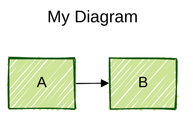

# Mermaid Diagram Syntax Rules

Comprehensive rules compiled from official Mermaid documentation (v10+).

## ⚠️ VALIDATION REQUIREMENTS

**MANDATORY: Run validation before committing any diagram changes or updates to this file.**

### Validation Checklist

Before committing changes, run ALL validation commands below:

```powershell
# 1. Check for HTML tags in diagrams (CRITICAL ERROR)
grep -n "<br/>\|<span>\|<div>" docs/diagrams/*.md

# 2. Check for double colons in text (ALWAYS BREAKS)
grep -n "::" docs/diagrams/*.md | grep -v "http://" | grep -v "https://" | grep -v "stateDiagram-v2"

# 3. Check for colons in subgraph labels (BREAKS)
grep -n "subgraph.*:.*\"" docs/diagrams/*.md

# 4. Check for unquoted forward slashes in node labels (BREAKS)
grep -n "\[\/.*\]" docs/diagrams/*.md | grep -v "\[\"\/.*\"\]"

# 5. Check for unquoted square brackets inside node labels (BREAKS)
grep -n "\[[^\"\[]*\[[^\]]*\].*\]" docs/diagrams/*.md

# 6. Check for unquoted parentheses in pie/gantt (BREAKS)
grep -n "\"[^\"]*([^)]*)\"" docs/diagrams/*.md

# 7. Check for colons in gantt task names after first colon (BREAKS)
grep -n "^[[:space:]]*[^:]*:.*:.*:" docs/diagrams/*.md | grep -v "http"

# 8. Validate all diagrams render (use Mermaid Live Editor)
# Copy each diagram to https://mermaid.live/ and verify no errors
```

### Validation Rules for MERMAID_RULES.md Itself

When adding examples to this documentation file:

1. **Complete diagrams ONLY as ```mermaid blocks**
   - Must have proper diagram type declaration (flowchart, sequenceDiagram, etc.)
   - Must be fully valid and renderable
   - Test in Mermaid Live Editor first

2. **Syntax examples as plain ``` blocks**
   - Incomplete snippets showing syntax only
   - Examples with intentional errors (BAD examples)
   - Fragments without diagram type declaration

3. **Test this file on GitHub**
   - Push and verify all diagrams render
   - GitHub treats ALL ```mermaid blocks as renderable diagrams
   - Incomplete examples will show "Unable to render" errors

### Common Validation Errors Found

Based on production issues discovered:

- **HTML tags** → Remove or replace with markdown
- **Double colons** → Remove or replace with single space
- **Colons in subgraph labels** → Remove from label text
- **Colons in sequence note text** → Keep only first colon (label separator)
- **Forward slashes unquoted** → Wrap in double quotes
- **Square brackets inside node labels** → Wrap entire label in quotes
- **Parentheses in pie/gantt labels** → Wrap entire label in quotes
- **State transition colons** → Keep only label separator colon
- **Incomplete ```mermaid examples** → Convert to plain ``` blocks

## Critical Syntax Rules

### 1. NO HTML Tags
- ❌ **NEVER use `<br/>`, `<span>`, `<div>`, or any HTML tags** in flowchart nodes
- ✅ Use simple text or markdown formatting with backticks
- Exception: `<br/>` is ONLY allowed in sequence diagrams for line breaks

### 2. Special Characters - CRITICAL

#### Colons (`:`) - Multiple Breaking Contexts
- ❌ **Colons in subgraph labels break parsing**: `subgraph "Layer 1: App"` → FAILS
- ✅ **Remove colons from subgraph labels**: `subgraph "Layer 1 App"` → WORKS
- ❌ **Double colons in text ALWAYS break**: `Status::OK` → FAILS
- ✅ **Remove double colons**: `Status OK` or `Status_OK` → WORKS
- ❌ **Colons in sequence note text after first colon**: `Note over A: Step 1: Details` → FAILS
- ✅ **Remove colons from note content**: `Note over A: Step 1 Details` → WORKS
- ✅ **Single colon separating label from text is OK**: `Note over A: Some text` → WORKS
- ✅ **Colons OK in link text**: `A -->|Status: OK| B` → WORKS

#### Square Brackets (`[]`) - Breaking in Node Labels
- ❌ **Brackets inside node text break parsing**: `NODE[Status [YES] OK]` → FAILS
- ✅ **Quote labels with nested brackets**: `NODE["Status [YES] OK"]` → WORKS
- ❌ **Multiple bracket markers unquoted**: `NODE[Doc [WARNING] Incomplete]` → FAILS
- ✅ **Quote all bracket-containing text**: `NODE["Doc [WARNING] Incomplete"]` → WORKS
- ✅ **Outer brackets define node - inner brackets need quotes**

#### Forward Slashes (`/`) - Breaking in Node Labels
- ❌ **File paths without quotes break parsing**: `DEV[/dev/i2c-1]` → FAILS
- ✅ **Quote all paths with slashes**: `DEV["/dev/i2c-1"]` → WORKS
- ❌ **URLs without quotes can break**: `NODE[http://example.com]` → FAILS
- ✅ **Quote URLs in node labels**: `NODE["http://example.com"]` → WORKS
- ✅ **Slashes in shape syntax are OK**: `A[/Parallelogram/]` → WORKS (defined shape)
- ⚠️ **Slashes in plain text or tables are OK** (not in diagram code)

#### Quotes - When Required
- ✅ **Quote text with forward slashes**: `id["/path/to/file"]`
- ✅ **Quote text with parentheses**: `id["Text with (parens)"]`
- ✅ **Quote text with square brackets**: `id["Status [YES] Complete"]`
- ✅ **Quote text with special symbols**: `id["Price: $50"]`
- ✅ Use entity codes: `#` (e.g., `#9829;` for ♥)
- ✅ For markdown: Use backticks: `` id["`**Bold** text`"] ``

#### Reserved Words
- ❌ Word "end" must be capitalized or quoted: `End`, `[end]`, `{end}`
- ❌ Starting with "o" or "x" creates special edges: `A---oB` = circle edge

### 3. Subgraph Syntax
```
subgraph id [Label Text]
    nodes...
end
```
- ✅ Must have space between id and bracket
- ❌ **NO colons in labels**: `subgraph "Layer 1: App"` → BREAKS - use `subgraph "Layer 1 App"`
- ✅ Labels can be quoted for special chars: `subgraph "System/Network"`
- ✅ Plain text labels work: `subgraph id` or `subgraph "Text Label"`

### 4. Node Labels

#### Simple text
```
id[This is text]
id(Round edges)
id{Diamond shape}
```

#### Unicode/Special characters
```
id["Unicode: ❤ works"]
id["Escaped: #9829;"]
```

#### Markdown formatting (requires config)


### 5. Line Breaks

#### Flowcharts
- ❌ NO `<br/>` tags
- ✅ Markdown formatting with newlines:
```
id["`Line 1
Line 2
Line 3`"]
```

#### Sequence Diagrams
- ✅ `<br/>` is allowed:
```
Alice->John: Hello<br/>World
```
- ✅ In participant aliases:
```
participant A as Alice<br/>Johnson
```

### 6. Links/Edges

#### Arrow types
```
-->  solid with arrow
---  solid no arrow
-.-> dotted with arrow
-.-  dotted no arrow
==>  thick with arrow
===  thick no arrow
--x  solid with cross
--o  solid with circle
<<-->> bidirectional (v11.0.0+)
```

#### Link text
```
A -->|Text on link| B
A -- Text --- B
A ---|Text| B
```

#### Edge IDs (v11.3.0+)
```
A e1@--> B
e1@{ animate: true }
```

### 7. Comments
```
%% This is a comment
%% Must start line with %%
flowchart LR
    A --> B %% inline comments NOT supported
```

### 8. Styling

#### Node styling
```
style id1 fill:#f9f,stroke:#333,stroke-width:4px
```

#### Classes
```
classDef className fill:#f9f
class nodeId className
A:::className --> B
```

#### Link styling
```
linkStyle 0 stroke:#ff3,stroke-width:4px
```

## Flowchart-Specific Rules

### Node Shapes
```
id[Rectangle]
id(Round edges)
id([Stadium])
id[[Subroutine]]
id[(Database)]
id((Circle))
id>Asymmetric]
id{Diamond}
id{{Hexagon}}
id[/Parallelogram/]
id[\Parallelogram alt\]
id[/Trapezoid\]
id[\Trapezoid alt/]
id(((Double circle)))
```

### Direction
```
flowchart TB   %% Top to Bottom
flowchart TD   %% Top-Down (same as TB)
flowchart BT   %% Bottom to Top
flowchart LR   %% Left to Right
flowchart RL   %% Right to Left
```

### Subgraph Direction


## Sequence Diagram-Specific Rules

### Participants
```
participant A as Alice
actor B as Bob
participant C@{ "type" : "boundary" }
participant D@{ "type" : "database" }
```

### Messages
```
->   solid no arrow
-->  dotted no arrow
->>  solid with arrow
-->> dotted with arrow
-x   solid with cross
--x  dotted with cross
-)   solid async
--)  dotted async
<<->> bidirectional (v11.0.0+)
```

### Activations
```
activate Alice
deactivate Alice
%% Or shorthand:
Alice->>+Bob: Message
Bob-->>-Alice: Reply
```

### Notes
```
Note right of Alice: Text
Note left of Alice: Text
Note over Alice,Bob: Text
```
- ⚠️ **CRITICAL**: Text after first colon cannot contain more colons
- ❌ **BREAKS**: `Note over A: Step 1: Initialize device` 
- ✅ **WORKS**: `Note over A: Step 1 Initialize device`
- ✅ **Single colon separating label is OK**: `Note over A: Any text here`

### Loops/Alt/Par
```
loop Every minute
    A->>B: Check
end

alt Success
    A->>B: OK
else Failure
    A->>B: Error
end

par Parallel 1
    A->>B: Task 1
and Parallel 2
    A->>C: Task 2
end
```

## State Diagram-Specific Rules

### Transitions

- ⚠️ **CRITICAL**: Transition labels after colon cannot contain more colons
- ❌ **BREAKS**: `State1 --> State2: Currently: No recovery`
- ✅ **WORKS**: `State1 --> State2: Currently No recovery`
- ✅ **Single colon for label is OK**: `State1 --> State2: Any text`

### Composite States


## Common Errors and Fixes

### Error: "Unable to render rich display"
**Causes:** 
- HTML tags like `<br/>` in flowcharts
- Colons in subgraph labels or node text
- Unquoted special characters

**Fix:**
```
%% BAD
flowchart LR
    A[Line 1<br/>Line 2]
    B["Layer 1: Application"]
    C[Status::OK]
    D[/dev/i2c-1]

%% GOOD
flowchart LR
    A["`Line 1
    Line 2`"]
    B["Layer 1 Application"]
    C[Status OK]
    D["/dev/i2c-1"]
```

### Error: "Unexpected character at offset X"
**Causes:**
- Colons in subgraph labels: `subgraph "Layer 1: App"`
- Colons after colon in sequence notes: `Note over A: Step 1: Details`
- Unquoted forward slashes: `/dev/i2c-1`

**Fix:**
```
%% BAD
subgraph "API: v2"
    node[Address: 0x68]
end
Note over A: Step 1: Initialize

%% GOOD
subgraph "API v2"
    node[Address 0x68]
end
Note over A: Step 1 Initialize
```

### Error: "Lexical error on line X. Unrecognized text"
**Causes:**
- Forward slashes without quotes: `node[/path/to/file]`
- File paths or URLs without quotes: `/dev/i2c-1`

**Fix:**
```
%% BAD
flowchart LR
    DEV[/dev/i2c-1 device]
    URL[http://example.com]

%% GOOD
flowchart LR
    DEV["/dev/i2c-1 device"]
    URL["http://example.com"]

%% GOOD
subgraph "API v2"
    node[Address 0x68]
end
```

### Error: Nodes not rendering
**Cause:** Reserved word "end" or starting with "o"/"x"

**Fix:**
```
%% BAD
A --> end
dev --> ops

%% GOOD
A --> End
dev --> Ops
```

## Configuration

### Frontmatter


### Directives


### Line Styles - Straight vs Curved

**To force straight lines instead of curved:**

#### Method 1: Frontmatter (affects entire diagram)


#### Method 2: Directive (inline)
```
%%{init: {'flowchart': {'curve': 'linear'}}}%%
flowchart LR
    A --> B --> C
```

**Curve options:**
- `linear` - Straight lines (no curves)
- `basis` - Smooth curves (default)
- `step` - Step-like connections
- `stepBefore` - Steps before nodes
- `stepAfter` - Steps after nodes

**Best practice:** Add to frontmatter at top of diagram for consistency across all connections.

## Best Practices

1. **Always test diagrams** in Mermaid Live Editor first
2. **Use semantic naming** for node IDs
3. **Keep labels concise** - use notes for details
4. **Prefer simple text** over complex formatting
5. **Comment your diagrams** with %% for complex logic
6. **Use consistent styling** with classes
7. **Validate special characters** before committing
8. **Avoid nesting** HTML or special syntax
9. **Check version compatibility** for new features
10. **Document your diagram intent** in surrounding markdown

## Validation Checklist

### Pre-Commit Diagram Validation

Run these checks BEFORE committing any Mermaid diagrams:

#### 1. Flowchart Validation
- [ ] **No HTML tags**: Search for `<br/>`, `<span>`, `<div>` in flowchart nodes
- [ ] **No unquoted paths**: Search for `/dev/`, `/sys/`, file paths without quotes
- [ ] **No unquoted brackets**: Search for `[YES]`, `[NO]`, `[WARNING]` inside node labels
- [ ] **No colons in subgraph labels**: `subgraph "Layer 1: App"` → FAILS
- [ ] **No colons in node labels**: Except in link text
- [ ] **No double colons**: `Status::OK` → FAILS
- [ ] **Quote special characters**: Parentheses, slashes, brackets, special symbols need quotes
- [ ] **Word "end" capitalized or quoted**

#### 2. Sequence Diagram Validation  
- [ ] **No colons in note text**: `Note over A: Step 1: Details` → FAILS (use `Step 1 Details`)
- [ ] **`<br/>` allowed**: Line breaks are OK in sequence diagrams
- [ ] **No double colons in messages**

#### 3. Pie Chart Validation
- [ ] **ALWAYS quote all labels**: Even simple labels like `HIGH` need quotes
- [ ] **Proper syntax**: `"Label text" : value` (always with quotes)
- [ ] **Quote labels with parentheses**: `Direct (visible) : 15` → FAILS without quotes
- [ ] **Quote labels with special chars**: Spaces, colons, symbols all need quotes

#### 4. State Diagram Validation
- [ ] **No colons in transition labels**: `State1 --> State2: Text: More` → FAILS
- [ ] **Single colon for label OK**: `State1 --> State2: Text` → WORKS
- [ ] **Same rule as sequence notes**: Text after colon cannot have more colons

#### 5. Gantt Chart Validation
- [ ] **No colons in task descriptions**: `Gap: Team leaves` → FAILS (use `Gap Team leaves`)
- [ ] **Colon delimiter required**: `Task name :milestone, crit, 2024-01, 0d` (colon after name is syntax)
- [ ] **Avoid colons before delimiter colon**: Having `Task: Name :milestone` confuses parser
- [ ] **Check dateFormat**: Must be valid format
- [ ] **Section names**: Plain text, no quotes needed

#### 5. Quadrant Chart Validation
- [ ] **Quote all data point labels**: Especially those with colons or special characters
- [ ] **Syntax**: `"Label text": [x, y]` with quotes
- [ ] **Special characters**: Unicode like `F´` needs quotes if label has colons

#### 6. Universal Checks (All Diagram Types)
- [ ] **Test in Mermaid Live Editor**: https://mermaid.live/
- [ ] **Check rendering on GitHub**: After push, verify actual rendering
- [ ] **All quotes properly closed**: Balance `"` marks
- [ ] **Comments start with `%%`**: Inline comments not supported

### Systematic Validation Commands

Run these grep searches to find potential issues:

```bash
# Find unquoted parentheses in pie charts
grep -E '^\s+[^"]*\([^)]+\)[^"]*\s*:' docs/diagrams/*.md

# Find unquoted square brackets in node labels
grep -E '^\s+[A-Z_]+\[[^\]"]*\[[^\]]*\]' docs/diagrams/*.md

# Find potential path issues (forward slashes)
grep -E '\[/dev/|\[/sys/|http://[^"]' docs/diagrams/*.md

# Find colons in subgraph labels
grep -E 'subgraph.*:' docs/diagrams/*.md

# Find double colons anywhere
grep -E '::' docs/diagrams/*.md

# Find HTML tags in flowcharts (context sensitive - check manually)
grep -E '<br/>|<span|<div' docs/diagrams/*.md

# Find sequence note colons (potential issues)
grep -E 'Note over.*:.*:' docs/diagrams/*.md

# Find gantt task names with colons before delimiter
grep -E '^\s+[^:]+:\s+[^:]+\s*:' docs/diagrams/*.md

# Find unquoted quadrant chart labels (context sensitive)
grep -A 10 'quadrantChart' docs/diagrams/*.md | grep -E '^\s+[^"]+:\s*\['
```

### Common Issues Found During Validation

1. **Parentheses without quotes** (pie charts, node labels)
   - ❌ `Direct (visible) : 15`
   - ✅ `"Direct (visible)" : 15`

2. **Square brackets without quotes** (node labels)
   - ❌ `NODE[Status [YES] Complete]`
   - ✅ `NODE["Status [YES] Complete"]`

3. **Forward slashes without quotes**
   - ❌ `DEV[/dev/i2c-1]`
   - ✅ `DEV["/dev/i2c-1"]`

4. **Colons in subgraph labels**
   - ❌ `subgraph "Layer 1: Application"`
   - ✅ `subgraph "Layer 1 Application"`

5. **Colons in sequence notes**
   - ❌ `Note over A: Step 1: Initialize`
   - ✅ `Note over A: Step 1 Initialize`

6. **Colons in state transition labels**
   - ❌ `State1 --> State2: Currently: No recovery`
   - ✅ `State1 --> State2: Currently No recovery`
   - ⚠️ Same rule as sequence notes

7. **Double colons**
   - ❌ `I2cStatus::OK`
   - ✅ `I2C_OK`

8. **Gantt task names with colons**
   - ❌ `Gap: Team leaves :milestone, crit, 2021-05, 0d`
   - ✅ `Gap Team leaves :milestone, crit, 2021-05, 0d`
   - ⚠️ Colon in task description before delimiter confuses parser

9. **Quadrant chart labels without quotes**
   - ❌ `F´ Core Docs: [0.1, 0.9]`
   - ✅ `"F´ Core Docs": [0.1, 0.9]`
   - ⚠️ Always quote data point labels, especially with colons or special chars

## Resources

- [Official Mermaid Docs](https://mermaid.js.org/)
- [Flowchart Syntax](https://mermaid.js.org/syntax/flowchart.html)
- [Sequence Diagram Syntax](https://mermaid.js.org/syntax/sequenceDiagram.html)
- [Mermaid Live Editor](https://mermaid.live/)

---

**Version:** Based on Mermaid v10+ (GitHub rendering)
**Last Updated:** December 28, 2024
