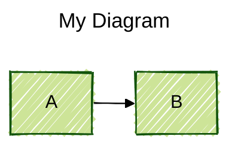

# Mermaid Diagram Syntax Rules

Comprehensive rules compiled from official Mermaid documentation (v10+).

## 🎨 ACTIVE THEME CONFIGURATION

**Current Active Theme: SPRING** (default)

To change the active theme, update the "Current Active Theme" line above to one of:
- SPRING (default) - Fresh greens, soft pinks, pale yellows
- SUMMER - Sky blues, sunny yellows, warm corals
- FALL - Burnt oranges, deep purples, golden yellows
- WINTER - Ice blues, slate greys, pale cyans

**To apply a theme to your diagrams:**
1. Scroll to the "Seasonal Theme Presets" section below
2. Copy the YAML frontmatter for your chosen theme
3. Paste it at the top of your mermaid code block
4. Replace any existing frontmatter (only one per diagram)

See "Seasonal Theme Presets" section below for complete copy-paste configurations.

## ⚠️ VALIDATION REQUIREMENTS

**MANDATORY: Run validation before committing any diagram changes or updates to this file.**

### Validation Checklist

Before committing changes, run ALL validation commands below:

```powershell
# 1. Check for HTML tags in diagrams (CRITICAL ERROR)
grep -n "<br/>\|<span>\|<div>" docs/diagrams/*.md

# 2. Check for double colons in text (ALWAYS BREAKS)
grep -n "::" docs/diagrams/*.md | grep -v "http://" | grep -v "https://" | grep -v "stateDiagram-v2"

# 3. Check for colons in subgraph labels (BREAKS)
grep -n "subgraph.*:.*\"" docs/diagrams/*.md

# 4. Check for unquoted forward slashes in node labels (BREAKS)
grep -n "\[\/.*\]" docs/diagrams/*.md | grep -v "\[\"\/.*\"\]"

# 5. Check for unquoted square brackets inside node labels (BREAKS)
grep -n "\[[^\"\[]*\[[^\]]*\].*\]" docs/diagrams/*.md

# 6. Check for unquoted parentheses in pie/gantt (BREAKS)
grep -n "\"[^\"]*([^)]*)\"" docs/diagrams/*.md

# 7. Check for colons in gantt task names after first colon (BREAKS)
grep -n "^[[:space:]]*[^:]*:.*:.*:" docs/diagrams/*.md | grep -v "http"

# 8. Validate all diagrams render (use Mermaid Live Editor)
# Copy each diagram to https://mermaid.live/ and verify no errors
```

### Validation Rules for MERMAID_RULES.md Itself

When adding examples to this documentation file:

1. **Complete diagrams ONLY as ```mermaid blocks**
   - Must have proper diagram type declaration (flowchart, sequenceDiagram, etc.)
   - Must be fully valid and renderable
   - Test in Mermaid Live Editor first

2. **Syntax examples as plain ``` blocks**
   - Incomplete snippets showing syntax only
   - Examples with intentional errors (BAD examples)
   - Fragments without diagram type declaration

3. **Test this file on GitHub**
   - Push and verify all diagrams render
   - GitHub treats ALL ```mermaid blocks as renderable diagrams
   - Incomplete examples will show "Unable to render" errors

### Common Validation Errors Found

Based on production issues discovered:

- **HTML tags** → Remove or replace with markdown
- **Double colons** → Remove or replace with single space
- **Colons in subgraph labels** → Remove from label text
- **Colons in sequence note text** → Keep only first colon (label separator)
- **Forward slashes unquoted** → Wrap in double quotes
- **Square brackets inside node labels** → Wrap entire label in quotes
- **Parentheses in pie/gantt labels** → Wrap entire label in quotes
- **State transition colons** → Keep only label separator colon
- **Incomplete ```mermaid examples** → Convert to plain ``` blocks

## Critical Syntax Rules

### 1. NO HTML Tags
- ❌ **NEVER use `<br/>`, `<span>`, `<div>`, or any HTML tags** in flowchart nodes
- ✅ Use simple text or markdown formatting with backticks
- Exception: `<br/>` is ONLY allowed in sequence diagrams for line breaks

### 2. Special Characters - CRITICAL

#### Colons (`:`) - Multiple Breaking Contexts
- ❌ **Colons in subgraph labels break parsing**: `subgraph "Layer 1: App"` → FAILS
- ✅ **Remove colons from subgraph labels**: `subgraph "Layer 1 App"` → WORKS
- ❌ **Double colons in text ALWAYS break**: `Status::OK` → FAILS
- ✅ **Remove double colons**: `Status OK` or `Status_OK` → WORKS
- ❌ **Colons in sequence note text after first colon**: `Note over A: Step 1: Details` → FAILS
- ✅ **Remove colons from note content**: `Note over A: Step 1 Details` → WORKS
- ✅ **Single colon separating label from text is OK**: `Note over A: Some text` → WORKS
- ✅ **Colons OK in link text**: `A -->|Status: OK| B` → WORKS

#### Square Brackets (`[]`) - Breaking in Node Labels
- ❌ **Brackets inside node text break parsing**: `NODE[Status [YES] OK]` → FAILS
- ✅ **Quote labels with nested brackets**: `NODE["Status [YES] OK"]` → WORKS
- ❌ **Multiple bracket markers unquoted**: `NODE[Doc [WARNING] Incomplete]` → FAILS
- ✅ **Quote all bracket-containing text**: `NODE["Doc [WARNING] Incomplete"]` → WORKS
- ✅ **Outer brackets define node - inner brackets need quotes**

#### Forward Slashes (`/`) - Breaking in Node Labels
- ❌ **File paths without quotes break parsing**: `DEV[/dev/i2c-1]` → FAILS
- ✅ **Quote all paths with slashes**: `DEV["/dev/i2c-1"]` → WORKS
- ❌ **URLs without quotes can break**: `NODE[http://example.com]` → FAILS
- ✅ **Quote URLs in node labels**: `NODE["http://example.com"]` → WORKS
- ✅ **Slashes in shape syntax are OK**: `A[/Parallelogram/]` → WORKS (defined shape)
- ⚠️ **Slashes in plain text or tables are OK** (not in diagram code)

#### Quotes - When Required
- ✅ **Quote text with forward slashes**: `id["/path/to/file"]`
- ✅ **Quote text with parentheses**: `id["Text with (parens)"]`
- ✅ **Quote text with square brackets**: `id["Status [YES] Complete"]`
- ✅ **Quote text with special symbols**: `id["Price: $50"]`
- ✅ Use entity codes: `#` (e.g., `#9829;` for ♥)
- ✅ For markdown: Use backticks: `` id["`**Bold** text`"] ``

#### Reserved Words
- ❌ Word "end" must be capitalized or quoted: `End`, `[end]`, `{end}`
- ❌ Starting with "o" or "x" creates special edges: `A---oB` = circle edge

### 3. Subgraph Syntax
```
subgraph id [Label Text]
    nodes...
end
```
- ✅ Must have space between id and bracket
- ❌ **NO colons in labels**: `subgraph "Layer 1: App"` → BREAKS - use `subgraph "Layer 1 App"`
- ✅ Labels can be quoted for special chars: `subgraph "System/Network"`
- ✅ Plain text labels work: `subgraph id` or `subgraph "Text Label"`

### 4. Node Labels

#### Simple text
```
id[This is text]
id(Round edges)
id{Diamond shape}
```

#### Unicode/Special characters
```
id["Unicode: ❤ works"]
id["Escaped: #9829;"]
```

#### Markdown formatting (requires config)


### 5. Line Breaks

#### Flowcharts
- ❌ NO `<br/>` tags
- ✅ Markdown formatting with newlines:
```
id["`Line 1
Line 2
Line 3`"]
```

#### Sequence Diagrams
- ✅ `<br/>` is allowed:
```
Alice->John: Hello<br/>World
```
- ✅ In participant aliases:
```
participant A as Alice<br/>Johnson
```

### 6. Links/Edges

#### Arrow types
```
-->  solid with arrow
---  solid no arrow
-.-> dotted with arrow
-.-  dotted no arrow
==>  thick with arrow
===  thick no arrow
--x  solid with cross
--o  solid with circle
<<-->> bidirectional (v11.0.0+)
```

#### Link text
```
A -->|Text on link| B
A -- Text --- B
A ---|Text| B
```

#### Edge IDs (v11.3.0+)
```
A e1@--> B
e1@{ animate: true }
```

### 7. Comments
```
%% This is a comment
%% Must start line with %%
flowchart LR
    A --> B %% inline comments NOT supported
```

### 8. Styling

#### Node styling
```
style id1 fill:#f9f,stroke:#333,stroke-width:4px
```

#### Classes
```
classDef className fill:#f9f
class nodeId className
A:::className --> B
```

#### Link styling
```
linkStyle 0 stroke:#ff3,stroke-width:4px
```

## Theme Variables Reference

Complete reference of all available Mermaid theme variables. Use these to create custom themes or modify the seasonal presets above.

Mermaid supports extensive theming through `themeVariables` in the init directive. Only the `base` theme is fully customizable.

### Usage Syntax
```
%%{init: {'theme':'base', 'themeVariables': {'primaryColor':'#ff0000', 'lineColor':'#333'}}}%%
```

### Base Theme Variables

#### Core Colors
- `background` - Diagram background color (default: `#f4f4f4`)
- `primaryColor` - Primary color for nodes and elements (default: `#fff4dd`)
- `secondaryColor` - Secondary color, auto-calculated from primary
- `tertiaryColor` - Tertiary color, auto-calculated from primary
- `primaryTextColor` - Text color in primary elements (default: calculated from darkMode)
- `secondaryTextColor` - Text color in secondary elements (auto-calculated)
- `tertiaryTextColor` - Text color in tertiary elements (auto-calculated)
- `primaryBorderColor` - Border color for primary elements (auto-calculated)
- `secondaryBorderColor` - Border color for secondary elements (auto-calculated)
- `tertiaryBorderColor` - Border color for tertiary elements (auto-calculated)

#### Text and Lines
- `textColor` - General text color (default: same as primaryTextColor)
- `lineColor` - Line and connection color (auto-calculated from background)
- `arrowheadColor` - Color of arrow heads (auto-calculated from background)
- `fontFamily` - Font family for diagram text (default: `"trebuchet ms", verdana, arial, sans-serif`)

**Font Size Configuration:**
- **Global `fontSize`** (config level): Controls overall diagram font size for certain diagram types (default: `16`, recommend `18`)
  - Place at config level: `config: { fontSize: 18, themeVariables: {...} }`
- **Theme `fontSize`** (themeVariables level): Theme-specific font styling
  - Place in themeVariables: `themeVariables: { fontSize: '18px' }`
- **⚠️ FLOWCHART NODE TEXT:** The above fontSize settings do NOT control flowchart node text!
  - Flowchart node text size is controlled by CSS classes
  - Use `themeCSS` to override node styling
  - **themeCSS Examples:**
    ```yaml
    config:
      theme: base
      fontSize: 18
      themeCSS: |
        # Font sizes - use multiple selectors for complete coverage
        .label, .nodeLabel, text { font-size: 18px !important; }
        .edgeLabel { font-size: 16px !important; }
        
        # Edge label borders - .label-container is the actual wrapper
        .edgeLabel .label-container rect, .edgeLabel rect, .label-container rect { 
          stroke: #000 !important; 
          stroke-width: 1.5px !important; 
          fill-opacity: 1 !important; 
        }
        
        # Hover effects for interactivity
        .node:hover rect, .node:hover circle, .node:hover polygon { 
          stroke-width: 3px !important; 
          filter: drop-shadow(0 0 8px rgba(0,0,0,0.3)); 
          cursor: pointer; 
        }
        .edgePath:hover path { stroke-width: 3px !important; opacity: 1; }
        .edgeLabel:hover rect, .edgeLabel:hover .label-container rect { 
          stroke-width: 2.5px !important; 
          filter: brightness(1.1); 
        }
      themeVariables:
        fontSize: '18px'
    ```

**themeCSS Capabilities:**
- Override any Mermaid CSS styling (font sizes, colors, borders)
- Add features not in theme variables (edge label borders, shadows)
- Add interactive hover effects (`:hover` pseudo-classes work)
- Use any valid CSS including filters, transforms, animations
- Always use `!important` to override Mermaid defaults

**Important CSS Selectors:**
- `.label`, `.nodeLabel`, `text` - Node text (use all three for complete coverage)
- `.edgeLabel .label-container rect` - Edge label background box (primary target)
- `.edgeLabel rect`, `.label-container rect` - Alternative edge label selectors
- `.node:hover` - Node hover states
- `.edgePath` - Connection lines between nodes

#### Notes and Labels
- `noteBkgColor` - Background color for note boxes (default: `#fff5ad`)
- `noteTextColor` - Text color in notes (default: `#333`)
- `noteBorderColor` - Border color for notes (auto-calculated)
- `labelColor` - Label text color
- `labelBackgroundColor` - Background for labels
- `labelTextColor` - Text color in labels

#### Error Styling
- `errorBkgColor` - Background for syntax error messages
- `errorTextColor` - Text color for error messages

### Flowchart Variables
- `nodeBkg` - Node background color (default: same as mainBkg)
- `mainBkg` - Main background for nodes (default: same as primaryColor)
- `nodeBorder` - Node border color (default: same as primaryBorderColor)
- `nodeTextColor` - Text color inside nodes
- `clusterBkg` - Background for subgraphs/clusters (default: same as tertiaryColor)
- `clusterBorder` - Border for subgraphs (default: same as tertiaryBorderColor)
- `defaultLinkColor` - Default link/edge color (default: same as lineColor)
- `titleColor` - Title text color (default: same as tertiaryTextColor)
- `edgeLabelBackground` - Background color of edge labels (auto-calculated from secondaryColor)
  - **Note:** No theme variable for edge label borders or hover effects. Use `themeCSS` with proper selectors:
    ```css
    /* Edge labels use .label-container rect as the primary wrapper */
    .edgeLabel .label-container rect, .edgeLabel rect, .label-container rect { 
      stroke: #000 !important; 
      stroke-width: 1.5px !important; 
      fill-opacity: 1 !important; 
    }
    
    /* Hover effect for edge labels */
    .edgeLabel:hover rect, .edgeLabel:hover .label-container rect { 
      stroke-width: 2.5px !important; 
      filter: brightness(1.1); 
    }
    ```
- `border2` - Alternative border color

### Sequence Diagram Variables
- `actorBkg` - Actor box background (default: same as mainBkg)
- `actorBorder` - Actor box border (default: same as primaryBorderColor)
- `actorTextColor` - Text in actor boxes (default: same as primaryTextColor)
- `actorLineColor` - Actor lifeline color (default: same as actorBorder)
- `signalColor` - Signal/message line color (default: same as textColor)
- `signalTextColor` - Text on signals (default: same as textColor)
- `labelBoxBkgColor` - Background for label boxes (default: same as actorBkg)
- `labelBoxBorderColor` - Border for label boxes (default: same as actorBorder)
- `loopTextColor` - Text in loop boxes (default: same as actorTextColor)
- `activationBorderColor` - Border of activation boxes (auto-calculated)
- `activationBkgColor` - Background of activation boxes (default: same as secondaryColor)
- `sequenceNumberColor` - Color of sequence numbers (auto-calculated)

### State Diagram Variables
- `stateBkg` - State box background (default: same as mainBkg)
- `compositeBackground` - Background for composite states (default: background or tertiaryColor)
- `altBackground` - Alternative background for deep composite states (default: same as tertiaryColor)
- `compositeTitleBackground` - Title background in composite states (default: same as mainBkg)
- `compositeBorder` - Border for composite states (default: same as nodeBorder)
- `innerEndBackground` - Background for inner end states
- `transitionColor` - Color of state transitions (default: same as lineColor)
- `specialStateColor` - Color for special states (default: same as lineColor)

### Gantt Diagram Variables
- `sectionBkgColor` - Section background color (default: same as tertiaryColor)
- `altSectionBkgColor` - Alternate section background (default: `white`)
- `sectionBkgColor2` - Second section background (default: same as primaryColor)
- `excludeBkgColor` - Background for excluded periods (default: `#eeeeee`)
- `taskBorderColor` - Task box border (default: same as primaryBorderColor)
- `taskBkgColor` - Task box background (default: same as primaryColor)
- `activeTaskBorderColor` - Active task border (default: same as primaryColor)
- `activeTaskBkgColor` - Active task background (auto-calculated)
- `gridColor` - Grid line color (default: `lightgrey`)
- `doneTaskBkgColor` - Completed task background (default: `lightgrey`)
- `doneTaskBorderColor` - Completed task border (default: `grey`)
- `critBorderColor` - Critical task border (default: `#ff8888`)
- `critBkgColor` - Critical task background (default: `red`)
- `todayLineColor` - Today marker line color (default: `red`)
- `vertLineColor` - Vertical line color (default: `navy`)
- `taskTextColor` - Text color in tasks (default: same as textColor)
- `taskTextOutsideColor` - Text outside task boxes (default: same as textColor)
- `taskTextLightColor` - Light task text (default: same as textColor)
- `taskTextDarkColor` - Dark task text (default: same as textColor)
- `taskTextClickableColor` - Clickable task text color (default: `#003163`)

### Class Diagram Variables
- `classText` - Text color in class boxes (default: same as textColor)

### Pie Chart Variables
- `pie1` through `pie12` - Fill colors for pie sections (defaults: various calculated colors)
- `pieTitleTextSize` - Title text size (default: `25px`)
- `pieTitleTextColor` - Title text color
- `pieSectionTextSize` - Section label text size (default: `17px`)
- `pieSectionTextColor` - Section label text color (default: same as textColor)
- `pieLegendTextSize` - Legend text size (default: `17px`)
- `pieLegendTextColor` - Legend text color
- `pieStrokeColor` - Pie section border color (default: `black`)
- `pieStrokeWidth` - Pie section border width (default: `2px`)
- `pieOuterStrokeWidth` - Outer circle border width (default: `2px`)
- `pieOuterStrokeColor` - Outer circle border color (default: `black`)
- `pieOpacity` - Section opacity (default: `0.7`)

### Quadrant Chart Variables
- `quadrant1Fill` through `quadrant4Fill` - Fill colors for quadrants
- `quadrant1TextFill` through `quadrant4TextFill` - Text colors in quadrants
- `quadrantPointFill` - Point fill color
- `quadrantPointTextFill` - Point label text color
- `quadrantXAxisTextFill` - X-axis label text color
- `quadrantYAxisTextFill` - Y-axis label text color
- `quadrantInternalBorderStrokeFill` - Internal border color
- `quadrantExternalBorderStrokeFill` - External border color
- `quadrantTitleFill` - Quadrant title text color

### XY Chart Variables
`xyChart` is an object containing:
- `backgroundColor` - Chart background
- `titleColor` - Chart title color
- `xAxisTitleColor` - X-axis title color
- `xAxisLabelColor` - X-axis label color
- `xAxisTickColor` - X-axis tick color
- `xAxisLineColor` - X-axis line color
- `yAxisTitleColor` - Y-axis title color
- `yAxisLabelColor` - Y-axis label color
- `yAxisTickColor` - Y-axis tick color
- `yAxisLineColor` - Y-axis line color
- `plotColorPalette` - Comma-separated color list for data series

### Requirement Diagram Variables
- `requirementBackground` - Requirement box background (default: same as primaryColor)
- `requirementBorderColor` - Requirement box border (default: same as primaryBorderColor)
- `requirementBorderSize` - Border width (default: `1`)
- `requirementTextColor` - Text in requirement boxes (default: same as primaryTextColor)
- `relationColor` - Relation line color (default: same as lineColor)
- `relationLabelBackground` - Relation label background (auto-calculated from secondaryColor)
- `relationLabelColor` - Relation label text color (default: same as actorTextColor)

### Git Graph Variables
- `git0` through `git7` - Branch colors (calculated from primary/secondary/tertiary)
- `gitInv0` through `gitInv7` - Inverted branch colors
- `gitBranchLabel0` through `gitBranchLabel7` - Branch label text colors
- `commitLabelColor` - Commit label text color
- `commitLabelBackground` - Commit label background (default: same as secondaryColor)
- `commitLabelFontSize` - Commit label font size (default: `10px`)
- `tagLabelColor` - Tag label text color
- `tagLabelBackground` - Tag label background (default: same as primaryColor)
- `tagLabelBorder` - Tag border color (default: same as primaryBorderColor)
- `tagLabelFontSize` - Tag label font size

### Color Scale Variables (for general use)
- `cScale0` through `cScale11` - Base color scale (12 colors)
- `cScaleInv0` through `cScaleInv11` - Inverted color scale
- `cScalePeer0` through `cScalePeer11` - Peer colors for borders
- `cScaleLabel0` through `cScaleLabel11` - Label text colors for color scale
- `scaleLabelColor` - Default scale label color (default: same as labelTextColor)

### Surface Colors (for layered elements)
- `surface0` through `surface4` - Surface background colors (5 levels)
- `surfacePeer0` through `surfacePeer4` - Peer/border colors for surfaces

### User Journey / Timeline Variables
- `fillType0` through `fillType7` - Section fill colors
- `actorColours` - Array of actor colors
- `sectionFills` - Array of section fill colors
- `sectionColours` - Array of section text colors

### Entity-Relationship Diagram Variables
- `attributeBackgroundColorOdd` - Background for odd attribute rows
- `attributeBackgroundColorEven` - Background for even attribute rows

### darkMode Flag
- `darkMode` (boolean) - Affects color calculations (default: `false`)

## 🎨 Seasonal Theme Presets

**ACTIVE THEME: SPRING** (default)

These are complete, ready-to-use theme configurations. Copy the frontmatter for your chosen theme and paste it at the top of any mermaid code block.

### SPRING Theme (Fresh & Vibrant)

**Color Palette:**
- Primary: Fresh green (#E8F5E9, #4CAF50, #66BB6A)
- Secondary: Soft pink (#FCE4EC, #F06292)
- Tertiary: Pale yellow (#FFF9C4, #FDD835)
- Text: Forest green (#2E7D32)
- Background: Light mint (#F1F8E9)

**Copy this frontmatter to use Spring theme:**
```yaml
---
config:
  theme: base
  fontSize: 18
  themeCSS: |
    .label, .nodeLabel, text { font-size: 18px !important; }
    .edgeLabel { font-size: 16px !important; }
    .edgeLabel .label-container rect, .edgeLabel rect, .label-container rect { stroke: #000 !important; stroke-width: 1.5px !important; fill-opacity: 1 !important; }
    .node:hover rect, .node:hover circle, .node:hover polygon { stroke-width: 3px !important; filter: drop-shadow(0 0 8px rgba(0,0,0,0.3)); cursor: pointer; }
    .edgePath:hover path { stroke-width: 3px !important; opacity: 1; }
    .edgeLabel:hover rect, .edgeLabel:hover .label-container rect { stroke-width: 2.5px !important; filter: brightness(1.1); }
  themeVariables:
    primaryColor: '#E8F5E9'
    secondaryColor: '#FCE4EC'
    tertiaryColor: '#FFF9C4'
    primaryTextColor: '#2E7D32'
    secondaryTextColor: '#C2185B'
    tertiaryTextColor: '#F57C00'
    primaryBorderColor: '#4CAF50'
    secondaryBorderColor: '#F06292'
    tertiaryBorderColor: '#FDD835'
    background: '#F1F8E9'
    textColor: '#2E7D32'
    lineColor: '#66BB6A'
    fontFamily: '"Segoe UI", Tahoma, Geneva, Verdana, sans-serif'
    fontSize: '18px'
    nodeBorder: '#4CAF50'
    mainBkg: '#E8F5E9'
    clusterBkg: '#FFF9C4'
    clusterBorder: '#FDD835'
    edgeLabelBackground: '#FCE4EC'
    actorBkg: '#E8F5E9'
    actorBorder: '#4CAF50'
    actorTextColor: '#2E7D32'
    signalColor: '#66BB6A'
    signalTextColor: '#2E7D32'
    labelBoxBkgColor: '#FCE4EC'
    noteBkgColor: '#FFF9C4'
    noteTextColor: '#F57C00'
    noteBorderColor: '#FDD835'
    pie1: '#4CAF50'
    pie2: '#F06292'
    pie3: '#FDD835'
    pie4: '#66BB6A'
    pie5: '#E91E63'
    pie6: '#FFEB3B'
    pie7: '#81C784'
    pie8: '#F48FB1'
    pie9: '#FFF176'
    pie10: '#A5D6A7'
    pie11: '#FCE4EC'
    pie12: '#FFF9C4'
  flowchart:
    curve: linear
---
```

### SUMMER Theme (Bright & Warm)

**Color Palette:**
- Primary: Sky blue (#E1F5FE, #0288D1, #29B6F6)
- Secondary: Sunny yellow (#FFF9C4, #FDD835)
- Tertiary: Warm coral (#FFE0B2, #FF9800)
- Text: Ocean blue (#01579B)
- Background: Pale sky (#E3F2FD)

**Copy this frontmatter to use Summer theme:**
```yaml
---
config:
  theme: base
  fontSize: 18
  themeCSS: |
    .label, .nodeLabel, text { font-size: 18px !important; }
    .edgeLabel { font-size: 16px !important; }
    .edgeLabel .label-container rect, .edgeLabel rect, .label-container rect { stroke: #000 !important; stroke-width: 1.5px !important; fill-opacity: 1 !important; }
    .node:hover rect, .node:hover circle, .node:hover polygon { stroke-width: 3px !important; filter: drop-shadow(0 0 8px rgba(0,0,0,0.3)); cursor: pointer; }
    .edgePath:hover path { stroke-width: 3px !important; opacity: 1; }
    .edgeLabel:hover rect, .edgeLabel:hover .label-container rect { stroke-width: 2.5px !important; filter: brightness(1.1); }
  themeVariables:
    primaryColor: '#E1F5FE'
    secondaryColor: '#FFF9C4'
    tertiaryColor: '#FFE0B2'
    primaryTextColor: '#01579B'
    secondaryTextColor: '#F57F17'
    tertiaryTextColor: '#E65100'
    primaryBorderColor: '#0288D1'
    secondaryBorderColor: '#FDD835'
    tertiaryBorderColor: '#FF9800'
    background: '#E3F2FD'
    textColor: '#01579B'
    lineColor: '#29B6F6'
    fontFamily: '"Segoe UI", Tahoma, Geneva, Verdana, sans-serif'
    fontSize: '18px'
    nodeBorder: '#0288D1'
    mainBkg: '#E1F5FE'
    clusterBkg: '#FFE0B2'
    clusterBorder: '#FF9800'
    edgeLabelBackground: '#FFF9C4'
    actorBkg: '#E1F5FE'
    actorBorder: '#0288D1'
    actorTextColor: '#01579B'
    signalColor: '#29B6F6'
    signalTextColor: '#01579B'
    labelBoxBkgColor: '#FFF9C4'
    noteBkgColor: '#FFE0B2'
    noteTextColor: '#E65100'
    noteBorderColor: '#FF9800'
    pie1: '#0288D1'
    pie2: '#FDD835'
    pie3: '#FF9800'
    pie4: '#29B6F6'
    pie5: '#FFEB3B'
    pie6: '#FFB74D'
    pie7: '#4FC3F7'
    pie8: '#FFF176'
    pie9: '#FF8A65'
    pie10: '#81D4FA'
    pie11: '#FFF9C4'
    pie12: '#FFE0B2'
  flowchart:
    curve: linear
---
```

### FALL Theme (Rich & Earthy)

**Color Palette:**
- Primary: Burnt orange (#FFF3E0, #FF6F00, #FF9800)
- Secondary: Deep purple (#F3E5F5, #9C27B0)
- Tertiary: Golden yellow (#FBC02D)
- Text: Chocolate brown (#5D4037)
- Background: Warm cream (#FFF8E1)

**Copy this frontmatter to use Fall theme:**
```yaml
---
config:
  theme: base
  fontSize: 18
  themeCSS: |
    .label, .nodeLabel, text { font-size: 18px !important; }
    .edgeLabel { font-size: 16px !important; }
    .edgeLabel .label-container rect, .edgeLabel rect, .label-container rect { stroke: #000 !important; stroke-width: 1.5px !important; fill-opacity: 1 !important; }
    .node:hover rect, .node:hover circle, .node:hover polygon { stroke-width: 3px !important; filter: drop-shadow(0 0 8px rgba(0,0,0,0.3)); cursor: pointer; }
    .edgePath:hover path { stroke-width: 3px !important; opacity: 1; }
    .edgeLabel:hover rect, .edgeLabel:hover .label-container rect { stroke-width: 2.5px !important; filter: brightness(1.1); }
  themeVariables:
    primaryColor: '#FFF3E0'
    secondaryColor: '#F3E5F5'
    tertiaryColor: '#FFF8E1'
    primaryTextColor: '#5D4037'
    secondaryTextColor: '#4A148C'
    tertiaryTextColor: '#F57F17'
    primaryBorderColor: '#FF6F00'
    secondaryBorderColor: '#9C27B0'
    tertiaryBorderColor: '#FBC02D'
    background: '#FFF8E1'
    textColor: '#5D4037'
    lineColor: '#FF9800'
    fontFamily: '"Segoe UI", Tahoma, Geneva, Verdana, sans-serif'
    fontSize: '18px'
    nodeBorder: '#FF6F00'
    mainBkg: '#FFF3E0'
    clusterBkg: '#F3E5F5'
    clusterBorder: '#9C27B0'
    edgeLabelBackground: '#FFF8E1'
    actorBkg: '#FFF3E0'
    actorBorder: '#FF6F00'
    actorTextColor: '#5D4037'
    signalColor: '#FF9800'
    signalTextColor: '#5D4037'
    labelBoxBkgColor: '#F3E5F5'
    noteBkgColor: '#FFF8E1'
    noteTextColor: '#F57F17'
    noteBorderColor: '#FBC02D'
    pie1: '#FF6F00'
    pie2: '#9C27B0'
    pie3: '#FBC02D'
    pie4: '#FF9800'
    pie5: '#BA68C8'
    pie6: '#FFD54F'
    pie7: '#FFB74D'
    pie8: '#CE93D8'
    pie9: '#FFF176'
    pie10: '#FF8A65'
    pie11: '#F3E5F5'
    pie12: '#FFF8E1'
  flowchart:
    curve: linear
---
```

### WINTER Theme (Cool & Crisp)

**Color Palette:**
- Primary: Ice blue (#E3F2FD, #1976D2, #42A5F5)
- Secondary: Slate grey (#ECEFF1, #78909C)
- Tertiary: Pale cyan (#E1F5FE, #26C6DA)
- Text: Deep navy (#0D47A1)
- Background: Snow white (#FAFAFA)

**Copy this frontmatter to use Winter theme:**
```yaml
---
config:
  theme: base
  fontSize: 18
  themeCSS: |
    .label, .nodeLabel, text { font-size: 18px !important; }
    .edgeLabel { font-size: 16px !important; }
    .edgeLabel .label-container rect, .edgeLabel rect, .label-container rect { stroke: #000 !important; stroke-width: 1.5px !important; fill-opacity: 1 !important; }
    .node:hover rect, .node:hover circle, .node:hover polygon { stroke-width: 3px !important; filter: drop-shadow(0 0 8px rgba(0,0,0,0.3)); cursor: pointer; }
    .edgePath:hover path { stroke-width: 3px !important; opacity: 1; }
    .edgeLabel:hover rect, .edgeLabel:hover .label-container rect { stroke-width: 2.5px !important; filter: brightness(1.1); }
  themeVariables:
    primaryColor: '#E3F2FD'
    secondaryColor: '#ECEFF1'
    tertiaryColor: '#E1F5FE'
    primaryTextColor: '#0D47A1'
    secondaryTextColor: '#37474F'
    tertiaryTextColor: '#006064'
    primaryBorderColor: '#1976D2'
    secondaryBorderColor: '#78909C'
    tertiaryBorderColor: '#26C6DA'
    background: '#FAFAFA'
    textColor: '#0D47A1'
    lineColor: '#42A5F5'
    fontFamily: '"Segoe UI", Tahoma, Geneva, Verdana, sans-serif'
    fontSize: '18px'
    nodeBorder: '#1976D2'
    mainBkg: '#E3F2FD'
    clusterBkg: '#ECEFF1'
    clusterBorder: '#78909C'
    edgeLabelBackground: '#E1F5FE'
    actorBkg: '#E3F2FD'
    actorBorder: '#1976D2'
    actorTextColor: '#0D47A1'
    signalColor: '#42A5F5'
    signalTextColor: '#0D47A1'
    labelBoxBkgColor: '#ECEFF1'
    noteBkgColor: '#E1F5FE'
    noteTextColor: '#006064'
    noteBorderColor: '#26C6DA'
    pie1: '#1976D2'
    pie2: '#78909C'
    pie3: '#26C6DA'
    pie4: '#42A5F5'
    pie5: '#90A4AE'
    pie6: '#4DD0E1'
    pie7: '#64B5F6'
    pie8: '#B0BEC5'
    pie9: '#80DEEA'
    pie10: '#90CAF9'
    pie11: '#ECEFF1'
    pie12: '#E1F5FE'
  flowchart:
    curve: linear
---
```

### How to Apply Themes

1. **Choose your theme** from the four options above (Spring, Summer, Fall, or Winter)
2. **Copy the entire YAML frontmatter block** (from `---` to `---`)
3. **Open your diagram file** (e.g., `docs/diagrams/overview.md`)
4. **Paste at the top of each mermaid block:**
   ```markdown
   ```mermaid
   ---
   config:
     theme: base
     themeVariables:
       primaryColor: '#E8F5E9'
       ... (all theme variables)
   ---
   flowchart LR
       A --> B
   ```
   ```
5. **Replace any existing frontmatter** - only one frontmatter block per diagram
6. **Test in Mermaid Live Editor** before committing

### Theme Switching Guidelines

- **Consistency**: Use the same theme across all diagrams in a document
- **Context**: Match theme to document purpose (Spring for growth/nature topics, Winter for technical/formal docs)
- **Accessibility**: All themes meet WCAG contrast requirements
- **Validation**: Run validation checklist after applying any theme

### Custom CSS Styling (GitHub Pages Only)

**Note:** Arrow label borders and hover effects require CSS in `docs/_sass/custom.scss` and only work on GitHub Pages (phantom-man.github.io/PROVES_LIBRARY), NOT on GitHub.com.

GitHub.com renders Mermaid server-side without custom CSS. To add borders to arrow labels:
- Use custom CSS on GitHub Pages deployment
- View diagrams on GitHub Pages for full styling (borders, hover effects)
- On GitHub.com, only `edgeLabelBackground` theme variable works

## Theme Variables Reference
```
%%{init: {'theme':'base', 'themeVariables': {
  'primaryColor':'#BB2528',
  'primaryTextColor':'#fff',
  'primaryBorderColor':'#7C0000',
  'lineColor':'#F8B229',
  'secondaryColor':'#006100',
  'tertiaryColor':'#fff',
  'fontFamily':'Arial, sans-serif',
  'fontSize':'14px',
  'edgeLabelBackground':'#ffeecc'
}}}%%
flowchart TD
    A --> B
```

## Flowchart-Specific Rules

### Node Shapes
```
id[Rectangle]
id(Round edges)
id([Stadium])
id[[Subroutine]]
id[(Database)]
id((Circle))
id>Asymmetric]
id{Diamond}
id{{Hexagon}}
id[/Parallelogram/]
id[\Parallelogram alt\]
id[/Trapezoid\]
id[\Trapezoid alt/]
id(((Double circle)))
```

### Direction
```
flowchart TB   %% Top to Bottom
flowchart TD   %% Top-Down (same as TB)
flowchart BT   %% Bottom to Top
flowchart LR   %% Left to Right
flowchart RL   %% Right to Left
```

### Subgraph Direction


## Sequence Diagram-Specific Rules

### Participants
```
participant A as Alice
actor B as Bob
participant C@{ "type" : "boundary" }
participant D@{ "type" : "database" }
```

### Messages
```
->   solid no arrow
-->  dotted no arrow
->>  solid with arrow
-->> dotted with arrow
-x   solid with cross
--x  dotted with cross
-)   solid async
--)  dotted async
<<->> bidirectional (v11.0.0+)
```

### Activations
```
activate Alice
deactivate Alice
%% Or shorthand:
Alice->>+Bob: Message
Bob-->>-Alice: Reply
```

### Notes
```
Note right of Alice: Text
Note left of Alice: Text
Note over Alice,Bob: Text
```
- ⚠️ **CRITICAL**: Text after first colon cannot contain more colons
- ❌ **BREAKS**: `Note over A: Step 1: Initialize device` 
- ✅ **WORKS**: `Note over A: Step 1 Initialize device`
- ✅ **Single colon separating label is OK**: `Note over A: Any text here`

### Loops/Alt/Par
```
loop Every minute
    A->>B: Check
end

alt Success
    A->>B: OK
else Failure
    A->>B: Error
end

par Parallel 1
    A->>B: Task 1
and Parallel 2
    A->>C: Task 2
end
```

## State Diagram-Specific Rules

### Transitions

- ⚠️ **CRITICAL**: Transition labels after colon cannot contain more colons
- ❌ **BREAKS**: `State1 --> State2: Currently: No recovery`
- ✅ **WORKS**: `State1 --> State2: Currently No recovery`
- ✅ **Single colon for label is OK**: `State1 --> State2: Any text`

### Composite States


## Common Errors and Fixes

### Error: "Unable to render rich display"
**Causes:** 
- HTML tags like `<br/>` in flowcharts
- Colons in subgraph labels or node text
- Unquoted special characters

**Fix:**
```
%% BAD
flowchart LR
    A[Line 1<br/>Line 2]
    B["Layer 1: Application"]
    C[Status::OK]
    D[/dev/i2c-1]

%% GOOD
flowchart LR
    A["`Line 1
    Line 2`"]
    B["Layer 1 Application"]
    C[Status OK]
    D["/dev/i2c-1"]
```

### Error: "Unexpected character at offset X"
**Causes:**
- Colons in subgraph labels: `subgraph "Layer 1: App"`
- Colons after colon in sequence notes: `Note over A: Step 1: Details`
- Unquoted forward slashes: `/dev/i2c-1`

**Fix:**
```
%% BAD
subgraph "API: v2"
    node[Address: 0x68]
end
Note over A: Step 1: Initialize

%% GOOD
subgraph "API v2"
    node[Address 0x68]
end
Note over A: Step 1 Initialize
```

### Error: "Lexical error on line X. Unrecognized text"
**Causes:**
- Forward slashes without quotes: `node[/path/to/file]`
- File paths or URLs without quotes: `/dev/i2c-1`

**Fix:**
```
%% BAD
flowchart LR
    DEV[/dev/i2c-1 device]
    URL[http://example.com]

%% GOOD
flowchart LR
    DEV["/dev/i2c-1 device"]
    URL["http://example.com"]

%% GOOD
subgraph "API v2"
    node[Address 0x68]
end
```

### Error: Nodes not rendering
**Cause:** Reserved word "end" or starting with "o"/"x"

**Fix:**
```
%% BAD
A --> end
dev --> ops

%% GOOD
A --> End
dev --> Ops
```

## Configuration

### Frontmatter


### Directives


### Line Styles - Straight vs Curved

**To force straight lines instead of curved:**

#### Method 1: Frontmatter (affects entire diagram)


#### Method 2: Directive (inline)
```
%%{init: {'flowchart': {'curve': 'linear'}}}%%
flowchart LR
    A --> B --> C
```

**Curve options:**
- `linear` - Straight lines (no curves)
- `basis` - Smooth curves (default)
- `step` - Step-like connections
- `stepBefore` - Steps before nodes
- `stepAfter` - Steps after nodes

**Best practice:** Add to frontmatter at top of diagram for consistency across all connections.

## Best Practices

1. **Always test diagrams** in Mermaid Live Editor first
2. **Use semantic naming** for node IDs
3. **Keep labels concise** - use notes for details
4. **Prefer simple text** over complex formatting
5. **Comment your diagrams** with %% for complex logic
6. **Use consistent styling** with classes
7. **Validate special characters** before committing
8. **Avoid nesting** HTML or special syntax
9. **Check version compatibility** for new features
10. **Document your diagram intent** in surrounding markdown

## Validation Checklist

### Pre-Commit Diagram Validation

Run these checks BEFORE committing any Mermaid diagrams:

#### 1. Flowchart Validation
- [ ] **No HTML tags**: Search for `<br/>`, `<span>`, `<div>` in flowchart nodes
- [ ] **No unquoted paths**: Search for `/dev/`, `/sys/`, file paths without quotes
- [ ] **No unquoted brackets**: Search for `[YES]`, `[NO]`, `[WARNING]` inside node labels
- [ ] **No colons in subgraph labels**: `subgraph "Layer 1: App"` → FAILS
- [ ] **No colons in node labels**: Except in link text
- [ ] **No double colons**: `Status::OK` → FAILS
- [ ] **Quote special characters**: Parentheses, slashes, brackets, special symbols need quotes
- [ ] **Word "end" capitalized or quoted**

#### 2. Sequence Diagram Validation  
- [ ] **No colons in note text**: `Note over A: Step 1: Details` → FAILS (use `Step 1 Details`)
- [ ] **`<br/>` allowed**: Line breaks are OK in sequence diagrams
- [ ] **No double colons in messages**

#### 3. Pie Chart Validation
- [ ] **ALWAYS quote all labels**: Even simple labels like `HIGH` need quotes
- [ ] **Proper syntax**: `"Label text" : value` (always with quotes)
- [ ] **Quote labels with parentheses**: `Direct (visible) : 15` → FAILS without quotes
- [ ] **Quote labels with special chars**: Spaces, colons, symbols all need quotes
- [ ] **Use descriptive labels**: Avoid short labels starting with quotes that may be hidden by legend box

#### 4. State Diagram Validation
- [ ] **No colons in transition labels**: `State1 --> State2: Text: More` → FAILS
- [ ] **Single colon for label OK**: `State1 --> State2: Text` → WORKS
- [ ] **Same rule as sequence notes**: Text after colon cannot have more colons

#### 5. Gantt Chart Validation
- [ ] **No colons in task descriptions**: `Gap: Team leaves` → FAILS (use `Gap Team leaves`)
- [ ] **Colon delimiter required**: `Task name :milestone, crit, 2024-01, 0d` (colon after name is syntax)
- [ ] **Avoid colons before delimiter colon**: Having `Task: Name :milestone` confuses parser
- [ ] **Check dateFormat**: Must be valid format
- [ ] **Section names**: Plain text, no quotes needed

#### 5. Quadrant Chart Validation
- [ ] **Quote all data point labels**: Especially those with colons or special characters
- [ ] **Syntax**: `"Label text": [x, y]` with quotes
- [ ] **Special characters**: Unicode like `F´` needs quotes if label has colons

#### 6. Universal Checks (All Diagram Types)
- [ ] **Test in Mermaid Live Editor**: https://mermaid.live/
- [ ] **Check rendering on GitHub**: After push, verify actual rendering
- [ ] **All quotes properly closed**: Balance `"` marks
- [ ] **Comments start with `%%`**: Inline comments not supported

### Systematic Validation Commands

Run these grep searches to find potential issues:

```bash
# Find unquoted parentheses in pie charts
grep -E '^\s+[^"]*\([^)]+\)[^"]*\s*:' docs/diagrams/*.md

# Find unquoted square brackets in node labels
grep -E '^\s+[A-Z_]+\[[^\]"]*\[[^\]]*\]' docs/diagrams/*.md

# Find potential path issues (forward slashes)
grep -E '\[/dev/|\[/sys/|http://[^"]' docs/diagrams/*.md

# Find colons in subgraph labels
grep -E 'subgraph.*:' docs/diagrams/*.md

# Find double colons anywhere
grep -E '::' docs/diagrams/*.md

# Find HTML tags in flowcharts (context sensitive - check manually)
grep -E '<br/>|<span|<div' docs/diagrams/*.md

# Find sequence note colons (potential issues)
grep -E 'Note over.*:.*:' docs/diagrams/*.md

# Find gantt task names with colons before delimiter
grep -E '^\s+[^:]+:\s+[^:]+\s*:' docs/diagrams/*.md

# Find unquoted quadrant chart labels (context sensitive)
grep -A 10 'quadrantChart' docs/diagrams/*.md | grep -E '^\s+[^"]+:\s*\['
```

### Common Issues Found During Validation

1. **Parentheses without quotes** (pie charts, node labels)
   - ❌ `Direct (visible) : 15`
   - ✅ `"Direct (visible)" : 15`

2. **Square brackets without quotes** (node labels)
   - ❌ `NODE[Status [YES] Complete]`
   - ✅ `NODE["Status [YES] Complete"]`

3. **Forward slashes without quotes**
   - ❌ `DEV[/dev/i2c-1]`
   - ✅ `DEV["/dev/i2c-1"]`

4. **Colons in subgraph labels**
   - ❌ `subgraph "Layer 1: Application"`
   - ✅ `subgraph "Layer 1 Application"`

5. **Colons in sequence notes**
   - ❌ `Note over A: Step 1: Initialize`
   - ✅ `Note over A: Step 1 Initialize`

6. **Colons in state transition labels**
   - ❌ `State1 --> State2: Currently: No recovery`
   - ✅ `State1 --> State2: Currently No recovery`
   - ⚠️ Same rule as sequence notes

7. **Double colons**
   - ❌ `I2cStatus::OK`
   - ✅ `I2C_OK`

8. **Gantt task names with colons**
   - ❌ `Gap: Team leaves :milestone, crit, 2021-05, 0d`
   - ✅ `Gap Team leaves :milestone, crit, 2021-05, 0d`
   - ⚠️ Colon in task description before delimiter confuses parser

9. **Quadrant chart labels without quotes**
   - ❌ `F´ Core Docs: [0.1, 0.9]`
   - ✅ `"F´ Core Docs": [0.1, 0.9]`
   - ⚠️ Always quote data point labels, especially with colons or special chars

## Resources

- [Official Mermaid Docs](https://mermaid.js.org/)
- [Flowchart Syntax](https://mermaid.js.org/syntax/flowchart.html)
- [Sequence Diagram Syntax](https://mermaid.js.org/syntax/sequenceDiagram.html)
- [Mermaid Live Editor](https://mermaid.live/)

---

**Version:** Based on Mermaid v10+ (GitHub rendering)
**Last Updated:** December 28, 2024
