# Cross-System Dependencies

The 4 critical dependencies between F´ and PROVES Kit that are **NOT documented** in either system.

This is the exact failure mode from the Team A/Team B scenario.

[← Back to Home](../index.html)

---

## Quick Terminology

**Cross-System Dependency** - When two separate systems (managed by different teams) depend on each other but neither documents the connection

**F´ (F Prime)** - NASA's flight software framework (Team A)

**PROVES Kit** - University power management system (Team B)

**I2C** - Communication bus that sensors use to talk to the computer

**Load Switch** - Electronic power switch controlled by software

**Why This Is Dangerous:** If Team B changes power settings without telling Team A, the sensors fail. Neither team knows to coordinate because the dependency isn't documented anywhere.

---


## Critical Finding: Hidden Dependencies

Neither F´ documentation nor PROVES Kit documentation mentions the other system. Yet they have critical runtime dependencies that can cause mission failures if misconfigured.

**Translation for Students:** Imagine two groups working on the same car - one builds the engine (F´/Team A), one controls the fuel pump (PROVES/Team B). The engine obviously needs fuel, but if neither group's manual mentions the other, Team B might change the fuel pump timing and break the engine without realizing it.

### Team A / Team B Knowledge Gap

**Real Scenario:**
- **Team B (PROVES Kit):** Changed power management configuration
- **Team B Testing:** Tested locally, everything worked
- **Launch -2 weeks:** Catastrophic failure when integrated
- **Team A (F´):** Knew the answer from "several generations before"
- **Problem:** Knowledge didn't flow across team boundaries

**Our Analysis Found This Exact Pattern:**

---

## Dependency 1: I2C Device -> Power Stability

### The Hidden Dependency


**Legend:**
- Solid lines: Documented dependencies
- <span style="color:red">Red dashed line</span>: **UNDOCUMENTED critical dependency**
- <span style="color:orange">Orange dashed line</span>: **MISSING integration**

### Evidence Chain

| System | Line | Evidence |
|--------|------|----------|
| F´ | 28 | "ImuManager uses the bus driver layer to implement data read/writes for MPU6050 sensor" |
| F´ | 126 | `Drv::I2cStatus status = this->busWriteRead_out(...)` - I2C operations can fail |
| F´ | 188-194 | Errors logged but NOT automatically recovered |
| PROVES | 28 | `"imu": DigitalInOut(board.IMU_ENABLE)` - IMU powered by load switch |
| PROVES | 34 | LoadSwitchManager initialization |
| PROVES | 108 | Enable logic configuration (active high/low) |

### The Gap

**What's NOT Documented:**
- Power-on timing requirements before I2C communication
- Voltage stability requirements for I2C bus
- Recovery strategy on I2C error (should power cycle?)
- Effect of enable logic change on I2C operations

**Risk Level:** 🔴 **CRITICAL**

**Failure Scenario:**
```
Team B changes enable_logic from True to False
  ↓
LoadSwitchManager inverts pin logic
  ↓
IMU loses power during F´ initialization
  ↓
I2C bus driver fails to open("/dev/i2c-1")
  ↓
F´ logs error but doesn't know to check power
  ↓
Mission continues without IMU (silent failure)
```

---


## Dependency 2: Bus Operations -> Power Control Sequence

### Temporal Ordering Requirement

```mermaid
---
config:
  theme: base
  fontSize: 18
  themeCSS: |
    .label, .nodeLabel, text { font-size: 18px !important; }
    .edgeLabel { font-size: 16px !important; }
    .edgeLabel .label-container rect, .edgeLabel rect, .label-container rect { stroke: #000 !important; stroke-width: 1.5px !important; fill-opacity: 1 !important; }
    .node:hover rect, .node:hover circle, .node:hover polygon { stroke-width: 3px !important; filter: drop-shadow(0 0 8px rgba(0,0,0,0.3)); cursor: pointer; }
    .edgePath:hover path { stroke-width: 3px !important; opacity: 1; }
    .edgeLabel:hover rect, .edgeLabel:hover .label-container rect { stroke-width: 2.5px !important; filter: brightness(1.1); }
  themeVariables:
    primaryColor: '#E8F5E9'
    secondaryColor: '#FCE4EC'
    tertiaryColor: '#FFF9C4'
    primaryTextColor: '#2E7D32'
    secondaryTextColor: '#C2185B'
    tertiaryTextColor: '#F57F17'
    primaryBorderColor: '#66BB6A'
    secondaryBorderColor: '#F06292'
    tertiaryBorderColor: '#FDD835'
    lineColor: '#4CAF50'
    edgeLabelBackground: '#F1F8E9'
    nodeBorder: '#66BB6A'
    clusterBkg: '#FFF9C4'
    clusterBorder: '#FDD835'
    defaultLinkColor: '#4CAF50'
    titleColor: '#2E7D32'
    actorBkg: '#E8F5E9'
    actorBorder: '#66BB6A'
    actorTextColor: '#2E7D32'
    signalColor: '#4CAF50'
    labelBoxBkgColor: '#FCE4EC'
    stateBkg: '#E8F5E9'
    sectionBkgColor: '#FFF9C4'
    taskBorderColor: '#66BB6A'
    taskBkgColor: '#E8F5E9'
    activeTaskBkgColor: '#C8E6C9'
    gridColor: '#A5D6A7'
    doneTaskBkgColor: '#81C784'
    critBkgColor: '#F06292'
    todayLineColor: '#2E7D32'
    pie1: '#4CAF50'
    pie2: '#F06292'
    pie3: '#FDD835'
    pie4: '#66BB6A'
    pie5: '#E91E63'
    pie6: '#FFEB3B'
    pie7: '#81C784'
    pie8: '#F48FB1'
    pie9: '#FFF176'
    pie10: '#A5D6A7'
    pie11: '#FCE4EC'
    pie12: '#FFF9C4'
  flowchart:
    curve: linear
---
sequenceDiagram
    autonumber
    participant Topology as Topology.cpp configureTopology
    participant LSM as LoadSwitchManager PROVES Kit
    participant Power as Hardware Power Supply
    participant BusDrv as LinuxI2cDriver F Prime
    participant I2C as "I2C Bus /dev/i2c-1"

    Note over Topology: UNDOCUMENTED ORDER

    rect rgb(255, 200, 200)
        Topology->>LSM: turn_on imu
        LSM->>Power: Enable IMU power
        Note over Power: ⏱️ UNDOCUMENTED DELAY
        Power-->>Power: Voltage stabilizes - how long?
    end

    rect rgb(200, 255, 200)
        Topology->>BusDrv: open /dev/i2c-1
        BusDrv->>I2C: Initialize I2C device
        I2C-->>BusDrv: Device ready
        BusDrv-->>Topology: Return I2C_OK
    end

    Note over Topology,I2C: If order reversed initialization fails silently
```



### Evidence Chain

| System | Line | Evidence |
|--------|------|----------|
| PROVES | 34 | `load_switch_manager = LoadSwitchManager(...)` - initialization required |
| F´ | 248 | `busDriver.open("/dev/i2c-1")` - happens in configureTopology() |
| F´ | 245-254 | configureTopology() example shown |

### The Gap

**What's NOT Documented:**
- Required power-on delay before I2C initialization
- Order of operations in configureTopology()
- Error handling if bus opens before power stabilizes

**Risk Level:** 🔴 **HIGH**

**Failure Scenario:**
```
configureTopology() calls busDriver.open() first
  ↓
I2C device doesn't exist yet (no power)
  ↓
open() fails with I2C_OPEN_ERR
  ↓
F´ logs error, continues without IMU
  ↓
No alert that power sequencing is wrong
```

---


## Dependency 3: I2C Address Configuration -> Pin Enable Logic

### Bus Sharing Conflicts


### Evidence Chain

| System | Line | Evidence |
|--------|------|----------|
| F´ | 253 | `imuManager.configure(0x68)` - Fixed I2C address |
| PROVES | 27-30 | Multiple devices: radio, imu, magnetometer, camera |

### The Gap

**What's NOT Documented:**
- Which devices share the I2C bus?
- I2C addresses of other devices (conflict detection)
- Power sequencing to avoid address collisions
- Bus arbitration strategy if multiple devices active

**Risk Level:** 🟡 **MEDIUM**

**Failure Scenario:**
```
Magnetometer and IMU share I2C bus
  ↓
Both powered on simultaneously
  ↓
Address conflict or bus contention
  ↓
I2C read operations corrupt data
  ↓
Attitude determination fails
```

---


## Dependency 4: Error Handling -> Power State Recovery

### Missing Integration

```mermaid
---
config:
  theme: base
  fontSize: 18
  themeCSS: |
    .label, .nodeLabel, text { font-size: 18px !important; }
    .edgeLabel { font-size: 16px !important; }
    .edgeLabel .label-container rect, .edgeLabel rect, .label-container rect { stroke: #000 !important; stroke-width: 1.5px !important; fill-opacity: 1 !important; }
    .node:hover rect, .node:hover circle, .node:hover polygon { stroke-width: 3px !important; filter: drop-shadow(0 0 8px rgba(0,0,0,0.3)); cursor: pointer; }
    .edgePath:hover path { stroke-width: 3px !important; opacity: 1; }
    .edgeLabel:hover rect, .edgeLabel:hover .label-container rect { stroke-width: 2.5px !important; filter: brightness(1.1); }
  themeVariables:
    primaryColor: '#E8F5E9'
    secondaryColor: '#FCE4EC'
    tertiaryColor: '#FFF9C4'
    primaryTextColor: '#2E7D32'
    secondaryTextColor: '#C2185B'
    tertiaryTextColor: '#F57F17'
    primaryBorderColor: '#66BB6A'
    secondaryBorderColor: '#F06292'
    tertiaryBorderColor: '#FDD835'
    lineColor: '#4CAF50'
    edgeLabelBackground: '#F1F8E9'
    nodeBorder: '#66BB6A'
    clusterBkg: '#FFF9C4'
    clusterBorder: '#FDD835'
    defaultLinkColor: '#4CAF50'
    titleColor: '#2E7D32'
    actorBkg: '#E8F5E9'
    actorBorder: '#66BB6A'
    actorTextColor: '#2E7D32'
    signalColor: '#4CAF50'
    labelBoxBkgColor: '#FCE4EC'
    stateBkg: '#E8F5E9'
    sectionBkgColor: '#FFF9C4'
    taskBorderColor: '#66BB6A'
    taskBkgColor: '#E8F5E9'
    activeTaskBkgColor: '#C8E6C9'
    gridColor: '#A5D6A7'
    doneTaskBkgColor: '#81C784'
    critBkgColor: '#F06292'
    todayLineColor: '#2E7D32'
    pie1: '#4CAF50'
    pie2: '#F06292'
    pie3: '#FDD835'
    pie4: '#66BB6A'
    pie5: '#E91E63'
    pie6: '#FFEB3B'
    pie7: '#81C784'
    pie8: '#F48FB1'
    pie9: '#FFF176'
    pie10: '#A5D6A7'
    pie11: '#FCE4EC'
    pie12: '#FFF9C4'
  flowchart:
    curve: linear
---
flowchart TB
    START[F´ I2C Read Operation]
    READ{I2C Status}
    ERROR[I2cStatus I2C_READ_ERR]
    LOG[log_WARNING_HI_ImuReadError]
    CONTINUE[Continue without IMU data]

    MISSING["✗ MISSING Power Cycle Recovery"]
    POWER_OFF[LoadSwitchManager.turn_off]
    DELAY[Wait for power drain]
    POWER_ON[LoadSwitchManager.turn_on]
    RETRY[Retry I2C operation]

    START --> READ
    READ -->|Error| ERROR
    READ -->|OK| CONTINUE
    ERROR --> LOG
    LOG --> CONTINUE

    ERROR -.->|should trigger| MISSING
    MISSING -.-> POWER_OFF
    POWER_OFF -.-> DELAY
    DELAY -.-> POWER_ON
    POWER_ON -.-> RETRY

    style ERROR fill:#ffebee
    style MISSING fill:#f44336,color:#fff
    style CONTINUE fill:#fff9c4

    linkStyle 5,6,7,8,9 stroke:#f44336,stroke-width:3px,stroke-dasharray: 5 5
```



### Evidence Chain

| System | Line | Evidence |
|--------|------|----------|
| F´ | 188-194 | `if (status == Drv::I2cStatus::I2C_OK) { ... } else { log_WARNING_HI_ImuReadError(status); }` |
| F´ | No line | NO recovery strategy implemented |
| PROVES | 119-125 | Load switch operations return boolean success |
| PROVES | 131-142 | Methods: turn_on(), turn_off(), get_switch_state() |

### The Gap

**What's NOT Documented:**
- Should I2C errors trigger power cycling?
- What's the recovery sequence?
- How many retries before giving up?
- Does F´ have mechanism to request power cycle?

**Risk Level:** 🟡 **MEDIUM**

**Mitigation Opportunity:**
```python
# Potential integration (NOT IMPLEMENTED)
def imu_read_with_recovery(imu_manager, load_switch_manager):
    max_retries = 3
    for attempt in range(max_retries):
        status = imu_manager.read(data)
        if status == I2cStatus.I2C_OK:
            return data

        # Power cycle recovery (MISSING)
        load_switch_manager.turn_off("imu")
        time.sleep(0.5)  # Power drain delay
        load_switch_manager.turn_on("imu")
        time.sleep(0.1)  # Power stabilization delay

    raise ImuReadFailure("Failed after power cycle attempts")
```

> **Why This Matters:** Without documented error recovery, every team will either (1) give up on first error, or (2) invent their own recovery strategy. This leads to inconsistent behavior and missed opportunities for automatic recovery.

---


## Organizational Analysis

### Team Interface Strength

```mermaid
---
config:
  theme: base
  fontSize: 18
  themeCSS: |
    .label, .nodeLabel, text { font-size: 18px !important; }
    .edgeLabel { font-size: 16px !important; }
    .edgeLabel .label-container rect, .edgeLabel rect, .label-container rect { stroke: #000 !important; stroke-width: 1.5px !important; fill-opacity: 1 !important; }
    .node:hover rect, .node:hover circle, .node:hover polygon { stroke-width: 3px !important; filter: drop-shadow(0 0 8px rgba(0,0,0,0.3)); cursor: pointer; }
    .edgePath:hover path { stroke-width: 3px !important; opacity: 1; }
    .edgeLabel:hover rect, .edgeLabel:hover .label-container rect { stroke-width: 2.5px !important; filter: brightness(1.1); }
  themeVariables:
    primaryColor: '#E8F5E9'
    secondaryColor: '#FCE4EC'
    tertiaryColor: '#FFF9C4'
    primaryTextColor: '#2E7D32'
    secondaryTextColor: '#C2185B'
    tertiaryTextColor: '#F57F17'
    primaryBorderColor: '#66BB6A'
    secondaryBorderColor: '#F06292'
    tertiaryBorderColor: '#FDD835'
    lineColor: '#4CAF50'
    edgeLabelBackground: '#F1F8E9'
    nodeBorder: '#66BB6A'
    clusterBkg: '#FFF9C4'
    clusterBorder: '#FDD835'
    defaultLinkColor: '#4CAF50'
    titleColor: '#2E7D32'
    actorBkg: '#E8F5E9'
    actorBorder: '#66BB6A'
    actorTextColor: '#2E7D32'
    signalColor: '#4CAF50'
    labelBoxBkgColor: '#FCE4EC'
    stateBkg: '#E8F5E9'
    sectionBkgColor: '#FFF9C4'
    taskBorderColor: '#66BB6A'
    taskBkgColor: '#E8F5E9'
    activeTaskBkgColor: '#C8E6C9'
    gridColor: '#A5D6A7'
    doneTaskBkgColor: '#81C784'
    critBkgColor: '#F06292'
    todayLineColor: '#2E7D32'
    pie1: '#4CAF50'
    pie2: '#F06292'
    pie3: '#FDD835'
    pie4: '#66BB6A'
    pie5: '#E91E63'
    pie6: '#FFEB3B'
    pie7: '#81C784'
    pie8: '#F48FB1'
    pie9: '#FFF176'
    pie10: '#A5D6A7'
    pie11: '#FCE4EC'
    pie12: '#FFF9C4'
  flowchart:
    curve: linear
---
flowchart LR
    subgraph "NASA/JPL Team"
        F_TEAM[F´ Core Team]
        F_DOC[Official Docs]
        F_VER[Versioned Releases]
    end

    subgraph "University Teams"
        PROVES_MAINT[PROVES Kit Maintainers]
        UNI_A[University A 2020 Mission]
        UNI_B[University B 2022 Mission]
    end

    F_TEAM -->|maintains| F_DOC
    F_TEAM -->|publishes| F_VER

    PROVES_MAINT -->|develops| PROVES_KIT[PROVES Kit Docs]
    UNI_A -.->|contributed to| PROVES_KIT
    UNI_B -.->|contributed to| PROVES_KIT

    F_TEAM -.->|WEAK interface| PROVES_MAINT
    UNI_A -.->|graduated/left| UNI_B

    style F_TEAM fill:#e1f5ff
    style PROVES_MAINT fill:#fff4e1
    style UNI_A fill:#ffebee
    style UNI_B fill:#e8f5e9

    linkStyle 4 stroke:#f44336,stroke-width:4px,stroke-dasharray: 5 5
    linkStyle 5 stroke:#ff9800,stroke-width:3px,stroke-dasharray: 5 5
```



**Interface Strength:**
- F´ ↔ PROVES Kit: **WEAK** (no documentation cross-references)
- University A ↔ University B: **WEAK** (student turnover, knowledge loss)

**Knowledge at Risk:**
- Integration knowledge lives in individual team members' heads
- Not captured in either documentation system
- Vulnerable to team turnover
- No mechanism for cross-team knowledge transfer

> **Key Insight:** The weakest link in the system isn't technical—it's organizational. Two excellent documentation systems (F´ and PROVES Kit) fail when they don't talk to each other.

---

## Impact Analysis

### What Happens When These Dependencies Break?

| Dependency | Misconfiguration | Result | Detection Time |
|------------|------------------|--------|----------------|
| Power Stability | Enable logic inverted | Silent IMU failure | Launch +hours |
| Power Sequence | Bus opens before power | I2C init fails | Boot time |
| Bus Sharing | Multiple devices conflict | Corrupted data | Mission +days |
| Error Recovery | No power cycle on error | Permanent sensor loss | First error |

### Estimated Risk


**Criticality Assessment:**
- **Power Stability:** Quadrant 2 (Critical) - High impact, high probability
- **Power Sequence:** Quadrant 2 (Critical) - High impact, moderate probability
- **Bus Sharing:** Quadrant 4 (Mitigate) - Moderate impact/probability
- **Error Recovery:** Quadrant 4 (Mitigate) - Moderate impact/probability

---


## Recommendations

### Immediate Actions

1. **Document the Integration**
   - Create "F´ + PROVES Kit Integration Guide"
   - Specify power-on timing requirements
   - Define configureTopology() ordering

2. **Add Cross-References**
   - F´ docs should mention PROVES Kit power requirements
   - PROVES docs should mention F´ I2C dependencies

3. **Implement Health Checks**
   - Verify power state before I2C operations
   - Add power cycle recovery on persistent errors

4. **Create Test Suite**
   - Test power sequencing variations
   - Verify enable logic configurations
   - Validate error recovery mechanisms

### Long-Term Solutions

1. **Automated Dependency Tracking**
   - This PROVES Library system!
   - Continuous scanning for cross-system dependencies
   - Alerting on team boundary crossings

2. **Knowledge Capture Process**
   - Empirical captures from university teams
   - Post-mission reports
   - Failure analysis documentation

3. **Interface Strengthening**
   - Regular F´ + PROVES Kit integration meetings
   - Shared documentation repository
   - Cross-team code reviews

---

## Navigation

- [← Back to Home](../index.html)
- [← Previous: Dependency Overview](overview.html)
- [Next: Transitive Dependency Chains ->](transitive-chains.html)

---


**Analysis Method:** Cross-document analysis, manual annotation
**Confidence Level:** High (human-verified, evidence-based)
**Impact:** Demonstrates exact Team A/Team B failure mode
**Date:** December 20, 2024


