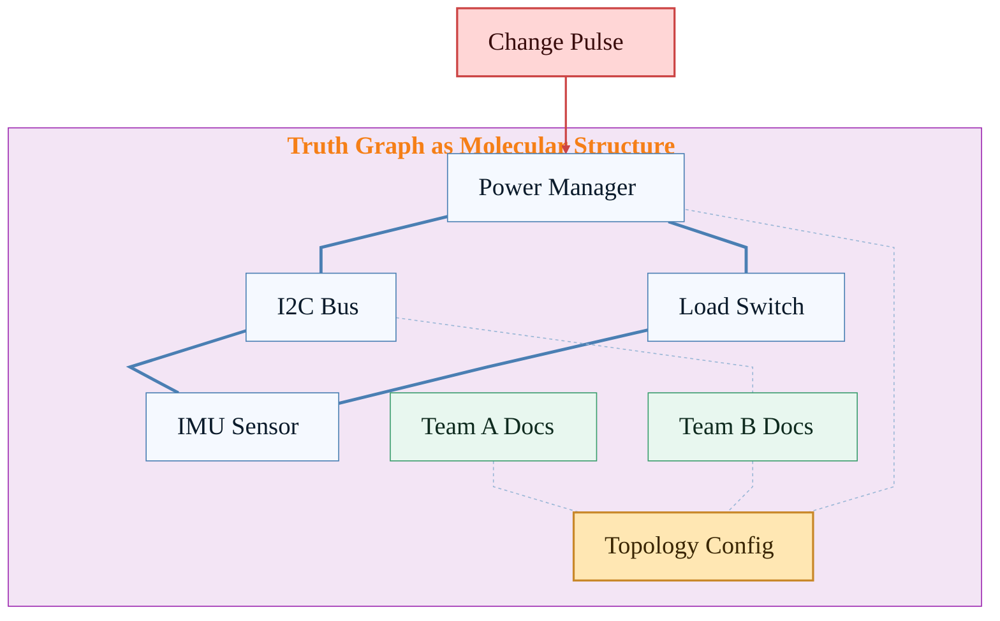

# GNN Molecular Model

Think of the truth graph as a molecular structure:
- **Nodes** are atoms (components, teams, documents).
- **Edges** are bonds (dependencies).
- **Bond strength** shows coupling (tight vs loose).
- **Message passing** is like an electron pull that carries influence across bonds.

[Back to Home](../index.html)

---

## Molecular View of the Graph

**Legend**
- **Thick bonds** = tight coupling (strong pull)
- **Dashed bonds** = loose coupling (weak pull)
- **Change pulse** = a modification that propagates across bonds

---

## Why this helps

A GNN learns which bonds carry the strongest influence. With verified edges and consistent labels, the model learns real system behavior instead of noise.

---

[Back to Home](../index.html)

