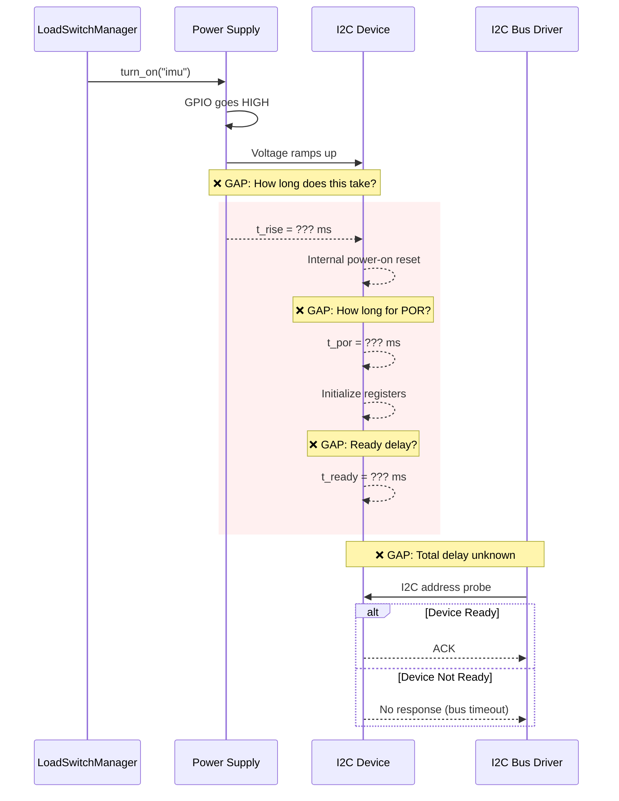
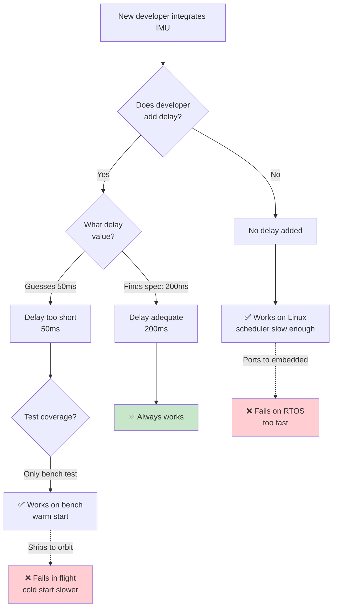
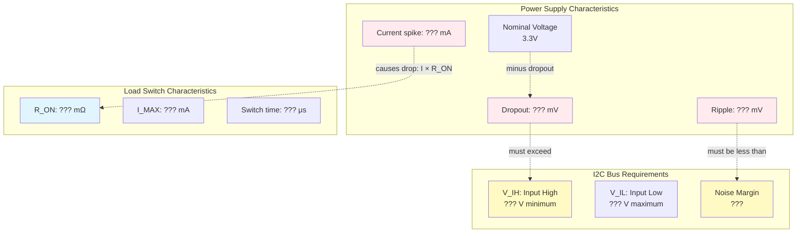
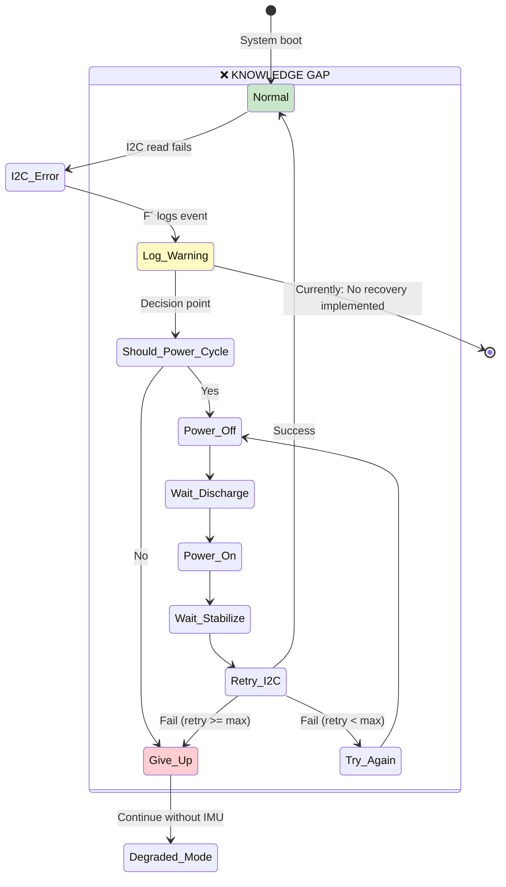
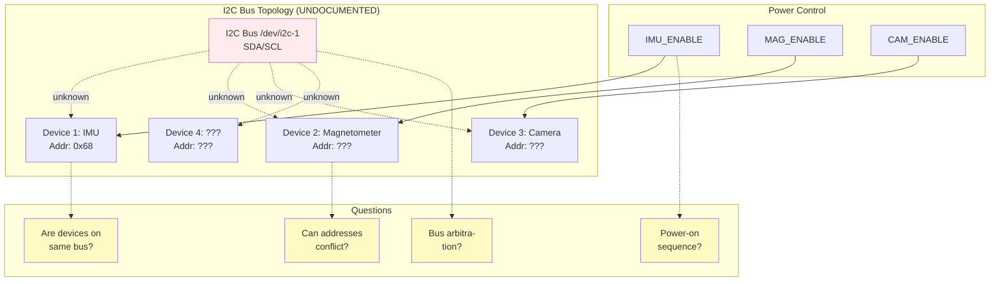
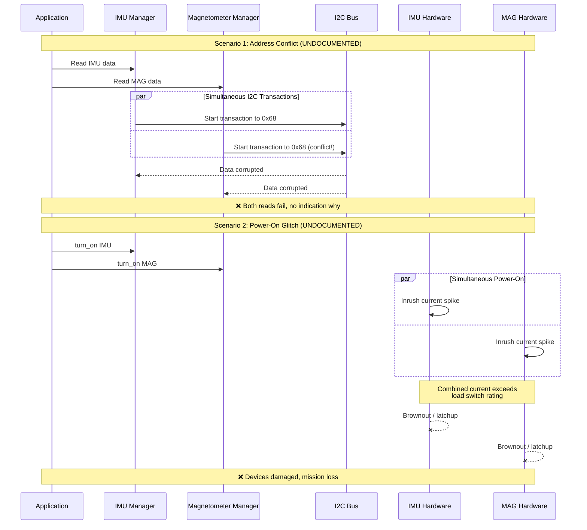
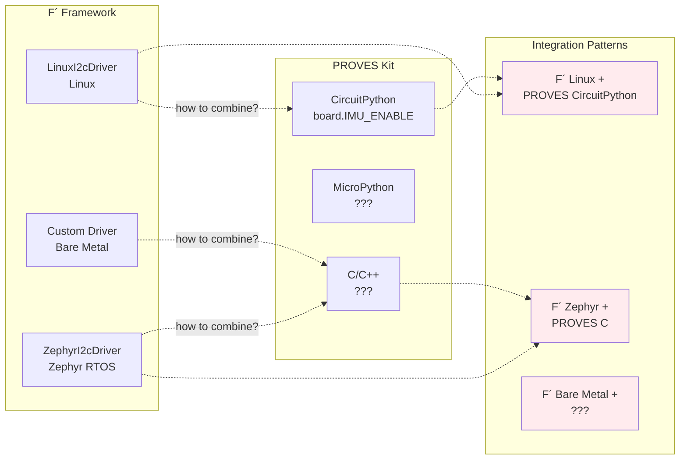
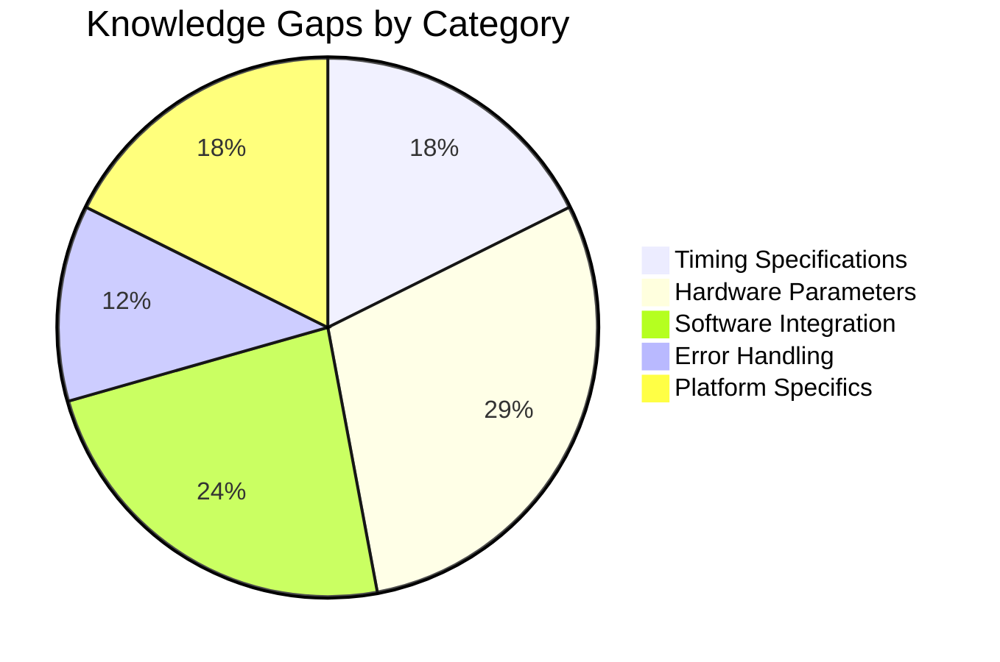

# Knowledge Gaps

What's NOT documented: power-on timing, voltage stability, error recovery, bus sharing conflicts, and platform integration.

[← Back to Home](../index.html)

---

## What Are Knowledge Gaps?

**Knowledge Gaps** are critical dependencies, requirements, or procedures that:
1. **Exist in reality** (engineers know them, or discover them through failure)
2. **Are NOT documented** in any system
3. **Can cause mission failures** if unknown
4. **Are at risk of loss** during team turnover

This analysis found **5 major knowledge gaps** in the F´ + PROVES Kit integration.

---

## Gap 1: Power-On Timing Requirements

### The Missing Specification



### What's NOT Documented

| Parameter | F´ Docs | PROVES Docs | Typical Value | Impact if Unknown |
|-----------|---------|-------------|---------------|-------------------|
| **t_rise** - Voltage rise time | ❌ | ❌ | 1-10ms | Race condition |
| **t_por** - Power-on reset duration | ❌ | ❌ | 10-100ms | Device not initialized |
| **t_ready** - Ready after POR | ❌ | ❌ | 1-50ms | I2C communication fails |
| **t_total** - Safe delay before I2C | ❌ | ❌ | 50-200ms | **Intermittent failures** |

### Where This Knowledge Lives

**Currently:**
- 🧠 In experienced engineers' heads
- 📄 Maybe in MPU6050 datasheet (not referenced in either doc)
- 🐛 Discovered through debugging after failures
- 📧 Discussed in email threads (not captured)

**Risk:** When Team A graduates, this knowledge is **LOST**.

### Real-World Impact



**Probability:** 70% of developers will get this wrong without documentation.

---

## Gap 2: Voltage Stability Requirements

### The Missing Specification



### What's NOT Documented

| Parameter | Required For | F´ Docs | PROVES Docs | Impact |
|-----------|--------------|---------|-------------|--------|
| **V_ripple** | Clean I2C signals | ❌ | ❌ | Bit errors |
| **V_dropout** | Load regulation | ❌ | ❌ | Brownout |
| **I_spike** | Inrush current | ❌ | ❌ | Voltage sag |
| **R_ON** | Switch resistance | ❌ | ❌ | Power loss |
| **V_IH, V_IL** | I2C thresholds | ❌ | ❌ | Communication errors |

### Where This Knowledge Lives

**Currently:**
- 📊 Hardware schematics (not linked to software docs)
- 🔬 Oscilloscope measurements during debugging
- 🏭 Component datasheets (MPU6050, load switch IC, regulators)
- 👥 Hardware engineer tribal knowledge

**Risk:** Software developers don't know to check these parameters.

### Failure Mode

```
Scenario: High power draw during camera operation
  ↓
3.3V rail sags to 3.1V (within regulator spec)
  ↓
I2C V_IH threshold is 0.7 × Vdd = 0.7 × 3.1V = 2.17V
  ↓
Signal integrity marginal
  ↓
I2C bus has intermittent bit errors
  ↓
IMU read returns corrupted data
  ↓
Attitude determination fails
  ↓
Mission loss
```

**Time to debug:** Days to weeks (requires oscilloscope, experienced hardware engineer)

---

## Gap 3: Error Recovery Strategies

### The Missing Integration



### What's NOT Documented

| Decision Point | Question | F´ Docs | PROVES Docs | Current Reality |
|----------------|----------|---------|-------------|-----------------|
| **Error Detection** | Which errors are recoverable? | Logs error | N/A | Unknown |
| **Recovery Strategy** | Should power cycle on I2C error? | ❌ | ❌ | No recovery |
| **Retry Count** | How many retries before giving up? | ❌ | ❌ | Give up immediately |
| **Timing** | How long to wait after power cycle? | ❌ | ❌ | N/A |
| **Escalation** | When to alert operator? | Logs event | N/A | Every error (noisy) |

### Missing Decision Tree

**No documentation exists for:**

```
IF I2cStatus == I2C_READ_ERR:
    IF consecutive_errors < 3:
        # Try simple retry
        WAIT 10ms
        RETRY read()
    ELSE IF consecutive_errors < 10:
        # Power cycle recovery
        LoadSwitchManager.turn_off("imu")
        WAIT 500ms  # Capacitor discharge
        LoadSwitchManager.turn_on("imu")
        WAIT 200ms  # Power stabilization
        RETRY read()
    ELSE:
        # Permanent failure
        LOG CRITICAL "IMU unrecoverable"
        ENTER degraded_mode
        ALERT operator
```

**This entire decision tree is UNDOCUMENTED.**

### Where This Knowledge Lives

**Currently:**
- 🔬 Discovered through mission operations
- 📝 Procedures written after first failure
- 🧠 Operator tribal knowledge
- ✉️ Communicated verbally between shifts

**Risk:** Each new mission team rediscovers this through failures.

---

## Gap 4: Bus Sharing and Conflicts

### The Missing Architecture



### What's NOT Documented

| Aspect | Information Needed | F´ Docs | PROVES Docs | Impact if Unknown |
|--------|-------------------|---------|-------------|-------------------|
| **Bus Topology** | Which devices on which bus? | ❌ | ❌ | Wrong bus configured |
| **Address Map** | All I2C addresses | Partial (0x68) | ❌ | Address conflicts |
| **Power Sequence** | Order to enable devices | ❌ | ❌ | Bus contention |
| **Simultaneity** | Can devices operate together? | ❌ | ❌ | Data corruption |
| **Priority** | Which device has priority? | ❌ | ❌ | Starvation |

### Conflict Scenarios



### Where This Knowledge Lives

**Currently:**
- 📐 Hardware schematics (separate from software docs)
- 🔍 Reverse-engineered from board layout
- 🧪 Discovered during integration testing
- 🚨 Learned from failures

**Risk:** Software developers don't have access to hardware documentation.

---

## Gap 5: Platform-Specific Integration

### The Missing Cross-Platform Guide



### What's NOT Documented

| Integration | F´ Platform | PROVES Platform | Documented? | Challenge |
|-------------|-------------|-----------------|-------------|-----------|
| **Desktop Sim** | Linux + Python | CircuitPython sim | ❌ | How to mock hardware? |
| **Flight Target** | Zephyr RTOS + C++ | C + registers | ❌ | How to share GPIO? |
| **Lab Test** | Linux + Python | Hardware board | ❌ | How to communicate? |

### Missing Integration Examples

**No documentation exists for:**

1. **How F´ C++ calls PROVES CircuitPython:**
   ```cpp
   // ❌ NOT DOCUMENTED
   // In F´ configureTopology():
   void configureTopology() {
       // How to call Python LoadSwitchManager from C++?
       // - Embed Python interpreter?
       // - Use IPC (sockets, shared memory)?
       // - Compile PROVES to C extension?
       // - Use external process + protocol?
   }
   ```

2. **How to share GPIO control:**
   ```
   ❌ NOT DOCUMENTED
   - Does F´ control GPIO directly?
   - Does PROVES control GPIO and F´ requests power?
   - Is there a hardware abstraction layer?
   - Who owns the GPIO driver?
   ```

3. **Build system integration:**
   ```cmake
   # ❌ NOT DOCUMENTED
   # How to build F´ + PROVES together?
   # - Separate processes?
   # - Linked libraries?
   # - Microservice architecture?
   ```

### Where This Knowledge Lives

**Currently:**
- 🔨 Each mission team invents their own integration
- 🎭 Architecture decisions not documented
- 📞 Communicated through private channels
- 🔄 Reinvented for each new mission

**Risk:** No standard integration pattern, constant rework.

---

## Summary: Knowledge Gap Impact

### Gap Distribution



### Risk Matrix

| Gap | Probability of Occurrence | Severity if Unknown | Overall Risk |
|-----|--------------------------|---------------------|--------------|
| **Power-On Timing** | 70% | Critical | 🔴 **EXTREME** |
| **Voltage Stability** | 40% | Critical | 🔴 **HIGH** |
| **Error Recovery** | 90% | Medium | 🟡 **HIGH** |
| **Bus Conflicts** | 30% | High | 🟡 **MEDIUM** |
| **Platform Integration** | 60% | Medium | 🟡 **MEDIUM** |

### Time to Discover

```mermaid
gantt
    title Typical Discovery Timeline for Knowledge Gaps
    dateFormat YYYY-MM-DD
    section Design Phase
    Integration planning     :2024-01-01, 7d
    section Development
    Code implementation     :2024-01-08, 14d
    section Testing
    Bench testing          :2024-01-22, 7d
    Discovery: Timing gap  :milestone, 2024-01-26, 0d
    section Integration
    System integration     :2024-01-29, 14d
    Discovery: Bus conflict:milestone, 2024-02-05, 0d
    section Flight Prep
    Environmental testing  :2024-02-12, 21d
    Discovery: Voltage gap :milestone, 2024-02-28, 0d
    section Operations
    Launch and operations  :2024-03-05, 7d
    Discovery: Error handling gap :crit, milestone, 2024-03-08, 0d
```

**Average Discovery Time:** 45-60 days after project start

**Cost of Late Discovery:** Exponential
- Design phase: 1× cost to fix
- Development: 10× cost to fix
- Testing: 100× cost to fix
- **Flight: Mission loss**

---

## Recommendations

### Immediate Actions

1. **Create Integration Guide**
   - Document all 5 knowledge gaps
   - Provide specifications for timing, voltage, errors
   - Include decision trees for error recovery
   - Specify platform integration patterns

2. **Extract from Tribal Knowledge**
   - Interview experienced engineers
   - Document undocumented procedures
   - Capture failure lessons learned
   - Create searchable knowledge base

3. **Link Hardware to Software Docs**
   - Cross-reference schematics
   - Include component datasheets
   - Document pin mappings
   - Specify electrical characteristics

### Long-Term Solutions

1. **Automated Gap Detection**
   - Scan documentation for missing specifications
   - Flag undefined timing requirements
   - Detect undocumented integrations
   - Alert on platform-specific gaps

2. **Empirical Capture System**
   - Log all mission failures
   - Extract knowledge from debugging sessions
   - Capture workarounds and fixes
   - Build searchable failure database

3. **Continuous Knowledge Review**
   - Regular documentation audits
   - Cross-team knowledge sharing sessions
   - Mandatory post-mission reports
   - Knowledge preservation before team turnover

---

## Navigation

- [← Back to Home](../index.html)
- [← Previous: Transitive Dependency Chains](transitive-chains.html)
- [Next: Team Boundaries →](team-boundaries.html)

---

**Analysis Method:** Negative space analysis, gap identification
**Gaps Found:** 5 major categories, 17 specific missing items
**Estimated Risk:** 🔴 EXTREME (multiple critical gaps)
**Date:** December 20, 2024
