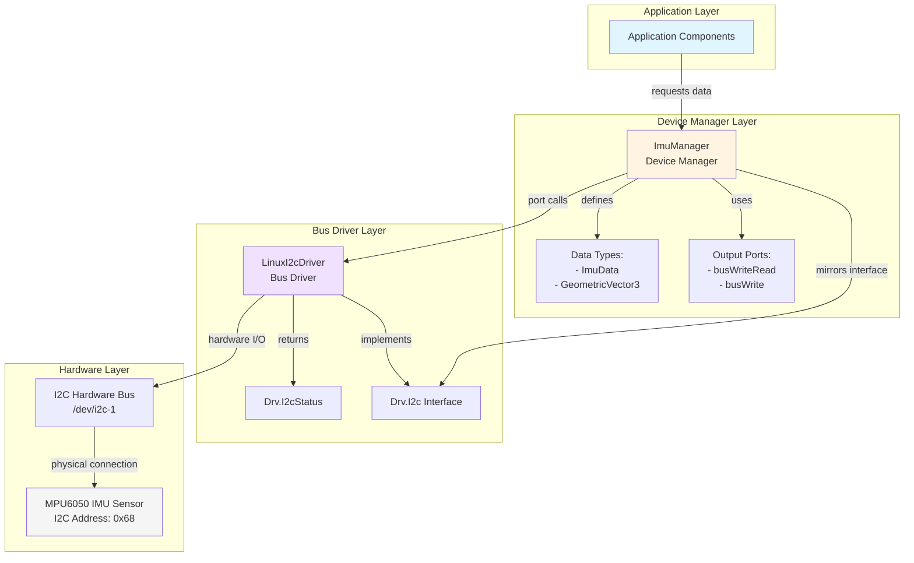
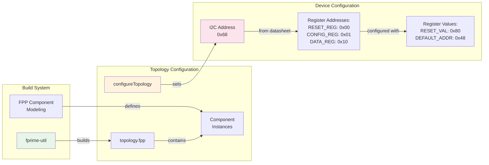
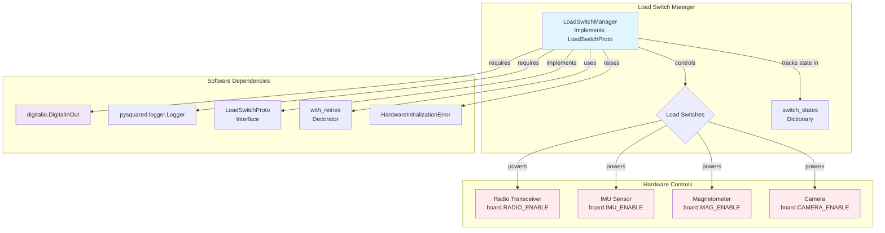
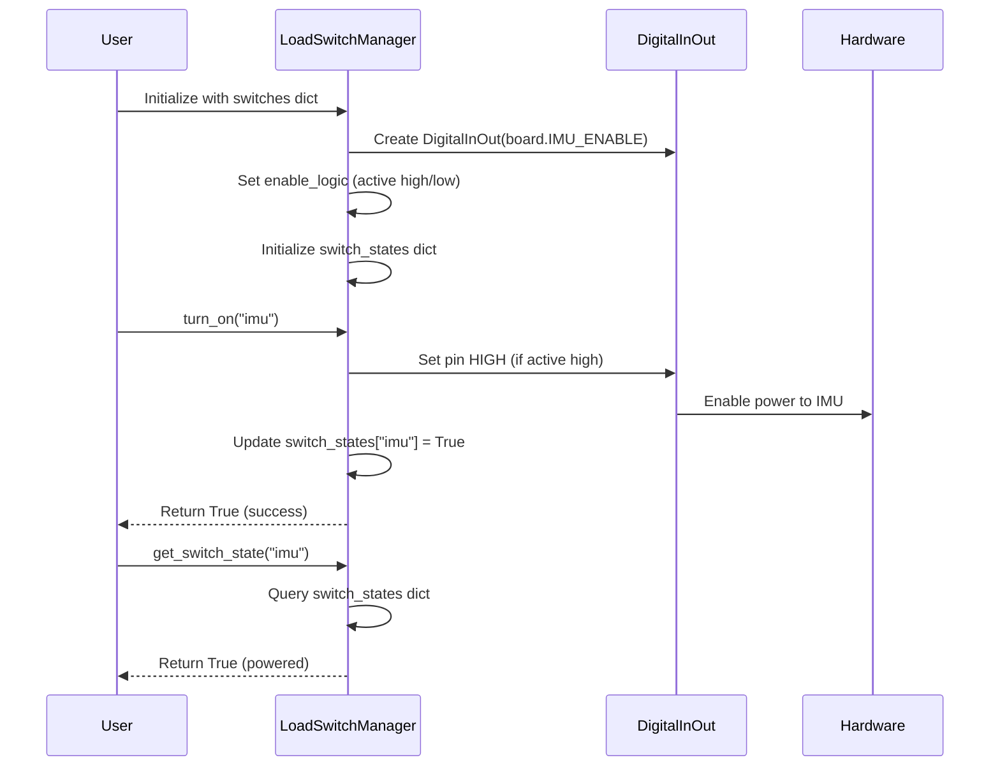
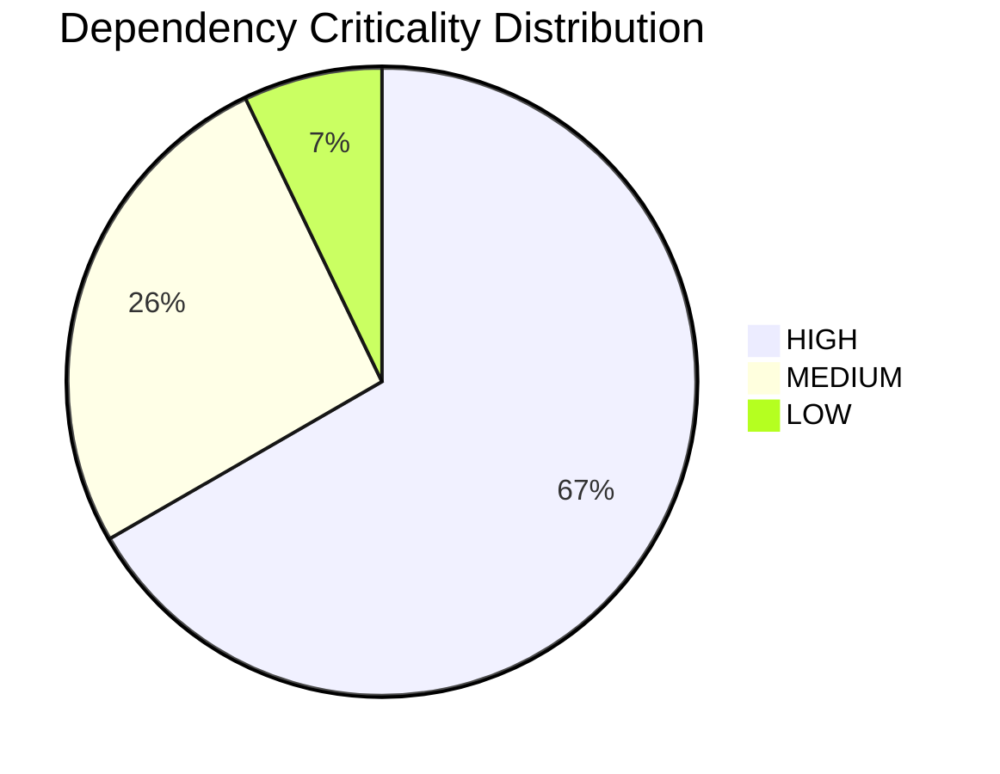

# Dependency Overview

Complete inventory of all 45+ dependencies found in F´ I2C Driver and PROVES Kit Power Management documentation.

[← Back to Home](../index.html)

---

## F´ I2C Driver Dependencies

### Software Architecture

### Configuration Dependencies

---

## PROVES Kit Load Switch Dependencies

### Power Control Architecture

### Configuration Flow

---

## Dependency Statistics

### By Category

| Category | F´ Count | PROVES Kit Count | Total |
|----------|----------|------------------|-------|
| **Software Dependencies** | 9 | 6 | 15 |
| **Hardware Dependencies** | 4 | 5 | 9 |
| **Configuration Dependencies** | 5 | 3 | 8 |
| **Build System Dependencies** | 3 | 0 | 3 |
| **Data Type Dependencies** | 4 | 0 | 4 |
| **State Management Dependencies** | 0 | 3 | 3 |
| **TOTAL** | 25 | 17 | **42** |

### By Criticality

### By Relationship Type

| Relationship Type | Count | Examples |
|-------------------|-------|----------|
| **requires** | 23 | Device Manager requires Bus Driver |
| **enables** | 7 | Load Switch enables IMU power |
| **depends_on** | 6 | Application depends_on Device Manager |
| **controls** | 5 | LoadSwitchManager controls hardware pins |
| **implements** | 1 | ZephyrI2cDriver implements Drv.I2c |

---

## Source Location Coverage

Every dependency tracked with precise source locations:

### F´ Documentation Coverage
- **File:** `nasa/fprime/docs/how-to/develop-device-driver.md`
- **Lines Analyzed:** 411
- **Dependencies Found:** 25
- **Average Density:** 1 dependency per 16.4 lines

### PROVES Kit Documentation Coverage
- **File:** `proveskit/pysquared/docs/load_switch.md`
- **Lines Analyzed:** 154
- **Dependencies Found:** 17
- **Average Density:** 1 dependency per 9.1 lines

---

## Navigation

- [← Back to Home](../index.html)
- [Next: Cross-System Dependencies →](cross-system.html)

---

**Analysis Method:** Manual annotation with line-by-line review
**Confidence Level:** High (human-verified)
**Date:** December 20, 2024
