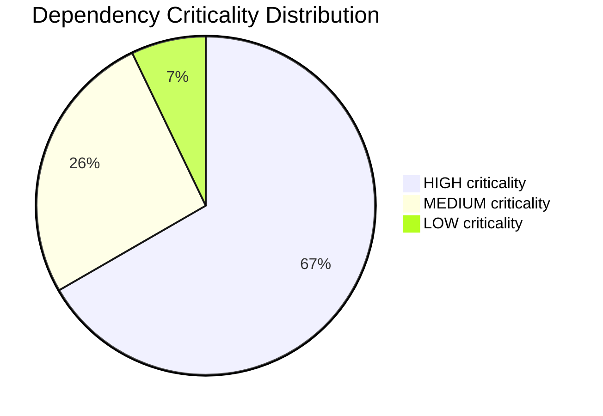
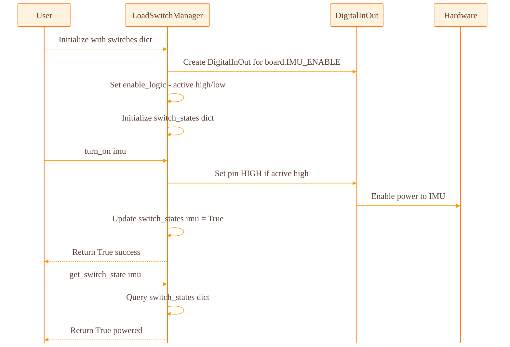

# Dependency Overview

Complete inventory of all 45+ dependencies found in F-Prime I2C Driver and PROVES Kit Power Management documentation.

[← Back to Home](../index.html)

---

## Quick Terminology Guide

**Dependency** - When one component needs another component to work
- Example: "The IMU sensor depends on power" means if power fails, IMU fails too

**F-Prime (F Prime)** - NASA's flight software framework used on many spacecraft

**I2C** - Communication protocol that lets microcontrollers talk to sensors (like USB but for embedded systems)

**PROVES Kit** - University CubeSat platform with standardized hardware modules

**Load Switch** - Electronic switch that turns power on/off to different components

**Device Manager** - Software layer that handles talking to hardware sensors

**Bus Driver** - Low-level software that manages the I2C communication protocol

---

## F-Prime I2C Driver Dependencies

### Software Architecture

**What you're looking at:** How software layers stack on top of each other to talk to a sensor. Each layer only talks to the layer directly below it.

### By Category

| Category | F-Prime Count | PROVES Kit Count | Total |
|----------|----------|------------------|-------|
| **Software Dependencies** | 9 | 6 | 15 |
| **Hardware Dependencies** | 4 | 5 | 9 |
| **Configuration Dependencies** | 5 | 3 | 8 |
| **Build System Dependencies** | 3 | 0 | 3 |
| **Data Type Dependencies** | 4 | 0 | 4 |
| **State Management Dependencies** | 0 | 3 | 3 |
| **TOTAL** | 25 | 17 | **42** |

### By Criticality


        FPP[FPP files Component definitions]
    end

    subgraph TOPO ["System Configuration - How components connect"]
        spacer35[ ]:::spacer
        TOPO_FILE[topology.fpp - Defines which components exist]
        CONFIG[configureTopology function - Sets up connections at startup]
    end

    subgraph DEVICE ["Hardware Configuration - Device settings"]
        spacer36[ ]:::spacer
        ADDR[I2C Address 0x68 - How to find the IMU on the bus]
        REGS[IMU Register Addresses - RESET 0x00, CONFIG 0x01, DATA 0x10]
        VALS[Register Values - What to write to configure the sensor]
    end

FPUTIL -->|"Compiles"| TOPO_FILE
FPP -->|"Generates code for"| TOPO_FILE
TOPO_FILE -->|"Used by"| CONFIG
CONFIG -->|"Must set correct"| ADDR
ADDR -->|"Comes from sensor datasheet"| REGS
REGS -->|"Require correct"| VALS

    style BUILD fill:#e8f5e9
    style TOPO fill:#fff3e0
    style DEVICE fill:#fce4ec
    %% Font sizing classes for consistency
    classDef default font-size:24px,font-family:Segoe UI,Tahoma,Geneva,Verdana,sans-serif;
    classDef diamond font-size:22px,font-family:Segoe UI,Tahoma,Geneva,Verdana,sans-serif;
    classDef spacer fill:none,stroke:none,color:transparent,width:1px,height:1px;
```

**Why this matters:** If the I2C address in code (0x68) doesn't match the hardware's actual address, communication fails silently.

---

## PROVES Kit Load Switch Dependencies

### Power Control Architecture

**What you're looking at:** How the PROVES Kit software controls power to different subsystems.

```mermaid
---
config:
  theme: base
  fontSize: 24
  themeVariables:
    primaryColor: '#FFF3E0'
    secondaryColor: '#F3E5F5'
    tertiaryColor: '#FFF8E1'
    primaryTextColor: '#5D4037'
    secondaryTextColor: '#4A148C'
    tertiaryTextColor: '#F57F17'
    primaryBorderColor: '#FF6F00'
    secondaryBorderColor: '#9C27B0'
    tertiaryBorderColor: '#FBC02D'
    background: '#FFF8E1'
    textColor: '#5D4037'
    lineColor: '#FF9800'
    fontFamily: '"Segoe UI", Tahoma, Geneva, Verdana, sans-serif'
    fontSize: '24px'
    nodeBorder: '#FF6F00'
    mainBkg: '#FFF3E0'
    clusterBkg: '#F3E5F5'
    clusterBorder: '#9C27B0'
    edgeLabelBackground: '#FFF8E1'
    actorBkg: '#FFF3E0'
    actorBorder: '#FF6F00'
    actorTextColor: '#5D4037'
    signalColor: '#FF9800'
    signalTextColor: '#5D4037'
    labelBoxBkgColor: '#F3E5F5'
    noteBkgColor: '#FFF8E1'
    noteTextColor: '#F57F17'
    noteBorderColor: '#FBC02D'
    pie1: '#FF6F00'
    pie2: '#9C27B0'
    pie3: '#FBC02D'
    pie4: '#FF9800'
    pie5: '#BA68C8'
    pie6: '#FFD54F'
    pie7: '#FFB74D'
    pie8: '#CE93D8'
    pie9: '#FFF176'
    pie10: '#FF8A65'
    pie11: '#F3E5F5'
    pie12: '#FFF8E1'
    sectionBkgColor: '#FFF8E1'
    altSectionBkgColor: '#FFF3E0'
    sectionBkgColor2: '#F3E5F5'
    taskBkgColor: '#FFB74D'
    taskBorderColor: '#FF6F00'
    activeTaskBkgColor: '#FF9800'
    activeTaskBorderColor: '#E65100'
    doneTaskBkgColor: '#FFCC80'
    doneTaskBorderColor: '#FF6F00'
    critBkgColor: '#CE93D8'
    critBorderColor: '#7B1FA2'
    taskTextColor: '#5D4037'
    taskTextOutsideColor: '#5D4037'
    taskTextLightColor: '#5D4037'
    taskTextDarkColor: '#FFFFFF'
    gridColor: '#FFCC80'
    todayLineColor: '#7B1FA2'
    classText: '#5D4037'
    fillType0: '#FFF3E0'
    fillType1: '#F3E5F5'
    fillType2: '#FFF8E1'
    fillType3: '#FFB74D'
    fillType4: '#CE93D8'
    fillType5: '#FFD54F'
    fillType6: '#FF8A65'
    fillType7: '#BA68C8'
    attributeBackgroundColorOdd: '#FFF8E1'
    attributeBackgroundColorEven: '#FFF3E0'
  gantt:
    fontSize: 24
    barHeight: 24
    barGap: 6
    topPadding: 50
    leftPadding: 75
    gridLineStartPadding: 40
    numberSectionStyles: 4
  flowchart:
    curve: 'linear'
    htmlLabels: false
    useMaxWidth: true
    padding: 40
    nodeSpacing: 100
    rankSpacing: 150
    diagramPadding: 8
  sequence:
    diagramMarginX: 50
    diagramMarginY: 10
    actorMargin: 50
    boxMargin: 10
    boxTextMargin: 5
    noteMargin: 10
    messageMargin: 35
    mirrorActors: false
    bottomMarginAdj: 1
    useMaxWidth: true
    rightAngles: false
    showSequenceNumbers: false
  state:
    dividerMargin: 10
    sizeUnit: 5
    padding: 8
    textHeight: 10
    titleShift: -15
    noteMargin: 10
    forkWidth: 70
    forkHeight: 7
    miniPadding: 2
    fontSizeFactor: 5.02
    fontSize: 24
    labelHeight: 16
    edgeLengthFactor: 20
    compositeTitleSize: 35
    radius: 5
  class:
    arrowMarkerAbsolute: false
    hideEmptyMembersBox: false
  er:
    diagramPadding: 40
    layoutDirection: 'TB'
    minEntityWidth: 100
    minEntityHeight: 75
    entityPadding: 15
    stroke: 'gray'
    fill: 'honeydew'
    fontSize: 12
  journey:
    diagramMarginX: 50
    diagramMarginY: 10
    actorMargin: 50
    boxMargin: 10
    boxTextMargin: 5
  pie:
    textPosition: 0.75
  quadrant:
    chartWidth: 500
    chartHeight: 500
    titlePadding: 10
    titlefontSize: 24
    quadrantPadding: 5
    quadrantTextTopPadding: 5
    quadrantLabelFontSize: 16
    quadrantInternalBorderStrokeWidth: 1
    quadrantExternalBorderStrokeWidth: 2
    pointTextPadding: 5
    pointLabelFontSize: 12
    pointRadius: 6
    xAxisLabelPadding: 5
    xAxisLabelFontSize: 16
    yAxisLabelPadding: 5
    yAxisLabelFontSize: 16
  requirement:
    rect_fill: '#FFF3E0'
    text_color: '#5D4037'
    rect_border_size: 2
    rect_border_color: '#FF6F00'
    rect_min_width: 200
    rect_min_height: 200
    fontSize: 14
    rect_padding: 10
    line_height: 20
  gitGraph:
    showBranches: true
    showCommitLabel: true
    mainBranchName: 'main'
    rotateCommitLabel: true
  c4:
    diagramMarginX: 50
    diagramMarginY: 10
    c4ShapeMargin: 50
    c4ShapePadding: 40
    width: 216
    height: 60
    boxMargin: 10
---
flowchart TB
    LSM[LoadSwitchManager - Main power control class - Written in Python]

    subgraph TOOLS ["Software Tools It Uses"]
        spacer37[ ]:::spacer
        DIO[digitalio.DigitalInOut - Controls GPIO pins]
        LOGGER[Logger - Records events]
        STATE[switch_states dict - Tracks on/off status]
    end

    subgraph DEVICES ["Hardware It Powers"]
        spacer38[ ]:::spacer
        RADIO[Radio - board.RADIO_ENABLE]
        IMU[IMU Sensor - board.IMU_ENABLE]
        MAG[Magnetometer - board.MAG_ENABLE]
        CAM[Camera - board.CAMERA_ENABLE]
    end

LSM -->|Uses| DIO
LSM -->|Uses| LOGGER
LSM -->|Uses| STATE

LSM -->|Controls power to| RADIO
LSM -->|Controls power to| IMU
LSM -->|Controls power to| MAG
LSM -->|Controls power to| CAM

    style LSM fill:#e1f5ff
    style TOOLS fill:#fff9c4
    style DEVICES fill:#ffebee
    %% Font sizing classes for consistency
    classDef default font-size:24px,font-family:Segoe UI,Tahoma,Geneva,Verdana,sans-serif;
    classDef diamond font-size:22px,font-family:Segoe UI,Tahoma,Geneva,Verdana,sans-serif;
    classDef spacer fill:none,stroke:none,color:transparent,width:1px,height:1px;
```



**Key insight:** The LoadSwitchManager is the single point of control for all subsystem power. If it fails, you can't turn anything on or off.

### Configuration Flow



---

## Dependency Statistics

### By Category

| Category | F-Prime Count | PROVES Kit Count | Total |
|----------|----------|------------------|-------|
| **Software Dependencies** | 9 | 6 | 15 |
| **Hardware Dependencies** | 4 | 5 | 9 |
| **Configuration Dependencies** | 5 | 3 | 8 |
| **Build System Dependencies** | 3 | 0 | 3 |
| **Data Type Dependencies** | 4 | 0 | 4 |
| **State Management Dependencies** | 0 | 3 | 3 |
| **TOTAL** | 25 | 17 | **42** |

### By Criticality

```mermaid
---
config:
  theme: base
  fontSize: 24
  themeVariables:
    primaryColor: '#FFF3E0'
    secondaryColor: '#F3E5F5'
    tertiaryColor: '#FFF8E1'
    primaryTextColor: '#5D4037'
    secondaryTextColor: '#4A148C'
    tertiaryTextColor: '#F57F17'
    primaryBorderColor: '#FF6F00'
    secondaryBorderColor: '#9C27B0'
    tertiaryBorderColor: '#FBC02D'
    background: '#FFF8E1'
    textColor: '#5D4037'
    lineColor: '#FF9800'
    fontFamily: '"Segoe UI", Tahoma, Geneva, Verdana, sans-serif'
    fontSize: '24px'
    nodeBorder: '#FF6F00'
    mainBkg: '#FFF3E0'
    clusterBkg: '#F3E5F5'
    clusterBorder: '#9C27B0'
    edgeLabelBackground: '#FFF8E1'
    actorBkg: '#FFF3E0'
    actorBorder: '#FF6F00'
    actorTextColor: '#5D4037'
    signalColor: '#FF9800'
    signalTextColor: '#5D4037'
    labelBoxBkgColor: '#F3E5F5'
    noteBkgColor: '#FFF8E1'
    noteTextColor: '#F57F17'
    noteBorderColor: '#FBC02D'
    pie1: '#FF6F00'
    pie2: '#9C27B0'
    pie3: '#FBC02D'
    pie4: '#FF9800'
    pie5: '#BA68C8'
    pie6: '#FFD54F'
    pie7: '#FFB74D'
    pie8: '#CE93D8'
    pie9: '#FFF176'
    pie10: '#FF8A65'
    pie11: '#F3E5F5'
    pie12: '#FFF8E1'
    sectionBkgColor: '#FFF8E1'
    altSectionBkgColor: '#FFF3E0'
    sectionBkgColor2: '#F3E5F5'
    taskBkgColor: '#FFB74D'
    taskBorderColor: '#FF6F00'
    activeTaskBkgColor: '#FF9800'
    activeTaskBorderColor: '#E65100'
    doneTaskBkgColor: '#FFCC80'
    doneTaskBorderColor: '#FF6F00'
    critBkgColor: '#CE93D8'
    critBorderColor: '#7B1FA2'
    taskTextColor: '#5D4037'
    taskTextOutsideColor: '#5D4037'
    taskTextLightColor: '#5D4037'
    taskTextDarkColor: '#FFFFFF'
    gridColor: '#FFCC80'
    todayLineColor: '#7B1FA2'
    classText: '#5D4037'
    fillType0: '#FFF3E0'
    fillType1: '#F3E5F5'
    fillType2: '#FFF8E1'
    fillType3: '#FFB74D'
    fillType4: '#CE93D8'
    fillType5: '#FFD54F'
    fillType6: '#FF8A65'
    fillType7: '#BA68C8'
    attributeBackgroundColorOdd: '#FFF8E1'
    attributeBackgroundColorEven: '#FFF3E0'
  gantt:
    fontSize: 24
    barHeight: 24
    barGap: 6
    topPadding: 50
    leftPadding: 75
    gridLineStartPadding: 40
    numberSectionStyles: 4
  flowchart:
    curve: 'linear'
    htmlLabels: false
    useMaxWidth: true
    padding: 40
    nodeSpacing: 100
    rankSpacing: 150
    diagramPadding: 8
  sequence:
    diagramMarginX: 50
    diagramMarginY: 10
    actorMargin: 50
    boxMargin: 10
    boxTextMargin: 5
    noteMargin: 10
    messageMargin: 35
    mirrorActors: false
    bottomMarginAdj: 1
    useMaxWidth: true
    rightAngles: false
    showSequenceNumbers: false
  state:
    dividerMargin: 10
    sizeUnit: 5
    padding: 8
    textHeight: 10
    titleShift: -15
    noteMargin: 10
    forkWidth: 70
    forkHeight: 7
    miniPadding: 2
    fontSizeFactor: 5.02
    fontSize: 24
    labelHeight: 16
    edgeLengthFactor: 20
    compositeTitleSize: 35
    radius: 5
  class:
    arrowMarkerAbsolute: false
    hideEmptyMembersBox: false
  er:
    diagramPadding: 40
    layoutDirection: 'TB'
    minEntityWidth: 100
    minEntityHeight: 75
    entityPadding: 15
    stroke: 'gray'
    fill: 'honeydew'
    fontSize: 12
  journey:
    diagramMarginX: 50
    diagramMarginY: 10
    actorMargin: 50
    boxMargin: 10
    boxTextMargin: 5
  pie:
    textPosition: 0.75
  quadrant:
    chartWidth: 500
    chartHeight: 500
    titlePadding: 10
    titlefontSize: 24
    quadrantPadding: 5
    quadrantTextTopPadding: 5
    quadrantLabelFontSize: 16
    quadrantInternalBorderStrokeWidth: 1
    quadrantExternalBorderStrokeWidth: 2
    pointTextPadding: 5
    pointLabelFontSize: 12
    pointRadius: 6
    xAxisLabelPadding: 5
    xAxisLabelFontSize: 16
    yAxisLabelPadding: 5
    yAxisLabelFontSize: 16
  requirement:
    rect_fill: '#FFF3E0'
    text_color: '#5D4037'
    rect_border_size: 2
    rect_border_color: '#FF6F00'
    rect_min_width: 200
    rect_min_height: 200
    fontSize: 14
    rect_padding: 10
    line_height: 20
  gitGraph:
    showBranches: true
    showCommitLabel: true
    mainBranchName: 'main'
    rotateCommitLabel: true
  c4:
    diagramMarginX: 50
    diagramMarginY: 10
    c4ShapeMargin: 50
    c4ShapePadding: 40
    width: 216

  ```mermaid
  pie title Dependency Criticality Distribution
    "HIGH criticality" : 28
    "MEDIUM criticality" : 11
    "LOW criticality" : 3
  ```

### By Relationship Type

| Relationship Type | Count | Examples |
|-------------------|-------|----------|
| **requires** | 23 | Device Manager requires Bus Driver |
| **enables** | 7 | Load Switch enables IMU power |
| **depends_on** | 6 | Application depends_on Device Manager |
| **controls** | 5 | LoadSwitchManager controls hardware pins |
| **implements** | 1 | ZephyrI2cDriver implements Drv.I2c |

---

## Source Location Coverage

Every dependency tracked with precise source locations:

### F-Prime Documentation Coverage

- **File:** `nasa/fprime/docs/how-to/develop-device-driver.md`
- **Lines Analyzed:** 411
- **Dependencies Found:** 25
- **Average Density:** 1 dependency per 16.4 lines

### PROVES Kit Documentation Coverage

- **File:** `proveskit/pysquared/docs/load_switch.md`
- **Lines Analyzed:** 154
- **Dependencies Found:** 17
- **Average Density:** 1 dependency per 9.1 lines

---

## Navigation

- [← Back to Home](../index.html)
- [Next: Cross-System Dependencies ->](cross-system.html)

---

**Analysis Method:** Manual annotation with line-by-line review
**Confidence Level:** High (human-verified)
**Date:** December 20, 2024


