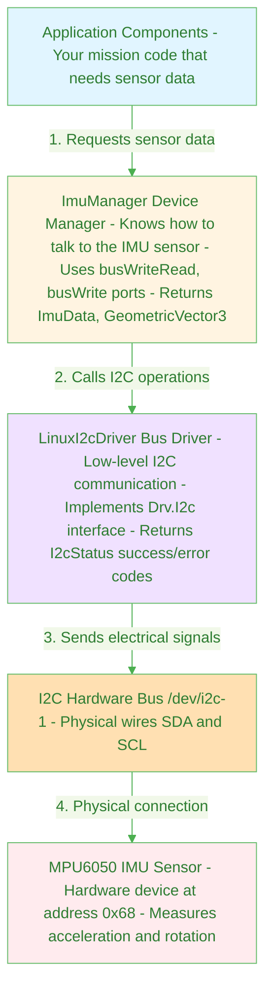
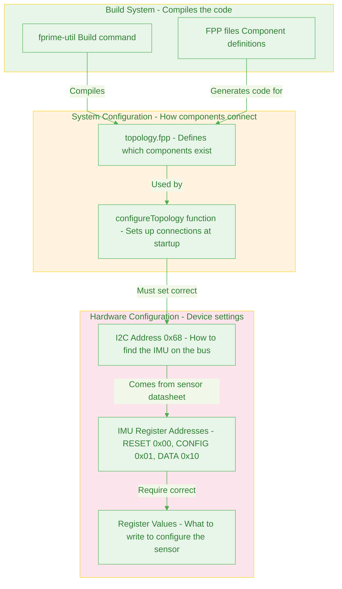
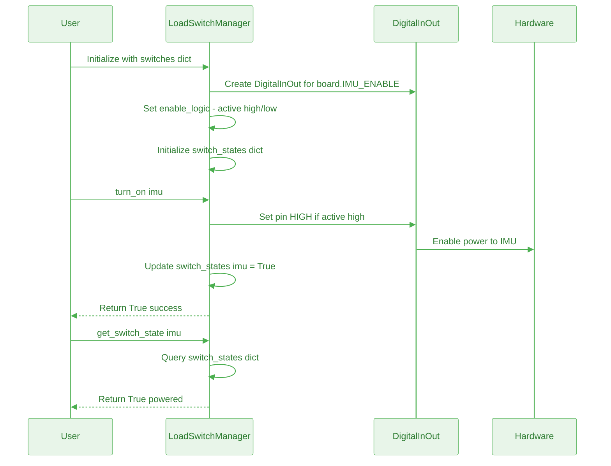
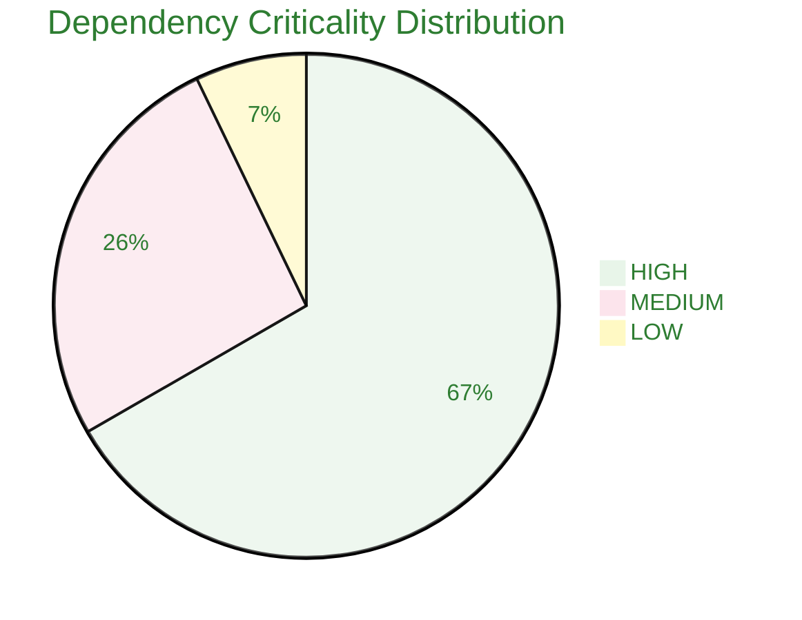

# Dependency Overview

Complete inventory of all 45+ dependencies found in F´ I2C Driver and PROVES Kit Power Management documentation.

[← Back to Home](../index.html)

---

## Quick Terminology Guide

**Dependency** - When one component needs another component to work
- Example: "The IMU sensor depends on power" means if power fails, IMU fails too

**F´ (F Prime)** - NASA's flight software framework used on many spacecraft

**I2C** - Communication protocol that lets microcontrollers talk to sensors (like USB but for embedded systems)

**PROVES Kit** - University CubeSat platform with standardized hardware modules

**Load Switch** - Electronic switch that turns power on/off to different components

**Device Manager** - Software layer that handles talking to hardware sensors

**Bus Driver** - Low-level software that manages the I2C communication protocol

---

## F´ I2C Driver Dependencies

### Software Architecture

**What you're looking at:** How software layers stack on top of each other to talk to a sensor. Each layer only talks to the layer directly below it.

**Key insight:** If any layer fails, all layers above it fail too. This is why dependencies matter!

### Configuration Dependencies

**What you're looking at:** Three types of configuration that all need to match up correctly.

**Why this matters:** If the I2C address in code (0x68) doesn't match the hardware's actual address, communication fails silently.

---

## PROVES Kit Load Switch Dependencies

### Power Control Architecture

**What you're looking at:** How the PROVES Kit software controls power to different subsystems.

```mermaid
---
config:
  theme: base
  themeVariables:
    primaryColor: '#E8F5E9'
    secondaryColor: '#FCE4EC'
    tertiaryColor: '#FFF9C4'
    primaryTextColor: '#2E7D32'
    secondaryTextColor: '#C2185B'
    tertiaryTextColor: '#F57F17'
    primaryBorderColor: '#66BB6A'
    secondaryBorderColor: '#F06292'
    tertiaryBorderColor: '#FDD835'
    lineColor: '#4CAF50'
    edgeLabelBackground: '#F1F8E9'
    nodeBorder: '#66BB6A'
    clusterBkg: '#FFF9C4'
    clusterBorder: '#FDD835'
    defaultLinkColor: '#4CAF50'
    titleColor: '#2E7D32'
    actorBkg: '#E8F5E9'
    actorBorder: '#66BB6A'
    actorTextColor: '#2E7D32'
    signalColor: '#4CAF50'
    labelBoxBkgColor: '#FCE4EC'
    stateBkg: '#E8F5E9'
    sectionBkgColor: '#FFF9C4'
    taskBorderColor: '#66BB6A'
    taskBkgColor: '#E8F5E9'
    activeTaskBkgColor: '#C8E6C9'
    gridColor: '#A5D6A7'
    doneTaskBkgColor: '#81C784'
    critBkgColor: '#F06292'
    todayLineColor: '#2E7D32'
  flowchart:
    curve: linear
---
flowchart TB
    LSM[LoadSwitchManager - Main power control class - Written in Python]

    subgraph TOOLS ["Software Tools It Uses"]
        DIO[digitalio.DigitalInOut - Controls GPIO pins]
        LOGGER[Logger - Records events]
        STATE[switch_states dict - Tracks on/off status]
    end

    subgraph DEVICES ["Hardware It Powers"]
        RADIO[Radio - board.RADIO_ENABLE]
        IMU[IMU Sensor - board.IMU_ENABLE]
        MAG[Magnetometer - board.MAG_ENABLE]
        CAM[Camera - board.CAMERA_ENABLE]
    end

    LSM -->|Uses| DIO
    LSM -->|Uses| LOGGER
    LSM -->|Uses| STATE

    LSM -->|Controls power to| RADIO
    LSM -->|Controls power to| IMU
    LSM -->|Controls power to| MAG
    LSM -->|Controls power to| CAM

    style LSM fill:#e1f5ff
    style TOOLS fill:#fff9c4
    style DEVICES fill:#ffebee
```

**Key insight:** The LoadSwitchManager is the single point of control for all subsystem power. If it fails, you can't turn anything on or off.

### Configuration Flow

---

## Dependency Statistics

### By Category

| Category | F´ Count | PROVES Kit Count | Total |
|----------|----------|------------------|-------|
| **Software Dependencies** | 9 | 6 | 15 |
| **Hardware Dependencies** | 4 | 5 | 9 |
| **Configuration Dependencies** | 5 | 3 | 8 |
| **Build System Dependencies** | 3 | 0 | 3 |
| **Data Type Dependencies** | 4 | 0 | 4 |
| **State Management Dependencies** | 0 | 3 | 3 |
| **TOTAL** | 25 | 17 | **42** |

### By Criticality

### By Relationship Type

| Relationship Type | Count | Examples |
|-------------------|-------|----------|
| **requires** | 23 | Device Manager requires Bus Driver |
| **enables** | 7 | Load Switch enables IMU power |
| **depends_on** | 6 | Application depends_on Device Manager |
| **controls** | 5 | LoadSwitchManager controls hardware pins |
| **implements** | 1 | ZephyrI2cDriver implements Drv.I2c |

---

## Source Location Coverage

Every dependency tracked with precise source locations:

### F´ Documentation Coverage
- **File:** `nasa/fprime/docs/how-to/develop-device-driver.md`
- **Lines Analyzed:** 411
- **Dependencies Found:** 25
- **Average Density:** 1 dependency per 16.4 lines

### PROVES Kit Documentation Coverage
- **File:** `proveskit/pysquared/docs/load_switch.md`
- **Lines Analyzed:** 154
- **Dependencies Found:** 17
- **Average Density:** 1 dependency per 9.1 lines

---

## Navigation

- [← Back to Home](../index.html)
- [Next: Cross-System Dependencies ->](cross-system.html)

---

**Analysis Method:** Manual annotation with line-by-line review
**Confidence Level:** High (human-verified)
**Date:** December 20, 2024
