# Team Boundaries

Organizational analysis showing WEAK interface between NASA/JPL F-Prime team and university PROVES Kit teams - where knowledge gets lost.

[← Back to Home](../index.html)

---

## FRAMES Framework: Where Knowledge Lives

**FRAMES (Failure Modes and Systems Engineering)** maps organizational knowledge flow, not technical components. This analysis shows:
- **WHERE** knowledge lives (which teams)
- **HOW STRONG** team interfaces are
- **WHEN** knowledge is at risk of loss
- **WHY** failures cross team boundaries

---

## Team Boundary Map

### What You're Looking At

This diagram maps the ORGANIZATIONAL structure, not the technical one. Each box is a team or group of people. Solid lines show strong, documented relationships (like F-Prime Core maintaining their docs). Dashed lines show weak, at-risk relationships (like university teams graduating and losing knowledge). The colors highlight different risk levels—red for teams that already left, orange for teams in transition, green for active teams.

**Think of it like:** A family tree showing who talks to whom. Strong relationships (solid lines) are like parents teaching kids—regular, documented, reliable. Weak relationships (dashed lines) are like distant cousins you only see at weddings—sporadic, informal, knowledge doesn't flow well.

### Organizational Structure

```mermaid
---
config:
  theme: base
  fontSize: 20
  themeCSS: |
    .node rect, .cluster rect, .edgePath path { transition: filter 0.2s ease, stroke-width: 0.2s ease; }
    .node:hover rect, .cluster:hover rect, .edgePath:hover path { filter: drop-shadow(0 0 8px rgba(0,0,0,0.35)); stroke-width: 3px; }
    .edgeLabel rect { rx: 6px; ry: 6px; stroke-width: 1px; }
    .cluster-label { font-weight: 600; }
  themeVariables:
    primaryColor: '#FFF3E0'
    secondaryColor: '#F3E5F5'
    tertiaryColor: '#FFF8E1'
    primaryTextColor: '#5D4037'
    secondaryTextColor: '#4A148C'
    tertiaryTextColor: '#F57F17'
    primaryBorderColor: '#FF6F00'
    secondaryBorderColor: '#9C27B0'
    tertiaryBorderColor: '#FBC02D'
    background: '#FFF8E1'
    textColor: '#5D4037'
    lineColor: '#FF9800'
    fontFamily: '"Segoe UI", Tahoma, Geneva, Verdana, sans-serif'
    fontSize: '24px'
    nodeBorder: '#FF6F00'
    mainBkg: '#FFF3E0'
    clusterBkg: '#F3E5F5'
    clusterBorder: '#9C27B0'
    edgeLabelBackground: '#FFF8E1'
    actorBkg: '#FFF3E0'
    actorBorder: '#FF6F00'
    actorTextColor: '#5D4037'
    signalColor: '#FF9800'
    signalTextColor: '#5D4037'
    labelBoxBkgColor: '#F3E5F5'
    noteBkgColor: '#FFF8E1'
    noteTextColor: '#F57F17'
    noteBorderColor: '#FBC02D'
    pie1: '#FF6F00'
    pie2: '#9C27B0'
    pie3: '#FBC02D'
    pie4: '#FF9800'
    pie5: '#BA68C8'
    pie6: '#FFD54F'
    pie7: '#FFB74D'
    pie8: '#CE93D8'
    pie9: '#FFF176'
    pie10: '#FF8A65'
    pie11: '#F3E5F5'
    pie12: '#FFF8E1'
    sectionBkgColor: '#FFF8E1'
    altSectionBkgColor: '#FFF3E0'
    sectionBkgColor2: '#F3E5F5'
    taskBkgColor: '#FFB74D'
    taskBorderColor: '#FF6F00'
    activeTaskBkgColor: '#FF9800'
    activeTaskBorderColor: '#E65100'
    doneTaskBkgColor: '#FFCC80'
    doneTaskBorderColor: '#FF6F00'
    critBkgColor: '#CE93D8'
    critBorderColor: '#7B1FA2'
    taskTextColor: '#5D4037'
    taskTextOutsideColor: '#5D4037'
    taskTextLightColor: '#5D4037'
    taskTextDarkColor: '#FFFFFF'
    gridColor: '#FFCC80'
    todayLineColor: '#7B1FA2'
    classText: '#5D4037'
    fillType0: '#FFF3E0'
    fillType1: '#F3E5F5'
    fillType2: '#FFF8E1'
    fillType3: '#FFB74D'
    fillType4: '#CE93D8'
    fillType5: '#FFD54F'
    fillType6: '#FF8A65'
    fillType7: '#BA68C8'
    attributeBackgroundColorOdd: '#FFF8E1'
    attributeBackgroundColorEven: '#FFF3E0'
  gantt:
    fontSize: 20
    barHeight: 24
    barGap: 6
    topPadding: 50
    leftPadding: 75
    gridLineStartPadding: 35
    numberSectionStyles: 4
  flowchart:
    curve: 'linear'
    htmlLabels: false
    useMaxWidth: true
    padding: 25
    nodeSpacing: 60
    rankSpacing: 80
    diagramPadding: 8
  sequence:
    diagramMarginX: 50
    diagramMarginY: 10
    actorMargin: 50
    boxMargin: 10
    boxTextMargin: 5
    noteMargin: 10
    messageMargin: 35
    mirrorActors: false
    bottomMarginAdj: 1
    useMaxWidth: true
    rightAngles: false
    showSequenceNumbers: false
  state:
    dividerMargin: 10
    sizeUnit: 5
    padding: 8
    textHeight: 10
    titleShift: -15
    noteMargin: 10
    forkWidth: 70
    forkHeight: 7
    miniPadding: 2
    fontSizeFactor: 5.02
    fontSize: 24
    labelHeight: 16
    edgeLengthFactor: 20
    compositeTitleSize: 35
    radius: 5
  class:
    arrowMarkerAbsolute: false
    hideEmptyMembersBox: false
  er:
    diagrampadding: 25
    layoutDirection: 'TB'
    minEntityWidth: 100
    minEntityHeight: 75
    entityPadding: 15
    stroke: 'gray'
    fill: 'honeydew'
    fontSize: 12
  journey:
    diagramMarginX: 50
    diagramMarginY: 10
    actorMargin: 50
    boxMargin: 10
    boxTextMargin: 5
  pie:
    textPosition: 0.75
  quadrant:
    chartWidth: 500
    chartHeight: 500
    titlePadding: 10
    titleFontSize: 20
    quadrantPadding: 5
    quadrantTextTopPadding: 5
    quadrantLabelFontSize: 16
    quadrantInternalBorderStrokeWidth: 1
    quadrantExternalBorderStrokeWidth: 2
    pointTextPadding: 5
    pointLabelFontSize: 12
    pointRadius: 6
    xAxisLabelPadding: 5
    xAxisLabelFontSize: 16
    yAxisLabelPadding: 5
    yAxisLabelFontSize: 16
  requirement:
    rect_fill: '#FFF3E0'
    text_color: '#5D4037'
    rect_border_size: 2
    rect_border_color: '#FF6F00'
    rect_min_width: 200
    rect_min_height: 200
    fontSize: 14
    rect_padding: 10
    line_height: 20
  gitGraph:
    showBranches: true
    showCommitLabel: true
    mainBranchName: 'main'
    rotateCommitLabel: true
  c4:
    diagramMarginX: 50
    diagramMarginY: 10
    c4ShapeMargin: 50
    c4Shapepadding: 25
    width: 216
    height: 60
    boxMargin: 10
---
flowchart TB
    subgraph "NASA/JPL"
        JPL_CORE[F-Prime Core Team ⭐ Permanent Staff]
        JPL_DOC[Documentation Team]
        JPL_REL[Release Engineering]
    end

    subgraph "PROVES Maintainers"
        PROVES_LEAD[PROVES Kit Lead 👤 Faculty/Staff]
        PROVES_DEV[Core Developers 👥 3-5 people]
    end

    subgraph "University Teams"
        UNI_A_2020[University A 2020 Mission 👥 8 students]
        UNI_B_2022[University B 2022 Mission 👥 6 students]
        UNI_C_2024[University C 2024 Mission 👥 10 students]
    end

    subgraph "External Users"
        USER_1[Commercial User 1]
        USER_2[Hobbyist Users]
        USER_3[New Universities]
    end

    JPL_CORE -->|maintains| JPL_DOC
    JPL_CORE -->|publishes| JPL_REL
    JPL_DOC -.->|weak link| PROVES_LEAD

    PROVES_LEAD -->|coordinates| PROVES_DEV
    PROVES_DEV -.->|weak link| UNI_A_2020
    PROVES_DEV -.->|weak link| UNI_B_2022
    PROVES_DEV -.->|weak link| UNI_C_2024

    UNI_A_2020 -.->|graduated| UNI_B_2022
    UNI_B_2022 -.->|graduated| UNI_C_2024

    PROVES_LEAD -.->|minimal support| USER_1
    PROVES_LEAD -.->|minimal support| USER_2
    PROVES_LEAD -.->|minimal support| USER_3

    style JPL_CORE fill:#e1f5ff
    style PROVES_LEAD fill:#fff4e1
    style UNI_A_2020 fill:#ffebee
    style UNI_B_2022 fill:#ffe0b2
    style UNI_C_2024 fill:#c8e6c9
    style USER_1 fill:#f5f5f5
    style USER_2 fill:#f5f5f5
    style USER_3 fill:#f5f5f5

    linkStyle 2 stroke:#f44336,stroke-width:4px,stroke-dasharray: 5 5
    linkStyle 4 stroke:#f44336,stroke-width:3px,stroke-dasharray: 5 5
    linkStyle 5 stroke:#f44336,stroke-width:3px,stroke-dasharray: 5 5
    linkStyle 6 stroke:#f44336,stroke-width:3px,stroke-dasharray: 5 5
    linkStyle 7 stroke:#ff9800,stroke-width:3px,stroke-dasharray: 5 5
    linkStyle 8 stroke:#ff9800,stroke-width:3px,stroke-dasharray: 5 5
```

**Legend:**
- Solid lines: STRONG interfaces (maintained, versioned, stable)
- Red dashed lines: **WEAK interfaces** (ad-hoc, undocumented, at-risk)
- Orange dashed lines: **TURNOVER RISK** (student graduation)

---

## Interface Strength Analysis

### F-Prime Team ↔ PROVES Kit Team

```mermaid
---
config:
  theme: base
  fontSize: 20
  themeCSS: |
    .node rect, .cluster rect, .edgePath path { transition: filter 0.2s ease, stroke-width: 0.2s ease; }
    .node:hover rect, .cluster:hover rect, .edgePath:hover path { filter: drop-shadow(0 0 8px rgba(0,0,0,0.35)); stroke-width: 3px; }
    .edgeLabel rect { rx: 6px; ry: 6px; stroke-width: 1px; }
    .cluster-label { font-weight: 600; }
  themeVariables:
    primaryColor: '#FFF3E0'
    secondaryColor: '#F3E5F5'
    tertiaryColor: '#FFF8E1'
    primaryTextColor: '#5D4037'
    secondaryTextColor: '#4A148C'
    tertiaryTextColor: '#F57F17'
    primaryBorderColor: '#FF6F00'
    secondaryBorderColor: '#9C27B0'
    tertiaryBorderColor: '#FBC02D'
    background: '#FFF8E1'
    textColor: '#5D4037'
    lineColor: '#FF9800'
    fontFamily: '"Segoe UI", Tahoma, Geneva, Verdana, sans-serif'
    fontSize: '24px'
    nodeBorder: '#FF6F00'
    mainBkg: '#FFF3E0'
    clusterBkg: '#F3E5F5'
    clusterBorder: '#9C27B0'
    edgeLabelBackground: '#FFF8E1'
    actorBkg: '#FFF3E0'
    actorBorder: '#FF6F00'
    actorTextColor: '#5D4037'
    signalColor: '#FF9800'
    signalTextColor: '#5D4037'
    labelBoxBkgColor: '#F3E5F5'
    noteBkgColor: '#FFF8E1'
    noteTextColor: '#F57F17'
    noteBorderColor: '#FBC02D'
    pie1: '#FF6F00'
    pie2: '#9C27B0'
    pie3: '#FBC02D'
    pie4: '#FF9800'
    pie5: '#BA68C8'
    pie6: '#FFD54F'
    pie7: '#FFB74D'
    pie8: '#CE93D8'
    pie9: '#FFF176'
    pie10: '#FF8A65'
    pie11: '#F3E5F5'
    pie12: '#FFF8E1'
    sectionBkgColor: '#FFF8E1'
    altSectionBkgColor: '#FFF3E0'
    sectionBkgColor2: '#F3E5F5'
    taskBkgColor: '#FFB74D'
    taskBorderColor: '#FF6F00'
    activeTaskBkgColor: '#FF9800'
    activeTaskBorderColor: '#E65100'
    doneTaskBkgColor: '#FFCC80'
    doneTaskBorderColor: '#FF6F00'
    critBkgColor: '#CE93D8'
    critBorderColor: '#7B1FA2'
    taskTextColor: '#5D4037'
    taskTextOutsideColor: '#5D4037'
    taskTextLightColor: '#5D4037'
    taskTextDarkColor: '#FFFFFF'
    gridColor: '#FFCC80'
    todayLineColor: '#7B1FA2'
    classText: '#5D4037'
    fillType0: '#FFF3E0'
    fillType1: '#F3E5F5'
    fillType2: '#FFF8E1'
    fillType3: '#FFB74D'
    fillType4: '#CE93D8'
    fillType5: '#FFD54F'
    fillType6: '#FF8A65'
    fillType7: '#BA68C8'
    attributeBackgroundColorOdd: '#FFF8E1'
    attributeBackgroundColorEven: '#FFF3E0'
  gantt:
    fontSize: 20
    barHeight: 24
    barGap: 6
    topPadding: 50
    leftPadding: 75
    gridLineStartPadding: 35
    numberSectionStyles: 4
  flowchart:
    curve: 'linear'
    htmlLabels: false
    useMaxWidth: true
    padding: 25
    nodeSpacing: 60
    rankSpacing: 80
    diagramPadding: 8
  sequence:
    diagramMarginX: 50
    diagramMarginY: 10
    actorMargin: 50
    boxMargin: 10
    boxTextMargin: 5
    noteMargin: 10
    messageMargin: 35
    mirrorActors: false
    bottomMarginAdj: 1
    useMaxWidth: true
    rightAngles: false
    showSequenceNumbers: false
  state:
    dividerMargin: 10
    sizeUnit: 5
    padding: 8
    textHeight: 10
    titleShift: -15
    noteMargin: 10
    forkWidth: 70
    forkHeight: 7
    miniPadding: 2
    fontSizeFactor: 5.02
    fontSize: 24
    labelHeight: 16
    edgeLengthFactor: 20
    compositeTitleSize: 35
    radius: 5
  class:
    arrowMarkerAbsolute: false
    hideEmptyMembersBox: false
  er:
    diagrampadding: 25
    layoutDirection: 'TB'
    minEntityWidth: 100
    minEntityHeight: 75
    entityPadding: 15
    stroke: 'gray'
    fill: 'honeydew'
    fontSize: 12
  journey:
    diagramMarginX: 50
    diagramMarginY: 10
    actorMargin: 50
    boxMargin: 10
    boxTextMargin: 5
  pie:
    textPosition: 0.75
  quadrant:
    chartWidth: 500
    chartHeight: 500
    titlePadding: 10
    titleFontSize: 20
    quadrantPadding: 5
    quadrantTextTopPadding: 5
    quadrantLabelFontSize: 16
    quadrantInternalBorderStrokeWidth: 1
    quadrantExternalBorderStrokeWidth: 2
    pointTextPadding: 5
    pointLabelFontSize: 12
    pointRadius: 6
    xAxisLabelPadding: 5
    xAxisLabelFontSize: 16
    yAxisLabelPadding: 5
    yAxisLabelFontSize: 16
  requirement:
    rect_fill: '#FFF3E0'
    text_color: '#5D4037'
    rect_border_size: 2
    rect_border_color: '#FF6F00'
    rect_min_width: 200
    rect_min_height: 200
    fontSize: 14
    rect_padding: 10
    line_height: 20
  gitGraph:
    showBranches: true
    showCommitLabel: true
    mainBranchName: 'main'
    rotateCommitLabel: true
  c4:
    diagramMarginX: 50
    diagramMarginY: 10
    c4ShapeMargin: 50
    c4Shapepadding: 25
    width: 216
    height: 60
    boxMargin: 10
---
flowchart LR
    subgraph "F-Prime Knowledge"
        F_PUB["Public Documentation [YES] Versioned [YES] Comprehensive"]
        F_CODE["GitHub Repository [YES] nasa/fprime [YES] Well-maintained"]
        F_COM["Community Forums [YES] Active support"]
    end

    subgraph "Interface"
        INT["✗ No Integration Docs ✗ No Cross-References ✗ No Joint Testing ✗ No Shared Examples"]
    end

    subgraph "PROVES Knowledge"
        P_PUB["Public Documentation [WARNING] Growing [WARNING] Gaps exist"]
        P_CODE["GitHub Repository [YES] proveskit/pysquared [WARNING] Active but small team"]
        P_COM["Community [WARNING] Mostly university teams"]
    end

    F_PUB -.->|weak| INT
    F_CODE -.->|weak| INT
    F_COM -.->|weak| INT

    INT -.->|weak| P_PUB
    INT -.->|weak| P_CODE
    INT -.->|weak| P_COM

    style F_PUB fill:#c8e6c9
    style F_CODE fill:#c8e6c9
    style F_COM fill:#c8e6c9
    style INT fill:#ffcdd2
    style P_PUB fill:#fff9c4
    style P_CODE fill:#fff9c4
    style P_COM fill:#fff9c4
```

**Interface Strength Score: 2/10 (WEAK)**

**Evidence:**
- [NO] F-Prime documentation doesn't mention PROVES Kit
- [NO] PROVES Kit documentation doesn't mention F-Prime
- [NO] No shared integration guide
- [NO] No joint GitHub issues/discussions
- [NO] No cross-team code reviews
- [NO] No coordinated releases

**Knowledge at Risk:**
- Integration patterns (how F-Prime + PROVES work together)
- Power management requirements (this analysis!)
- Error recovery strategies
- Platform-specific configurations

> **Key Insight:** F-Prime and PROVES Kit are both well-documented systems individually, but the interface between them has a strength score of 2/10. This is like having two excellent textbooks but no syllabus telling you how to use them together.

---

## Knowledge Flow Analysis

### What You're Looking At

This flowchart shows the journey developers take when they need integration knowledge. Start at the top: check F-Prime docs (not found), check PROVES docs (not found), ask tribal experts. The problem is that the tribal knowledge path leads to either (1) PROVES maintainers who know but are overloaded, (2) JPL engineers who don't know PROVES, or (3) students who are also learning. Eventually, everyone ends up at "Discover Through Failure" -> knowledge gets captured in email/chat -> then LOST at graduation.

**Think of it like:** Trying to find a recipe your grandmother used to make. Check the cookbook (not there), check online (not there), ask family members (some remember pieces), eventually you try to recreate it yourself and write it down... on a sticky note that falls behind the fridge.

### Where Integration Knowledge Lives

**Critical Bottleneck:** PROVES Kit maintainers are the ONLY source of integration knowledge.

**Single Point of Failure:** If PROVES maintainers leave, integration knowledge is LOST.

> **Why This Matters:** This diagram explains why the power-on timing issue keeps happening. The knowledge exists somewhere (in someone's head or buried in a chat log), but the path to find it is so convoluted that most developers give up and rediscover it through failure instead.

---

## Team Turnover Analysis

### What You're Looking At

This Gantt chart shows three university team lifecycles over 5 years. Notice the pattern: each team works for 12-18 months (colored bars), then graduates (red "crit" markers), leaving a knowledge gap. Team B starts 6 months after Team A leaves, so there's no overlap for knowledge transfer. The red milestone markers show when knowledge is at risk of being lost forever.

**Think of it like:** Relay race runners who never actually hand off the baton. Runner A finishes and leaves the stadium. Six months later, Runner B shows up and has to figure out where the baton is and which direction to run.

### University Team Lifecycle

**Pattern:**
- ⏱️ Average team lifetime: **12-18 months**
- 🎓 Knowledge turnover: **Every 2 years**
- 📉 Retention rate: **~20%** (1-2 students stay for grad school)

### Knowledge Loss Calculation

**Only 10% of tribal knowledge is captured and passed to next team.**

> **Key Insight:** The 70% knowledge loss isn't because students are lazy about documentation. It's because (1) they're focused on getting their mission to work, (2) they don't know what future teams will need to know, and (3) there's no system in place to capture knowledge automatically as they work.

---

## The Team A / Team B Failure Scenario

### What You're Looking At

This sequence diagram tells the story of an actual failure caused by team boundaries. Follow the numbered steps: Team A discovers the 200ms delay is needed (through testing), commits the code but doesn't document WHY, then graduates. Team B arrives, sees the delay, thinks it's wasteful, "optimizes" it to 10ms, tests (works on warm hardware!), ships to space, then fails on cold boot. The red boxes highlight where knowledge was lost.

**Think of it like:** Your roommate learns that the apartment's hot water takes 2 minutes to warm up, but doesn't tell you. They move out. You move in, wait 30 seconds, decide the hot water is broken, and call the landlord. Meanwhile, you could have just waited 2 minutes.

### Organizational Dynamics

**Root Cause:** WEAK interface between Team A and Team B + inadequate documentation

**FRAMES Analysis:**
- **Where knowledge lived:** Team A members' heads
- **Interface strength:** WEAK (only code, no explanation)
- **Knowledge transfer mechanism:** None (graduation = knowledge loss)
- **Result:** Team B didn't know what Team A knew

> **Why This Matters:** This isn't a hypothetical scenario—it's based on real mission failures. The technical solution (200ms delay) was simple. The organizational problem (no knowledge transfer) caused mission loss. PROVES Library addresses the organizational problem by capturing knowledge automatically, before teams graduate.

---

## Interface Strength Scoring

### FRAMES Interface Strength Model

| Interface | Strength | Evidence | Knowledge Flow | Risk |
| --------- | -------- | -------- | -------------- | ---- |
| **F-Prime Core ↔ F-Prime Docs** | 🟢 STRONG | Versioned, maintained, comprehensive | High | Low |
| **F-Prime Docs ↔ F-Prime Users** | 🟢 STRONG | Public, searchable, with examples | High | Low |
| **F-Prime ↔ PROVES** | 🔴 **WEAK** | No cross-references, no integration guide | **Very Low** | **EXTREME** |
| **PROVES Lead ↔ PROVES Docs** | 🟡 MEDIUM | Active but growing, some gaps | Medium | Medium |
| **PROVES ↔ University Teams** | 🔴 **WEAK** | Ad-hoc, tribal knowledge | **Low** | **HIGH** |
| **Uni Team A ↔ Uni Team B** | 🔴 **WEAK** | Student turnover, minimal handoff | **Very Low** | **EXTREME** |
| **PROVES ↔ External Users** | 🔴 **WEAK** | Minimal support, self-service | **Very Low** | **HIGH** |

### Scoring Criteria

**STRONG Interface (8-10):**
- [YES] Comprehensive documentation
- [YES] Regular communication
- [YES] Shared tooling
- [YES] Code reviews
- [YES] Joint testing
- [YES] Coordinated releases

**MEDIUM Interface (5-7):**
- [WARNING] Some documentation
- [WARNING] Occasional communication
- [WARNING] Separate tools but compatible
- [WARNING] Knowledge exists but not always accessible

**WEAK Interface (0-4):**
- [NO] Little to no documentation
- [NO] Minimal communication
- [NO] Incompatible or unknown tools
- [NO] Knowledge in individuals' heads
- [NO] High risk of knowledge loss

---

## Knowledge Capture Analysis

### What Gets Captured vs. Lost

**Only 30% of mission knowledge is permanently captured.**

**50% of knowledge is LOST after team graduation.**

> **Key Insight:** Notice that code (30% captured) is preserved, but the "why" behind decisions (50% lost) is not. Team B had Team A's code but not their reasoning. This is why PROVES Library focuses on capturing design rationale, failure lessons, and workarounds—the knowledge that lives in tribal memory, not in code repositories.

---

## Risk Heat Map

### Knowledge at Risk by Interface

**Critical Risk Zone (Quadrant 1):**
- **University Team -> Team:** EXTREME knowledge loss risk
- **PROVES -> University Teams:** HIGH knowledge loss risk
- **F-Prime -> PROVES:** EXTREME integration knowledge loss risk

---

## Recommendations

### Immediate Actions

1. **Strengthen F-Prime ↔ PROVES Interface**
   - Create joint integration guide
   - Cross-reference documentation
   - Establish regular sync meetings
   - Share GitHub issues/discussions

2. **Capture Tribal Knowledge**
   - Interview university teams BEFORE graduation
   - Document all workarounds and failures
   - Extract design rationale from code
   - Create searchable knowledge base

3. **Improve Team Handoff**
   - Mandatory knowledge transfer before graduation
   - Overlap period with new team
   - Documented procedures and lessons learned
   - Video recordings of key procedures

### Long-Term Solutions

1. **Automated Knowledge Capture**
   - **This PROVES Library system!**
   - Capture knowledge from GitHub issues, PRs, chat
   - Extract from code comments and commit messages
   - Index and make searchable

2. **Interface Strength Monitoring**
   - Track documentation coverage
   - Measure communication frequency
   - Monitor team turnover impact
   - Alert on weak interfaces

3. **Community Building**
   - Cross-university collaboration
   - Shared mission reviews
   - F-Prime + PROVES user group
   - Annual knowledge sharing conference

---

## PROVES Library Solution

### How This System Addresses Team Boundary Issues

**Key Features:**
- [YES] Captures knowledge from ALL sources (not just docs)
- [YES] Tracks WHICH TEAM contributed knowledge
- [YES] Preserves DESIGN RATIONALE (why decisions were made)
- [YES] Survives team turnover (knowledge in graph, not heads)
- [YES] Alerts on knowledge at risk
- [YES] Makes tribal knowledge searchable

---

## Success Metrics

### How to Measure Interface Strength Improvement

| Metric | Current | Target | Method |
| ------ | ------- | ------ | ------ |
| **Documentation Coverage** | 68% | 95% | % dependencies documented |
| **Cross-Team References** | 0 | 50+ | # doc links between F-Prime ↔ PROVES |
| **Knowledge Retention** | 10% | 80% | % knowledge captured before graduation |
| **Integration Failures** | 70% | <10% | % new teams that encounter power issue |
| **Time to Answer** | Days | Minutes | Time to find integration knowledge |
| **Interface Strength** | 2/10 | 8/10 | FRAMES scoring system |

---

## Navigation

- [← Back to Home](../index.html)
- [← Previous: Knowledge Gaps](knowledge-gaps.html)

---

**Analysis Method:** FRAMES organizational modeling, team interface analysis
**Interface Strength:** F-Prime ↔ PROVES scored 2/10 (WEAK)
**Knowledge Retention:** Only 10% captured after graduation
**Risk Level:** 🔴 EXTREME - Multiple weak interfaces, high turnover
**Date:** December 20, 2024

