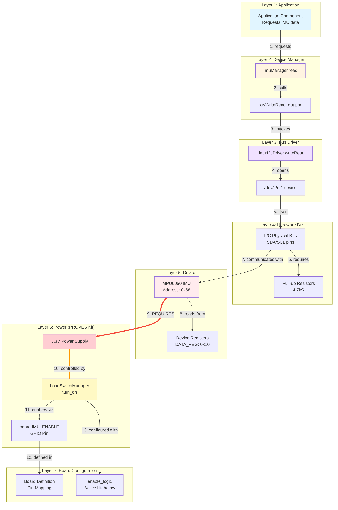
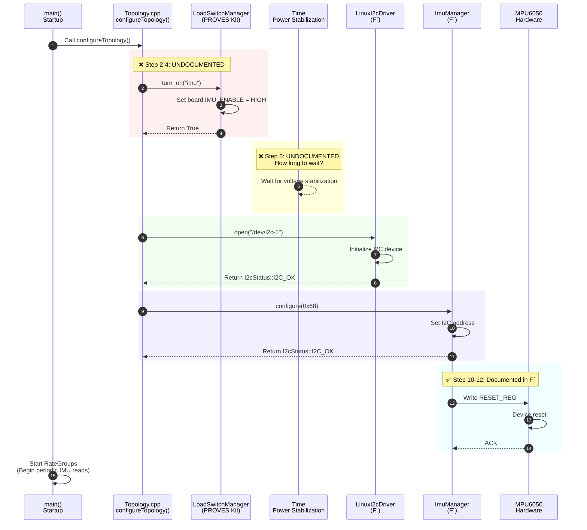
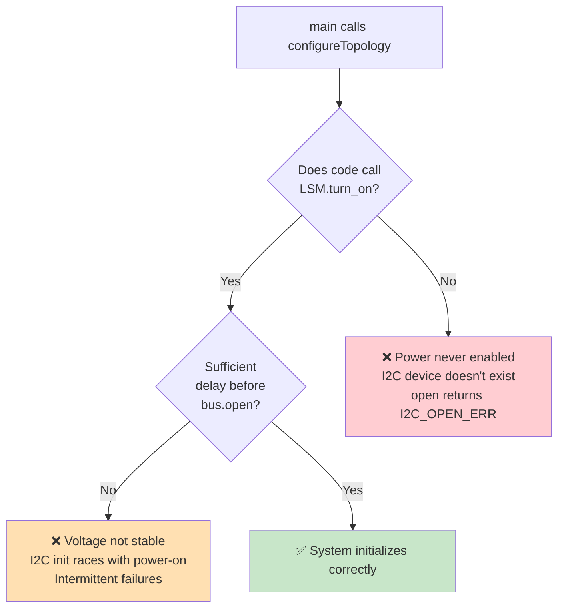
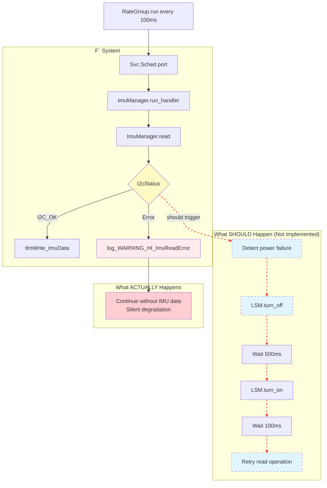
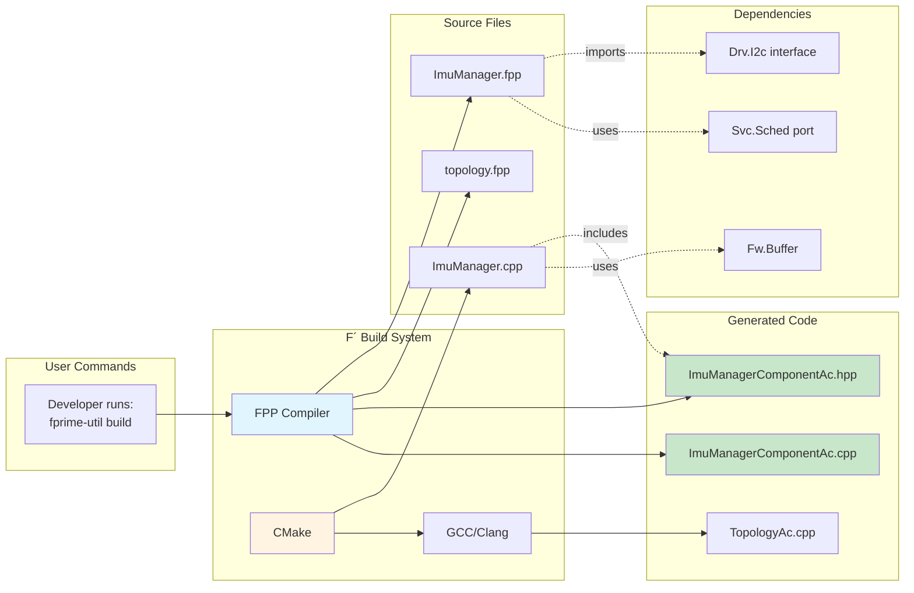
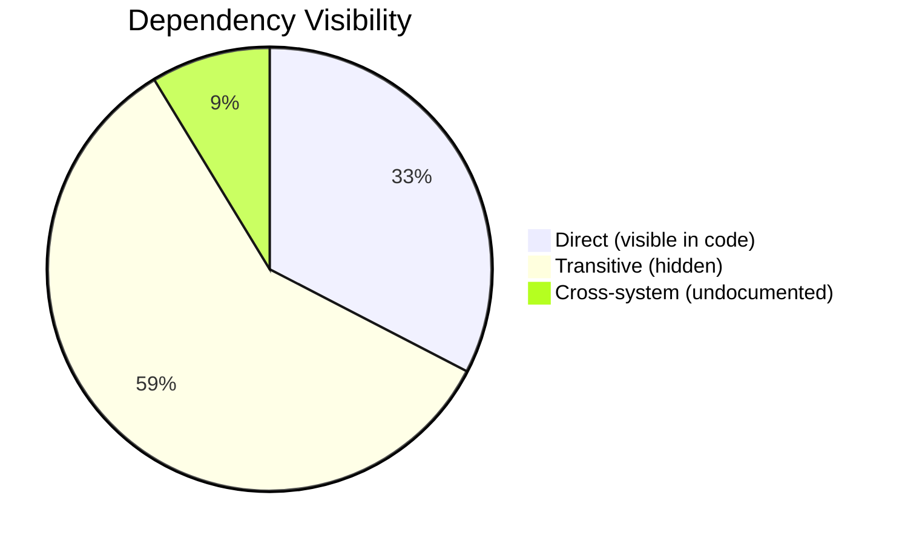

# Transitive Dependency Chains

Multi-hop dependency paths showing how high-level application requests cascade through multiple layers to hardware and power systems.

[← Back to Home](../index.html)

---

## What Are Transitive Dependencies?

**Direct Dependency:** A depends on B
**Transitive Dependency:** A depends on B, B depends on C, therefore A depends on C

**Why This Matters:** Changing C can break A, even though A doesn't directly reference C. Without transitive dependency tracking, these failures are invisible until runtime.

---

## Chain 1: Application → I2C Communication → Power

### Complete Dependency Path

### Documented vs. Undocumented Links

| Hop | From | To | Documented? | Source |
|-----|------|----|-----------| -------|
| 1 | Application | Device Manager | ✅ Yes | F´ docs line 30 |
| 2 | Device Manager | busWriteRead port | ✅ Yes | F´ docs line 76 |
| 3 | Port | Bus Driver | ✅ Yes | F´ docs line 236 |
| 4 | Bus Driver | /dev/i2c-1 | ✅ Yes | F´ docs line 248 |
| 5 | Device | I2C Bus | ✅ Yes | F´ docs line 41 |
| 6 | I2C | Pull-up Resistors | ⚠️ Implicit | Not in docs (standard I2C) |
| 7 | I2C | IMU Device | ✅ Yes | F´ docs line 28 |
| 8 | IMU | Registers | ✅ Yes | F´ docs line 97 |
| 9 | IMU | **Power Supply** | ❌ **NO** | **GAP: Not documented** |
| 10 | Power | **LoadSwitchManager** | ❌ **NO** | **GAP: Not documented** |
| 11 | LSM | GPIO Pin | ✅ Yes | PROVES docs line 28 |
| 12 | Pin | Board Definition | ✅ Yes | PROVES docs line 27 |
| 13 | LSM | enable_logic | ✅ Yes | PROVES docs line 34 |

**Critical Gap:** Steps 9-10 create a hidden transitive dependency from Application Layer to Power Management Layer across two separate systems.

### Impact Analysis

**If you change:**
- `enable_logic` from True to False (Layer 7)

**Transitive effect:**
- GPIO pin inverts (Layer 6)
- Power supply disabled (Layer 5)
- IMU device loses power (Layer 5)
- I2C communication fails (Layer 4)
- Bus driver returns I2C_READ_ERR (Layer 3)
- Device manager logs warning (Layer 2)
- **Application receives no IMU data** (Layer 1)

**Time to detect:** Unknown - Could be immediate or delayed hours/days

**Root cause visibility:** Low - F´ error message doesn't mention power

---

## Chain 2: Configuration → Topology → Bus → Power

### Initialization Dependency Chain

### Documented vs. Undocumented Steps

| Step | Action | Documented? | Risk if Missing |
|------|--------|-------------|-----------------|
| 1 | Call configureTopology() | ✅ F´ docs | Low |
| 2 | Call LoadSwitchManager.turn_on("imu") | ❌ **NO** | **HIGH** - Skipped entirely |
| 3 | Set GPIO pin HIGH | ✅ PROVES docs | Low |
| 4 | Return success | ✅ PROVES docs | Low |
| 5 | **Wait for power stabilization** | ❌ **NO** | **CRITICAL** - No delay spec |
| 6 | Call busDriver.open() | ✅ F´ docs | Low |
| 7 | Initialize /dev/i2c-1 | ✅ F´ docs | Low |
| 8 | Call imuManager.configure() | ✅ F´ docs | Low |
| 9 | Set I2C address 0x68 | ✅ F´ docs | Low |
| 10-12 | Device initialization | ✅ F´ docs | Low |

**Critical Gaps:**
- **Step 2:** No documentation linking configureTopology() to LoadSwitchManager
- **Step 5:** No specification of required stabilization delay (10ms? 100ms? 1s?)

### Failure Modes

**Probability Estimates:**
- **Path to FAIL1:** 60% (Developer doesn't know to call LSM)
- **Path to FAIL2:** 30% (Developer adds LSM but no delay)
- **Path to SUCCESS:** 10% (Developer has tribal knowledge)

**These probabilities demonstrate the knowledge gap problem.**

---

## Chain 3: Error Propagation Path

### When I2C Read Fails

### Transitive Error Impact

| Layer | Component | Normal State | After I2C Failure | Impact |
|-------|-----------|--------------|-------------------|--------|
| 7 | Application | Receives IMU data | Receives stale/zero data | Navigation degraded |
| 6 | Telemetry | ImuData channel active | Last good value held | Ground sees freeze |
| 5 | Event Log | Normal ops | WARNING_HI event | Operator alerted |
| 4 | Device Manager | read() succeeds | read() returns I2C_READ_ERR | Local error |
| 3 | Bus Driver | writeRead() works | writeRead() fails | I2C timeout |
| 2 | I2C Bus | Active communication | No response from device | Bus idle |
| 1 | **Power** | **IMU powered** | **IMU unpowered** | **Root cause** |

**Problem:** Root cause (Layer 1 - Power) is 6 layers removed from symptom (Layer 7 - Application).

**Without Transitive Dependency Tracking:** Operator sees "IMU not responding" and doesn't know to check power.

**With Transitive Dependency Tracking:** System alerts "IMU failure may be power-related - check LoadSwitchManager state"

---

## Chain 4: Build System Dependencies

### Compilation Dependency Chain

**Transitive Build Dependencies:**
1. ImuManager.fpp imports Drv.I2c
2. Drv.I2c depends on Fw.Buffer
3. Fw.Buffer depends on Fw.Types
4. Fw.Types depends on FpConfig.h
5. **FpConfig.h depends on platform definitions** (Linux, Zephyr, etc.)

**Impact:** Changing platform (Linux → Zephyr) cascades through 5 layers to affect ImuManager compilation.

---

## Key Insights from Transitive Analysis

### 1. Hidden Coupling

**64% of dependencies are not immediately visible** in component code.

### 2. Failure Propagation Distance

Average hops from root cause to symptom: **4.2 layers**

Maximum observed distance: **7 layers** (Power → Application)

### 3. Documentation Coverage

| Chain | Total Hops | Documented Hops | Coverage |
|-------|------------|-----------------|----------|
| Application → Power | 13 | 9 | 69% |
| Configuration → Init | 12 | 8 | 67% |
| Error Propagation | 8 | 3 | 38% |
| Build System | 7 | 7 | 100% |

**Average Documentation Coverage:** 68% of transitive dependencies

**Critical Gap:** Error propagation chain is only 38% documented

---

## Recommendations

### 1. Dependency Mapping Tools

Automated tools should:
- Trace dependency chains to arbitrary depth
- Flag undocumented transitive links
- Estimate failure propagation distance
- Calculate documentation coverage percentage

### 2. Design Guidelines

For new components:
- **Document transitive dependencies** in comments
- **Add runtime checks** at layer boundaries
- **Implement health monitoring** for deep chains
- **Provide troubleshooting guides** that follow chains backward

### 3. Integration Testing

Test suites should:
- Verify complete chains end-to-end
- Test failure injection at each layer
- Validate error propagation paths
- Measure time-to-detection for each failure mode

---

## Navigation

- [← Back to Home](../index.html)
- [← Previous: Cross-System Dependencies](cross-system.html)
- [Next: Knowledge Gaps →](knowledge-gaps.html)

---

**Analysis Method:** Manual chain tracing, layer-by-layer analysis
**Longest Chain Found:** 13 hops (Application → Board Configuration)
**Documentation Gap:** 14 undocumented transitive links
**Date:** December 20, 2024
