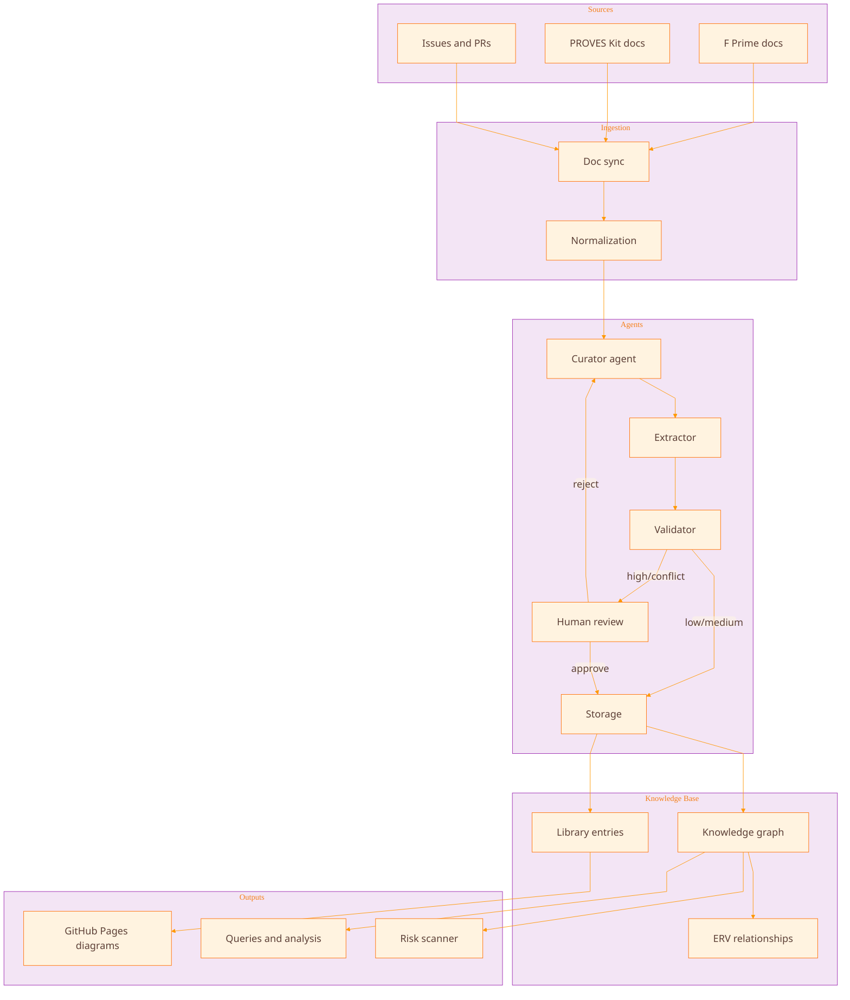
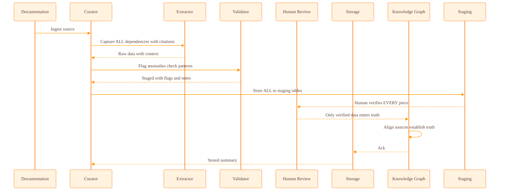

# PROVES Library: Agentic Knowledge for CubeSat Mission Safety

**Automated dependency capture + knowledge graph + human review** to prevent
cross-team failures when critical knowledge disappears.

---

## dY>y At a Glance

  

    <h3>Capture</h3>
    
Extract dependencies with citations from docs, code, and issues.

  

  

    <h3>Validate</h3>
    
Normalize into ERV relationships and check duplicates.

  

  

    <h3>Review</h3>
    
Gate mission-critical items for human approval.

  

  

    <h3>Store</h3>
    
Write entries to a structured knowledge graph.

  

  

    <h3>Visualize</h3>
    
Render diagrams and trace transitive chains.

  

  

    <h3>Learn</h3>
    
Use feedback to improve prompts and patterns.

  

---

## dY?-‹,? Agentic AI Structure

---

## dY` Lifecycle: Curation Run

---

## dY"S Trial Results (What We Found)

- **45+ dependencies** with citations across FA' + PROVES Kit docs
- **4 cross-system dependencies** not documented in either system
- **2 transitive dependency chains** traced end-to-end
- **5 knowledge gaps** that explain mission failures

---

## dY"S Interactive Diagrams

- [Dependency Overview](diagrams/overview.html)
- [Cross-System Dependencies](diagrams/cross-system.html)
- [Transitive Dependency Chains](diagrams/transitive-chains.html)
- [Knowledge Gaps](diagrams/knowledge-gaps.html)
- [Team Boundaries](diagrams/team-boundaries.html)

---

## dY"- What This Enables

- Detect risky changes before they cascade across subsystems.
- Preserve the "why" behind technical decisions.
- Enable cross-team learning without tribal knowledge loss.

---

## Documentation

- [**Getting Started Guide**](getting-started/) - New user walkthrough
- [**Quick Reference**](getting-started/QUICK_REFERENCE.html) - Command cheat sheet
- [Trial Mapping Design Document](../testing_data/diagrams/TRIAL_MAPPING_DESIGN.html)
- [Comprehensive Dependency Map](../testing_data/diagrams/COMPREHENSIVE_DEPENDENCY_MAP.html)
- [Original F´ Documentation](../testing_data/diagrams/fprime_i2c_driver_full.html)
- [Original PROVES Kit Documentation](../testing_data/diagrams/proves_power_full.html)
