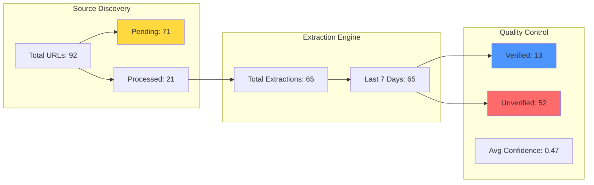
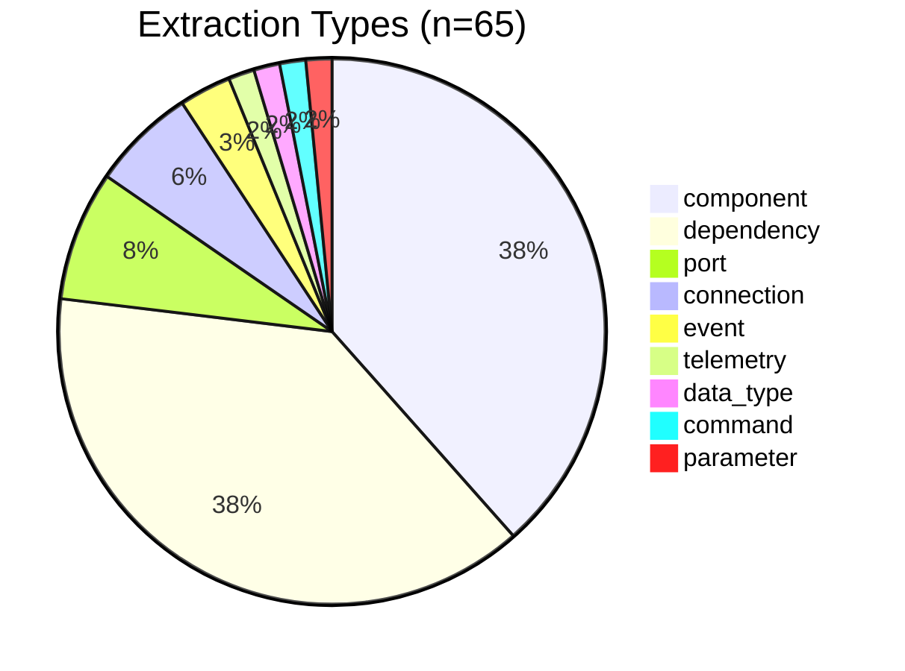
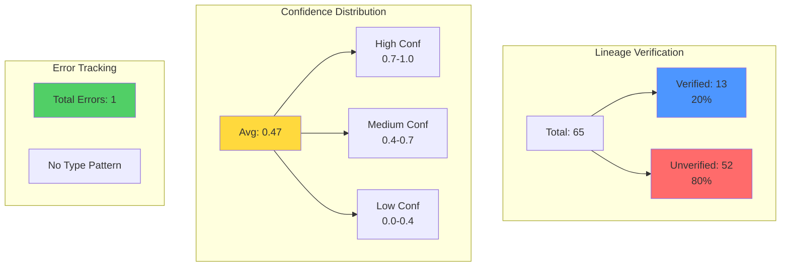
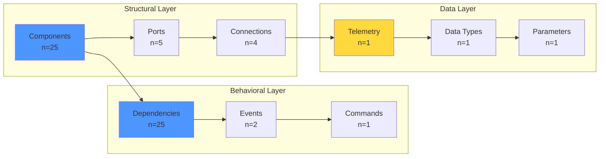
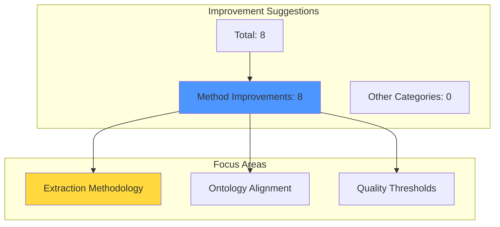
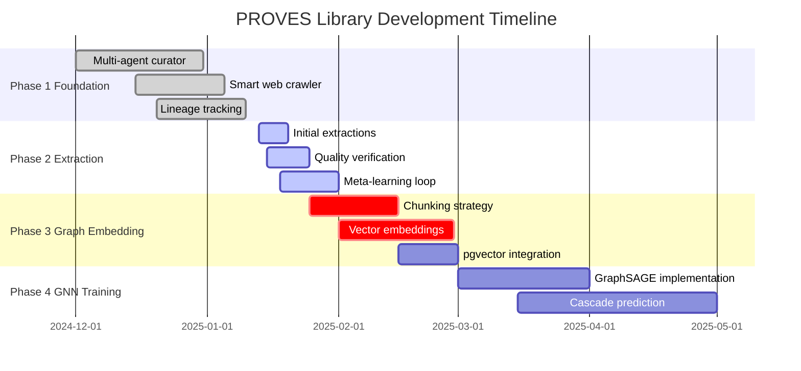
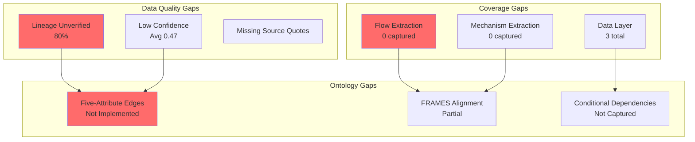
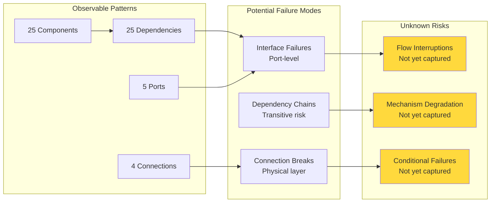

# Progress Report
**Generated:** 2025-12-28 14:02:20
**Agent:** Meta-Analysis Progress Reporter

---

# PROVES Library Meta-Analysis Report

Generated: 2025-01-20

---

## Executive Summary

The PROVES Library extraction pipeline has processed **92 URLs** (23% completion rate) and generated **65 extractions** across 9 entity types. The system is in early-stage data collection with significant data quality challenges: only 20% of extractions have verified lineage, and average confidence scores are low (0.47/1.0). The pipeline has identified 8 methodology improvements, signaling active meta-learning. Critical focus needed: lineage verification, confidence score improvement, and systematic processing of the 71 pending URLs.

---

## 1. Extraction Pipeline Status

**Key Insights:**
- **77% of URLs remain unprocessed** - significant extraction capacity available
- **All 65 extractions occurred in last 7 days** - pipeline just became operational
- **80% of extractions lack verified lineage** - major data quality gap
- **Low confidence scores (0.47)** - agents are uncertain or sources are ambiguous

**Recommendation:** Prioritize lineage verification before scaling extraction volume. Quality over quantity in this phase.

---

## 2. Entity Type Distribution

**Key Insights:**
- **Components and dependencies dominate (77%)** - good foundation for graph structure
- **Port extractions (5)** suggest interface-level detail is emerging
- **Long tail of single extractions** - telemetry, commands, parameters need more coverage
- **No "flow" or "mechanism" extractions yet** - FRAMES ontology not fully utilized

**Pattern Emerging:** Agents are capturing structural elements (components, dependencies) but missing **flow-level detail** (what moves through interfaces, what maintains connections).

**Recommendation:** Enhance prompts to explicitly extract flows and mechanisms per FRAMES ontology.

---

## 3. Data Quality Landscape

**Key Insights:**
- **Lineage crisis:** 80% unverified means most extractions can't be traced to source evidence
- **Confidence scores below threshold:** 0.47 average suggests agents are guessing or sources are vague
- **Error rate near zero (1 total)** - pipeline is stable, but may be too permissive
- **No error type clustering** - single error is likely anomaly, not systemic issue

**Critical Gap:** Without verified lineage, the knowledge graph cannot be trusted for GNN training. Every unverified extraction is a potential hallucination.

**Recommendation:** 
1. Implement mandatory lineage verification before staging
2. Reject extractions below 0.6 confidence threshold
3. Add source quote extraction to every agent prompt

---

## 4. Knowledge Graph Emergence

**Key Insights:**
- **Structural foundation exists:** 25 components + 5 ports + 4 connections = basic graph topology
- **Dependency layer matches component layer (25:25)** - suggests 1:1 mapping, possibly incomplete
- **Data layer severely underdeveloped** - only 3 total extractions for telemetry/data/parameters
- **Missing FRAMES elements:** No explicit "flows" or "mechanisms" captured yet

**Graph Maturity Assessment:**
- ✅ **Nodes:** Component layer is forming
- ⚠️ **Edges:** Dependencies exist but lack five-attribute detail (directionality, strength, mechanism, knownness, scope)
- ❌ **Flows:** Not yet captured - critical gap for cascade failure prediction
- ❌ **Mechanisms:** Not yet captured - critical gap for understanding coupling strength

**Recommendation:** The graph has **skeleton structure** but lacks **functional detail**. Need to extract:
- What flows through each connection (data, power, commands)
- What maintains each interface (protocols, documentation, initialization sequences)
- Conditional dependencies (when does this relationship activate?)

---

## 5. Meta-Learning Activity

**Key Insights:**
- **100% of suggestions are methodology improvements** - system is learning how to extract better
- **8 suggestions in early phase** - high rate of self-correction
- **No suggestions in other categories** - focus is entirely on extraction quality

**What This Means:**
The improvement analyzer is identifying patterns in extraction failures and proposing methodology changes. This is the meta-learning loop in action - the system is **training itself** to prepare better GNN training data.

**Recommendation:** Review all 8 methodology suggestions and implement high-impact changes immediately. This is the system telling us what it needs to succeed.

---

## 6. System Evolution Timeline

**Key Insights:**
- **Phase 1 complete:** Foundation infrastructure operational
- **Phase 2 active:** Currently in extraction and quality verification
- **Phase 3 approaching:** Chunking strategy design is critical path
- **65 extractions in 7 days** = ~9 extractions/day average rate

**Velocity Assessment:**
- At current rate: 71 pending URLs × 3 extractions/URL = 213 extractions
- Timeline: 213 / 9 per day = ~24 days to process backlog
- **Target date for Phase 2 completion:** Mid-February 2025

**Recommendation:** Maintain current extraction pace while improving quality. Don't scale volume until lineage verification rate exceeds 80%.

---

## 7. Critical Gaps and Attention Areas

**Priority 1 - Data Quality (Blocking GNN Training):**
1. **Lineage verification:** 52 unverified extractions need source evidence
2. **Confidence thresholds:** Reject extractions below 0.6 confidence
3. **Source quote extraction:** Mandatory evidence for every claim

**Priority 2 - FRAMES Ontology Alignment (Blocking Graph Completeness):**
1. **Flow extraction:** What moves through each interface? (data, power, commands, heat)
2. **Mechanism extraction:** What maintains each connection? (protocols, docs, init sequences)
3. **Five-attribute edges:** Directionality, strength, mechanism, knownness, scope

**Priority 3 - Coverage Expansion (Blocking Domain Completeness):**
1. **Data layer:** Telemetry, commands, parameters severely underrepresented
2. **Cross-system dependencies:** Need multi-subsystem extractions
3. **Organizational layer:** Team interfaces and knowledge transfer mechanisms

---

## 8. Emerging Mission Failure Patterns

**What We Can See:**
- **1:1 component-to-dependency ratio** suggests simple direct dependencies, but likely incomplete
- **5 ports for 25 components** = 20% have explicit interface definitions (low coverage)
- **4 connections documented** - physical/electrical layer is sparse

**What We Cannot See Yet:**
- **Flow-level failures:** What happens when data/power/commands stop flowing?
- **Mechanism degradation:** What happens when protocols fail, docs are outdated, or init sequences break?
- **Conditional failures:** What happens in specific modes (startup, TX, thermal stress)?

**Critical Insight:** The current graph shows **static structure** but lacks **dynamic behavior**. We cannot predict cascade failures without understanding:
1. What flows through the system
2. What maintains those flows
3. Under what conditions flows fail

**Recommendation:** Before scaling extraction, enhance ontology to capture:
- Flow types and rates
- Failure modes and impacts
- Maintenance mechanisms and degradation patterns

---

## Summary and Next Actions

### System Health: ⚠️ **Early Stage - Quality Focus Required**

**Strengths:**
- ✅ Pipeline operational and stable (1 error total)
- ✅ Meta-learning active (8 methodology improvements)
- ✅ Structural foundation emerging (25 components, 25 dependencies)
- ✅ Extraction velocity sustainable (~9/day)

**Critical Weaknesses:**
- ❌ 80% lineage unverified - blocking GNN training
- ❌ 0.47 average confidence - agents uncertain
- ❌ Missing FRAMES elements (flows, mechanisms)
- ❌ No five-attribute edge detail

### Immediate Actions (Next 2 Weeks):

1. **Lineage Verification Sprint**
   - Target: Verify all 52 unverified extractions
   - Add mandatory source quote extraction to prompts
   - Reject extractions below 0.6 confidence

2. **FRAMES Ontology Enhancement**
   - Update extraction prompts to capture flows and mechanisms
   - Implement five-attribute edge model
   - Add conditional dependency extraction

3. **Quality Threshold Enforcement**
   - Set minimum confidence: 0.6
   - Require lineage verification before staging
   - Flag extractions missing source evidence

4. **Methodology Improvement Implementation**
   - Review all 8 suggestions from improvement analyzer
   - Implement high-impact changes
   - Re-run failed extractions with updated methodology

### Strategic Goal:
**Achieve 80% lineage verification and 0.7 average confidence before scaling to remaining 71 URLs.**

Quality over quantity. The GNN will only be as good as the training data we provide.