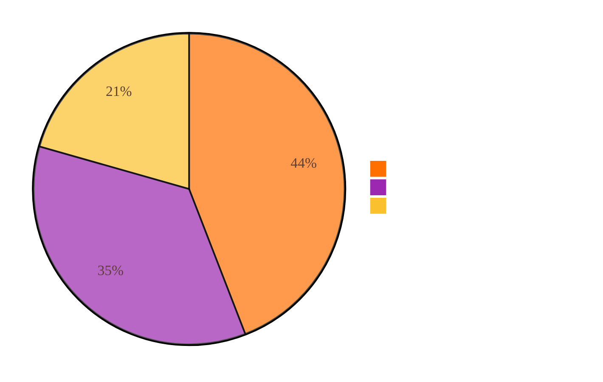
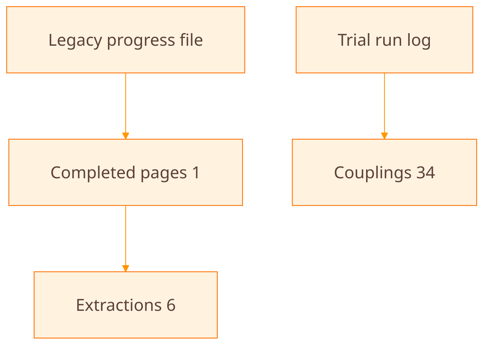

# Progress Report

**Generated:** 2025-12-30 13:10:43
**Source log:** testing_data/dataset_97e5e162-967f-4399-9037-a9bd1b8cbf6e.jsonl
**Scope:** Trial-run extraction logs (agent runs, not the production extraction pipeline)

---

## Executive Summary

This report summarizes **agent trial logs** (agents learning to run and record extractions), which is fundamentally different from the **data extraction progress report** that reflects the production pipeline and staged data. The trial-run log includes **3 unique extraction runs** across **3 source pages**, totaling **34 couplings**. All runs report lineage_verified true in their summaries, but this is agent-reported and still requires human review. The legacy progress tracker in `testing_data/extraction_progress.json` still shows **1 completed page with 6 extractions**, so public status should reference this log only when explicitly talking about trial-run activity.

---

## 1. Trial Run Coverage

```mermaid
---
config:
  theme: base
  fontSize: 16
  themeCSS: |
    .node rect, .cluster rect, .edgePath path { transition: filter 0.2s ease, stroke-width: 0.2s ease; }
    .node:hover rect, .cluster:hover rect, .edgePath:hover path { filter: drop-shadow(0 0 8px rgba(0,0,0,0.35)); stroke-width: 3px; }
    .edgeLabel rect { rx: 6px; ry: 6px; stroke-width: 1px; }
    .cluster-label { font-weight: 600; }
    .node .label, .nodeLabel, .node foreignObject div, .edgeLabel { font-size: 20px !important; font-family: "Segoe UI", Tahoma, Geneva, Verdana, sans-serif !important; }
    .node.decision .label, .node polygon + .label { font-size: 18px !important; }
  themeVariables:
    primaryColor: '#FFF3E0'
    secondaryColor: '#F3E5F5'
    tertiaryColor: '#FFF8E1'
    primaryTextColor: '#5D4037'
    secondaryTextColor: '#4A148C'
    tertiaryTextColor: '#F57F17'
    primaryBorderColor: '#FF6F00'
    secondaryBorderColor: '#9C27B0'
    tertiaryBorderColor: '#FBC02D'
    background: '#FFF8E1'
    textColor: '#5D4037'
    lineColor: '#FF9800'
    fontFamily: '"Segoe UI", Tahoma, Geneva, Verdana, sans-serif'
    fontSize: '16px'
    nodeBorder: '#FF6F00'
    mainBkg: '#FFF3E0'
    clusterBkg: '#F3E5F5'
    clusterBorder: '#9C27B0'
    edgeLabelBackground: '#FFF8E1'
    actorBkg: '#FFF3E0'
    actorBorder: '#FF6F00'
    actorTextColor: '#5D4037'
    signalColor: '#FF9800'
    signalTextColor: '#5D4037'
    labelBoxBkgColor: '#F3E5F5'
    noteBkgColor: '#FFF8E1'
    noteTextColor: '#F57F17'
    noteBorderColor: '#FBC02D'
    pie1: '#FF6F00'
    pie2: '#9C27B0'
    pie3: '#FBC02D'
    pie4: '#FF9800'
    pie5: '#BA68C8'
    pie6: '#FFD54F'
    pie7: '#FFB74D'
    pie8: '#CE93D8'
    pie9: '#FFF176'
    pie10: '#FF8A65'
    pie11: '#F3E5F5'
    pie12: '#FFF8E1'
    sectionBkgColor: '#FFF8E1'
    altSectionBkgColor: '#FFF3E0'
    sectionBkgColor2: '#F3E5F5'
    taskBkgColor: '#FFB74D'
    taskBorderColor: '#FF6F00'
    activeTaskBkgColor: '#FF9800'
    activeTaskBorderColor: '#E65100'
    doneTaskBkgColor: '#FFCC80'
    doneTaskBorderColor: '#FF6F00'
    critBkgColor: '#CE93D8'
    critBorderColor: '#7B1FA2'
    taskTextColor: '#5D4037'
    taskTextOutsideColor: '#5D4037'
    taskTextLightColor: '#5D4037'
    taskTextDarkColor: '#FFFFFF'
    gridColor: '#FFCC80'
    todayLineColor: '#7B1FA2'
    classText: '#5D4037'
    fillType0: '#FFF3E0'
    fillType1: '#F3E5F5'
    fillType2: '#FFF8E1'
    fillType3: '#FFB74D'
    fillType4: '#CE93D8'
    fillType5: '#FFD54F'
    fillType6: '#FF8A65'
    fillType7: '#BA68C8'
    attributeBackgroundColorOdd: '#FFF8E1'
    attributeBackgroundColorEven: '#FFF3E0'
  gantt:
    fontSize: 16
    barHeight: 24
    barGap: 6
    topPadding: 50
    leftPadding: 75
    gridLineStartPadding: 35
    numberSectionStyles: 4
  flowchart:
    curve: 'linear'
    htmlLabels: false
    useMaxWidth: true
    padding: 25
    nodeSpacing: 60
    rankSpacing: 80
    diagramPadding: 8
  sequence:
    diagramMarginX: 50
    diagramMarginY: 10
    actorMargin: 50
    boxMargin: 10
    boxTextMargin: 5
    noteMargin: 10
---
flowchart LR
    A[Dataset records 30]
    B[Unique extraction runs 3]
    C[Source pages 3]
    D[Couplings extracted 34]
    E[Lineage flagged true 3]
    A --> B --> C --> D --> E
```

**Key insights:**
- Trial-run coverage is limited to three source pages, so extraction breadth remains narrow.
- Lineage flags are present in the log, but they are not yet human-verified.

---

## 2. Couplings by Source Page

**Key insights:**
- Fprime documentation dominates the current trial runs.
- PROVES kit testing content contributes a meaningful share of couplings.

---

## 3. Evidence Map

**Key insights:**
- The trial-run log is the only place where counts above 6 are currently verifiable.
- Any public claim beyond the legacy tracker should reference the trial log and this report.

---

## Source References

- `testing_data/dataset_97e5e162-967f-4399-9037-a9bd1b8cbf6e.jsonl`
- `testing_data/extraction_progress.json`
- `testing_data/progress_diagrams/latest.md`
